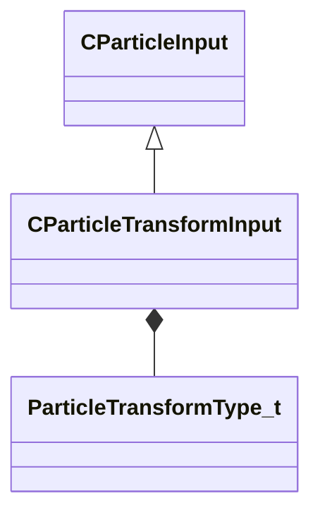

[Schemas](../../schemas.md) / [particleslib](../particleslib.md) / CParticleTransformInput

# CParticleTransformInput

**Kind:** class · **Size:** 104 bytes (`0x68`) · **Align:** 8 · **Module:** particleslib

**Inherits from:** [CParticleInput](../particleslib/CParticleInput.md)

**Metadata:** `MCustomFGDMetadata { KV3DefaultTestFnName = 'CParticleTransformInputDefaultTestFunc' }`, `MPropertyCustomEditor TransformInput()`

**Relationships:**

## Memory layout

8 fields (8 declared here, 0 inherited). Offsets are absolute from the object base.

| Offset | Field | Type | From | Annotations |
|--------|-------|------|------|-------------|
| `0x10` | `m_nType` | [ParticleTransformType_t](../particleslib/ParticleTransformType_t.md) |  |  |
| `0x18` | `m_NamedValue` | CParticleNamedValueRef |  |  |
| `0x58` | `m_bFollowNamedValue` | bool |  |  |
| `0x59` | `m_bSupportsDisabled` | bool |  |  |
| `0x5a` | `m_bUseOrientation` | bool |  |  |
| `0x5c` | `m_nControlPoint` | int32 |  |  |
| `0x60` | `m_nControlPointRangeMax` | int32 |  |  |
| `0x64` | `m_flEndCPGrowthTime` | float32 |  |  |

KV3 class defaults

<pre>{
	&quot;m_nType&quot;: &quot;PT_TYPE_CONTROL_POINT&quot;,
	&quot;m_NamedValue&quot;: &quot;&quot;,
	&quot;m_bFollowNamedValue&quot;: false,
	&quot;m_bSupportsDisabled&quot;: false,
	&quot;m_bUseOrientation&quot;: true,
	&quot;m_nControlPoint&quot;: 0,
	&quot;m_nControlPointRangeMax&quot;: 0,
	&quot;m_flEndCPGrowthTime&quot;: 0.000000
}</pre>

