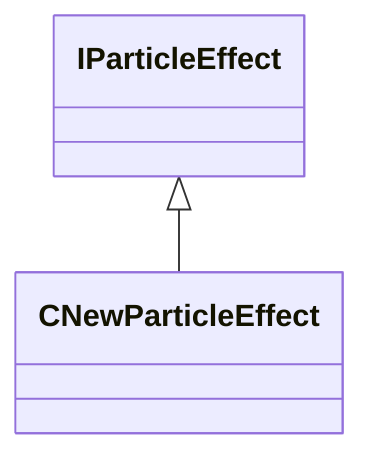

[Schemas](../../schemas.md) / [particleslib](../particleslib.md) / IParticleEffect

# IParticleEffect

**Kind:** class · **Size:** 8 bytes (`0x8`) · **Align:** 255 · **Module:** particleslib

**Derived by:** [CNewParticleEffect](../particleslib/CNewParticleEffect.md)

**Relationships:**

