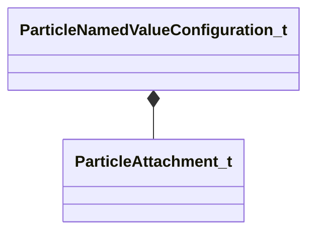

[Schemas](../../schemas.md) / [particleslib](../particleslib.md) / ParticleNamedValueConfiguration_t

# ParticleNamedValueConfiguration_t

> Source: **Build 25000182** · 2026-08-28 · `windows-x86_64` · schema `0.10.0`

**Kind:** class · **Size:** 56 bytes (`0x38`) · **Align:** 8 · **Module:** particleslib

**Relationships:**

## Memory layout

6 fields (6 declared here, 0 inherited). Offsets are absolute from the object base.

| Offset | Field | Type | From | Annotations |
|--------|-------|------|------|-------------|
| `0x0` | `m_ConfigName` | CUtlString |  |  |
| `0x8` | `m_ConfigValue` | KeyValues3 |  |  |
| `0x18` | `m_BoundValuePath` | CUtlString |  |  |
| `0x20` | `m_iAttachType` | [ParticleAttachment_t](../animationsystem/ParticleAttachment_t.md) |  |  |
| `0x28` | `m_strEntityScope` | CUtlString |  |  |
| `0x30` | `m_strAttachmentName` | CUtlString |  |  |

KV3 class defaults

<pre>{
	&quot;m_ConfigName&quot;: &quot;&quot;,
	&quot;m_ConfigValue&quot;: null,
	&quot;m_BoundValuePath&quot;: &quot;&quot;,
	&quot;m_iAttachType&quot;: &quot;PATTACH_INVALID&quot;,
	&quot;m_strEntityScope&quot;: &quot;&quot;,
	&quot;m_strAttachmentName&quot;: &quot;&quot;
}</pre>

