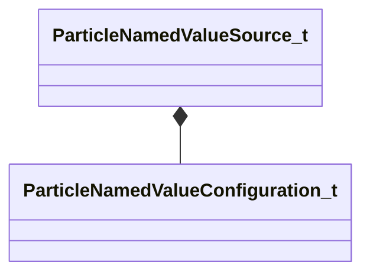

[Schemas](../../schemas.md) / [particleslib](../particleslib.md) / ParticleNamedValueSource_t

# ParticleNamedValueSource_t

> Source: **Build 25000182** · 2026-08-28 · `windows-x86_64` · schema `0.10.0`

**Kind:** class · **Size:** 96 bytes (`0x60`) · **Align:** 8 · **Module:** particleslib

**Relationships:**

## Memory layout

4 fields (4 declared here, 0 inherited). Offsets are absolute from the object base.

| Offset | Field | Type | From | Annotations |
|--------|-------|------|------|-------------|
| `0x0` | `m_Name` | CUtlString |  |  |
| `0x8` | `m_IsPublic` | bool |  |  |
| `0x10` | `m_ValueType` | CPulseValueFullType |  | `MFgdFromSchemaCompletelySkipField` |
| `0x28` | `m_DefaultConfig` | [ParticleNamedValueConfiguration_t](../particleslib/ParticleNamedValueConfiguration_t.md) |  | `MFgdFromSchemaCompletelySkipField` |

KV3 class defaults

<pre>{
	&quot;m_Name&quot;: &quot;&quot;,
	&quot;m_IsPublic&quot;: true,
	&quot;m_ValueType&quot;: &quot;PVAL_VOID&quot;,
	&quot;m_DefaultConfig&quot;:
	{
		&quot;m_ConfigName&quot;: &quot;&quot;,
		&quot;m_ConfigValue&quot;: null,
		&quot;m_BoundValuePath&quot;: &quot;&quot;,
		&quot;m_iAttachType&quot;: &quot;PATTACH_INVALID&quot;,
		&quot;m_strEntityScope&quot;: &quot;&quot;,
		&quot;m_strAttachmentName&quot;: &quot;&quot;
	}
}</pre>

