# Module: physicslib

[📊 View UML Diagram](../diagrams/physicslib.md)

| Name | Kind | Bases | Fields |
|------|------|-------|--------|
| [CFeIndexedJiggleBone](#cfeindexedjigglebone) | class |  | 3 |
| [CFeJiggleBone](#cfejigglebone) | class |  | 35 |
| [CFeMorphLayer](#cfemorphlayer) | class |  | 7 |
| [CFeNamedJiggleBone](#cfenamedjigglebone) | class |  | 4 |
| [CFeVertexMapBuildArray](#cfevertexmapbuildarray) | class |  | 1 |
| [CRegionSVM](#cregionsvm) | class |  | 2 |
| [CastSphereSATParams_t](#castspheresatparams_t) | class |  | 6 |
| [CollisionDetailLayerInfo_t](#collisiondetaillayerinfo_t) | class |  | 6 |
| [CollisionDetailLayerInfo_t::Name_t](#collisiondetaillayerinfo_tname_t) | class |  | 2 |
| [CovMatrix3](#covmatrix3) | class |  | 4 |
| [Dop26_t](#dop26_t) | class |  | 1 |
| [DynamicContinuousContactBehavior_t](#dynamiccontinuouscontactbehavior_t) | enum |  | 3 |
| [FeAnimStrayRadius_t](#feanimstrayradius_t) | class |  | 3 |
| [FeAntiTunnelGroupBuild_t](#feantitunnelgroupbuild_t) | class |  | 2 |
| [FeAntiTunnelProbeBuild_t](#feantitunnelprobebuild_t) | class |  | 7 |
| [FeAntiTunnelProbe_t](#feantitunnelprobe_t) | class |  | 8 |
| [FeAxialEdgeBend_t](#feaxialedgebend_t) | class |  | 5 |
| [FeBandBendLimit_t](#febandbendlimit_t) | class |  | 3 |
| [FeBoxRigid_t](#feboxrigid_t) | class |  | 6 |
| [FeBuildBoxRigid_t](#febuildboxrigid_t) | class | FeBoxRigid_t | 3 |
| [FeBuildSDFRigid_t](#febuildsdfrigid_t) | class | FeSDFRigid_t | 3 |
| [FeBuildSphereRigid_t](#febuildsphererigid_t) | class | FeSphereRigid_t | 3 |
| [FeBuildTaperedCapsuleRigid_t](#febuildtaperedcapsulerigid_t) | class | FeTaperedCapsuleRigid_t | 3 |
| [FeCollisionPlane_t](#fecollisionplane_t) | class |  | 4 |
| [FeCtrlOffset_t](#fectrloffset_t) | class |  | 3 |
| [FeCtrlOsOffset_t](#fectrlosoffset_t) | class |  | 2 |
| [FeCtrlSoftOffset_t](#fectrlsoftoffset_t) | class |  | 4 |
| [FeDynKinLink_t](#fedynkinlink_t) | class |  | 2 |
| [FeEdgeDesc_t](#feedgedesc_t) | class |  | 3 |
| [FeEffectDesc_t](#feeffectdesc_t) | class |  | 4 |
| [FeFitInfluence_t](#fefitinfluence_t) | class |  | 3 |
| [FeFitMatrix_t](#fefitmatrix_t) | class |  | 5 |
| [FeFitWeight_t](#fefitweight_t) | class |  | 3 |
| [FeFollowNode_t](#fefollownode_t) | class |  | 3 |
| [FeHingeLimitBuild_t](#fehingelimitbuild_t) | class |  | 4 |
| [FeHingeLimit_t](#fehingelimit_t) | class |  | 6 |
| [FeKelagerBend2_t](#fekelagerbend2_t) | class |  | 4 |
| [FeModelSelfCollisionLayer_t](#femodelselfcollisionlayer_t) | class |  | 5 |
| [FeMorphLayerDepr_t](#femorphlayerdepr_t) | class |  | 8 |
| [FeNodeBase_t](#fenodebase_t) | class |  | 7 |
| [FeNodeIntegrator_t](#fenodeintegrator_t) | class |  | 4 |
| [FeNodeReverseOffset_t](#fenodereverseoffset_t) | class |  | 3 |
| [FeNodeStrayBox_t](#fenodestraybox_t) | class |  | 4 |
| [FeNodeWindBase_t](#fenodewindbase_t) | class |  | 4 |
| [FeProxyVertexMap_t](#feproxyvertexmap_t) | class |  | 2 |
| [FeQuad_t](#fequad_t) | class |  | 3 |
| [FeRigidColliderIndices_t](#ferigidcolliderindices_t) | class |  | 5 |
| [FeRodConstraint_t](#ferodconstraint_t) | class |  | 5 |
| [FeSDFRigid_t](#fesdfrigid_t) | class |  | 11 |
| [FeSimdAnimStrayRadius_t](#fesimdanimstrayradius_t) | class |  | 3 |
| [FeSimdNodeBase_t](#fesimdnodebase_t) | class |  | 7 |
| [FeSimdQuad_t](#fesimdquad_t) | class |  | 4 |
| [FeSimdRodConstraintAnim_t](#fesimdrodconstraintanim_t) | class |  | 3 |
| [FeSimdRodConstraint_t](#fesimdrodconstraint_t) | class |  | 5 |
| [FeSimdSpringIntegrator_t](#fesimdspringintegrator_t) | class |  | 5 |
| [FeSimdTri_t](#fesimdtri_t) | class |  | 5 |
| [FeSoftParent_t](#fesoftparent_t) | class |  | 2 |
| [FeSourceEdge_t](#fesourceedge_t) | class |  | 1 |
| [FeSphereRigid_t](#fesphererigid_t) | class |  | 5 |
| [FeSpringIntegrator_t](#fespringintegrator_t) | class |  | 5 |
| [FeStiffHingeBuild_t](#festiffhingebuild_t) | class |  | 4 |
| [FeTaperedCapsuleRigid_t](#fetaperedcapsulerigid_t) | class |  | 5 |
| [FeTaperedCapsuleStretch_t](#fetaperedcapsulestretch_t) | class |  | 4 |
| [FeTreeChildren_t](#fetreechildren_t) | class |  | 1 |
| [FeTri_t](#fetri_t) | class |  | 5 |
| [FeTwistConstraint_t](#fetwistconstraint_t) | class |  | 4 |
| [FeVertexMapBuild_t](#fevertexmapbuild_t) | class |  | 6 |
| [FeVertexMapDesc_t](#fevertexmapdesc_t) | class |  | 12 |
| [FeWeightedNode_t](#feweightednode_t) | class |  | 2 |
| [FeWorldCollisionParams_t](#feworldcollisionparams_t) | class |  | 4 |
| [FourCovMatrices3](#fourcovmatrices3) | class |  | 4 |
| [FourVectors2D](#fourvectors2d) | class |  | 2 |
| [JointAxis_t](#jointaxis_t) | enum |  | 4 |
| [JointMotion_t](#jointmotion_t) | enum |  | 3 |
| [OldFeEdge_t](#oldfeedge_t) | class |  | 12 |
| [PhysFeModelDesc_t](#physfemodeldesc_t) | class |  | 110 |
| [RnBlendVertex_t](#rnblendvertex_t) | class |  | 8 |
| [RnBodyDesc_t](#rnbodydesc_t) | class |  | 36 |
| [RnCapsuleDesc_t](#rncapsuledesc_t) | class | RnShapeDesc_t | 1 |
| [RnCapsule_t](#rncapsule_t) | class |  | 2 |
| [RnFace_t](#rnface_t) | class |  | 1 |
| [RnHalfEdge_t](#rnhalfedge_t) | class |  | 4 |
| [RnHullDesc_t](#rnhulldesc_t) | class | RnShapeDesc_t | 1 |
| [RnHull_t](#rnhull_t) | class |  | 14 |
| [RnMeshDesc_t](#rnmeshdesc_t) | class | RnShapeDesc_t | 1 |
| [RnMesh_t](#rnmesh_t) | class |  | 11 |
| [RnNode_t](#rnnode_t) | class |  | 4 |
| [RnPlane_t](#rnplane_t) | class |  | 2 |
| [RnShapeDesc_t](#rnshapedesc_t) | class |  | 6 |
| [RnSoftbodyCapsule_t](#rnsoftbodycapsule_t) | class |  | 3 |
| [RnSoftbodyParticle_t](#rnsoftbodyparticle_t) | class |  | 1 |
| [RnSoftbodySpring_t](#rnsoftbodyspring_t) | class |  | 2 |
| [RnSphereDesc_t](#rnspheredesc_t) | class | RnShapeDesc_t | 1 |
| [RnTriangle_t](#rntriangle_t) | class |  | 1 |
| [RnVertex_t](#rnvertex_t) | class |  | 1 |
| [RnWing_t](#rnwing_t) | class |  | 1 |
| [VertexPositionColor_t](#vertexpositioncolor_t) | class |  | 1 |
| [VertexPositionNormal_t](#vertexpositionnormal_t) | class |  | 2 |

---

### CFeIndexedJiggleBone

**Metadata:** `MGetKV3ClassDefaults {
	"m_nNode": 4294967295,
	"m_nJiggleParent": 4294967295,
	"m_jiggleBone":
	{
		"m_nFlags": 0,
		"m_flLength": 1.000000,
		"m_flTipMass": 0.000000,
		"m_flYawStiffness": 0.000000,
		"m_flYawDamping": 0.000000,
		"m_flPitchStiffness": 0.000000,
		"m_flPitchDamping": 0.000000,
		"m_flAlongStiffness": 0.000000,
		"m_flAlongDamping": 0.000000,
		"m_flAngleLimit": 0.000000,
		"m_flMinYaw": 0.000000,
		"m_flMaxYaw": 0.000000,
		"m_flYawFriction": 0.000000,
		"m_flYawBounce": 0.000000,
		"m_flMinPitch": 0.000000,
		"m_flMaxPitch": 0.000000,
		"m_flPitchFriction": 0.000000,
		"m_flPitchBounce": 0.000000,
		"m_flBaseMass": 0.000000,
		"m_flBaseStiffness": 0.000000,
		"m_flBaseDamping": 0.000000,
		"m_flBaseMinLeft": 0.000000,
		"m_flBaseMaxLeft": 0.000000,
		"m_flBaseLeftFriction": 0.000000,
		"m_flBaseMinUp": 0.000000,
		"m_flBaseMaxUp": 0.000000,
		"m_flBaseUpFriction": 0.000000,
		"m_flBaseMinForward": 0.000000,
		"m_flBaseMaxForward": 0.000000,
		"m_flBaseForwardFriction": 0.000000,
		"m_flRadius0": 1.000000,
		"m_flRadius1": 1.000000,
		"m_vPoint0":
		[
			0.000000,
			0.000000,
			0.000000
		],
		"m_vPoint1":
		[
			10.000000,
			0.000000,
			0.000000
		],
		"m_nCollisionMask": 65535
	}
}`

**Relationships:**

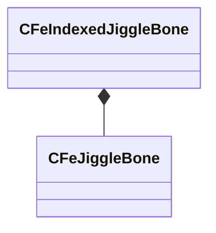

**Fields:**

| Name | Type | Annotations |
|------|------|-------------|
| `m_nNode` | uint32 |  |
| `m_nJiggleParent` | uint32 |  |
| `m_jiggleBone` | [CFeJiggleBone](../schemas/physicslib.md#cfejigglebone) |  |

### CFeJiggleBone

**Metadata:** `MGetKV3ClassDefaults {
	"m_nFlags": 0,
	"m_flLength": 1.000000,
	"m_flTipMass": 0.000000,
	"m_flYawStiffness": 0.000000,
	"m_flYawDamping": 0.000000,
	"m_flPitchStiffness": 0.000000,
	"m_flPitchDamping": 0.000000,
	"m_flAlongStiffness": 0.000000,
	"m_flAlongDamping": 0.000000,
	"m_flAngleLimit": 0.000000,
	"m_flMinYaw": 0.000000,
	"m_flMaxYaw": 0.000000,
	"m_flYawFriction": 0.000000,
	"m_flYawBounce": 0.000000,
	"m_flMinPitch": 0.000000,
	"m_flMaxPitch": 0.000000,
	"m_flPitchFriction": 0.000000,
	"m_flPitchBounce": 0.000000,
	"m_flBaseMass": 0.000000,
	"m_flBaseStiffness": 0.000000,
	"m_flBaseDamping": 0.000000,
	"m_flBaseMinLeft": 0.000000,
	"m_flBaseMaxLeft": 0.000000,
	"m_flBaseLeftFriction": 0.000000,
	"m_flBaseMinUp": 0.000000,
	"m_flBaseMaxUp": 0.000000,
	"m_flBaseUpFriction": 0.000000,
	"m_flBaseMinForward": 0.000000,
	"m_flBaseMaxForward": 0.000000,
	"m_flBaseForwardFriction": 0.000000,
	"m_flRadius0": 1.000000,
	"m_flRadius1": 1.000000,
	"m_vPoint0":
	[
		0.000000,
		0.000000,
		0.000000
	],
	"m_vPoint1":
	[
		10.000000,
		0.000000,
		0.000000
	],
	"m_nCollisionMask": 65535
}`

**Fields:**

| Name | Type | Annotations |
|------|------|-------------|
| `m_nFlags` | uint32 |  |
| `m_flLength` | float32 |  |
| `m_flTipMass` | float32 |  |
| `m_flYawStiffness` | float32 |  |
| `m_flYawDamping` | float32 |  |
| `m_flPitchStiffness` | float32 |  |
| `m_flPitchDamping` | float32 |  |
| `m_flAlongStiffness` | float32 |  |
| `m_flAlongDamping` | float32 |  |
| `m_flAngleLimit` | float32 |  |
| `m_flMinYaw` | float32 |  |
| `m_flMaxYaw` | float32 |  |
| `m_flYawFriction` | float32 |  |
| `m_flYawBounce` | float32 |  |
| `m_flMinPitch` | float32 |  |
| `m_flMaxPitch` | float32 |  |
| `m_flPitchFriction` | float32 |  |
| `m_flPitchBounce` | float32 |  |
| `m_flBaseMass` | float32 |  |
| `m_flBaseStiffness` | float32 |  |
| `m_flBaseDamping` | float32 |  |
| `m_flBaseMinLeft` | float32 |  |
| `m_flBaseMaxLeft` | float32 |  |
| `m_flBaseLeftFriction` | float32 |  |
| `m_flBaseMinUp` | float32 |  |
| `m_flBaseMaxUp` | float32 |  |
| `m_flBaseUpFriction` | float32 |  |
| `m_flBaseMinForward` | float32 |  |
| `m_flBaseMaxForward` | float32 |  |
| `m_flBaseForwardFriction` | float32 |  |
| `m_flRadius0` | float32 |  |
| `m_flRadius1` | float32 |  |
| `m_vPoint0` | Vector |  |
| `m_vPoint1` | Vector |  |
| `m_nCollisionMask` | uint16 |  |

### CFeMorphLayer

**Metadata:** `MGetKV3ClassDefaults {
	"m_Name": "",
	"m_nNameHash": 0,
	"m_Nodes":
	[
	],
	"m_InitPos":
	[
	],
	"m_Gravity":
	[
	],
	"m_GoalStrength":
	[
	],
	"m_GoalDamping":
	[
	]
}`

**Fields:**

| Name | Type | Annotations |
|------|------|-------------|
| `m_Name` | CUtlString |  |
| `m_nNameHash` | uint32 |  |
| `m_Nodes` | CUtlVector<uint16> |  |
| `m_InitPos` | CUtlVector<Vector> |  |
| `m_Gravity` | CUtlVector<float32> |  |
| `m_GoalStrength` | CUtlVector<float32> |  |
| `m_GoalDamping` | CUtlVector<float32> |  |

### CFeNamedJiggleBone

**Metadata:** `MGetKV3ClassDefaults {
	"m_strParentBone": "",
	"m_transform":
	[
		0.000000,
		0.000000,
		0.000000,
		0.000000,
		0.000000,
		0.000000,
		0.000000,
		0.000000
	],
	"m_nJiggleParent": 0,
	"m_jiggleBone":
	{
		"m_nFlags": 0,
		"m_flLength": 1.000000,
		"m_flTipMass": 0.000000,
		"m_flYawStiffness": 0.000000,
		"m_flYawDamping": 0.000000,
		"m_flPitchStiffness": 0.000000,
		"m_flPitchDamping": 0.000000,
		"m_flAlongStiffness": 0.000000,
		"m_flAlongDamping": 0.000000,
		"m_flAngleLimit": 0.000000,
		"m_flMinYaw": 0.000000,
		"m_flMaxYaw": 0.000000,
		"m_flYawFriction": 0.000000,
		"m_flYawBounce": 0.000000,
		"m_flMinPitch": 0.000000,
		"m_flMaxPitch": 0.000000,
		"m_flPitchFriction": 0.000000,
		"m_flPitchBounce": 0.000000,
		"m_flBaseMass": 0.000000,
		"m_flBaseStiffness": 0.000000,
		"m_flBaseDamping": 0.000000,
		"m_flBaseMinLeft": 0.000000,
		"m_flBaseMaxLeft": 0.000000,
		"m_flBaseLeftFriction": 0.000000,
		"m_flBaseMinUp": 0.000000,
		"m_flBaseMaxUp": 0.000000,
		"m_flBaseUpFriction": 0.000000,
		"m_flBaseMinForward": 0.000000,
		"m_flBaseMaxForward": 0.000000,
		"m_flBaseForwardFriction": 0.000000,
		"m_flRadius0": 1.000000,
		"m_flRadius1": 1.000000,
		"m_vPoint0":
		[
			0.000000,
			0.000000,
			0.000000
		],
		"m_vPoint1":
		[
			10.000000,
			0.000000,
			0.000000
		],
		"m_nCollisionMask": 65535
	}
}`

**Relationships:**

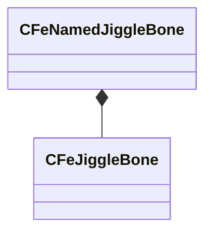

**Fields:**

| Name | Type | Annotations |
|------|------|-------------|
| `m_strParentBone` | CUtlString |  |
| `m_transform` | CTransform |  |
| `m_nJiggleParent` | uint32 |  |
| `m_jiggleBone` | [CFeJiggleBone](../schemas/physicslib.md#cfejigglebone) |  |

### CFeVertexMapBuildArray

**Metadata:** `MGetKV3ClassDefaults {
	"m_Array":
	[
	]
}`

**Relationships:**

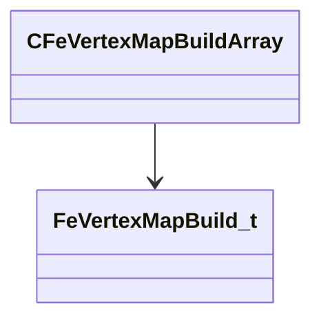

**Fields:**

| Name | Type | Annotations |
|------|------|-------------|
| `m_Array` | CUtlVector<[FeVertexMapBuild_t](../schemas/physicslib.md#fevertexmapbuild_t)*> |  |

### CRegionSVM

**Metadata:** `MGetKV3ClassDefaults {
	"m_Planes": "[BINARY BLOB]",
	"m_Nodes": "[BINARY BLOB]"
}`

**Relationships:**

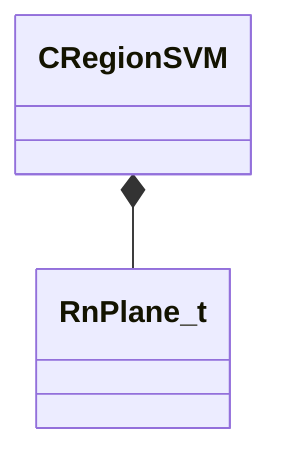

**Fields:**

| Name | Type | Annotations |
|------|------|-------------|
| `m_Planes` | CUtlVector<[RnPlane_t](../schemas/physicslib.md#rnplane_t)> |  |
| `m_Nodes` | CUtlVector<uint32> |  |

### CastSphereSATParams_t

**Metadata:** `MGetKV3ClassDefaults Could not parse KV3 Defaults`

**Relationships:**

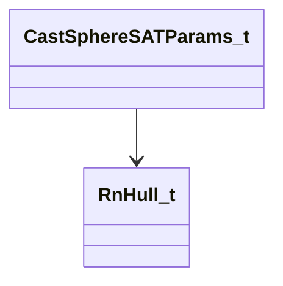

**Fields:**

| Name | Type | Annotations |
|------|------|-------------|
| `m_vRayStart` | Vector |  |
| `m_vRayDelta` | Vector |  |
| `m_flRadius` | float32 |  |
| `m_flMaxFraction` | float32 |  |
| `m_flScale` | float32 |  |
| `m_pHull` | [RnHull_t](../schemas/physicslib.md#rnhull_t)* |  |

### CollisionDetailLayerInfo_t

**Metadata:** `MGetKV3ClassDefaults {
	"m_sDescription": "",
	"m_sFriendlyName": "",
	"m_bIsQueryOnly": false,
	"m_sParentDetailLayer": "",
	"m_vecSubtreeDetailLayers":
	[
	],
	"m_bNotPickable": false
}`, `MVDataRoot`, `MVDataOutlinerLeafNameFn`

**Fields:**

| Name | Type | Annotations |
|------|------|-------------|
| `m_sDescription` | CUtlString | `MPropertyFriendlyName "Description"` `MPropertyDescription "How the detail layer is meant to be used"` |
| `m_sFriendlyName` | CUtlString | `MPropertyFriendlyName "Friendly Name"` `MPropertyDescription "How name is displayed in tools"` |
| `m_bIsQueryOnly` | bool | `MPropertyDescription "Only query can use this layer, not collision"` |
| `m_sParentDetailLayer` | CUtlString | `MPropertyDescription "Parent detail layers automatically include the child layer"` |
| `m_vecSubtreeDetailLayers` | CUtlVector<[CollisionDetailLayerInfo_t](../schemas/physicslib.md#collisiondetaillayerinfo_t)::Name_t> | `MPropertySuppressField` |
| `m_bNotPickable` | bool | `MPropertySuppressField` |

### CollisionDetailLayerInfo_t::Name_t

**Metadata:** `MGetKV3ClassDefaults {
	"m_nNameToken": "",
	"m_sNameString": ""
}`, `MVDataRoot`

**Fields:**

| Name | Type | Annotations |
|------|------|-------------|
| `m_nNameToken` | CUtlStringToken |  |
| `m_sNameString` | CUtlString |  |

### CovMatrix3

**Metadata:** `MGetKV3ClassDefaults {
	"m_vDiag":
	[
		0.000000,
		0.000000,
		0.000000
	],
	"m_flXY": 0.000000,
	"m_flXZ": 0.000000,
	"m_flYZ": 0.000000
}`

**Fields:**

| Name | Type | Annotations |
|------|------|-------------|
| `m_vDiag` | Vector |  |
| `m_flXY` | float32 |  |
| `m_flXZ` | float32 |  |
| `m_flYZ` | float32 |  |

### Dop26_t

**Metadata:** `MGetKV3ClassDefaults Could not parse KV3 Defaults`

**Fields:**

| Name | Type | Annotations |
|------|------|-------------|
| `m_flSupport` | float32[26] |  |

### DynamicContinuousContactBehavior_t

**Values:**

| Name | Value | Description |
|------|-------|-------------|
| `DYNAMIC_CONTINUOUS_ALLOW_IF_REQUESTED_BY_OTHER_BODY` | 0 |  |
| `DYNAMIC_CONTINUOUS_ALWAYS` | 1 |  |
| `DYNAMIC_CONTINUOUS_NEVER` | 2 |  |

### FeAnimStrayRadius_t

**Metadata:** `MGetKV3ClassDefaults {
	"nNode":
	[
		0,
		0
	],
	"flMaxDist": 0.000000,
	"flRelaxationFactor": 0.000000
}`

**Fields:**

| Name | Type | Annotations |
|------|------|-------------|
| `nNode` | uint16[2] |  |
| `flMaxDist` | float32 |  |
| `flRelaxationFactor` | float32 |  |

### FeAntiTunnelGroupBuild_t

**Metadata:** `MGetKV3ClassDefaults {
	"m_nVertexMapHash": 0,
	"m_nCollisionMask": 0
}`

**Fields:**

| Name | Type | Annotations |
|------|------|-------------|
| `m_nVertexMapHash` | uint32 |  |
| `m_nCollisionMask` | uint32 |  |

### FeAntiTunnelProbeBuild_t

**Metadata:** `MGetKV3ClassDefaults {
	"flWeight": 1.000000,
	"flActivationDistance": 1.000000,
	"flBias": 0.000000,
	"flCurvature": 0.000000,
	"nFlags": 0,
	"nProbeNode": 0,
	"targetNodes":
	[
	]
}`

**Fields:**

| Name | Type | Annotations |
|------|------|-------------|
| `flWeight` | float32 |  |
| `flActivationDistance` | float32 |  |
| `flBias` | float32 |  |
| `flCurvature` | float32 |  |
| `nFlags` | uint32 |  |
| `nProbeNode` | uint16 |  |
| `targetNodes` | CUtlVector<uint16> |  |

### FeAntiTunnelProbe_t

**Metadata:** `MGetKV3ClassDefaults {
	"flWeight": 1.000000,
	"nFlags": 0,
	"nProbeNode": 0,
	"nCount": 0,
	"nBegin": 0,
	"flActivationDistance": 1.000000,
	"flCurvatureRadius": 0.000000,
	"flBias": 0.000000
}`

**Fields:**

| Name | Type | Annotations |
|------|------|-------------|
| `flWeight` | float32 |  |
| `nFlags` | uint32 |  |
| `nProbeNode` | uint16 |  |
| `nCount` | uint16 |  |
| `nBegin` | uint32 |  |
| `flActivationDistance` | float32 |  |
| `flCurvatureRadius` | float32 |  |
| `flBias` | float32 |  |

### FeAxialEdgeBend_t

**Metadata:** `MGetKV3ClassDefaults {
	"te": 0.000000,
	"tv": 0.000000,
	"flDist": 0.000000,
	"flWeight":
	[
		0.000000,
		0.000000,
		0.000000,
		0.000000
	],
	"nNode":
	[
		0,
		0,
		0,
		0,
		0,
		0
	]
}`

**Fields:**

| Name | Type | Annotations |
|------|------|-------------|
| `te` | float32 |  |
| `tv` | float32 |  |
| `flDist` | float32 |  |
| `flWeight` | float32[4] |  |
| `nNode` | uint16[6] |  |

### FeBandBendLimit_t

**Metadata:** `MGetKV3ClassDefaults {
	"flDistMin": 0.000000,
	"flDistMax": 0.000000,
	"nNode":
	[
		0,
		0,
		0,
		0,
		0,
		0
	]
}`

**Fields:**

| Name | Type | Annotations |
|------|------|-------------|
| `flDistMin` | float32 |  |
| `flDistMax` | float32 |  |
| `nNode` | uint16[6] |  |

### FeBoxRigid_t

**Derived by:** [FeBuildBoxRigid_t](physicslib.md#febuildboxrigid_t)

**Metadata:** `MGetKV3ClassDefaults {
	"tmFrame2":
	[
		0.000000,
		0.000000,
		0.000000,
		1.000000,
		0.000000,
		0.000000,
		0.000000,
		1.000000
	],
	"nNode": 0,
	"nCollisionMask": 65535,
	"vSize":
	[
		0.000000,
		0.000000,
		0.000000
	],
	"nVertexMapIndex": 65535,
	"nFlags": 0
}`

**Relationships:**


**Fields:**

| Name | Type | Annotations |
|------|------|-------------|
| `tmFrame2` | CTransform |  |
| `nNode` | uint16 |  |
| `nCollisionMask` | uint16 |  |
| `vSize` | Vector |  |
| `nVertexMapIndex` | uint16 |  |
| `nFlags` | uint16 |  |

### FeBuildBoxRigid_t

**Inherits from:** [FeBoxRigid_t](physicslib.md#feboxrigid_t)

**Metadata:** `MGetKV3ClassDefaults {
	"tmFrame2":
	[
		0.000000,
		0.000000,
		0.000000,
		1.000000,
		0.000000,
		0.000000,
		0.000000,
		1.000000
	],
	"nNode": 0,
	"nCollisionMask": 65535,
	"vSize":
	[
		0.000000,
		0.000000,
		0.000000
	],
	"nVertexMapIndex": 65535,
	"nFlags": 0,
	"m_nPriority": 0,
	"m_nVertexMapHash": 0,
	"m_nAntitunnelGroupBits": 0
}`

**Relationships:**


**Fields:**

| Name | Type | Annotations |
|------|------|-------------|
| `m_nPriority` | int32 |  |
| `m_nVertexMapHash` | uint32 |  |
| `m_nAntitunnelGroupBits` | uint32 |  |

### FeBuildSDFRigid_t

**Inherits from:** [FeSDFRigid_t](physicslib.md#fesdfrigid_t)

**Metadata:** `MGetKV3ClassDefaults {
	"vLocalMin":
	[
		0.000000,
		0.000000,
		0.000000
	],
	"vLocalMax":
	[
		0.000000,
		0.000000,
		0.000000
	],
	"flBounciness": 0.000000,
	"nNode": 0,
	"nCollisionMask": 65535,
	"nVertexMapIndex": 65535,
	"nFlags": 0,
	"m_Distances":
	[
	],
	"m_nWidth": 8,
	"m_nHeight": 8,
	"m_nDepth": 8,
	"m_nPriority": 0,
	"m_nVertexMapHash": 0,
	"m_nAntitunnelGroupBits": 0
}`

**Relationships:**

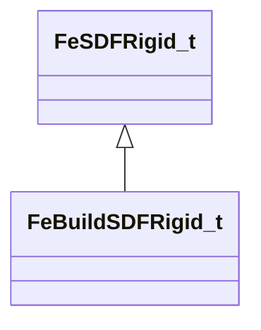

**Fields:**

| Name | Type | Annotations |
|------|------|-------------|
| `m_nPriority` | int32 |  |
| `m_nVertexMapHash` | uint32 |  |
| `m_nAntitunnelGroupBits` | uint32 |  |

### FeBuildSphereRigid_t

**Inherits from:** [FeSphereRigid_t](physicslib.md#fesphererigid_t)

**Metadata:** `MGetKV3ClassDefaults {
	"vSphere":
	[
		0.000000,
		0.000000,
		0.000000,
		1.000000
	],
	"nNode": 0,
	"nCollisionMask": 65535,
	"nVertexMapIndex": 65535,
	"nFlags": 0,
	"m_nPriority": 0,
	"m_nVertexMapHash": 0,
	"m_nAntitunnelGroupBits": 0
}`

**Relationships:**

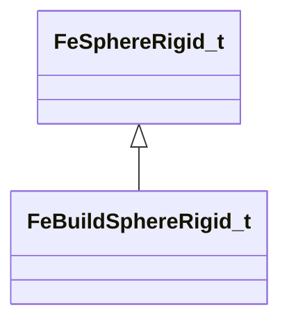

**Fields:**

| Name | Type | Annotations |
|------|------|-------------|
| `m_nPriority` | int32 |  |
| `m_nVertexMapHash` | uint32 |  |
| `m_nAntitunnelGroupBits` | uint32 |  |

### FeBuildTaperedCapsuleRigid_t

**Inherits from:** [FeTaperedCapsuleRigid_t](physicslib.md#fetaperedcapsulerigid_t)

**Metadata:** `MGetKV3ClassDefaults {
	"vSphere":
	[
		[
			0.000000,
			0.000000,
			0.000000,
			0.000000
		],
		[
			0.000000,
			0.000000,
			0.000000,
			0.000000
		]
	],
	"nNode": 0,
	"nCollisionMask": 65535,
	"nVertexMapIndex": 65535,
	"nFlags": 0,
	"m_nPriority": 0,
	"m_nVertexMapHash": 0,
	"m_nAntitunnelGroupBits": 0
}`

**Relationships:**

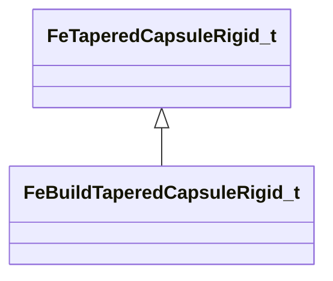

**Fields:**

| Name | Type | Annotations |
|------|------|-------------|
| `m_nPriority` | int32 |  |
| `m_nVertexMapHash` | uint32 |  |
| `m_nAntitunnelGroupBits` | uint32 |  |

### FeCollisionPlane_t

**Metadata:** `MGetKV3ClassDefaults {
	"nCtrlParent": 0,
	"nChildNode": 0,
	"m_Plane":
	{
		"m_vNormal":
		[
			0.000000,
			0.000000,
			0.000000
		],
		"m_flOffset": 0.000000
	},
	"flStrength": 0.000000
}`

**Relationships:**

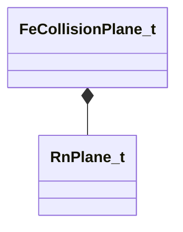

**Fields:**

| Name | Type | Annotations |
|------|------|-------------|
| `nCtrlParent` | uint16 |  |
| `nChildNode` | uint16 |  |
| `m_Plane` | [RnPlane_t](../schemas/physicslib.md#rnplane_t) |  |
| `flStrength` | float32 |  |

### FeCtrlOffset_t

**Metadata:** `MGetKV3ClassDefaults {
	"vOffset":
	[
		0.000000,
		0.000000,
		0.000000
	],
	"nCtrlParent": 0,
	"nCtrlChild": 0
}`

**Fields:**

| Name | Type | Annotations |
|------|------|-------------|
| `vOffset` | Vector |  |
| `nCtrlParent` | uint16 |  |
| `nCtrlChild` | uint16 |  |

### FeCtrlOsOffset_t

**Metadata:** `MGetKV3ClassDefaults {
	"nCtrlParent": 0,
	"nCtrlChild": 0
}`

**Fields:**

| Name | Type | Annotations |
|------|------|-------------|
| `nCtrlParent` | uint16 |  |
| `nCtrlChild` | uint16 |  |

### FeCtrlSoftOffset_t

**Metadata:** `MGetKV3ClassDefaults {
	"nCtrlParent": 0,
	"nCtrlChild": 0,
	"vOffset":
	[
		0.000000,
		0.000000,
		0.000000
	],
	"flAlpha": 0.000000
}`

**Fields:**

| Name | Type | Annotations |
|------|------|-------------|
| `nCtrlParent` | uint16 |  |
| `nCtrlChild` | uint16 |  |
| `vOffset` | Vector |  |
| `flAlpha` | float32 |  |

### FeDynKinLink_t

**Metadata:** `MGetKV3ClassDefaults {
	"m_nParent": 5,
	"m_nChild": 0
}`

**Fields:**

| Name | Type | Annotations |
|------|------|-------------|
| `m_nParent` | uint16 |  |
| `m_nChild` | uint16 |  |

### FeEdgeDesc_t

**Metadata:** `MGetKV3ClassDefaults {
	"nEdge":
	[
		0,
		0
	],
	"nSide":
	[
		[
			0,
			0
		],
		[
			0,
			0
		]
	],
	"nVirtElem":
	[
		0,
		0
	]
}`

**Fields:**

| Name | Type | Annotations |
|------|------|-------------|
| `nEdge` | uint16[2] |  |
| `nSide` | uint16[2][2] |  |
| `nVirtElem` | uint16[2] |  |

### FeEffectDesc_t

**Metadata:** `MGetKV3ClassDefaults {
	"sName": "",
	"nNameHash": 0,
	"nType": 0,
	"m_Params": null
}`

**Fields:**

| Name | Type | Annotations |
|------|------|-------------|
| `sName` | CUtlString |  |
| `nNameHash` | uint32 |  |
| `nType` | int32 |  |
| `m_Params` | KeyValues3 |  |

### FeFitInfluence_t

**Metadata:** `MGetKV3ClassDefaults {
	"nVertexNode": 0,
	"flWeight": 0.000000,
	"nMatrixNode": 0
}`

**Fields:**

| Name | Type | Annotations |
|------|------|-------------|
| `nVertexNode` | uint32 |  |
| `flWeight` | float32 |  |
| `nMatrixNode` | uint32 |  |

### FeFitMatrix_t

**Metadata:** `MGetKV3ClassDefaults {
	"bone":
	[
		0.000000,
		0.000000,
		0.000000,
		1.000000,
		0.000000,
		0.000000,
		0.000000,
		1.000000
	],
	"vCenter":
	[
		0.000000,
		0.000000,
		0.000000
	],
	"nEnd": 0,
	"nNode": 0,
	"nBeginDynamic": 0
}`

**Fields:**

| Name | Type | Annotations |
|------|------|-------------|
| `bone` | CTransform |  |
| `vCenter` | Vector |  |
| `nEnd` | uint16 |  |
| `nNode` | uint16 |  |
| `nBeginDynamic` | uint16 |  |

### FeFitWeight_t

**Metadata:** `MGetKV3ClassDefaults {
	"flWeight": 0.000000,
	"nNode": 0,
	"nDummy": 0
}`

**Fields:**

| Name | Type | Annotations |
|------|------|-------------|
| `flWeight` | float32 |  |
| `nNode` | uint16 |  |
| `nDummy` | uint16 |  |

### FeFollowNode_t

**Metadata:** `MGetKV3ClassDefaults {
	"nParentNode": 0,
	"nChildNode": 0,
	"flWeight": 0.000000
}`

**Fields:**

| Name | Type | Annotations |
|------|------|-------------|
| `nParentNode` | uint16 |  |
| `nChildNode` | uint16 |  |
| `flWeight` | float32 |  |

### FeHingeLimitBuild_t

**Metadata:** `MGetKV3ClassDefaults {
	"nNode":
	[
		0,
		0,
		0,
		0,
		0,
		0
	],
	"nFlags": 0,
	"flLimitCW": 0.000000,
	"flLimitCCW": 0.000000
}`

**Fields:**

| Name | Type | Annotations |
|------|------|-------------|
| `nNode` | uint16[6] |  |
| `nFlags` | uint32 |  |
| `flLimitCW` | float32 |  |
| `flLimitCCW` | float32 |  |

### FeHingeLimit_t

**Metadata:** `MGetKV3ClassDefaults {
	"nNode":
	[
		0,
		0,
		0,
		0,
		0,
		0
	],
	"nFlags": 0,
	"flWeight4": 0.000000,
	"flWeight5": 0.000000,
	"flAngleCenter": 0.000000,
	"flAngleExtents": 0.000000
}`

**Fields:**

| Name | Type | Annotations |
|------|------|-------------|
| `nNode` | uint16[6] |  |
| `nFlags` | uint32 |  |
| `flWeight4` | float32 |  |
| `flWeight5` | float32 |  |
| `flAngleCenter` | float32 |  |
| `flAngleExtents` | float32 |  |

### FeKelagerBend2_t

**Metadata:** `MGetKV3ClassDefaults {
	"flWeight":
	[
		0.000000,
		0.000000,
		0.000000
	],
	"flHeight0": 0.000000,
	"nNode":
	[
		0,
		0,
		0
	],
	"nReserved": 0
}`

**Fields:**

| Name | Type | Annotations |
|------|------|-------------|
| `flWeight` | float32[3] |  |
| `flHeight0` | float32 |  |
| `nNode` | uint16[3] |  |
| `nReserved` | uint16 |  |

### FeModelSelfCollisionLayer_t

**Metadata:** `MGetKV3ClassDefaults {
	"m_Name": "",
	"m_Nodes":
	[
	],
	"m_flParentReaction": 0.000000,
	"m_nFlags": 0,
	"m_nEndIdx":
	[
		0,
		0,
		0,
		0
	]
}`

**Fields:**

| Name | Type | Annotations |
|------|------|-------------|
| `m_Name` | CUtlString |  |
| `m_Nodes` | CUtlVector<uint16> |  |
| `m_flParentReaction` | float32 |  |
| `m_nFlags` | uint32 |  |
| `m_nEndIdx` | uint32[4] |  |

### FeMorphLayerDepr_t

**Metadata:** `MGetKV3ClassDefaults {
	"m_Name": "",
	"m_nNameHash": 0,
	"m_Nodes":
	[
	],
	"m_InitPos":
	[
	],
	"m_Gravity":
	[
	],
	"m_GoalStrength":
	[
	],
	"m_GoalDamping":
	[
	],
	"m_nFlags": 0
}`

**Fields:**

| Name | Type | Annotations |
|------|------|-------------|
| `m_Name` | CUtlString |  |
| `m_nNameHash` | uint32 |  |
| `m_Nodes` | CUtlVector<uint16> |  |
| `m_InitPos` | CUtlVector<Vector> |  |
| `m_Gravity` | CUtlVector<float32> |  |
| `m_GoalStrength` | CUtlVector<float32> |  |
| `m_GoalDamping` | CUtlVector<float32> |  |
| `m_nFlags` | uint32 |  |

### FeNodeBase_t

**Metadata:** `MGetKV3ClassDefaults {
	"nNode": 0,
	"nDummy":
	[
		0,
		0,
		0
	],
	"nNodeX0": 0,
	"nNodeX1": 0,
	"nNodeY0": 0,
	"nNodeY1": 0,
	"qAdjust":
	[
		0.000000,
		0.000000,
		0.000000,
		0.000000
	]
}`

**Fields:**

| Name | Type | Annotations |
|------|------|-------------|
| `nNode` | uint16 |  |
| `nDummy` | uint16[3] |  |
| `nNodeX0` | uint16 |  |
| `nNodeX1` | uint16 |  |
| `nNodeY0` | uint16 |  |
| `nNodeY1` | uint16 |  |
| `qAdjust` | QuaternionStorage |  |

### FeNodeIntegrator_t

**Metadata:** `MGetKV3ClassDefaults {
	"flPointDamping": 0.000000,
	"flAnimationForceAttraction": 0.000000,
	"flAnimationVertexAttraction": 0.000000,
	"flGravity": 0.000000
}`

**Fields:**

| Name | Type | Annotations |
|------|------|-------------|
| `flPointDamping` | float32 |  |
| `flAnimationForceAttraction` | float32 |  |
| `flAnimationVertexAttraction` | float32 |  |
| `flGravity` | float32 |  |

### FeNodeReverseOffset_t

**Metadata:** `MGetKV3ClassDefaults {
	"vOffset":
	[
		0.000000,
		0.000000,
		0.000000
	],
	"nBoneCtrl": 0,
	"nTargetNode": 0
}`

**Fields:**

| Name | Type | Annotations |
|------|------|-------------|
| `vOffset` | Vector |  |
| `nBoneCtrl` | uint16 |  |
| `nTargetNode` | uint16 |  |

### FeNodeStrayBox_t

**Metadata:** `MGetKV3ClassDefaults {
	"vMin":
	[
		0.000000,
		0.000000,
		0.000000
	],
	"nFlags": 0,
	"vMax":
	[
		0.000000,
		0.000000,
		0.000000
	],
	"nNode":
	[
		0,
		0
	]
}`

**Fields:**

| Name | Type | Annotations |
|------|------|-------------|
| `vMin` | Vector |  |
| `nFlags` | uint32 |  |
| `vMax` | Vector |  |
| `nNode` | uint16[2] |  |

### FeNodeWindBase_t

**Metadata:** `MGetKV3ClassDefaults {
	"nNodeX0": 0,
	"nNodeX1": 0,
	"nNodeY0": 0,
	"nNodeY1": 0
}`

**Fields:**

| Name | Type | Annotations |
|------|------|-------------|
| `nNodeX0` | uint16 |  |
| `nNodeX1` | uint16 |  |
| `nNodeY0` | uint16 |  |
| `nNodeY1` | uint16 |  |

### FeProxyVertexMap_t

**Metadata:** `MGetKV3ClassDefaults {
	"m_Name": "",
	"m_flWeight": 1.000000
}`

**Fields:**

| Name | Type | Annotations |
|------|------|-------------|
| `m_Name` | CUtlString |  |
| `m_flWeight` | float32 |  |

### FeQuad_t

**Metadata:** `MGetKV3ClassDefaults {
	"nNode":
	[
		0,
		0,
		0,
		0
	],
	"flSlack": 0.000000,
	"vShape":
	[
		[
			0.000000,
			0.000000,
			0.000000,
			0.000000
		],
		[
			0.000000,
			0.000000,
			0.000000,
			0.000000
		],
		[
			0.000000,
			0.000000,
			0.000000,
			0.000000
		],
		[
			0.000000,
			0.000000,
			0.000000,
			0.000000
		]
	]
}`

**Fields:**

| Name | Type | Annotations |
|------|------|-------------|
| `nNode` | uint16[4] |  |
| `flSlack` | float32 |  |
| `vShape` | Vector4D[4] |  |

### FeRigidColliderIndices_t

**Metadata:** `MGetKV3ClassDefaults {
	"m_nTaperedCapsuleRigidIndex": 0,
	"m_nSphereRigidIndex": 0,
	"m_nBoxRigidIndex": 0,
	"m_nSDFRigidIndex": 0,
	"m_nCollisionPlaneIndex": 0
}`

**Fields:**

| Name | Type | Annotations |
|------|------|-------------|
| `m_nTaperedCapsuleRigidIndex` | uint16 |  |
| `m_nSphereRigidIndex` | uint16 |  |
| `m_nBoxRigidIndex` | uint16 |  |
| `m_nSDFRigidIndex` | uint16 |  |
| `m_nCollisionPlaneIndex` | uint16 |  |

### FeRodConstraint_t

**Metadata:** `MGetKV3ClassDefaults {
	"nNode":
	[
		0,
		0
	],
	"flMaxDist": 0.000000,
	"flMinDist": 0.000000,
	"flWeight0": 0.000000,
	"flRelaxationFactor": 0.000000
}`

**Fields:**

| Name | Type | Annotations |
|------|------|-------------|
| `nNode` | uint16[2] |  |
| `flMaxDist` | float32 |  |
| `flMinDist` | float32 |  |
| `flWeight0` | float32 |  |
| `flRelaxationFactor` | float32 |  |

### FeSDFRigid_t

**Derived by:** [FeBuildSDFRigid_t](physicslib.md#febuildsdfrigid_t)

**Metadata:** `MGetKV3ClassDefaults {
	"vLocalMin":
	[
		0.000000,
		0.000000,
		0.000000
	],
	"vLocalMax":
	[
		0.000000,
		0.000000,
		0.000000
	],
	"flBounciness": 0.000000,
	"nNode": 0,
	"nCollisionMask": 65535,
	"nVertexMapIndex": 65535,
	"nFlags": 0,
	"m_Distances":
	[
	],
	"m_nWidth": 8,
	"m_nHeight": 8,
	"m_nDepth": 8
}`

**Relationships:**


**Fields:**

| Name | Type | Annotations |
|------|------|-------------|
| `vLocalMin` | Vector |  |
| `vLocalMax` | Vector |  |
| `flBounciness` | float32 |  |
| `nNode` | uint16 |  |
| `nCollisionMask` | uint16 |  |
| `nVertexMapIndex` | uint16 |  |
| `nFlags` | uint16 |  |
| `m_Distances` | CUtlVector<float32> |  |
| `m_nWidth` | int32 |  |
| `m_nHeight` | int32 |  |
| `m_nDepth` | int32 |  |

### FeSimdAnimStrayRadius_t

**Metadata:** `MGetKV3ClassDefaults {
	"nNode":
	[
		[
			0,
			0,
			0,
			0
		],
		[
			0,
			0,
			0,
			0
		]
	],
	"flMaxDist":
	[
		0.000000,
		0.000000,
		0.000000,
		0.000000
	],
	"flRelaxationFactor":
	[
		0.000000,
		0.000000,
		0.000000,
		0.000000
	]
}`

**Fields:**

| Name | Type | Annotations |
|------|------|-------------|
| `nNode` | uint16[4][2] |  |
| `flMaxDist` | fltx4 |  |
| `flRelaxationFactor` | fltx4 |  |

### FeSimdNodeBase_t

**Metadata:** `MGetKV3ClassDefaults {
	"nNode":
	[
		0,
		0,
		0,
		0
	],
	"nNodeX0":
	[
		0,
		0,
		0,
		0
	],
	"nNodeX1":
	[
		0,
		0,
		0,
		0
	],
	"nNodeY0":
	[
		0,
		0,
		0,
		0
	],
	"nNodeY1":
	[
		0,
		0,
		0,
		0
	],
	"nDummy":
	[
		0,
		0,
		0,
		0
	],
	"qAdjust":
	[
		0.000000,
		0.000000,
		0.000000,
		0.000000,
		0.000000,
		0.000000,
		0.000000,
		0.000000,
		0.000000,
		0.000000,
		0.000000,
		0.000000,
		0.000000,
		0.000000,
		0.000000,
		0.000000
	]
}`

**Relationships:**

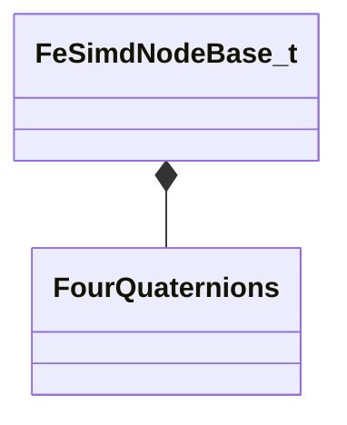

**Fields:**

| Name | Type | Annotations |
|------|------|-------------|
| `nNode` | uint16[4] |  |
| `nNodeX0` | uint16[4] |  |
| `nNodeX1` | uint16[4] |  |
| `nNodeY0` | uint16[4] |  |
| `nNodeY1` | uint16[4] |  |
| `nDummy` | uint16[4] |  |
| `qAdjust` | [FourQuaternions](../schemas/mathlib_extended.md#fourquaternions) |  |

### FeSimdQuad_t

**Metadata:** `MGetKV3ClassDefaults {
	"nNode":
	[
		[
			0,
			0,
			0,
			0
		],
		[
			0,
			0,
			0,
			0
		],
		[
			0,
			0,
			0,
			0
		],
		[
			0,
			0,
			0,
			0
		]
	],
	"f4Slack":
	[
		0.000000,
		0.000000,
		0.000000,
		0.000000
	],
	"vShape":
	[
		[
			0.000000,
			0.000000,
			0.000000,
			0.000000,
			0.000000,
			0.000000,
			0.000000,
			0.000000,
			0.000000,
			0.000000,
			0.000000,
			0.000000
		],
		[
			0.000000,
			0.000000,
			0.000000,
			0.000000,
			0.000000,
			0.000000,
			0.000000,
			0.000000,
			0.000000,
			0.000000,
			0.000000,
			0.000000
		],
		[
			0.000000,
			0.000000,
			0.000000,
			0.000000,
			0.000000,
			0.000000,
			0.000000,
			0.000000,
			0.000000,
			0.000000,
			0.000000,
			0.000000
		],
		[
			0.000000,
			0.000000,
			0.000000,
			0.000000,
			0.000000,
			0.000000,
			0.000000,
			0.000000,
			0.000000,
			0.000000,
			0.000000,
			0.000000
		]
	],
	"f4Weights":
	[
		[
			0.000000,
			0.000000,
			0.000000,
			0.000000
		],
		[
			0.000000,
			0.000000,
			0.000000,
			0.000000
		],
		[
			0.000000,
			0.000000,
			0.000000,
			0.000000
		],
		[
			0.000000,
			0.000000,
			0.000000,
			0.000000
		]
	]
}`

**Fields:**

| Name | Type | Annotations |
|------|------|-------------|
| `nNode` | uint16[4][4] |  |
| `f4Slack` | fltx4 |  |
| `vShape` | FourVectors[4] |  |
| `f4Weights` | fltx4[4] |  |

### FeSimdRodConstraintAnim_t

**Metadata:** `MGetKV3ClassDefaults {
	"nNode":
	[
		[
			0,
			0,
			0,
			0
		],
		[
			0,
			0,
			0,
			0
		]
	],
	"f4Weight0":
	[
		0.000000,
		0.000000,
		0.000000,
		0.000000
	],
	"f4RelaxationFactor":
	[
		0.000000,
		0.000000,
		0.000000,
		0.000000
	]
}`

**Fields:**

| Name | Type | Annotations |
|------|------|-------------|
| `nNode` | uint16[4][2] |  |
| `f4Weight0` | fltx4 |  |
| `f4RelaxationFactor` | fltx4 |  |

### FeSimdRodConstraint_t

**Metadata:** `MGetKV3ClassDefaults {
	"nNode":
	[
		[
			0,
			0,
			0,
			0
		],
		[
			0,
			0,
			0,
			0
		]
	],
	"f4MaxDist":
	[
		0.000000,
		0.000000,
		0.000000,
		0.000000
	],
	"f4MinDist":
	[
		0.000000,
		0.000000,
		0.000000,
		0.000000
	],
	"f4Weight0":
	[
		0.000000,
		0.000000,
		0.000000,
		0.000000
	],
	"f4RelaxationFactor":
	[
		0.000000,
		0.000000,
		0.000000,
		0.000000
	]
}`

**Fields:**

| Name | Type | Annotations |
|------|------|-------------|
| `nNode` | uint16[4][2] |  |
| `f4MaxDist` | fltx4 |  |
| `f4MinDist` | fltx4 |  |
| `f4Weight0` | fltx4 |  |
| `f4RelaxationFactor` | fltx4 |  |

### FeSimdSpringIntegrator_t

**Metadata:** `MGetKV3ClassDefaults {
	"nNode":
	[
		[
			0,
			0,
			0,
			0
		],
		[
			0,
			0,
			0,
			0
		]
	],
	"flSpringRestLength":
	[
		0.000000,
		0.000000,
		0.000000,
		0.000000
	],
	"flSpringConstant":
	[
		0.000000,
		0.000000,
		0.000000,
		0.000000
	],
	"flSpringDamping":
	[
		0.000000,
		0.000000,
		0.000000,
		0.000000
	],
	"flNodeWeight0":
	[
		0.000000,
		0.000000,
		0.000000,
		0.000000
	]
}`

**Fields:**

| Name | Type | Annotations |
|------|------|-------------|
| `nNode` | uint16[4][2] |  |
| `flSpringRestLength` | fltx4 |  |
| `flSpringConstant` | fltx4 |  |
| `flSpringDamping` | fltx4 |  |
| `flNodeWeight0` | fltx4 |  |

### FeSimdTri_t

**Metadata:** `MGetKV3ClassDefaults {
	"nNode":
	[
		[
			0,
			0,
			0,
			0
		],
		[
			0,
			0,
			0,
			0
		],
		[
			0,
			0,
			0,
			0
		]
	],
	"w1":
	[
		0.000000,
		0.000000,
		0.000000,
		0.000000
	],
	"w2":
	[
		0.000000,
		0.000000,
		0.000000,
		0.000000
	],
	"v1x":
	[
		0.000000,
		0.000000,
		0.000000,
		0.000000
	],
	"v2":
	{
		"x":
		[
			0.000000,
			0.000000,
			0.000000,
			0.000000
		],
		"y":
		[
			0.000000,
			0.000000,
			0.000000,
			0.000000
		]
	}
}`

**Relationships:**

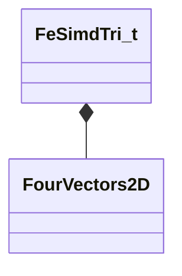

**Fields:**

| Name | Type | Annotations |
|------|------|-------------|
| `nNode` | uint32[4][3] |  |
| `w1` | fltx4 |  |
| `w2` | fltx4 |  |
| `v1x` | fltx4 |  |
| `v2` | [FourVectors2D](../schemas/physicslib.md#fourvectors2d) |  |

### FeSoftParent_t

**Metadata:** `MGetKV3ClassDefaults {
	"nParent": -1,
	"flAlpha": 0.000000
}`

**Fields:**

| Name | Type | Annotations |
|------|------|-------------|
| `nParent` | int32 |  |
| `flAlpha` | float32 |  |

### FeSourceEdge_t

**Metadata:** `MGetKV3ClassDefaults {
	"nNode":
	[
		0,
		0
	]
}`

**Fields:**

| Name | Type | Annotations |
|------|------|-------------|
| `nNode` | uint16[2] |  |

### FeSphereRigid_t

**Derived by:** [FeBuildSphereRigid_t](physicslib.md#febuildsphererigid_t)

**Metadata:** `MGetKV3ClassDefaults {
	"vSphere":
	[
		0.000000,
		0.000000,
		0.000000,
		1.000000
	],
	"nNode": 0,
	"nCollisionMask": 65535,
	"nVertexMapIndex": 65535,
	"nFlags": 0
}`

**Relationships:**


**Fields:**

| Name | Type | Annotations |
|------|------|-------------|
| `vSphere` | fltx4 |  |
| `nNode` | uint16 |  |
| `nCollisionMask` | uint16 |  |
| `nVertexMapIndex` | uint16 |  |
| `nFlags` | uint16 |  |

### FeSpringIntegrator_t

**Metadata:** `MGetKV3ClassDefaults {
	"nNode":
	[
		0,
		0
	],
	"flSpringRestLength": 0.000000,
	"flSpringConstant": 0.000000,
	"flSpringDamping": 0.000000,
	"flNodeWeight0": 0.000000
}`

**Fields:**

| Name | Type | Annotations |
|------|------|-------------|
| `nNode` | uint16[2] |  |
| `flSpringRestLength` | float32 |  |
| `flSpringConstant` | float32 |  |
| `flSpringDamping` | float32 |  |
| `flNodeWeight0` | float32 |  |

### FeStiffHingeBuild_t

**Metadata:** `MGetKV3ClassDefaults {
	"flMaxAngle": 0.000000,
	"flStrength": 1.000000,
	"flMotionBias":
	[
		1.000000,
		1.000000,
		1.000000
	],
	"nNode":
	[
		0,
		0,
		0
	]
}`

**Fields:**

| Name | Type | Annotations |
|------|------|-------------|
| `flMaxAngle` | float32 |  |
| `flStrength` | float32 |  |
| `flMotionBias` | float32[3] |  |
| `nNode` | uint16[3] |  |

### FeTaperedCapsuleRigid_t

**Derived by:** [FeBuildTaperedCapsuleRigid_t](physicslib.md#febuildtaperedcapsulerigid_t)

**Metadata:** `MGetKV3ClassDefaults {
	"vSphere":
	[
		[
			0.000000,
			0.000000,
			0.000000,
			0.000000
		],
		[
			0.000000,
			0.000000,
			0.000000,
			0.000000
		]
	],
	"nNode": 0,
	"nCollisionMask": 65535,
	"nVertexMapIndex": 65535,
	"nFlags": 0
}`

**Relationships:**


**Fields:**

| Name | Type | Annotations |
|------|------|-------------|
| `vSphere` | fltx4[2] |  |
| `nNode` | uint16 |  |
| `nCollisionMask` | uint16 |  |
| `nVertexMapIndex` | uint16 |  |
| `nFlags` | uint16 |  |

### FeTaperedCapsuleStretch_t

**Metadata:** `MGetKV3ClassDefaults {
	"nNode":
	[
		0,
		0
	],
	"nCollisionMask": 65535,
	"nDummy": 0,
	"flRadius":
	[
		0.000000,
		0.000000
	]
}`

**Fields:**

| Name | Type | Annotations |
|------|------|-------------|
| `nNode` | uint16[2] |  |
| `nCollisionMask` | uint16 |  |
| `nDummy` | uint16 | `MPropertySuppressField` |
| `flRadius` | float32[2] |  |

### FeTreeChildren_t

**Metadata:** `MGetKV3ClassDefaults {
	"nChild":
	[
		0,
		0
	]
}`

**Fields:**

| Name | Type | Annotations |
|------|------|-------------|
| `nChild` | uint16[2] |  |

### FeTri_t

**Metadata:** `MGetKV3ClassDefaults {
	"nNode":
	[
		0,
		0,
		0
	],
	"w1": 0.000000,
	"w2": 0.000000,
	"v1x": 0.000000,
	"v2":
	[
		0.000000,
		0.000000
	]
}`

**Fields:**

| Name | Type | Annotations |
|------|------|-------------|
| `nNode` | uint16[3] |  |
| `w1` | float32 |  |
| `w2` | float32 |  |
| `v1x` | float32 |  |
| `v2` | Vector2D |  |

### FeTwistConstraint_t

**Metadata:** `MGetKV3ClassDefaults {
	"nNodeOrient": 0,
	"nNodeEnd": 0,
	"flTwistRelax": 0.000000,
	"flSwingRelax": 0.000000
}`

**Fields:**

| Name | Type | Annotations |
|------|------|-------------|
| `nNodeOrient` | uint16 |  |
| `nNodeEnd` | uint16 |  |
| `flTwistRelax` | float32 |  |
| `flSwingRelax` | float32 |  |

### FeVertexMapBuild_t

**Metadata:** `MGetKV3ClassDefaults {
	"m_VertexMapName": "",
	"m_nNameHash": 0,
	"m_Color":
	[
		255,
		255,
		255
	],
	"m_flVolumetricSolveStrength": 0.000000,
	"m_nScaleSourceNode": -1,
	"m_Weights":
	[
	]
}`

**Fields:**

| Name | Type | Annotations |
|------|------|-------------|
| `m_VertexMapName` | CUtlString |  |
| `m_nNameHash` | uint32 |  |
| `m_Color` | Color |  |
| `m_flVolumetricSolveStrength` | float32 |  |
| `m_nScaleSourceNode` | int32 |  |
| `m_Weights` | CUtlVector<float32> |  |

### FeVertexMapDesc_t

**Metadata:** `MGetKV3ClassDefaults {
	"sName": "",
	"nNameHash": 0,
	"nColor": 0,
	"nFlags": 0,
	"nVertexBase": 0,
	"nVertexCount": 0,
	"nMapOffset": 0,
	"nNodeListOffset": 0,
	"vCenterOfMass":
	[
		0.000000,
		0.000000,
		0.000000
	],
	"flVolumetricSolveStrength": 0.000000,
	"nScaleSourceNode": -1,
	"nNodeListCount": 0
}`

**Fields:**

| Name | Type | Annotations |
|------|------|-------------|
| `sName` | CUtlString |  |
| `nNameHash` | uint32 |  |
| `nColor` | uint32 |  |
| `nFlags` | uint32 |  |
| `nVertexBase` | uint16 |  |
| `nVertexCount` | uint16 |  |
| `nMapOffset` | uint32 |  |
| `nNodeListOffset` | uint32 |  |
| `vCenterOfMass` | Vector |  |
| `flVolumetricSolveStrength` | float32 |  |
| `nScaleSourceNode` | int16 |  |
| `nNodeListCount` | uint16 |  |

### FeWeightedNode_t

**Metadata:** `MGetKV3ClassDefaults {
	"nNode": 0,
	"nWeight": 0
}`

**Fields:**

| Name | Type | Annotations |
|------|------|-------------|
| `nNode` | uint16 |  |
| `nWeight` | uint16 |  |

### FeWorldCollisionParams_t

**Metadata:** `MGetKV3ClassDefaults {
	"flWorldFriction": 0.000000,
	"flGroundFriction": 0.000000,
	"nListBegin": 0,
	"nListEnd": 0
}`

**Fields:**

| Name | Type | Annotations |
|------|------|-------------|
| `flWorldFriction` | float32 |  |
| `flGroundFriction` | float32 |  |
| `nListBegin` | uint16 |  |
| `nListEnd` | uint16 |  |

### FourCovMatrices3

**Metadata:** `MGetKV3ClassDefaults Could not parse KV3 Defaults`

**Fields:**

| Name | Type | Annotations |
|------|------|-------------|
| `m_vDiag` | FourVectors |  |
| `m_flXY` | fltx4 |  |
| `m_flXZ` | fltx4 |  |
| `m_flYZ` | fltx4 |  |

### FourVectors2D

**Metadata:** `MGetKV3ClassDefaults {
	"x":
	[
		0.000000,
		0.000000,
		0.000000,
		0.000000
	],
	"y":
	[
		0.000000,
		0.000000,
		0.000000,
		0.000000
	]
}`

**Fields:**

| Name | Type | Annotations |
|------|------|-------------|
| `x` | fltx4 |  |
| `y` | fltx4 |  |

### JointAxis_t

**Values:**

| Name | Value | Description |
|------|-------|-------------|
| `JOINT_AXIS_X` | 0 |  |
| `JOINT_AXIS_Y` | 1 |  |
| `JOINT_AXIS_Z` | 2 |  |
| `JOINT_AXIS_COUNT` | 3 |  |

### JointMotion_t

**Values:**

| Name | Value | Description |
|------|-------|-------------|
| `JOINT_MOTION_FREE` | 0 |  |
| `JOINT_MOTION_LOCKED` | 1 |  |
| `JOINT_MOTION_COUNT` | 2 |  |

### OldFeEdge_t

**Metadata:** `MGetKV3ClassDefaults {
	"m_flK":
	[
		0.000000,
		0.000000,
		0.000000
	],
	"invA": 0.000000,
	"t": 0.000000,
	"flThetaRelaxed": 0.000000,
	"flThetaFactor": 0.000000,
	"c01": 0.000000,
	"c02": 0.000000,
	"c03": 0.000000,
	"c04": 0.000000,
	"flAxialModelDist": 0.000000,
	"flAxialModelWeights":
	[
		0.000000,
		0.000000,
		0.000000,
		0.000000
	],
	"m_nNode":
	[
		0,
		0,
		0,
		0
	]
}`

**Fields:**

| Name | Type | Annotations |
|------|------|-------------|
| `m_flK` | float32[3] |  |
| `invA` | float32 |  |
| `t` | float32 |  |
| `flThetaRelaxed` | float32 |  |
| `flThetaFactor` | float32 |  |
| `c01` | float32 |  |
| `c02` | float32 |  |
| `c03` | float32 |  |
| `c04` | float32 |  |
| `flAxialModelDist` | float32 |  |
| `flAxialModelWeights` | float32[4] |  |
| `m_nNode` | uint16[4] |  |

### PhysFeModelDesc_t

**Metadata:** `MGetKV3ClassDefaults {
	"m_CtrlHash":
	[
	],
	"m_CtrlName":
	[
	],
	"m_nStaticNodeFlags": 0,
	"m_nDynamicNodeFlags": 0,
	"m_flLocalForce": 0.000000,
	"m_flLocalRotation": 0.000000,
	"m_nNodeCount": 0,
	"m_nStaticNodes": 0,
	"m_nRotLockStaticNodes": 0,
	"m_nFirstPositionDrivenNode": 0,
	"m_nSimdTriCount1": 0,
	"m_nSimdTriCount2": 0,
	"m_nSimdQuadCount1": 0,
	"m_nSimdQuadCount2": 0,
	"m_nQuadCount1": 0,
	"m_nQuadCount2": 0,
	"m_nTreeDepth": 0,
	"m_nNodeBaseJiggleboneDependsCount": 0,
	"m_nRopeCount": 0,
	"m_Ropes":
	[
	],
	"m_NodeBases":
	[
	],
	"m_SimdNodeBases":
	[
	],
	"m_Quads":
	[
	],
	"m_SimdQuads":
	[
	],
	"m_SimdTris":
	[
	],
	"m_SimdRods":
	[
	],
	"m_SimdRodsAnim":
	[
	],
	"m_InitPose":
	[
	],
	"m_Rods":
	[
	],
	"m_Twists":
	[
	],
	"m_HingeLimits":
	[
	],
	"m_AntiTunnelBytecode":
	[
	],
	"m_DynKinLinks":
	[
	],
	"m_AntiTunnelProbes":
	[
	],
	"m_AntiTunnelTargetNodes":
	[
	],
	"m_NodeStrayBoxes":
	[
	],
	"m_AxialEdges":
	[
	],
	"m_NodeInvMasses":
	[
	],
	"m_CtrlOffsets":
	[
	],
	"m_CtrlOsOffsets":
	[
	],
	"m_FollowNodes":
	[
	],
	"m_CollisionPlanes":
	[
	],
	"m_NodeIntegrator":
	[
	],
	"m_SpringIntegrator":
	[
	],
	"m_SimdSpringIntegrator":
	[
	],
	"m_WorldCollisionParams":
	[
	],
	"m_LegacyStretchForce":
	[
	],
	"m_NodeCollisionRadii":
	[
	],
	"m_DynNodeFriction":
	[
	],
	"m_LocalRotation":
	[
	],
	"m_LocalForce":
	[
	],
	"m_TaperedCapsuleStretches":
	[
	],
	"m_TaperedCapsuleRigids":
	[
	],
	"m_SphereRigids":
	[
	],
	"m_WorldCollisionNodes":
	[
	],
	"m_TreeParents":
	[
	],
	"m_TreeCollisionMasks":
	[
	],
	"m_TreeChildren":
	[
	],
	"m_FreeNodes":
	[
	],
	"m_FitMatrices":
	[
	],
	"m_FitWeights":
	[
	],
	"m_ReverseOffsets":
	[
	],
	"m_AnimStrayRadii":
	[
	],
	"m_SimdAnimStrayRadii":
	[
	],
	"m_KelagerBends":
	[
	],
	"m_CtrlSoftOffsets":
	[
	],
	"m_JiggleBones":
	[
	],
	"m_SourceElems":
	[
	],
	"m_GoalDampedSpringIntegrators":
	[
	],
	"m_Tris":
	[
	],
	"m_nTriCount1": 0,
	"m_nTriCount2": 0,
	"m_nReservedUint8": 0,
	"m_nExtraPressureIterations": 0,
	"m_nExtraGoalIterations": 0,
	"m_nExtraIterations": 0,
	"m_SDFRigids":
	[
	],
	"m_BoxRigids":
	[
	],
	"m_DynNodeVertexSet":
	[
	],
	"m_VertexSetNames":
	[
	],
	"m_RigidColliderPriorities":
	[
	],
	"m_MorphLayers":
	[
	],
	"m_MorphSetData":
	[
	],
	"m_VertexMaps":
	[
	],
	"m_VertexMapValues":
	[
	],
	"m_Effects":
	[
	],
	"m_LockToParent":
	[
	],
	"m_LockToGoal":
	[
	],
	"m_SkelParents":
	[
	],
	"m_DynNodeWindBases":
	[
	],
	"m_SelfCollisionLayers":
	[
	],
	"m_flInternalPressure": 0.000000,
	"m_flDefaultTimeDilation": 0.000000,
	"m_flWindage": 0.000000,
	"m_flWindDrag": 0.000000,
	"m_flDefaultSurfaceStretch": 0.000000,
	"m_flDefaultThreadStretch": 0.000000,
	"m_flDefaultGravityScale": 0.000000,
	"m_flDefaultVelAirDrag": 0.000000,
	"m_flDefaultExpAirDrag": 0.000000,
	"m_flDefaultVelQuadAirDrag": 0.000000,
	"m_flDefaultExpQuadAirDrag": 0.000000,
	"m_flRodVelocitySmoothRate": 0.000000,
	"m_flQuadVelocitySmoothRate": 0.000000,
	"m_flAddWorldCollisionRadius": 0.000000,
	"m_flDefaultVolumetricSolveAmount": 0.000000,
	"m_flMotionSmoothCDT": 0.000000,
	"m_flLocalDrag1": 0.000000,
	"m_nRodVelocitySmoothIterations": 0,
	"m_nQuadVelocitySmoothIterations": 0
}`

**Relationships:**

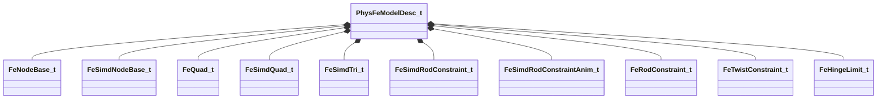

**Fields:**

| Name | Type | Annotations |
|------|------|-------------|
| `m_CtrlHash` | CUtlVector<uint32> |  |
| `m_CtrlName` | CUtlVector<CUtlString> |  |
| `m_nStaticNodeFlags` | uint32 |  |
| `m_nDynamicNodeFlags` | uint32 |  |
| `m_flLocalForce` | float32 |  |
| `m_flLocalRotation` | float32 |  |
| `m_nNodeCount` | uint16 |  |
| `m_nStaticNodes` | uint16 |  |
| `m_nRotLockStaticNodes` | uint16 |  |
| `m_nFirstPositionDrivenNode` | uint16 |  |
| `m_nSimdTriCount1` | uint16 |  |
| `m_nSimdTriCount2` | uint16 |  |
| `m_nSimdQuadCount1` | uint16 |  |
| `m_nSimdQuadCount2` | uint16 |  |
| `m_nQuadCount1` | uint16 |  |
| `m_nQuadCount2` | uint16 |  |
| `m_nTreeDepth` | uint16 |  |
| `m_nNodeBaseJiggleboneDependsCount` | uint16 |  |
| `m_nRopeCount` | uint16 |  |
| `m_Ropes` | CUtlVector<uint16> |  |
| `m_NodeBases` | CUtlVector<[FeNodeBase_t](../schemas/physicslib.md#fenodebase_t)> |  |
| `m_SimdNodeBases` | CUtlVector<[FeSimdNodeBase_t](../schemas/physicslib.md#fesimdnodebase_t)> |  |
| `m_Quads` | CUtlVector<[FeQuad_t](../schemas/physicslib.md#fequad_t)> |  |
| `m_SimdQuads` | CUtlVector<[FeSimdQuad_t](../schemas/physicslib.md#fesimdquad_t)> |  |
| `m_SimdTris` | CUtlVector<[FeSimdTri_t](../schemas/physicslib.md#fesimdtri_t)> |  |
| `m_SimdRods` | CUtlVector<[FeSimdRodConstraint_t](../schemas/physicslib.md#fesimdrodconstraint_t)> |  |
| `m_SimdRodsAnim` | CUtlVector<[FeSimdRodConstraintAnim_t](../schemas/physicslib.md#fesimdrodconstraintanim_t)> |  |
| `m_InitPose` | CUtlVector<CTransform> |  |
| `m_Rods` | CUtlVector<[FeRodConstraint_t](../schemas/physicslib.md#ferodconstraint_t)> |  |
| `m_Twists` | CUtlVector<[FeTwistConstraint_t](../schemas/physicslib.md#fetwistconstraint_t)> |  |
| `m_HingeLimits` | CUtlVector<[FeHingeLimit_t](../schemas/physicslib.md#fehingelimit_t)> |  |
| `m_AntiTunnelBytecode` | CUtlVector<uint32> |  |
| `m_DynKinLinks` | CUtlVector<[FeDynKinLink_t](../schemas/physicslib.md#fedynkinlink_t)> |  |
| `m_AntiTunnelProbes` | CUtlVector<[FeAntiTunnelProbe_t](../schemas/physicslib.md#feantitunnelprobe_t)> |  |
| `m_AntiTunnelTargetNodes` | CUtlVector<uint16> |  |
| `m_NodeStrayBoxes` | CUtlVector<[FeNodeStrayBox_t](../schemas/physicslib.md#fenodestraybox_t)> |  |
| `m_AxialEdges` | CUtlVector<[FeAxialEdgeBend_t](../schemas/physicslib.md#feaxialedgebend_t)> |  |
| `m_NodeInvMasses` | CUtlVector<float32> |  |
| `m_CtrlOffsets` | CUtlVector<[FeCtrlOffset_t](../schemas/physicslib.md#fectrloffset_t)> |  |
| `m_CtrlOsOffsets` | CUtlVector<[FeCtrlOsOffset_t](../schemas/physicslib.md#fectrlosoffset_t)> |  |
| `m_FollowNodes` | CUtlVector<[FeFollowNode_t](../schemas/physicslib.md#fefollownode_t)> |  |
| `m_CollisionPlanes` | CUtlVector<[FeCollisionPlane_t](../schemas/physicslib.md#fecollisionplane_t)> |  |
| `m_NodeIntegrator` | CUtlVector<[FeNodeIntegrator_t](../schemas/physicslib.md#fenodeintegrator_t)> |  |
| `m_SpringIntegrator` | CUtlVector<[FeSpringIntegrator_t](../schemas/physicslib.md#fespringintegrator_t)> |  |
| `m_SimdSpringIntegrator` | CUtlVector<[FeSimdSpringIntegrator_t](../schemas/physicslib.md#fesimdspringintegrator_t)> |  |
| `m_WorldCollisionParams` | CUtlVector<[FeWorldCollisionParams_t](../schemas/physicslib.md#feworldcollisionparams_t)> |  |
| `m_LegacyStretchForce` | CUtlVector<float32> |  |
| `m_NodeCollisionRadii` | CUtlVector<float32> |  |
| `m_DynNodeFriction` | CUtlVector<float32> |  |
| `m_LocalRotation` | CUtlVector<float32> |  |
| `m_LocalForce` | CUtlVector<float32> |  |
| `m_TaperedCapsuleStretches` | CUtlVector<[FeTaperedCapsuleStretch_t](../schemas/physicslib.md#fetaperedcapsulestretch_t)> |  |
| `m_TaperedCapsuleRigids` | CUtlVector<[FeTaperedCapsuleRigid_t](../schemas/physicslib.md#fetaperedcapsulerigid_t)> |  |
| `m_SphereRigids` | CUtlVector<[FeSphereRigid_t](../schemas/physicslib.md#fesphererigid_t)> |  |
| `m_WorldCollisionNodes` | CUtlVector<uint16> |  |
| `m_TreeParents` | CUtlVector<uint16> |  |
| `m_TreeCollisionMasks` | CUtlVector<uint16> |  |
| `m_TreeChildren` | CUtlVector<[FeTreeChildren_t](../schemas/physicslib.md#fetreechildren_t)> |  |
| `m_FreeNodes` | CUtlVector<uint16> |  |
| `m_FitMatrices` | CUtlVector<[FeFitMatrix_t](../schemas/physicslib.md#fefitmatrix_t)> |  |
| `m_FitWeights` | CUtlVector<[FeFitWeight_t](../schemas/physicslib.md#fefitweight_t)> |  |
| `m_ReverseOffsets` | CUtlVector<[FeNodeReverseOffset_t](../schemas/physicslib.md#fenodereverseoffset_t)> |  |
| `m_AnimStrayRadii` | CUtlVector<[FeAnimStrayRadius_t](../schemas/physicslib.md#feanimstrayradius_t)> |  |
| `m_SimdAnimStrayRadii` | CUtlVector<[FeSimdAnimStrayRadius_t](../schemas/physicslib.md#fesimdanimstrayradius_t)> |  |
| `m_KelagerBends` | CUtlVector<[FeKelagerBend2_t](../schemas/physicslib.md#fekelagerbend2_t)> |  |
| `m_CtrlSoftOffsets` | CUtlVector<[FeCtrlSoftOffset_t](../schemas/physicslib.md#fectrlsoftoffset_t)> |  |
| `m_JiggleBones` | CUtlVector<[CFeIndexedJiggleBone](../schemas/physicslib.md#cfeindexedjigglebone)> |  |
| `m_SourceElems` | CUtlVector<uint16> |  |
| `m_GoalDampedSpringIntegrators` | CUtlVector<uint32> |  |
| `m_Tris` | CUtlVector<[FeTri_t](../schemas/physicslib.md#fetri_t)> |  |
| `m_nTriCount1` | uint16 |  |
| `m_nTriCount2` | uint16 |  |
| `m_nReservedUint8` | uint8 |  |
| `m_nExtraPressureIterations` | uint8 |  |
| `m_nExtraGoalIterations` | uint8 |  |
| `m_nExtraIterations` | uint8 |  |
| `m_SDFRigids` | CUtlVector<[FeSDFRigid_t](../schemas/physicslib.md#fesdfrigid_t)> |  |
| `m_BoxRigids` | CUtlVector<[FeBoxRigid_t](../schemas/physicslib.md#feboxrigid_t)> |  |
| `m_DynNodeVertexSet` | CUtlVector<uint8> |  |
| `m_VertexSetNames` | CUtlVector<uint32> |  |
| `m_RigidColliderPriorities` | CUtlVector<[FeRigidColliderIndices_t](../schemas/physicslib.md#ferigidcolliderindices_t)> |  |
| `m_MorphLayers` | CUtlVector<[FeMorphLayerDepr_t](../schemas/physicslib.md#femorphlayerdepr_t)> |  |
| `m_MorphSetData` | CUtlVector<uint8> |  |
| `m_VertexMaps` | CUtlVector<[FeVertexMapDesc_t](../schemas/physicslib.md#fevertexmapdesc_t)> |  |
| `m_VertexMapValues` | CUtlVector<uint8> |  |
| `m_Effects` | CUtlVector<[FeEffectDesc_t](../schemas/physicslib.md#feeffectdesc_t)> |  |
| `m_LockToParent` | CUtlVector<[FeCtrlOffset_t](../schemas/physicslib.md#fectrloffset_t)> |  |
| `m_LockToGoal` | CUtlVector<uint16> |  |
| `m_SkelParents` | CUtlVector<int16> |  |
| `m_DynNodeWindBases` | CUtlVector<[FeNodeWindBase_t](../schemas/physicslib.md#fenodewindbase_t)> |  |
| `m_SelfCollisionLayers` | CUtlVector<[FeModelSelfCollisionLayer_t](../schemas/physicslib.md#femodelselfcollisionlayer_t)> |  |
| `m_flInternalPressure` | float32 |  |
| `m_flDefaultTimeDilation` | float32 |  |
| `m_flWindage` | float32 |  |
| `m_flWindDrag` | float32 |  |
| `m_flDefaultSurfaceStretch` | float32 |  |
| `m_flDefaultThreadStretch` | float32 |  |
| `m_flDefaultGravityScale` | float32 |  |
| `m_flDefaultVelAirDrag` | float32 |  |
| `m_flDefaultExpAirDrag` | float32 |  |
| `m_flDefaultVelQuadAirDrag` | float32 |  |
| `m_flDefaultExpQuadAirDrag` | float32 |  |
| `m_flRodVelocitySmoothRate` | float32 |  |
| `m_flQuadVelocitySmoothRate` | float32 |  |
| `m_flAddWorldCollisionRadius` | float32 |  |
| `m_flDefaultVolumetricSolveAmount` | float32 |  |
| `m_flMotionSmoothCDT` | float32 |  |
| `m_flLocalDrag1` | float32 |  |
| `m_nRodVelocitySmoothIterations` | uint16 |  |
| `m_nQuadVelocitySmoothIterations` | uint16 |  |

### RnBlendVertex_t

**Metadata:** `MGetKV3ClassDefaults {
	"m_nWeight0": 0,
	"m_nIndex0": 0,
	"m_nWeight1": 0,
	"m_nIndex1": 0,
	"m_nWeight2": 0,
	"m_nIndex2": 0,
	"m_nFlags": 0,
	"m_nTargetIndex": 0
}`

**Fields:**

| Name | Type | Annotations |
|------|------|-------------|
| `m_nWeight0` | uint16 |  |
| `m_nIndex0` | uint16 |  |
| `m_nWeight1` | uint16 |  |
| `m_nIndex1` | uint16 |  |
| `m_nWeight2` | uint16 |  |
| `m_nIndex2` | uint16 |  |
| `m_nFlags` | uint16 |  |
| `m_nTargetIndex` | uint16 |  |

### RnBodyDesc_t

**Derived by:** [vphysics_save_cphysicsbody_t](vphysics2.md#vphysics_save_cphysicsbody_t)

**Metadata:** `MGetKV3ClassDefaults {
	"m_sDebugName": "",
	"m_vPosition":
	[
		0.000000,
		0.000000,
		0.000000
	],
	"m_qOrientation":
	[
		0.000000,
		0.000000,
		0.000000,
		1.000000
	],
	"m_vLinearVelocity":
	[
		0.000000,
		0.000000,
		0.000000
	],
	"m_vAngularVelocity":
	[
		0.000000,
		0.000000,
		0.000000
	],
	"m_vLocalMassCenter":
	[
		0.000000,
		0.000000,
		0.000000
	],
	"m_LocalInertiaInv":
	[
		[
			0.000000,
			0.000000,
			0.000000
		],
		[
			0.000000,
			0.000000,
			0.000000
		],
		[
			0.000000,
			0.000000,
			0.000000
		]
	],
	"m_flMassInv": 0.000000,
	"m_flGameMass": 0.000000,
	"m_flMassScaleInv": 1.000000,
	"m_flInertiaScaleInv": 1.000000,
	"m_flLinearDamping": 0.000000,
	"m_flAngularDamping": 0.000000,
	"m_flLinearDragScale": 1.000000,
	"m_flAngularDragScale": 1.000000,
	"m_flLinearFluidDragScale": 1.000000,
	"m_flAngularFluidDragScale": 1.000000,
	"m_vLastAwakeForceAccum":
	[
		0.000000,
		0.000000,
		0.000000
	],
	"m_vLastAwakeTorqueAccum":
	[
		0.000000,
		0.000000,
		0.000000
	],
	"m_flBuoyancyScale": 1.000000,
	"m_flGravityScale": 1.000000,
	"m_flTimeScale": 1.000000,
	"m_nBodyType": 0,
	"m_nGameIndex": 0,
	"m_nGameFlags": 0,
	"m_nMinVelocityIterations": 1,
	"m_nMinPositionIterations": 0,
	"m_nMassPriority": 0,
	"m_bEnabled": true,
	"m_bSleeping": false,
	"m_bIsContinuousEnabled": true,
	"m_bDragEnabled": true,
	"m_vGravity":
	[
		0.000000,
		0.000000,
		0.000000
	],
	"m_bSpeculativeEnabled": true,
	"m_bHasShadowController": false,
	"m_nDynamicContinuousContactBehavior": "DYNAMIC_CONTINUOUS_ALLOW_IF_REQUESTED_BY_OTHER_BODY"
}`

**Relationships:**

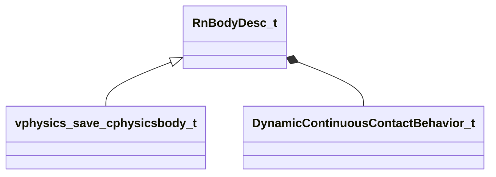

**Fields:**

| Name | Type | Annotations |
|------|------|-------------|
| `m_sDebugName` | CUtlString |  |
| `m_vPosition` | Vector |  |
| `m_qOrientation` | QuaternionStorage |  |
| `m_vLinearVelocity` | Vector |  |
| `m_vAngularVelocity` | Vector |  |
| `m_vLocalMassCenter` | Vector |  |
| `m_LocalInertiaInv` | Vector[3] |  |
| `m_flMassInv` | float32 |  |
| `m_flGameMass` | float32 |  |
| `m_flMassScaleInv` | float32 |  |
| `m_flInertiaScaleInv` | float32 |  |
| `m_flLinearDamping` | float32 |  |
| `m_flAngularDamping` | float32 |  |
| `m_flLinearDragScale` | float32 |  |
| `m_flAngularDragScale` | float32 |  |
| `m_flLinearFluidDragScale` | float32 |  |
| `m_flAngularFluidDragScale` | float32 |  |
| `m_vLastAwakeForceAccum` | Vector |  |
| `m_vLastAwakeTorqueAccum` | Vector |  |
| `m_flBuoyancyScale` | float32 |  |
| `m_flGravityScale` | float32 |  |
| `m_flTimeScale` | float32 |  |
| `m_nBodyType` | int32 |  |
| `m_nGameIndex` | uint32 |  |
| `m_nGameFlags` | uint32 |  |
| `m_nMinVelocityIterations` | int8 |  |
| `m_nMinPositionIterations` | int8 |  |
| `m_nMassPriority` | int8 |  |
| `m_bEnabled` | bool |  |
| `m_bSleeping` | bool |  |
| `m_bIsContinuousEnabled` | bool |  |
| `m_bDragEnabled` | bool |  |
| `m_vGravity` | Vector |  |
| `m_bSpeculativeEnabled` | bool |  |
| `m_bHasShadowController` | bool |  |
| `m_nDynamicContinuousContactBehavior` | [DynamicContinuousContactBehavior_t](../schemas/physicslib.md#dynamiccontinuouscontactbehavior_t) |  |

### RnCapsuleDesc_t

**Inherits from:** [RnShapeDesc_t](physicslib.md#rnshapedesc_t)

**Metadata:** `MGetKV3ClassDefaults {
	"m_nCollisionAttributeIndex": 0,
	"m_nSurfacePropertyIndex": 0,
	"m_UserFriendlyName": "",
	"m_bUserFriendlyNameSealed": false,
	"m_bUserFriendlyNameLong": false,
	"m_nToolMaterialHash": 0,
	"m_Capsule":
	{
		"m_vCenter":
		[
			[
				0.000000,
				0.000000,
				0.000000
			],
			[
				0.000000,
				0.000000,
				0.000000
			]
		],
		"m_flRadius": 0.000000
	}
}`

**Relationships:**

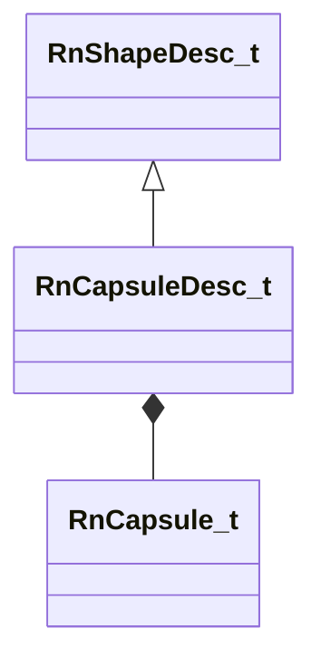

**Fields:**

| Name | Type | Annotations |
|------|------|-------------|
| `m_Capsule` | [RnCapsule_t](../schemas/physicslib.md#rncapsule_t) |  |

### RnCapsule_t

**Metadata:** `MGetKV3ClassDefaults {
	"m_vCenter":
	[
		[
			0.000000,
			0.000000,
			0.000000
		],
		[
			0.000000,
			0.000000,
			0.000000
		]
	],
	"m_flRadius": 0.000000
}`

**Fields:**

| Name | Type | Annotations |
|------|------|-------------|
| `m_vCenter` | Vector[2] |  |
| `m_flRadius` | float32 |  |

### RnFace_t

**Metadata:** `MGetKV3ClassDefaults {
	"m_nEdge": 0
}`

**Fields:**

| Name | Type | Annotations |
|------|------|-------------|
| `m_nEdge` | uint8 |  |

### RnHalfEdge_t

**Metadata:** `MGetKV3ClassDefaults {
	"m_nNext": 5,
	"m_nTwin": 0,
	"m_nOrigin": 0,
	"m_nFace": 0
}`

**Fields:**

| Name | Type | Annotations |
|------|------|-------------|
| `m_nNext` | uint8 |  |
| `m_nTwin` | uint8 |  |
| `m_nOrigin` | uint8 |  |
| `m_nFace` | uint8 |  |

### RnHullDesc_t

**Inherits from:** [RnShapeDesc_t](physicslib.md#rnshapedesc_t)

**Metadata:** `MGetKV3ClassDefaults {
	"m_nCollisionAttributeIndex": 0,
	"m_nSurfacePropertyIndex": 0,
	"m_UserFriendlyName": "",
	"m_bUserFriendlyNameSealed": false,
	"m_bUserFriendlyNameLong": false,
	"m_nToolMaterialHash": 0,
	"m_Hull":
	{
		"m_vCentroid":
		[
			0.000000,
			0.000000,
			0.000000
		],
		"m_flMaxAngularRadius": 0.000000,
		"m_Bounds":
		{
			"m_vMinBounds":
			[
				0.000000,
				0.000000,
				0.000000
			],
			"m_vMaxBounds":
			[
				0.000000,
				0.000000,
				0.000000
			]
		},
		"m_vOrthographicAreas":
		[
			0.000000,
			0.000000,
			0.000000
		],
		"m_MassProperties":
		[
			1.000000,
			0.000000,
			0.000000,
			0.000000,
			0.000000,
			1.000000,
			0.000000,
			0.000000,
			0.000000,
			0.000000,
			1.000000,
			0.000000
		],
		"m_flVolume": 0.000000,
		"m_flSurfaceArea": 0.000000,
		"m_nFlags": 0,
		"m_pRegionSVM": null,
		"m_Vertices": "[BINARY BLOB]",
		"m_VertexPositions": "[BINARY BLOB]",
		"m_Edges": "[BINARY BLOB]",
		"m_Faces": "[BINARY BLOB]",
		"m_Planes": "[BINARY BLOB]"
	}
}`

**Relationships:**

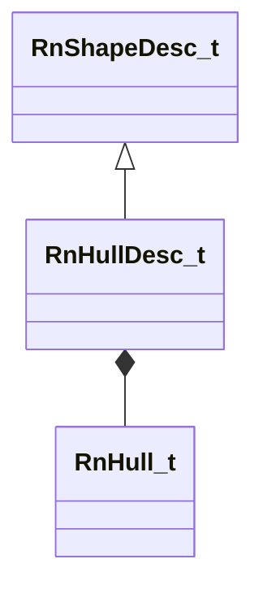

**Fields:**

| Name | Type | Annotations |
|------|------|-------------|
| `m_Hull` | [RnHull_t](../schemas/physicslib.md#rnhull_t) |  |

### RnHull_t

**Metadata:** `MGetKV3ClassDefaults {
	"m_vCentroid":
	[
		0.000000,
		0.000000,
		0.000000
	],
	"m_flMaxAngularRadius": 0.000000,
	"m_Bounds":
	{
		"m_vMinBounds":
		[
			0.000000,
			0.000000,
			0.000000
		],
		"m_vMaxBounds":
		[
			0.000000,
			0.000000,
			0.000000
		]
	},
	"m_vOrthographicAreas":
	[
		0.000000,
		0.000000,
		0.000000
	],
	"m_MassProperties":
	[
		1.000000,
		0.000000,
		0.000000,
		0.000000,
		0.000000,
		1.000000,
		0.000000,
		0.000000,
		0.000000,
		0.000000,
		1.000000,
		0.000000
	],
	"m_flVolume": 0.000000,
	"m_flSurfaceArea": 0.000000,
	"m_nFlags": 0,
	"m_pRegionSVM": null,
	"m_Vertices": "[BINARY BLOB]",
	"m_VertexPositions": "[BINARY BLOB]",
	"m_Edges": "[BINARY BLOB]",
	"m_Faces": "[BINARY BLOB]",
	"m_Planes": "[BINARY BLOB]"
}`

**Relationships:**

```mermaid
classDiagram
    RnHull_t *-- AABB_t
    RnHull_t *-- RnVertex_t
    RnHull_t *-- RnHalfEdge_t
    RnHull_t *-- RnFace_t
    RnHull_t *-- RnPlane_t
    RnHull_t --> CRegionSVM
```

**Fields:**

| Name | Type | Annotations |
|------|------|-------------|
| `m_vCentroid` | Vector |  |
| `m_flMaxAngularRadius` | float32 |  |
| `m_Bounds` | [AABB_t](../schemas/mathlib_extended.md#aabb_t) |  |
| `m_vOrthographicAreas` | Vector |  |
| `m_MassProperties` | matrix3x4_t |  |
| `m_flVolume` | float32 |  |
| `m_flSurfaceArea` | float32 |  |
| `m_Vertices` | CUtlVector<[RnVertex_t](../schemas/physicslib.md#rnvertex_t)> |  |
| `m_VertexPositions` | CUtlVector<Vector> |  |
| `m_Edges` | CUtlVector<[RnHalfEdge_t](../schemas/physicslib.md#rnhalfedge_t)> |  |
| `m_Faces` | CUtlVector<[RnFace_t](../schemas/physicslib.md#rnface_t)> |  |
| `m_FacePlanes` | CUtlVector<[RnPlane_t](../schemas/physicslib.md#rnplane_t)> |  |
| `m_nFlags` | uint32 |  |
| `m_pRegionSVM` | [CRegionSVM](../schemas/physicslib.md#cregionsvm)* |  |

### RnMeshDesc_t

**Inherits from:** [RnShapeDesc_t](physicslib.md#rnshapedesc_t)

**Metadata:** `MGetKV3ClassDefaults {
	"m_nCollisionAttributeIndex": 0,
	"m_nSurfacePropertyIndex": 0,
	"m_UserFriendlyName": "",
	"m_bUserFriendlyNameSealed": false,
	"m_bUserFriendlyNameLong": false,
	"m_nToolMaterialHash": 0,
	"m_Mesh":
	{
		"m_vMin":
		[
			0.000000,
			0.000000,
			0.000000
		],
		"m_vMax":
		[
			0.000000,
			0.000000,
			0.000000
		],
		"m_Materials":
		[
		],
		"m_vOrthographicAreas":
		[
			0.000000,
			0.000000,
			0.000000
		],
		"m_nFlags": 0,
		"m_nDebugFlags": 0,
		"m_Nodes": "[BINARY BLOB]",
		"m_Triangles": "[BINARY BLOB]",
		"m_Vertices": "[BINARY BLOB]"
	}
}`

**Relationships:**

```mermaid
classDiagram
    RnShapeDesc_t <|-- RnMeshDesc_t
    RnMeshDesc_t *-- RnMesh_t
```

**Fields:**

| Name | Type | Annotations |
|------|------|-------------|
| `m_Mesh` | [RnMesh_t](../schemas/physicslib.md#rnmesh_t) |  |

### RnMesh_t

**Metadata:** `MGetKV3ClassDefaults {
	"m_vMin":
	[
		0.000000,
		0.000000,
		0.000000
	],
	"m_vMax":
	[
		0.000000,
		0.000000,
		0.000000
	],
	"m_Materials":
	[
	],
	"m_vOrthographicAreas":
	[
		0.000000,
		0.000000,
		0.000000
	],
	"m_nFlags": 0,
	"m_nDebugFlags": 0,
	"m_Nodes": "[BINARY BLOB]",
	"m_Triangles": "[BINARY BLOB]",
	"m_Vertices": "[BINARY BLOB]"
}`

**Relationships:**

```mermaid
classDiagram
    RnMesh_t *-- RnNode_t
    RnMesh_t *-- RnTriangle_t
    RnMesh_t *-- RnWing_t
```

**Fields:**

| Name | Type | Annotations |
|------|------|-------------|
| `m_vMin` | Vector |  |
| `m_vMax` | Vector |  |
| `m_Nodes` | CUtlVector<[RnNode_t](../schemas/physicslib.md#rnnode_t)> |  |
| `m_Vertices` | CUtlVectorSIMDPaddedVector |  |
| `m_Triangles` | CUtlVector<[RnTriangle_t](../schemas/physicslib.md#rntriangle_t)> |  |
| `m_Wings` | CUtlVector<[RnWing_t](../schemas/physicslib.md#rnwing_t)> |  |
| `m_TriangleEdgeFlags` | CUtlVector<uint8> |  |
| `m_Materials` | CUtlVector<uint8> |  |
| `m_vOrthographicAreas` | Vector |  |
| `m_nFlags` | uint32 |  |
| `m_nDebugFlags` | uint32 |  |

### RnNode_t

**Metadata:** `MGetKV3ClassDefaults {
	"m_vMin":
	[
		0.000000,
		0.000000,
		0.000000
	],
	"m_nChildren": 0,
	"m_vMax":
	[
		0.000000,
		0.000000,
		0.000000
	],
	"m_nTriangleOffset": 0
}`

**Fields:**

| Name | Type | Annotations |
|------|------|-------------|
| `m_vMin` | Vector |  |
| `m_nChildren` | uint32 |  |
| `m_vMax` | Vector |  |
| `m_nTriangleOffset` | uint32 |  |

### RnPlane_t

**Metadata:** `MGetKV3ClassDefaults {
	"m_vNormal":
	[
		0.000000,
		0.000000,
		0.000000
	],
	"m_flOffset": 0.000000
}`

**Fields:**

| Name | Type | Annotations |
|------|------|-------------|
| `m_vNormal` | Vector |  |
| `m_flOffset` | float32 |  |

### RnShapeDesc_t

**Derived by:** [RnCapsuleDesc_t](physicslib.md#rncapsuledesc_t), [RnHullDesc_t](physicslib.md#rnhulldesc_t), [RnMeshDesc_t](physicslib.md#rnmeshdesc_t), [RnSphereDesc_t](physicslib.md#rnspheredesc_t)

**Metadata:** `MGetKV3ClassDefaults {
	"m_nCollisionAttributeIndex": 0,
	"m_nSurfacePropertyIndex": 0,
	"m_UserFriendlyName": "",
	"m_bUserFriendlyNameSealed": false,
	"m_bUserFriendlyNameLong": false,
	"m_nToolMaterialHash": 0
}`

**Relationships:**

```mermaid
classDiagram
    RnShapeDesc_t <|-- RnCapsuleDesc_t
    RnShapeDesc_t <|-- RnHullDesc_t
    RnShapeDesc_t <|-- RnSphereDesc_t
    RnShapeDesc_t <|-- RnMeshDesc_t
```

**Fields:**

| Name | Type | Annotations |
|------|------|-------------|
| `m_nCollisionAttributeIndex` | uint32 |  |
| `m_nSurfacePropertyIndex` | uint32 |  |
| `m_UserFriendlyName` | CUtlString |  |
| `m_bUserFriendlyNameSealed` | bool |  |
| `m_bUserFriendlyNameLong` | bool |  |
| `m_nToolMaterialHash` | uint32 |  |

### RnSoftbodyCapsule_t

**Metadata:** `MGetKV3ClassDefaults {
	"m_vCenter":
	[
		[
			0.000000,
			0.000000,
			0.000000
		],
		[
			0.000000,
			0.000000,
			0.000000
		]
	],
	"m_flRadius": 0.000000,
	"m_nParticle":
	[
		0,
		0
	]
}`

**Fields:**

| Name | Type | Annotations |
|------|------|-------------|
| `m_vCenter` | Vector[2] |  |
| `m_flRadius` | float32 |  |
| `m_nParticle` | uint16[2] |  |

### RnSoftbodyParticle_t

**Metadata:** `MGetKV3ClassDefaults {
	"m_flMassInv": -nan
}`

**Fields:**

| Name | Type | Annotations |
|------|------|-------------|
| `m_flMassInv` | float32 |  |

### RnSoftbodySpring_t

**Metadata:** `MGetKV3ClassDefaults Could not parse KV3 Defaults`

**Fields:**

| Name | Type | Annotations |
|------|------|-------------|
| `m_nParticle` | uint16[2] |  |
| `m_flLength` | float32 |  |

### RnSphereDesc_t

**Inherits from:** [RnShapeDesc_t](physicslib.md#rnshapedesc_t)

**Metadata:** `MGetKV3ClassDefaults {
	"m_nCollisionAttributeIndex": 0,
	"m_nSurfacePropertyIndex": 0,
	"m_UserFriendlyName": "",
	"m_bUserFriendlyNameSealed": false,
	"m_bUserFriendlyNameLong": false,
	"m_nToolMaterialHash": 0,
	"m_Sphere":
	{
		"m_vCenter":
		[
			0.000000,
			0.000000,
			0.000000
		],
		"m_flRadius": 0.000000
	}
}`

**Relationships:**

```mermaid
classDiagram
    RnShapeDesc_t <|-- RnSphereDesc_t
```

**Fields:**

| Name | Type | Annotations |
|------|------|-------------|
| `m_Sphere` | SphereBase_t<float32> |  |

### RnTriangle_t

**Metadata:** `MGetKV3ClassDefaults {
	"m_nIndex":
	[
		0,
		0,
		0
	]
}`

**Fields:**

| Name | Type | Annotations |
|------|------|-------------|
| `m_nIndex` | int32[3] |  |

### RnVertex_t

**Metadata:** `MGetKV3ClassDefaults {
	"m_nEdge": 0
}`

**Fields:**

| Name | Type | Annotations |
|------|------|-------------|
| `m_nEdge` | uint8 |  |

### RnWing_t

**Metadata:** `MGetKV3ClassDefaults {
	"m_nIndex":
	[
		0,
		0,
		0
	]
}`

**Fields:**

| Name | Type | Annotations |
|------|------|-------------|
| `m_nIndex` | int32[3] |  |

### VertexPositionColor_t

**Fields:**

| Name | Type | Annotations |
|------|------|-------------|
| `m_vPosition` | Vector |  |

### VertexPositionNormal_t

**Fields:**

| Name | Type | Annotations |
|------|------|-------------|
| `m_vPosition` | Vector |  |
| `m_vNormal` | Vector |  |
