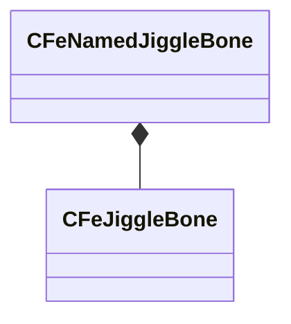

[Schemas](../../schemas.md) / [physicslib](../physicslib.md) / CFeNamedJiggleBone

# CFeNamedJiggleBone

> Source: **Build 25000182** · 2026-08-28 · `windows-x86_64` · schema `0.10.0`

**Kind:** class · **Size:** 208 bytes (`0xd0`) · **Align:** 16 · **Module:** physicslib

**Relationships:**

## Memory layout

4 fields (4 declared here, 0 inherited). Offsets are absolute from the object base.

| Offset | Field | Type | From | Annotations |
|--------|-------|------|------|-------------|
| `0x0` | `m_strParentBone` | CUtlString |  |  |
| `0x10` | `m_transform` | CTransform |  |  |
| `0x30` | `m_nJiggleParent` | uint32 |  |  |
| `0x34` | `m_jiggleBone` | [CFeJiggleBone](../physicslib/CFeJiggleBone.md) |  |  |

KV3 class defaults

<pre>{
	&quot;m_strParentBone&quot;: &quot;&quot;,
	&quot;m_transform&quot;:
	[
		0.000000,
		0.000000,
		0.000000,
		0.000000,
		0.000000,
		0.000000,
		0.000000,
		0.000000
	],
	&quot;m_nJiggleParent&quot;: 0,
	&quot;m_jiggleBone&quot;:
	{
		&quot;m_nFlags&quot;: 0,
		&quot;m_flLength&quot;: 1.000000,
		&quot;m_flTipMass&quot;: 0.000000,
		&quot;m_flYawStiffness&quot;: 0.000000,
		&quot;m_flYawDamping&quot;: 0.000000,
		&quot;m_flPitchStiffness&quot;: 0.000000,
		&quot;m_flPitchDamping&quot;: 0.000000,
		&quot;m_flAlongStiffness&quot;: 0.000000,
		&quot;m_flAlongDamping&quot;: 0.000000,
		&quot;m_flAngleLimit&quot;: 0.000000,
		&quot;m_flMinYaw&quot;: 0.000000,
		&quot;m_flMaxYaw&quot;: 0.000000,
		&quot;m_flYawFriction&quot;: 0.000000,
		&quot;m_flYawBounce&quot;: 0.000000,
		&quot;m_flMinPitch&quot;: 0.000000,
		&quot;m_flMaxPitch&quot;: 0.000000,
		&quot;m_flPitchFriction&quot;: 0.000000,
		&quot;m_flPitchBounce&quot;: 0.000000,
		&quot;m_flBaseMass&quot;: 0.000000,
		&quot;m_flBaseStiffness&quot;: 0.000000,
		&quot;m_flBaseDamping&quot;: 0.000000,
		&quot;m_flBaseMinLeft&quot;: 0.000000,
		&quot;m_flBaseMaxLeft&quot;: 0.000000,
		&quot;m_flBaseLeftFriction&quot;: 0.000000,
		&quot;m_flBaseMinUp&quot;: 0.000000,
		&quot;m_flBaseMaxUp&quot;: 0.000000,
		&quot;m_flBaseUpFriction&quot;: 0.000000,
		&quot;m_flBaseMinForward&quot;: 0.000000,
		&quot;m_flBaseMaxForward&quot;: 0.000000,
		&quot;m_flBaseForwardFriction&quot;: 0.000000,
		&quot;m_flRadius0&quot;: 1.000000,
		&quot;m_flRadius1&quot;: 1.000000,
		&quot;m_vPoint0&quot;:
		[
			0.000000,
			0.000000,
			0.000000
		],
		&quot;m_vPoint1&quot;:
		[
			10.000000,
			0.000000,
			0.000000
		],
		&quot;m_nCollisionMask&quot;: 65535
	}
}</pre>

