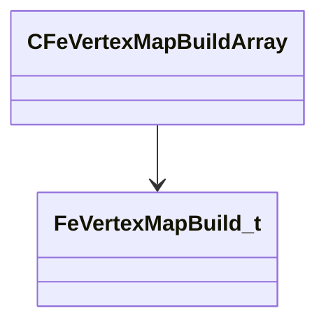

[Schemas](../../schemas.md) / [physicslib](../physicslib.md) / CFeVertexMapBuildArray

# CFeVertexMapBuildArray

**Kind:** class · **Size:** 24 bytes (`0x18`) · **Align:** 8 · **Module:** physicslib

**Relationships:**

## Memory layout

1 fields (1 declared here, 0 inherited). Offsets are absolute from the object base.

| Offset | Field | Type | From | Annotations |
|--------|-------|------|------|-------------|
| `0x0` | `m_Array` | CUtlVector< [FeVertexMapBuild_t](../physicslib/FeVertexMapBuild_t.md)* > |  |  |

KV3 class defaults

<pre>{
	&quot;m_Array&quot;:
	[
	]
}</pre>

