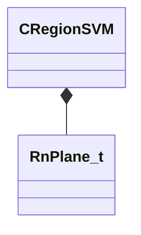

[Schemas](../../schemas.md) / [physicslib](../physicslib.md) / CRegionSVM

# CRegionSVM

> Source: **Build 25000182** · 2026-08-28 · `windows-x86_64` · schema `0.10.0`

**Kind:** class · **Size:** 48 bytes (`0x30`) · **Align:** 8 · **Module:** physicslib

**Relationships:**

## Memory layout

2 fields (2 declared here, 0 inherited). Offsets are absolute from the object base.

| Offset | Field | Type | From | Annotations |
|--------|-------|------|------|-------------|
| `0x0` | `m_Planes` | CUtlVector< [RnPlane_t](../physicslib/RnPlane_t.md) > |  |  |
| `0x18` | `m_Nodes` | CUtlVector< uint32 > |  |  |

KV3 class defaults

<pre>{
	&quot;m_Planes&quot;: &quot;[BINARY BLOB]&quot;,
	&quot;m_Nodes&quot;: &quot;[BINARY BLOB]&quot;
}</pre>

