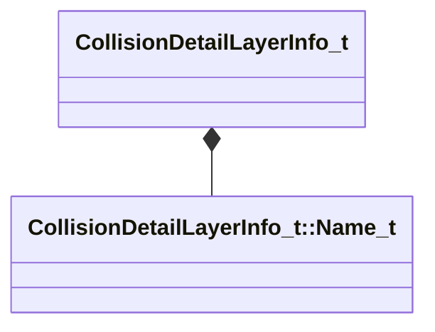

[Schemas](../../schemas.md) / [physicslib](../physicslib.md) / CollisionDetailLayerInfo_t

# CollisionDetailLayerInfo_t

> Source: **Build 25000182** · 2026-08-28 · `windows-x86_64` · schema `0.10.0`

**Kind:** class · **Size:** 64 bytes (`0x40`) · **Align:** 8 · **Module:** physicslib

**Metadata:** `MVDataOutlinerLeafNameFn`, `MVDataRoot`

**Relationships:**

## Memory layout

6 fields (6 declared here, 0 inherited). Offsets are absolute from the object base.

| Offset | Field | Type | From | Annotations |
|--------|-------|------|------|-------------|
| `0x0` | `m_sDescription` | CUtlString |  | `MPropertyDescription How the detail layer is meant to be used` `MPropertyFriendlyName Description` |
| `0x8` | `m_sFriendlyName` | CUtlString |  | `MPropertyDescription How name is displayed in tools` `MPropertyFriendlyName Friendly Name` |
| `0x10` | `m_bIsQueryOnly` | bool |  | `MPropertyDescription Only query can use this layer, not collision` |
| `0x18` | `m_sParentDetailLayer` | CUtlString |  | `MPropertyDescription Parent detail layers automatically include the child layer` |
| `0x20` | `m_vecSubtreeDetailLayers` | CUtlVector< [CollisionDetailLayerInfo_t::Name_t](../physicslib/CollisionDetailLayerInfo_t.Name_t.md) > |  | `MPropertySuppressField` |
| `0x38` | `m_bNotPickable` | bool |  | `MPropertySuppressField` |

KV3 class defaults

<pre>{
	&quot;m_sDescription&quot;: &quot;&quot;,
	&quot;m_sFriendlyName&quot;: &quot;&quot;,
	&quot;m_bIsQueryOnly&quot;: false,
	&quot;m_sParentDetailLayer&quot;: &quot;&quot;,
	&quot;m_vecSubtreeDetailLayers&quot;:
	[
	],
	&quot;m_bNotPickable&quot;: false
}</pre>

