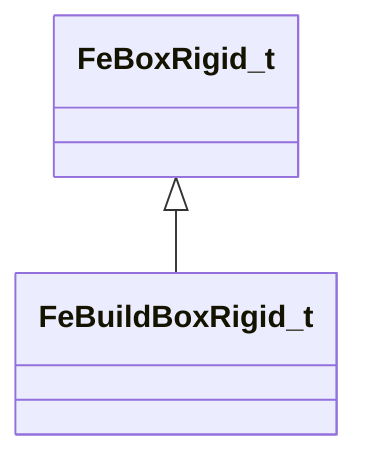

[Schemas](../../schemas.md) / [physicslib](../physicslib.md) / FeBoxRigid_t

# FeBoxRigid_t

> Source: **Build 25000182** · 2026-08-28 · `windows-x86_64` · schema `0.10.0`

**Kind:** class · **Size:** 64 bytes (`0x40`) · **Align:** 16 · **Module:** physicslib

**Derived by:** [FeBuildBoxRigid_t](../physicslib/FeBuildBoxRigid_t.md)

**Relationships:**

## Memory layout

6 fields (6 declared here, 0 inherited). Offsets are absolute from the object base.

| Offset | Field | Type | From | Annotations |
|--------|-------|------|------|-------------|
| `0x0` | `tmFrame2` | CTransform |  |  |
| `0x20` | `nNode` | uint16 |  |  |
| `0x22` | `nCollisionMask` | uint16 |  |  |
| `0x24` | `vSize` | Vector |  |  |
| `0x30` | `nVertexMapIndex` | uint16 |  |  |
| `0x32` | `nFlags` | uint16 |  |  |

KV3 class defaults

<pre>{
	&quot;tmFrame2&quot;:
	[
		0.000000,
		0.000000,
		0.000000,
		1.000000,
		0.000000,
		0.000000,
		0.000000,
		1.000000
	],
	&quot;nNode&quot;: 0,
	&quot;nCollisionMask&quot;: 65535,
	&quot;vSize&quot;:
	[
		0.000000,
		0.000000,
		0.000000
	],
	&quot;nVertexMapIndex&quot;: 65535,
	&quot;nFlags&quot;: 0
}</pre>

