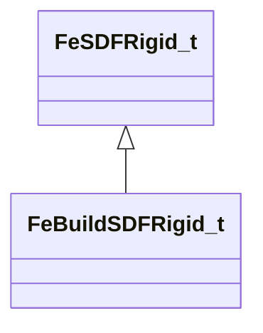

[Schemas](../../schemas.md) / [physicslib](../physicslib.md) / FeBuildSDFRigid_t

# FeBuildSDFRigid_t

> Source: **Build 25000182** · 2026-08-28 · `windows-x86_64` · schema `0.10.0`

**Kind:** class · **Size:** 96 bytes (`0x60`) · **Align:** 8 · **Module:** physicslib

**Inherits from:** [FeSDFRigid_t](../physicslib/FeSDFRigid_t.md)

**Relationships:**

## Memory layout

14 fields (3 declared here, 11 inherited). Offsets are absolute from the object base.

| Offset | Field | Type | From | Annotations |
|--------|-------|------|------|-------------|
| `0x0` | `vLocalMin` | Vector | [FeSDFRigid_t](../physicslib/FeSDFRigid_t.md) |  |
| `0xc` | `vLocalMax` | Vector | [FeSDFRigid_t](../physicslib/FeSDFRigid_t.md) |  |
| `0x18` | `flBounciness` | float32 | [FeSDFRigid_t](../physicslib/FeSDFRigid_t.md) |  |
| `0x1c` | `nNode` | uint16 | [FeSDFRigid_t](../physicslib/FeSDFRigid_t.md) |  |
| `0x1e` | `nCollisionMask` | uint16 | [FeSDFRigid_t](../physicslib/FeSDFRigid_t.md) |  |
| `0x20` | `nVertexMapIndex` | uint16 | [FeSDFRigid_t](../physicslib/FeSDFRigid_t.md) |  |
| `0x22` | `nFlags` | uint16 | [FeSDFRigid_t](../physicslib/FeSDFRigid_t.md) |  |
| `0x28` | `m_Distances` | CUtlVector< float32 > | [FeSDFRigid_t](../physicslib/FeSDFRigid_t.md) |  |
| `0x40` | `m_nWidth` | int32 | [FeSDFRigid_t](../physicslib/FeSDFRigid_t.md) |  |
| `0x44` | `m_nHeight` | int32 | [FeSDFRigid_t](../physicslib/FeSDFRigid_t.md) |  |
| `0x48` | `m_nDepth` | int32 | [FeSDFRigid_t](../physicslib/FeSDFRigid_t.md) |  |
| `0x50` | `m_nPriority` | int32 |  |  |
| `0x54` | `m_nVertexMapHash` | uint32 |  |  |
| `0x58` | `m_nAntitunnelGroupBits` | uint32 |  |  |

KV3 class defaults

<pre>{
	&quot;vLocalMin&quot;:
	[
		0.000000,
		0.000000,
		0.000000
	],
	&quot;vLocalMax&quot;:
	[
		0.000000,
		0.000000,
		0.000000
	],
	&quot;flBounciness&quot;: 0.000000,
	&quot;nNode&quot;: 0,
	&quot;nCollisionMask&quot;: 65535,
	&quot;nVertexMapIndex&quot;: 65535,
	&quot;nFlags&quot;: 0,
	&quot;m_Distances&quot;:
	[
	],
	&quot;m_nWidth&quot;: 8,
	&quot;m_nHeight&quot;: 8,
	&quot;m_nDepth&quot;: 8,
	&quot;m_nPriority&quot;: 0,
	&quot;m_nVertexMapHash&quot;: 0,
	&quot;m_nAntitunnelGroupBits&quot;: 0
}</pre>

