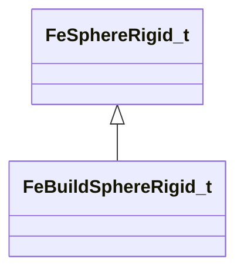

[Schemas](../../schemas.md) / [physicslib](../physicslib.md) / FeBuildSphereRigid_t

# FeBuildSphereRigid_t

> Source: **Build 25000182** · 2026-08-28 · `windows-x86_64` · schema `0.10.0`

**Kind:** class · **Size:** 48 bytes (`0x30`) · **Align:** 16 · **Module:** physicslib

**Inherits from:** [FeSphereRigid_t](../physicslib/FeSphereRigid_t.md)

**Relationships:**

## Memory layout

8 fields (3 declared here, 5 inherited). Offsets are absolute from the object base.

| Offset | Field | Type | From | Annotations |
|--------|-------|------|------|-------------|
| `0x0` | `vSphere` | fltx4 | [FeSphereRigid_t](../physicslib/FeSphereRigid_t.md) |  |
| `0x10` | `nNode` | uint16 | [FeSphereRigid_t](../physicslib/FeSphereRigid_t.md) |  |
| `0x12` | `nCollisionMask` | uint16 | [FeSphereRigid_t](../physicslib/FeSphereRigid_t.md) |  |
| `0x14` | `nVertexMapIndex` | uint16 | [FeSphereRigid_t](../physicslib/FeSphereRigid_t.md) |  |
| `0x16` | `nFlags` | uint16 | [FeSphereRigid_t](../physicslib/FeSphereRigid_t.md) |  |
| `0x20` | `m_nPriority` | int32 |  |  |
| `0x24` | `m_nVertexMapHash` | uint32 |  |  |
| `0x28` | `m_nAntitunnelGroupBits` | uint32 |  |  |

KV3 class defaults

<pre>{
	&quot;vSphere&quot;:
	[
		0.000000,
		0.000000,
		0.000000,
		1.000000
	],
	&quot;nNode&quot;: 0,
	&quot;nCollisionMask&quot;: 65535,
	&quot;nVertexMapIndex&quot;: 65535,
	&quot;nFlags&quot;: 0,
	&quot;m_nPriority&quot;: 0,
	&quot;m_nVertexMapHash&quot;: 0,
	&quot;m_nAntitunnelGroupBits&quot;: 0
}</pre>

