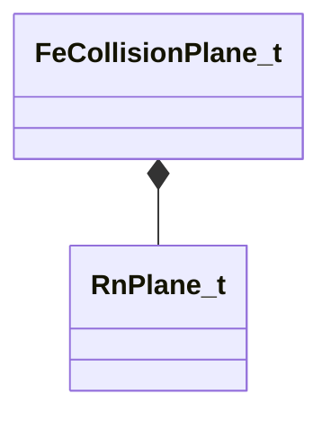

[Schemas](../../schemas.md) / [physicslib](../physicslib.md) / FeCollisionPlane_t

# FeCollisionPlane_t

**Kind:** class · **Size:** 24 bytes (`0x18`) · **Align:** 4 · **Module:** physicslib

**Relationships:**

## Memory layout

4 fields (4 declared here, 0 inherited). Offsets are absolute from the object base.

| Offset | Field | Type | From | Annotations |
|--------|-------|------|------|-------------|
| `0x0` | `nCtrlParent` | uint16 |  |  |
| `0x2` | `nChildNode` | uint16 |  |  |
| `0x4` | `m_Plane` | [RnPlane_t](../physicslib/RnPlane_t.md) |  |  |
| `0x14` | `flStrength` | float32 |  |  |

KV3 class defaults

<pre>{
	&quot;nCtrlParent&quot;: 0,
	&quot;nChildNode&quot;: 0,
	&quot;m_Plane&quot;:
	{
		&quot;m_vNormal&quot;:
		[
			0.000000,
			0.000000,
			0.000000
		],
		&quot;m_flOffset&quot;: 0.000000
	},
	&quot;flStrength&quot;: 0.000000
}</pre>

