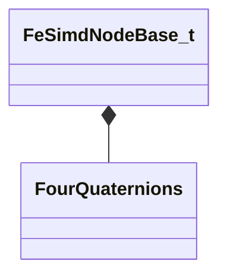

[Schemas](../../schemas.md) / [physicslib](../physicslib.md) / FeSimdNodeBase_t

# FeSimdNodeBase_t

> Source: **Build 25000182** · 2026-08-28 · `windows-x86_64` · schema `0.10.0`

**Kind:** class · **Size:** 112 bytes (`0x70`) · **Align:** 16 · **Module:** physicslib

**Relationships:**

## Memory layout

7 fields (7 declared here, 0 inherited). Offsets are absolute from the object base.

| Offset | Field | Type | From | Annotations |
|--------|-------|------|------|-------------|
| `0x0` | `nNode` | uint16[4] |  |  |
| `0x8` | `nNodeX0` | uint16[4] |  |  |
| `0x10` | `nNodeX1` | uint16[4] |  |  |
| `0x18` | `nNodeY0` | uint16[4] |  |  |
| `0x20` | `nNodeY1` | uint16[4] |  |  |
| `0x28` | `nDummy` | uint16[4] |  |  |
| `0x30` | `qAdjust` | [FourQuaternions](../mathlib_extended/FourQuaternions.md) |  |  |

KV3 class defaults

<pre>{
	&quot;nNode&quot;:
	[
		0,
		0,
		0,
		0
	],
	&quot;nNodeX0&quot;:
	[
		0,
		0,
		0,
		0
	],
	&quot;nNodeX1&quot;:
	[
		0,
		0,
		0,
		0
	],
	&quot;nNodeY0&quot;:
	[
		0,
		0,
		0,
		0
	],
	&quot;nNodeY1&quot;:
	[
		0,
		0,
		0,
		0
	],
	&quot;nDummy&quot;:
	[
		0,
		0,
		0,
		0
	],
	&quot;qAdjust&quot;:
	[
		0.000000,
		0.000000,
		0.000000,
		0.000000,
		0.000000,
		0.000000,
		0.000000,
		0.000000,
		0.000000,
		0.000000,
		0.000000,
		0.000000,
		0.000000,
		0.000000,
		0.000000,
		0.000000
	]
}</pre>

