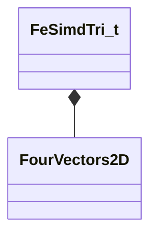

[Schemas](../../schemas.md) / [physicslib](../physicslib.md) / FeSimdTri_t

# FeSimdTri_t

**Kind:** class · **Size:** 128 bytes (`0x80`) · **Align:** 16 · **Module:** physicslib

**Relationships:**

## Memory layout

5 fields (5 declared here, 0 inherited). Offsets are absolute from the object base.

| Offset | Field | Type | From | Annotations |
|--------|-------|------|------|-------------|
| `0x0` | `nNode` | uint32[4][3] |  |  |
| `0x30` | `w1` | fltx4 |  |  |
| `0x40` | `w2` | fltx4 |  |  |
| `0x50` | `v1x` | fltx4 |  |  |
| `0x60` | `v2` | [FourVectors2D](../physicslib/FourVectors2D.md) |  |  |

KV3 class defaults

<pre>{
	&quot;nNode&quot;:
	[
		[
			0,
			0,
			0,
			0
		],
		[
			0,
			0,
			0,
			0
		],
		[
			0,
			0,
			0,
			0
		]
	],
	&quot;w1&quot;:
	[
		0.000000,
		0.000000,
		0.000000,
		0.000000
	],
	&quot;w2&quot;:
	[
		0.000000,
		0.000000,
		0.000000,
		0.000000
	],
	&quot;v1x&quot;:
	[
		0.000000,
		0.000000,
		0.000000,
		0.000000
	],
	&quot;v2&quot;:
	{
		&quot;x&quot;:
		[
			0.000000,
			0.000000,
			0.000000,
			0.000000
		],
		&quot;y&quot;:
		[
			0.000000,
			0.000000,
			0.000000,
			0.000000
		]
	}
}</pre>

