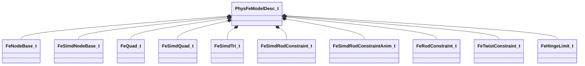

[Schemas](../../schemas.md) / [physicslib](../physicslib.md) / PhysFeModelDesc_t

# PhysFeModelDesc_t

> Source: **Build 25000182** · 2026-08-28 · `windows-x86_64` · schema `0.10.0`

**Kind:** class · **Size:** 1784 bytes (`0x6f8`) · **Align:** 8 · **Module:** physicslib

**Relationships:**

## Memory layout

111 fields (111 declared here, 0 inherited). Offsets are absolute from the object base.

| Offset | Field | Type | From | Annotations |
|--------|-------|------|------|-------------|
| `0x0` | `m_CtrlHash` | CUtlVector< uint32 > |  |  |
| `0x18` | `m_CtrlName` | CUtlVector< CUtlString > |  |  |
| `0x30` | `m_nStaticNodeFlags` | uint32 |  |  |
| `0x34` | `m_nDynamicNodeFlags` | uint32 |  |  |
| `0x38` | `m_flLocalForce` | float32 |  |  |
| `0x3c` | `m_flLocalRotation` | float32 |  |  |
| `0x40` | `m_nNodeCount` | uint16 |  |  |
| `0x42` | `m_nStaticNodes` | uint16 |  |  |
| `0x44` | `m_nRotLockStaticNodes` | uint16 |  |  |
| `0x46` | `m_nFirstPositionDrivenNode` | uint16 |  |  |
| `0x48` | `m_nSimdTriCount1` | uint16 |  |  |
| `0x4a` | `m_nSimdTriCount2` | uint16 |  |  |
| `0x4c` | `m_nSimdQuadCount1` | uint16 |  |  |
| `0x4e` | `m_nSimdQuadCount2` | uint16 |  |  |
| `0x50` | `m_nQuadCount1` | uint16 |  |  |
| `0x52` | `m_nQuadCount2` | uint16 |  |  |
| `0x54` | `m_nTreeDepth` | uint16 |  |  |
| `0x56` | `m_nNodeBaseJiggleboneDependsCount` | uint16 |  |  |
| `0x58` | `m_nRopeCount` | uint16 |  |  |
| `0x60` | `m_Ropes` | CUtlVector< uint16 > |  |  |
| `0x78` | `m_NodeBases` | CUtlVector< [FeNodeBase_t](../physicslib/FeNodeBase_t.md) > |  |  |
| `0x90` | `m_SimdNodeBases` | CUtlVector< [FeSimdNodeBase_t](../physicslib/FeSimdNodeBase_t.md) > |  |  |
| `0xa8` | `m_Quads` | CUtlVector< [FeQuad_t](../physicslib/FeQuad_t.md) > |  |  |
| `0xc0` | `m_SimdQuads` | CUtlVector< [FeSimdQuad_t](../physicslib/FeSimdQuad_t.md) > |  |  |
| `0xd8` | `m_SimdTris` | CUtlVector< [FeSimdTri_t](../physicslib/FeSimdTri_t.md) > |  |  |
| `0xf0` | `m_SimdRods` | CUtlVector< [FeSimdRodConstraint_t](../physicslib/FeSimdRodConstraint_t.md) > |  |  |
| `0x108` | `m_SimdRodsAnim` | CUtlVector< [FeSimdRodConstraintAnim_t](../physicslib/FeSimdRodConstraintAnim_t.md) > |  |  |
| `0x120` | `m_InitPose` | CUtlVector< CTransform > |  |  |
| `0x138` | `m_Rods` | CUtlVector< [FeRodConstraint_t](../physicslib/FeRodConstraint_t.md) > |  |  |
| `0x150` | `m_Twists` | CUtlVector< [FeTwistConstraint_t](../physicslib/FeTwistConstraint_t.md) > |  |  |
| `0x168` | `m_HingeLimits` | CUtlVector< [FeHingeLimit_t](../physicslib/FeHingeLimit_t.md) > |  |  |
| `0x180` | `m_AntiTunnelBytecode` | CUtlVector< uint32 > |  |  |
| `0x198` | `m_DynKinLinks` | CUtlVector< [FeDynKinLink_t](../physicslib/FeDynKinLink_t.md) > |  |  |
| `0x1b0` | `m_BoneMergeLinks` | CUtlVector< [FeBoneMergeLink_t](../physicslib/FeBoneMergeLink_t.md) > |  |  |
| `0x1c8` | `m_AntiTunnelProbes` | CUtlVector< [FeAntiTunnelProbe_t](../physicslib/FeAntiTunnelProbe_t.md) > |  |  |
| `0x1e0` | `m_AntiTunnelTargetNodes` | CUtlVector< uint16 > |  |  |
| `0x1f8` | `m_NodeStrayBoxes` | CUtlVector< [FeNodeStrayBox_t](../physicslib/FeNodeStrayBox_t.md) > |  |  |
| `0x210` | `m_AxialEdges` | CUtlVector< [FeAxialEdgeBend_t](../physicslib/FeAxialEdgeBend_t.md) > |  |  |
| `0x228` | `m_NodeInvMasses` | CUtlVector< float32 > |  |  |
| `0x240` | `m_CtrlOffsets` | CUtlVector< [FeCtrlOffset_t](../physicslib/FeCtrlOffset_t.md) > |  |  |
| `0x258` | `m_CtrlOsOffsets` | CUtlVector< [FeCtrlOsOffset_t](../physicslib/FeCtrlOsOffset_t.md) > |  |  |
| `0x270` | `m_FollowNodes` | CUtlVector< [FeFollowNode_t](../physicslib/FeFollowNode_t.md) > |  |  |
| `0x288` | `m_CollisionPlanes` | CUtlVector< [FeCollisionPlane_t](../physicslib/FeCollisionPlane_t.md) > |  |  |
| `0x2a0` | `m_NodeIntegrator` | CUtlVector< [FeNodeIntegrator_t](../physicslib/FeNodeIntegrator_t.md) > |  |  |
| `0x2b8` | `m_SpringIntegrator` | CUtlVector< [FeSpringIntegrator_t](../physicslib/FeSpringIntegrator_t.md) > |  |  |
| `0x2d0` | `m_SimdSpringIntegrator` | CUtlVector< [FeSimdSpringIntegrator_t](../physicslib/FeSimdSpringIntegrator_t.md) > |  |  |
| `0x2e8` | `m_WorldCollisionParams` | CUtlVector< [FeWorldCollisionParams_t](../physicslib/FeWorldCollisionParams_t.md) > |  |  |
| `0x300` | `m_LegacyStretchForce` | CUtlVector< float32 > |  |  |
| `0x318` | `m_NodeCollisionRadii` | CUtlVector< float32 > |  |  |
| `0x330` | `m_DynNodeFriction` | CUtlVector< float32 > |  |  |
| `0x348` | `m_LocalRotation` | CUtlVector< float32 > |  |  |
| `0x360` | `m_LocalForce` | CUtlVector< float32 > |  |  |
| `0x378` | `m_TaperedCapsuleStretches` | CUtlVector< [FeTaperedCapsuleStretch_t](../physicslib/FeTaperedCapsuleStretch_t.md) > |  |  |
| `0x390` | `m_TaperedCapsuleRigids` | CUtlVector< [FeTaperedCapsuleRigid_t](../physicslib/FeTaperedCapsuleRigid_t.md) > |  |  |
| `0x3a8` | `m_SphereRigids` | CUtlVector< [FeSphereRigid_t](../physicslib/FeSphereRigid_t.md) > |  |  |
| `0x3c0` | `m_WorldCollisionNodes` | CUtlVector< uint16 > |  |  |
| `0x3d8` | `m_TreeParents` | CUtlVector< uint16 > |  |  |
| `0x3f0` | `m_TreeCollisionMasks` | CUtlVector< uint16 > |  |  |
| `0x408` | `m_TreeChildren` | CUtlVector< [FeTreeChildren_t](../physicslib/FeTreeChildren_t.md) > |  |  |
| `0x420` | `m_FreeNodes` | CUtlVector< uint16 > |  |  |
| `0x438` | `m_FitMatrices` | CUtlVector< [FeFitMatrix_t](../physicslib/FeFitMatrix_t.md) > |  |  |
| `0x450` | `m_FitWeights` | CUtlVector< [FeFitWeight_t](../physicslib/FeFitWeight_t.md) > |  |  |
| `0x468` | `m_ReverseOffsets` | CUtlVector< [FeNodeReverseOffset_t](../physicslib/FeNodeReverseOffset_t.md) > |  |  |
| `0x480` | `m_AnimStrayRadii` | CUtlVector< [FeAnimStrayRadius_t](../physicslib/FeAnimStrayRadius_t.md) > |  |  |
| `0x498` | `m_SimdAnimStrayRadii` | CUtlVector< [FeSimdAnimStrayRadius_t](../physicslib/FeSimdAnimStrayRadius_t.md) > |  |  |
| `0x4b0` | `m_KelagerBends` | CUtlVector< [FeKelagerBend2_t](../physicslib/FeKelagerBend2_t.md) > |  |  |
| `0x4c8` | `m_CtrlSoftOffsets` | CUtlVector< [FeCtrlSoftOffset_t](../physicslib/FeCtrlSoftOffset_t.md) > |  |  |
| `0x4e0` | `m_JiggleBones` | CUtlVector< [CFeIndexedJiggleBone](../physicslib/CFeIndexedJiggleBone.md) > |  |  |
| `0x4f8` | `m_SourceElems` | CUtlVector< uint16 > |  |  |
| `0x510` | `m_GoalDampedSpringIntegrators` | CUtlVector< uint32 > |  |  |
| `0x528` | `m_Tris` | CUtlVector< [FeTri_t](../physicslib/FeTri_t.md) > |  |  |
| `0x540` | `m_nTriCount1` | uint16 |  |  |
| `0x542` | `m_nTriCount2` | uint16 |  |  |
| `0x544` | `m_nReservedUint8` | uint8 |  |  |
| `0x545` | `m_nExtraPressureIterations` | uint8 |  |  |
| `0x546` | `m_nExtraGoalIterations` | uint8 |  |  |
| `0x547` | `m_nExtraIterations` | uint8 |  |  |
| `0x548` | `m_SDFRigids` | CUtlVector< [FeSDFRigid_t](../physicslib/FeSDFRigid_t.md) > |  |  |
| `0x560` | `m_BoxRigids` | CUtlVector< [FeBoxRigid_t](../physicslib/FeBoxRigid_t.md) > |  |  |
| `0x578` | `m_DynNodeVertexSet` | CUtlVector< uint8 > |  |  |
| `0x590` | `m_VertexSetNames` | CUtlVector< uint32 > |  |  |
| `0x5a8` | `m_RigidColliderPriorities` | CUtlVector< [FeRigidColliderIndices_t](../physicslib/FeRigidColliderIndices_t.md) > |  |  |
| `0x5c0` | `m_MorphLayers` | CUtlVector< [FeMorphLayerDepr_t](../physicslib/FeMorphLayerDepr_t.md) > |  |  |
| `0x5d8` | `m_MorphSetData` | CUtlVector< uint8 > |  |  |
| `0x5f0` | `m_VertexMaps` | CUtlVector< [FeVertexMapDesc_t](../physicslib/FeVertexMapDesc_t.md) > |  |  |
| `0x608` | `m_VertexMapValues` | CUtlVector< uint8 > |  |  |
| `0x620` | `m_Effects` | CUtlVector< [FeEffectDesc_t](../physicslib/FeEffectDesc_t.md) > |  |  |
| `0x638` | `m_LockToParent` | CUtlVector< [FeCtrlOffset_t](../physicslib/FeCtrlOffset_t.md) > |  |  |
| `0x650` | `m_LockToGoal` | CUtlVector< uint16 > |  |  |
| `0x668` | `m_SkelParents` | CUtlVector< int16 > |  |  |
| `0x680` | `m_DynNodeWindBases` | CUtlVector< [FeNodeWindBase_t](../physicslib/FeNodeWindBase_t.md) > |  |  |
| `0x698` | `m_SelfCollisionLayers` | CUtlVector< [FeModelSelfCollisionLayer_t](../physicslib/FeModelSelfCollisionLayer_t.md) > |  |  |
| `0x6b0` | `m_flInternalPressure` | float32 |  |  |
| `0x6b4` | `m_flDefaultTimeDilation` | float32 |  |  |
| `0x6b8` | `m_flWindage` | float32 |  |  |
| `0x6bc` | `m_flWindDrag` | float32 |  |  |
| `0x6c0` | `m_flDefaultSurfaceStretch` | float32 |  |  |
| `0x6c4` | `m_flDefaultThreadStretch` | float32 |  |  |
| `0x6c8` | `m_flDefaultGravityScale` | float32 |  |  |
| `0x6cc` | `m_flDefaultVelAirDrag` | float32 |  |  |
| `0x6d0` | `m_flDefaultExpAirDrag` | float32 |  |  |
| `0x6d4` | `m_flDefaultVelQuadAirDrag` | float32 |  |  |
| `0x6d8` | `m_flDefaultExpQuadAirDrag` | float32 |  |  |
| `0x6dc` | `m_flRodVelocitySmoothRate` | float32 |  |  |
| `0x6e0` | `m_flQuadVelocitySmoothRate` | float32 |  |  |
| `0x6e4` | `m_flAddWorldCollisionRadius` | float32 |  |  |
| `0x6e8` | `m_flDefaultVolumetricSolveAmount` | float32 |  |  |
| `0x6ec` | `m_flMotionSmoothCDT` | float32 |  |  |
| `0x6f0` | `m_flLocalDrag1` | float32 |  |  |
| `0x6f4` | `m_nRodVelocitySmoothIterations` | uint16 |  |  |
| `0x6f6` | `m_nQuadVelocitySmoothIterations` | uint16 |  |  |

KV3 class defaults

<pre>{
	&quot;m_CtrlHash&quot;:
	[
	],
	&quot;m_CtrlName&quot;:
	[
	],
	&quot;m_nStaticNodeFlags&quot;: 0,
	&quot;m_nDynamicNodeFlags&quot;: 0,
	&quot;m_flLocalForce&quot;: 0.000000,
	&quot;m_flLocalRotation&quot;: 0.000000,
	&quot;m_nNodeCount&quot;: 0,
	&quot;m_nStaticNodes&quot;: 0,
	&quot;m_nRotLockStaticNodes&quot;: 0,
	&quot;m_nFirstPositionDrivenNode&quot;: 0,
	&quot;m_nSimdTriCount1&quot;: 0,
	&quot;m_nSimdTriCount2&quot;: 0,
	&quot;m_nSimdQuadCount1&quot;: 0,
	&quot;m_nSimdQuadCount2&quot;: 0,
	&quot;m_nQuadCount1&quot;: 0,
	&quot;m_nQuadCount2&quot;: 0,
	&quot;m_nTreeDepth&quot;: 0,
	&quot;m_nNodeBaseJiggleboneDependsCount&quot;: 0,
	&quot;m_nRopeCount&quot;: 0,
	&quot;m_Ropes&quot;:
	[
	],
	&quot;m_NodeBases&quot;:
	[
	],
	&quot;m_SimdNodeBases&quot;:
	[
	],
	&quot;m_Quads&quot;:
	[
	],
	&quot;m_SimdQuads&quot;:
	[
	],
	&quot;m_SimdTris&quot;:
	[
	],
	&quot;m_SimdRods&quot;:
	[
	],
	&quot;m_SimdRodsAnim&quot;:
	[
	],
	&quot;m_InitPose&quot;:
	[
	],
	&quot;m_Rods&quot;:
	[
	],
	&quot;m_Twists&quot;:
	[
	],
	&quot;m_HingeLimits&quot;:
	[
	],
	&quot;m_AntiTunnelBytecode&quot;:
	[
	],
	&quot;m_DynKinLinks&quot;:
	[
	],
	&quot;m_BoneMergeLinks&quot;:
	[
	],
	&quot;m_AntiTunnelProbes&quot;:
	[
	],
	&quot;m_AntiTunnelTargetNodes&quot;:
	[
	],
	&quot;m_NodeStrayBoxes&quot;:
	[
	],
	&quot;m_AxialEdges&quot;:
	[
	],
	&quot;m_NodeInvMasses&quot;:
	[
	],
	&quot;m_CtrlOffsets&quot;:
	[
	],
	&quot;m_CtrlOsOffsets&quot;:
	[
	],
	&quot;m_FollowNodes&quot;:
	[
	],
	&quot;m_CollisionPlanes&quot;:
	[
	],
	&quot;m_NodeIntegrator&quot;:
	[
	],
	&quot;m_SpringIntegrator&quot;:
	[
	],
	&quot;m_SimdSpringIntegrator&quot;:
	[
	],
	&quot;m_WorldCollisionParams&quot;:
	[
	],
	&quot;m_LegacyStretchForce&quot;:
	[
	],
	&quot;m_NodeCollisionRadii&quot;:
	[
	],
	&quot;m_DynNodeFriction&quot;:
	[
	],
	&quot;m_LocalRotation&quot;:
	[
	],
	&quot;m_LocalForce&quot;:
	[
	],
	&quot;m_TaperedCapsuleStretches&quot;:
	[
	],
	&quot;m_TaperedCapsuleRigids&quot;:
	[
	],
	&quot;m_SphereRigids&quot;:
	[
	],
	&quot;m_WorldCollisionNodes&quot;:
	[
	],
	&quot;m_TreeParents&quot;:
	[
	],
	&quot;m_TreeCollisionMasks&quot;:
	[
	],
	&quot;m_TreeChildren&quot;:
	[
	],
	&quot;m_FreeNodes&quot;:
	[
	],
	&quot;m_FitMatrices&quot;:
	[
	],
	&quot;m_FitWeights&quot;:
	[
	],
	&quot;m_ReverseOffsets&quot;:
	[
	],
	&quot;m_AnimStrayRadii&quot;:
	[
	],
	&quot;m_SimdAnimStrayRadii&quot;:
	[
	],
	&quot;m_KelagerBends&quot;:
	[
	],
	&quot;m_CtrlSoftOffsets&quot;:
	[
	],
	&quot;m_JiggleBones&quot;:
	[
	],
	&quot;m_SourceElems&quot;:
	[
	],
	&quot;m_GoalDampedSpringIntegrators&quot;:
	[
	],
	&quot;m_Tris&quot;:
	[
	],
	&quot;m_nTriCount1&quot;: 0,
	&quot;m_nTriCount2&quot;: 0,
	&quot;m_nReservedUint8&quot;: 0,
	&quot;m_nExtraPressureIterations&quot;: 0,
	&quot;m_nExtraGoalIterations&quot;: 0,
	&quot;m_nExtraIterations&quot;: 0,
	&quot;m_SDFRigids&quot;:
	[
	],
	&quot;m_BoxRigids&quot;:
	[
	],
	&quot;m_DynNodeVertexSet&quot;:
	[
	],
	&quot;m_VertexSetNames&quot;:
	[
	],
	&quot;m_RigidColliderPriorities&quot;:
	[
	],
	&quot;m_MorphLayers&quot;:
	[
	],
	&quot;m_MorphSetData&quot;:
	[
	],
	&quot;m_VertexMaps&quot;:
	[
	],
	&quot;m_VertexMapValues&quot;:
	[
	],
	&quot;m_Effects&quot;:
	[
	],
	&quot;m_LockToParent&quot;:
	[
	],
	&quot;m_LockToGoal&quot;:
	[
	],
	&quot;m_SkelParents&quot;:
	[
	],
	&quot;m_DynNodeWindBases&quot;:
	[
	],
	&quot;m_SelfCollisionLayers&quot;:
	[
	],
	&quot;m_flInternalPressure&quot;: 0.000000,
	&quot;m_flDefaultTimeDilation&quot;: 0.000000,
	&quot;m_flWindage&quot;: 0.000000,
	&quot;m_flWindDrag&quot;: 0.000000,
	&quot;m_flDefaultSurfaceStretch&quot;: 0.000000,
	&quot;m_flDefaultThreadStretch&quot;: 0.000000,
	&quot;m_flDefaultGravityScale&quot;: 0.000000,
	&quot;m_flDefaultVelAirDrag&quot;: 0.000000,
	&quot;m_flDefaultExpAirDrag&quot;: 0.000000,
	&quot;m_flDefaultVelQuadAirDrag&quot;: 0.000000,
	&quot;m_flDefaultExpQuadAirDrag&quot;: 0.000000,
	&quot;m_flRodVelocitySmoothRate&quot;: 0.000000,
	&quot;m_flQuadVelocitySmoothRate&quot;: 0.000000,
	&quot;m_flAddWorldCollisionRadius&quot;: 0.000000,
	&quot;m_flDefaultVolumetricSolveAmount&quot;: 0.000000,
	&quot;m_flMotionSmoothCDT&quot;: 0.000000,
	&quot;m_flLocalDrag1&quot;: 0.000000,
	&quot;m_nRodVelocitySmoothIterations&quot;: 0,
	&quot;m_nQuadVelocitySmoothIterations&quot;: 0
}</pre>

