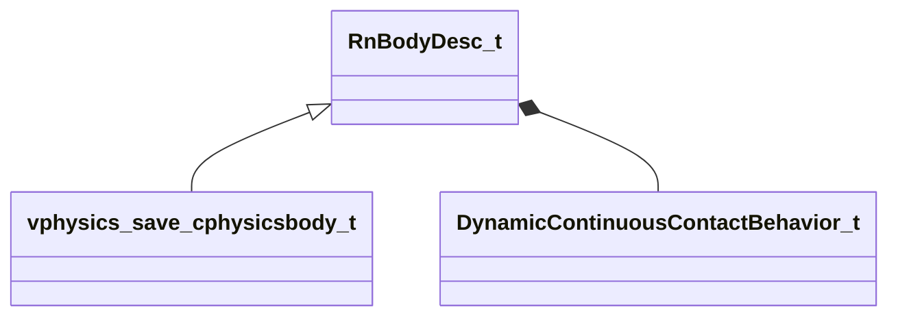

[Schemas](../../schemas.md) / [physicslib](../physicslib.md) / RnBodyDesc_t

# RnBodyDesc_t

> Source: **Build 25000182** · 2026-08-28 · `windows-x86_64` · schema `0.10.0`

**Kind:** class · **Size:** 224 bytes (`0xe0`) · **Align:** 8 · **Module:** physicslib

**Derived by:** [vphysics_save_cphysicsbody_t](../vphysics2/vphysics_save_cphysicsbody_t.md)

**Relationships:**

## Memory layout

36 fields (36 declared here, 0 inherited). Offsets are absolute from the object base.

| Offset | Field | Type | From | Annotations |
|--------|-------|------|------|-------------|
| `0x0` | `m_sDebugName` | CUtlString |  |  |
| `0x8` | `m_vPosition` | VectorWS |  |  |
| `0x14` | `m_qOrientation` | QuaternionStorage |  |  |
| `0x24` | `m_vLinearVelocity` | Vector |  |  |
| `0x30` | `m_vAngularVelocity` | Vector |  |  |
| `0x3c` | `m_vLocalMassCenter` | Vector |  |  |
| `0x48` | `m_LocalInertiaInv` | Vector[3] |  |  |
| `0x6c` | `m_flMassInv` | float32 |  |  |
| `0x70` | `m_flGameMass` | float32 |  |  |
| `0x74` | `m_flMassScaleInv` | float32 |  |  |
| `0x78` | `m_flInertiaScaleInv` | float32 |  |  |
| `0x7c` | `m_flLinearDamping` | float32 |  |  |
| `0x80` | `m_flAngularDamping` | float32 |  |  |
| `0x84` | `m_flLinearDragScale` | float32 |  |  |
| `0x88` | `m_flAngularDragScale` | float32 |  |  |
| `0x8c` | `m_flLinearFluidDragScale` | float32 |  |  |
| `0x90` | `m_flAngularFluidDragScale` | float32 |  |  |
| `0x94` | `m_vLastAwakeForceAccum` | Vector |  |  |
| `0xa0` | `m_vLastAwakeTorqueAccum` | Vector |  |  |
| `0xac` | `m_flBuoyancyScale` | float32 |  |  |
| `0xb0` | `m_flGravityScale` | float32 |  |  |
| `0xb4` | `m_flTimeScale` | float32 |  |  |
| `0xb8` | `m_nBodyType` | int32 |  |  |
| `0xbc` | `m_nGameIndex` | uint32 |  |  |
| `0xc0` | `m_nGameFlags` | uint32 |  |  |
| `0xc4` | `m_nMinVelocityIterations` | int8 |  |  |
| `0xc5` | `m_nMinPositionIterations` | int8 |  |  |
| `0xc6` | `m_nMassPriority` | int8 |  |  |
| `0xc7` | `m_bEnabled` | bool |  |  |
| `0xc8` | `m_bSleeping` | bool |  |  |
| `0xc9` | `m_bIsContinuousEnabled` | bool |  |  |
| `0xca` | `m_bDragEnabled` | bool |  |  |
| `0xcc` | `m_vGravity` | Vector |  |  |
| `0xd8` | `m_bSpeculativeEnabled` | bool |  |  |
| `0xd9` | `m_bHasShadowController` | bool |  |  |
| `0xda` | `m_nDynamicContinuousContactBehavior` | [DynamicContinuousContactBehavior_t](../physicslib/DynamicContinuousContactBehavior_t.md) |  |  |

KV3 class defaults

<pre>{
	&quot;m_sDebugName&quot;: &quot;&quot;,
	&quot;m_vPosition&quot;: null,
	&quot;m_qOrientation&quot;:
	[
		0.000000,
		0.000000,
		0.000000,
		1.000000
	],
	&quot;m_vLinearVelocity&quot;:
	[
		0.000000,
		0.000000,
		0.000000
	],
	&quot;m_vAngularVelocity&quot;:
	[
		0.000000,
		0.000000,
		0.000000
	],
	&quot;m_vLocalMassCenter&quot;:
	[
		0.000000,
		0.000000,
		0.000000
	],
	&quot;m_LocalInertiaInv&quot;:
	[
		[
			0.000000,
			0.000000,
			0.000000
		],
		[
			0.000000,
			0.000000,
			0.000000
		],
		[
			0.000000,
			0.000000,
			0.000000
		]
	],
	&quot;m_flMassInv&quot;: &lt;HIDDEN FOR DIFF&gt;,
	&quot;m_flGameMass&quot;: 0.000000,
	&quot;m_flMassScaleInv&quot;: 1.000000,
	&quot;m_flInertiaScaleInv&quot;: 1.000000,
	&quot;m_flLinearDamping&quot;: 0.000000,
	&quot;m_flAngularDamping&quot;: 0.000000,
	&quot;m_flLinearDragScale&quot;: 1.000000,
	&quot;m_flAngularDragScale&quot;: 1.000000,
	&quot;m_flLinearFluidDragScale&quot;: 1.000000,
	&quot;m_flAngularFluidDragScale&quot;: 1.000000,
	&quot;m_vLastAwakeForceAccum&quot;:
	[
		0.000000,
		0.000000,
		0.000000
	],
	&quot;m_vLastAwakeTorqueAccum&quot;:
	[
		0.000000,
		0.000000,
		0.000000
	],
	&quot;m_flBuoyancyScale&quot;: 1.000000,
	&quot;m_flGravityScale&quot;: 1.000000,
	&quot;m_flTimeScale&quot;: 1.000000,
	&quot;m_nBodyType&quot;: 0,
	&quot;m_nGameIndex&quot;: 0,
	&quot;m_nGameFlags&quot;: 0,
	&quot;m_nMinVelocityIterations&quot;: 1,
	&quot;m_nMinPositionIterations&quot;: 0,
	&quot;m_nMassPriority&quot;: 0,
	&quot;m_bEnabled&quot;: true,
	&quot;m_bSleeping&quot;: false,
	&quot;m_bIsContinuousEnabled&quot;: true,
	&quot;m_bDragEnabled&quot;: true,
	&quot;m_vGravity&quot;:
	[
		0.000000,
		0.000000,
		0.000000
	],
	&quot;m_bSpeculativeEnabled&quot;: true,
	&quot;m_bHasShadowController&quot;: false,
	&quot;m_nDynamicContinuousContactBehavior&quot;: &quot;DYNAMIC_CONTINUOUS_ALLOW_IF_REQUESTED_BY_OTHER_BODY&quot;
}</pre>

