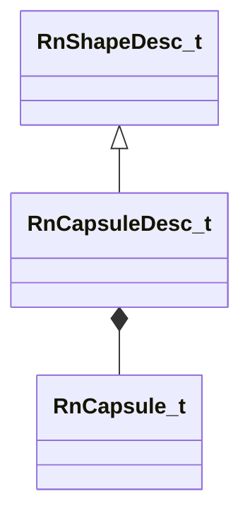

[Schemas](../../schemas.md) / [physicslib](../physicslib.md) / RnCapsuleDesc_t

# RnCapsuleDesc_t

> Source: **Build 25000182** · 2026-08-28 · `windows-x86_64` · schema `0.10.0`

**Kind:** class · **Size:** 56 bytes (`0x38`) · **Align:** 8 · **Module:** physicslib

**Inherits from:** [RnShapeDesc_t](../physicslib/RnShapeDesc_t.md)

**Relationships:**

## Memory layout

7 fields (1 declared here, 6 inherited). Offsets are absolute from the object base.

| Offset | Field | Type | From | Annotations |
|--------|-------|------|------|-------------|
| `0x0` | `m_nCollisionAttributeIndex` | uint32 | [RnShapeDesc_t](../physicslib/RnShapeDesc_t.md) |  |
| `0x4` | `m_nSurfacePropertyIndex` | uint32 | [RnShapeDesc_t](../physicslib/RnShapeDesc_t.md) |  |
| `0x8` | `m_UserFriendlyName` | CUtlString | [RnShapeDesc_t](../physicslib/RnShapeDesc_t.md) |  |
| `0x10` | `m_bUserFriendlyNameSealed` | bool | [RnShapeDesc_t](../physicslib/RnShapeDesc_t.md) |  |
| `0x11` | `m_bUserFriendlyNameLong` | bool | [RnShapeDesc_t](../physicslib/RnShapeDesc_t.md) |  |
| `0x14` | `m_nToolMaterialHash` | uint32 | [RnShapeDesc_t](../physicslib/RnShapeDesc_t.md) |  |
| `0x18` | `m_Capsule` | [RnCapsule_t](../physicslib/RnCapsule_t.md) |  |  |

KV3 class defaults

<pre>{
	&quot;m_nCollisionAttributeIndex&quot;: 0,
	&quot;m_nSurfacePropertyIndex&quot;: 0,
	&quot;m_UserFriendlyName&quot;: &quot;&quot;,
	&quot;m_bUserFriendlyNameSealed&quot;: false,
	&quot;m_bUserFriendlyNameLong&quot;: false,
	&quot;m_nToolMaterialHash&quot;: 0,
	&quot;m_Capsule&quot;:
	{
		&quot;m_vCenter&quot;:
		[
			[
				0.000000,
				0.000000,
				0.000000
			],
			[
				0.000000,
				0.000000,
				0.000000
			]
		],
		&quot;m_flRadius&quot;: 0.000000
	}
}</pre>

