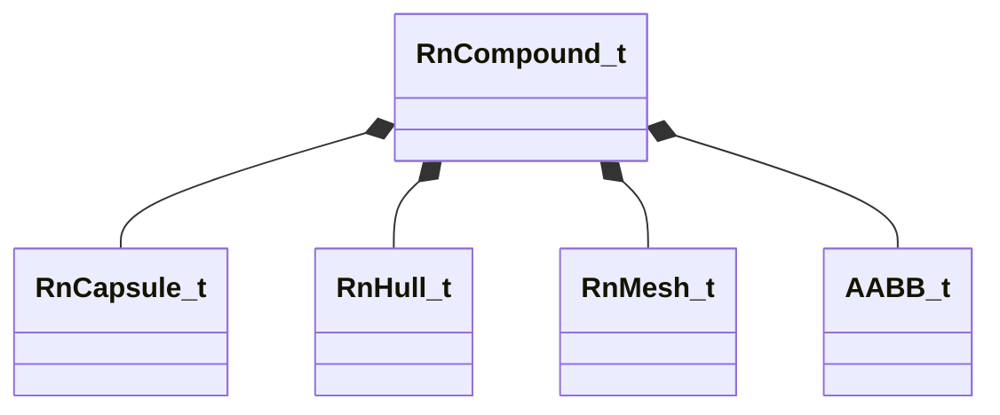

[Schemas](../../schemas.md) / [physicslib](../physicslib.md) / RnCompound_t

# RnCompound_t

> Source: **Build 25000182** · 2026-08-28 · `windows-x86_64` · schema `0.10.0`

**Kind:** class · **Size:** 144 bytes (`0x90`) · **Align:** 8 · **Module:** physicslib

**Relationships:**

## Memory layout

8 fields (8 declared here, 0 inherited). Offsets are absolute from the object base.

| Offset | Field | Type | From | Annotations |
|--------|-------|------|------|-------------|
| `0x0` | `m_Spheres` | CUtlVector< RnSphere_t > |  |  |
| `0x18` | `m_Capsules` | CUtlVector< [RnCapsule_t](../physicslib/RnCapsule_t.md) > |  |  |
| `0x30` | `m_Hulls` | CUtlVector< [RnHull_t](../physicslib/RnHull_t.md) > |  |  |
| `0x48` | `m_Meshes` | CUtlVector< [RnMesh_t](../physicslib/RnMesh_t.md) > |  |  |
| `0x60` | `m_Bounds` | [AABB_t](../mathlib_extended/AABB_t.md) |  |  |
| `0x78` | `m_vOrthographicAreas` | Vector |  |  |
| `0x84` | `m_flSurfaceArea` | float32 |  |  |
| `0x88` | `m_flVolume` | float32 |  |  |

KV3 class defaults

<pre>{
	&quot;m_Spheres&quot;:
	[
	],
	&quot;m_Capsules&quot;:
	[
	],
	&quot;m_Hulls&quot;:
	[
	],
	&quot;m_Meshes&quot;:
	[
	],
	&quot;m_Bounds&quot;:
	{
		&quot;m_vMinBounds&quot;:
		[
			0.000000,
			0.000000,
			0.000000
		],
		&quot;m_vMaxBounds&quot;:
		[
			0.000000,
			0.000000,
			0.000000
		]
	},
	&quot;m_vOrthographicAreas&quot;:
	[
		0.000000,
		0.000000,
		0.000000
	],
	&quot;m_flSurfaceArea&quot;: 0.000000,
	&quot;m_flVolume&quot;: 0.000000
}</pre>

