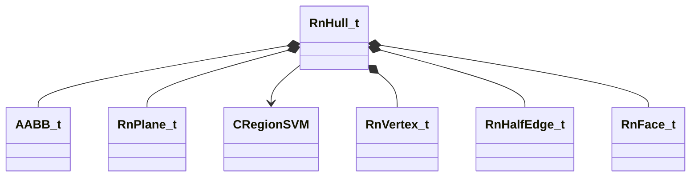

[Schemas](../../schemas.md) / [physicslib](../physicslib.md) / RnHull_t

# RnHull_t

> Source: **Build 25000182** · 2026-08-28 · `windows-x86_64` · schema `0.10.0`

**Kind:** class · **Size:** 248 bytes (`0xf8`) · **Align:** 8 · **Module:** physicslib

**Relationships:**

## Memory layout

14 fields (14 declared here, 0 inherited). Offsets are absolute from the object base.

| Offset | Field | Type | From | Annotations |
|--------|-------|------|------|-------------|
| `0x0` | `m_vCentroid` | Vector |  |  |
| `0xc` | `m_flMaxAngularRadius` | float32 |  |  |
| `0x10` | `m_Bounds` | [AABB_t](../mathlib_extended/AABB_t.md) |  |  |
| `0x28` | `m_vOrthographicAreas` | Vector |  |  |
| `0x34` | `m_MassProperties` | matrix3x4_t |  |  |
| `0x64` | `m_flVolume` | float32 |  |  |
| `0x68` | `m_flSurfaceArea` | float32 |  |  |
| `0x70` | `m_VertexPositions` | CUtlVector< Vector > |  |  |
| `0x88` | `m_FacePlanes` | CUtlVector< [RnPlane_t](../physicslib/RnPlane_t.md) > |  |  |
| `0xa0` | `m_nFlags` | uint32 |  |  |
| `0xa8` | `m_pRegionSVM` | [CRegionSVM](../physicslib/CRegionSVM.md)* |  |  |
| `0xb0` | `m_Vertices` | CUtlVector< [RnVertex_t](../physicslib/RnVertex_t.md) > |  |  |
| `0xc8` | `m_Edges` | CUtlVector< [RnHalfEdge_t](../physicslib/RnHalfEdge_t.md) > |  |  |
| `0xe0` | `m_Faces` | CUtlVector< [RnFace_t](../physicslib/RnFace_t.md) > |  |  |

KV3 class defaults

<pre>{
	&quot;m_vCentroid&quot;:
	[
		0.000000,
		0.000000,
		0.000000
	],
	&quot;m_flMaxAngularRadius&quot;: 0.000000,
	&quot;m_Bounds&quot;:
	{
		&quot;m_vMinBounds&quot;:
		[
			0.000000,
			0.000000,
			0.000000
		],
		&quot;m_vMaxBounds&quot;:
		[
			0.000000,
			0.000000,
			0.000000
		]
	},
	&quot;m_vOrthographicAreas&quot;:
	[
		0.000000,
		0.000000,
		0.000000
	],
	&quot;m_MassProperties&quot;:
	[
		1.000000,
		0.000000,
		0.000000,
		0.000000,
		0.000000,
		1.000000,
		0.000000,
		0.000000,
		0.000000,
		0.000000,
		1.000000,
		0.000000
	],
	&quot;m_flVolume&quot;: 0.000000,
	&quot;m_flSurfaceArea&quot;: 0.000000,
	&quot;m_nFlags&quot;: 0,
	&quot;m_pRegionSVM&quot;: null,
	&quot;m_Vertices&quot;: &quot;[BINARY BLOB]&quot;,
	&quot;m_VertexPositions&quot;: &quot;[BINARY BLOB]&quot;,
	&quot;m_Edges&quot;: &quot;[BINARY BLOB]&quot;,
	&quot;m_Faces&quot;: &quot;[BINARY BLOB]&quot;,
	&quot;m_Planes&quot;: &quot;[BINARY BLOB]&quot;
}</pre>

