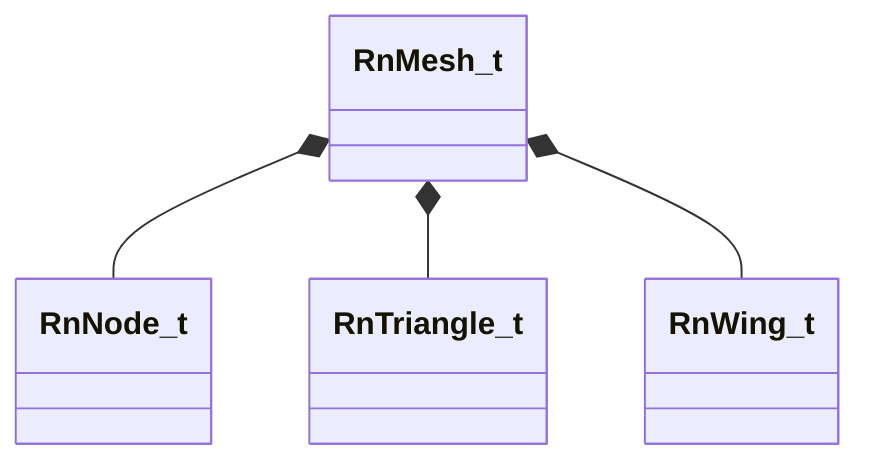

[Schemas](../../schemas.md) / [physicslib](../physicslib.md) / RnMesh_t

# RnMesh_t

**Kind:** class · **Size:** 192 bytes (`0xc0`) · **Align:** 8 · **Module:** physicslib

**Relationships:**

## Memory layout

11 fields (11 declared here, 0 inherited). Offsets are absolute from the object base.

| Offset | Field | Type | From | Annotations |
|--------|-------|------|------|-------------|
| `0x0` | `m_vMin` | Vector |  |  |
| `0xc` | `m_vMax` | Vector |  |  |
| `0x18` | `m_Nodes` | CUtlVector< [RnNode_t](../physicslib/RnNode_t.md) > |  |  |
| `0x30` | `m_Vertices` | CUtlVectorSIMDPaddedVector |  |  |
| `0x48` | `m_Triangles` | CUtlVector< [RnTriangle_t](../physicslib/RnTriangle_t.md) > |  |  |
| `0x60` | `m_Wings` | CUtlVector< [RnWing_t](../physicslib/RnWing_t.md) > |  |  |
| `0x78` | `m_TriangleEdgeFlags` | CUtlVector< uint8 > |  |  |
| `0x90` | `m_Materials` | CUtlVector< uint8 > |  |  |
| `0xa8` | `m_vOrthographicAreas` | Vector |  |  |
| `0xb4` | `m_nFlags` | uint32 |  |  |
| `0xb8` | `m_nDebugFlags` | uint32 |  |  |

KV3 class defaults

<pre>{
	&quot;m_vMin&quot;:
	[
		0.000000,
		0.000000,
		0.000000
	],
	&quot;m_vMax&quot;:
	[
		0.000000,
		0.000000,
		0.000000
	],
	&quot;m_Materials&quot;:
	[
	],
	&quot;m_vOrthographicAreas&quot;:
	[
		0.000000,
		0.000000,
		0.000000
	],
	&quot;m_nFlags&quot;: 0,
	&quot;m_nDebugFlags&quot;: 0,
	&quot;m_Nodes&quot;: &quot;[BINARY BLOB]&quot;,
	&quot;m_Triangles&quot;: &quot;[BINARY BLOB]&quot;,
	&quot;m_Vertices&quot;: &quot;[BINARY BLOB]&quot;
}</pre>

