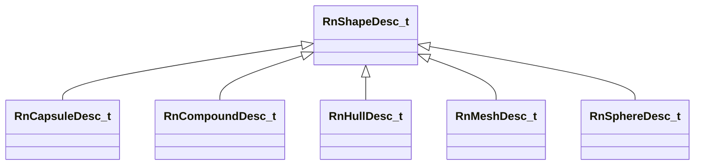

[Schemas](../../schemas.md) / [physicslib](../physicslib.md) / RnShapeDesc_t

# RnShapeDesc_t

> Source: **Build 25000182** · 2026-08-28 · `windows-x86_64` · schema `0.10.0`

**Kind:** class · **Size:** 24 bytes (`0x18`) · **Align:** 8 · **Module:** physicslib

**Derived by:** [RnCapsuleDesc_t](../physicslib/RnCapsuleDesc_t.md), [RnCompoundDesc_t](../physicslib/RnCompoundDesc_t.md), [RnHullDesc_t](../physicslib/RnHullDesc_t.md), [RnMeshDesc_t](../physicslib/RnMeshDesc_t.md), [RnSphereDesc_t](../physicslib/RnSphereDesc_t.md)

**Relationships:**

## Memory layout

6 fields (6 declared here, 0 inherited). Offsets are absolute from the object base.

| Offset | Field | Type | From | Annotations |
|--------|-------|------|------|-------------|
| `0x0` | `m_nCollisionAttributeIndex` | uint32 |  |  |
| `0x4` | `m_nSurfacePropertyIndex` | uint32 |  |  |
| `0x8` | `m_UserFriendlyName` | CUtlString |  |  |
| `0x10` | `m_bUserFriendlyNameSealed` | bool |  |  |
| `0x11` | `m_bUserFriendlyNameLong` | bool |  |  |
| `0x14` | `m_nToolMaterialHash` | uint32 |  |  |

KV3 class defaults

<pre>{
	&quot;m_nCollisionAttributeIndex&quot;: 0,
	&quot;m_nSurfacePropertyIndex&quot;: 0,
	&quot;m_UserFriendlyName&quot;: &quot;&quot;,
	&quot;m_bUserFriendlyNameSealed&quot;: false,
	&quot;m_bUserFriendlyNameLong&quot;: false,
	&quot;m_nToolMaterialHash&quot;: 0
}</pre>

