# Module: pulse_runtime_lib

[📊 View UML Diagram](../diagrams/pulse_runtime_lib.md)

| Name | Kind | Bases | Fields |
|------|------|-------|--------|
| [CBasePulseGraphInstance](#cbasepulsegraphinstance) | class |  | 0 |
| [CPulseArraylib](#cpulsearraylib) | class |  | 0 |
| [CPulseCell_Base](#cpulsecell_base) | class |  | 1 |
| [CPulseCell_BaseFlow](#cpulsecell_baseflow) | class | CPulseCell_Base | 0 |
| [CPulseCell_BaseLerp](#cpulsecell_baselerp) | class | CPulseCell_BaseYieldingInflow | 1 |
| [CPulseCell_BaseLerp::CursorState_t](#cpulsecell_baselerpcursorstate_t) | class |  | 2 |
| [CPulseCell_BaseRequirement](#cpulsecell_baserequirement) | class | CPulseCell_Base | 0 |
| [CPulseCell_BaseState](#cpulsecell_basestate) | class | CPulseCell_BaseYieldingInflow | 0 |
| [CPulseCell_BaseValue](#cpulsecell_basevalue) | class | CPulseCell_Base | 0 |
| [CPulseCell_BaseYieldingInflow](#cpulsecell_baseyieldinginflow) | class | CPulseCell_BaseFlow | 0 |
| [CPulseCell_BooleanSwitchState](#cpulsecell_booleanswitchstate) | class | CPulseCell_BaseState | 4 |
| [CPulseCell_CursorQueue](#cpulsecell_cursorqueue) | class | CPulseCell_WaitForCursorsWithTagBase | 1 |
| [CPulseCell_FireCursors](#cpulsecell_firecursors) | class | CPulseCell_BaseYieldingInflow | 4 |
| [CPulseCell_Inflow_BaseEntrypoint](#cpulsecell_inflow_baseentrypoint) | class | CPulseCell_BaseFlow | 2 |
| [CPulseCell_Inflow_EntOutputHandler](#cpulsecell_inflow_entoutputhandler) | class | CPulseCell_Inflow_BaseEntrypoint | 3 |
| [CPulseCell_Inflow_EventHandler](#cpulsecell_inflow_eventhandler) | class | CPulseCell_Inflow_BaseEntrypoint | 1 |
| [CPulseCell_Inflow_GraphHook](#cpulsecell_inflow_graphhook) | class | CPulseCell_Inflow_BaseEntrypoint | 1 |
| [CPulseCell_Inflow_Method](#cpulsecell_inflow_method) | class | CPulseCell_Inflow_BaseEntrypoint | 5 |
| [CPulseCell_Inflow_ObservableVariableListener](#cpulsecell_inflow_observablevariablelistener) | class | CPulseCell_Inflow_BaseEntrypoint | 2 |
| [CPulseCell_Inflow_Wait](#cpulsecell_inflow_wait) | class | CPulseCell_BaseYieldingInflow | 1 |
| [CPulseCell_Inflow_Yield](#cpulsecell_inflow_yield) | class | CPulseCell_BaseYieldingInflow | 1 |
| [CPulseCell_InlineNodeSkipSelector](#cpulsecell_inlinenodeskipselector) | class | CPulseCell_BaseFlow | 4 |
| [CPulseCell_IntervalTimer](#cpulsecell_intervaltimer) | class | CPulseCell_BaseYieldingInflow | 2 |
| [CPulseCell_IntervalTimer::CursorState_t](#cpulsecell_intervaltimercursorstate_t) | class |  | 5 |
| [CPulseCell_IsRequirementValid](#cpulsecell_isrequirementvalid) | class | CPulseCell_BaseRequirement | 0 |
| [CPulseCell_IsRequirementValid::Criteria_t](#cpulsecell_isrequirementvalidcriteria_t) | class |  | 1 |
| [CPulseCell_LimitCount](#cpulsecell_limitcount) | class | CPulseCell_BaseRequirement | 1 |
| [CPulseCell_LimitCount::Criteria_t](#cpulsecell_limitcountcriteria_t) | class |  | 1 |
| [CPulseCell_LimitCount::InstanceState_t](#cpulsecell_limitcountinstancestate_t) | class |  | 1 |
| [CPulseCell_Outflow_CycleOrdered](#cpulsecell_outflow_cycleordered) | class | CPulseCell_BaseFlow | 1 |
| [CPulseCell_Outflow_CycleOrdered::InstanceState_t](#cpulsecell_outflow_cycleorderedinstancestate_t) | class |  | 1 |
| [CPulseCell_Outflow_CycleRandom](#cpulsecell_outflow_cyclerandom) | class | CPulseCell_BaseFlow | 1 |
| [CPulseCell_Outflow_CycleShuffled](#cpulsecell_outflow_cycleshuffled) | class | CPulseCell_BaseFlow | 1 |
| [CPulseCell_Outflow_CycleShuffled::InstanceState_t](#cpulsecell_outflow_cycleshuffledinstancestate_t) | class |  | 2 |
| [CPulseCell_PickBestOutflowSelector](#cpulsecell_pickbestoutflowselector) | class | CPulseCell_BaseFlow | 2 |
| [CPulseCell_Step_CallExternalMethod](#cpulsecell_step_callexternalmethod) | class | CPulseCell_BaseYieldingInflow | 5 |
| [CPulseCell_Step_DebugLog](#cpulsecell_step_debuglog) | class | CPulseCell_BaseFlow | 0 |
| [CPulseCell_Step_PublicOutput](#cpulsecell_step_publicoutput) | class | CPulseCell_BaseFlow | 1 |
| [CPulseCell_Timeline](#cpulsecell_timeline) | class | CPulseCell_BaseYieldingInflow | 4 |
| [CPulseCell_Timeline::TimelineEvent_t](#cpulsecell_timelinetimelineevent_t) | class |  | 2 |
| [CPulseCell_Unknown](#cpulsecell_unknown) | class | CPulseCell_Base | 1 |
| [CPulseCell_Value_Curve](#cpulsecell_value_curve) | class | CPulseCell_BaseValue | 1 |
| [CPulseCell_Value_Gradient](#cpulsecell_value_gradient) | class | CPulseCell_BaseValue | 1 |
| [CPulseCell_Value_RandomFloat](#cpulsecell_value_randomfloat) | class | CPulseCell_BaseValue | 0 |
| [CPulseCell_Value_RandomInt](#cpulsecell_value_randomint) | class | CPulseCell_BaseValue | 0 |
| [CPulseCell_WaitForCursorsWithTag](#cpulsecell_waitforcursorswithtag) | class | CPulseCell_WaitForCursorsWithTagBase | 2 |
| [CPulseCell_WaitForCursorsWithTagBase](#cpulsecell_waitforcursorswithtagbase) | class | CPulseCell_BaseYieldingInflow | 2 |
| [CPulseCell_WaitForCursorsWithTagBase::CursorState_t](#cpulsecell_waitforcursorswithtagbasecursorstate_t) | class |  | 1 |
| [CPulseCell_WaitForObservable](#cpulsecell_waitforobservable) | class | CPulseCell_BaseYieldingInflow | 2 |
| [CPulseCursorFuncs](#cpulsecursorfuncs) | class |  | 0 |
| [CPulseExecCursor](#cpulseexeccursor) | class |  | 0 |
| [CPulseGraphDef](#cpulsegraphdef) | class |  | 14 |
| [CPulseGraphExecutionHistory](#cpulsegraphexecutionhistory) | class |  | 5 |
| [CPulseMathlib](#cpulsemathlib) | class |  | 0 |
| [CPulseRuntimeMethodArg](#cpulseruntimemethodarg) | class |  | 3 |
| [CPulseTestScriptLib](#cpulsetestscriptlib) | class |  | 0 |
| [CPulse_BlackboardReference](#cpulse_blackboardreference) | class |  | 4 |
| [CPulse_CallInfo](#cpulse_callinfo) | class |  | 6 |
| [CPulse_Chunk](#cpulse_chunk) | class |  | 3 |
| [CPulse_Constant](#cpulse_constant) | class |  | 2 |
| [CPulse_DomainValue](#cpulse_domainvalue) | class |  | 3 |
| [CPulse_InstructionDebug](#cpulse_instructiondebug) | class |  | 3 |
| [CPulse_InvokeBinding](#cpulse_invokebinding) | class |  | 5 |
| [CPulse_OutflowConnection](#cpulse_outflowconnection) | class |  | 4 |
| [CPulse_OutputConnection](#cpulse_outputconnection) | class |  | 4 |
| [CPulse_PublicOutput](#cpulse_publicoutput) | class |  | 3 |
| [CPulse_RegisterInfo](#cpulse_registerinfo) | class |  | 5 |
| [CPulse_ResumePoint](#cpulse_resumepoint) | class | CPulse_OutflowConnection | 0 |
| [CPulse_Variable](#cpulse_variable) | class |  | 8 |
| [EPulseGraphExecutionHistoryFlag](#epulsegraphexecutionhistoryflag) | enum |  | 6 |
| [OutflowWithRequirements_t](#outflowwithrequirements_t) | class |  | 4 |
| [PGDInstruction_t](#pgdinstruction_t) | class |  | 12 |
| [PulseApiFeature_t](#pulseapifeature_t) | enum |  | 6 |
| [PulseBestOutflowRules_t](#pulsebestoutflowrules_t) | enum |  | 2 |
| [PulseCursorCancelPriority_t](#pulsecursorcancelpriority_t) | enum |  | 4 |
| [PulseCursorExecResult_t](#pulsecursorexecresult_t) | enum |  | 4 |
| [PulseCursorID_t](#pulsecursorid_t) | class |  | 1 |
| [PulseCursorYieldToken_t](#pulsecursoryieldtoken_t) | class |  | 1 |
| [PulseDocNodeID_t](#pulsedocnodeid_t) | class |  | 1 |
| [PulseDomainValueType_t](#pulsedomainvaluetype_t) | enum |  | 4 |
| [PulseGraphExecutionHistoryCursorDesc_t](#pulsegraphexecutionhistorycursordesc_t) | class |  | 6 |
| [PulseGraphExecutionHistoryEntry_t](#pulsegraphexecutionhistoryentry_t) | class |  | 5 |
| [PulseGraphExecutionHistoryNodeDesc_t](#pulsegraphexecutionhistorynodedesc_t) | class |  | 2 |
| [PulseGraphInstanceID_t](#pulsegraphinstanceid_t) | class |  | 1 |
| [PulseInstructionCode_t](#pulseinstructioncode_t) | enum |  | 125 |
| [PulseMethodCallMode_t](#pulsemethodcallmode_t) | enum |  | 2 |
| [PulseNodeDynamicOutflows_t](#pulsenodedynamicoutflows_t) | class |  | 1 |
| [PulseNodeDynamicOutflows_t::DynamicOutflow_t](#pulsenodedynamicoutflows_tdynamicoutflow_t) | class |  | 2 |
| [PulseObservableBoolExpression_t](#pulseobservableboolexpression_t) | class |  | 3 |
| [PulseRegisterMap_t](#pulseregistermap_t) | class |  | 3 |
| [PulseRuntimeBlackboardReferenceIndex_t](#pulseruntimeblackboardreferenceindex_t) | class |  | 1 |
| [PulseRuntimeCallInfoIndex_t](#pulseruntimecallinfoindex_t) | class |  | 1 |
| [PulseRuntimeCellIndex_t](#pulseruntimecellindex_t) | class |  | 1 |
| [PulseRuntimeChunkIndex_t](#pulseruntimechunkindex_t) | class |  | 1 |
| [PulseRuntimeConstantIndex_t](#pulseruntimeconstantindex_t) | class |  | 1 |
| [PulseRuntimeDomainValueIndex_t](#pulseruntimedomainvalueindex_t) | class |  | 1 |
| [PulseRuntimeEntrypointIndex_t](#pulseruntimeentrypointindex_t) | class |  | 1 |
| [PulseRuntimeInvokeIndex_t](#pulseruntimeinvokeindex_t) | class |  | 1 |
| [PulseRuntimeOutputIndex_t](#pulseruntimeoutputindex_t) | class |  | 1 |
| [PulseRuntimeRegisterIndex_t](#pulseruntimeregisterindex_t) | class |  | 1 |
| [PulseRuntimeStateOffset_t](#pulseruntimestateoffset_t) | class |  | 1 |
| [PulseRuntimeVarIndex_t](#pulseruntimevarindex_t) | class |  | 1 |
| [PulseSelectorOutflowList_t](#pulseselectoroutflowlist_t) | class |  | 1 |
| [PulseValueType_t](#pulsevaluetype_t) | enum |  | 33 |
| [PulseVariableKeysSource_t](#pulsevariablekeyssource_t) | enum |  | 6 |
| [SignatureOutflow_Continue](#signatureoutflow_continue) | class | CPulse_OutflowConnection | 0 |
| [SignatureOutflow_Resume](#signatureoutflow_resume) | class | CPulse_ResumePoint | 0 |

---

### CBasePulseGraphInstance

**Derived by:** [CParticleCollectionBindingInstance](particleslib.md#cparticlecollectionbindinginstance), [CPulseGraphInstance_ServerEntity](server.md#cpulsegraphinstance_serverentity), [CPulseGraphInstance_SmartPropEval](smartprops.md#cpulsegraphinstance_smartpropeval), [CPulseGraphInstance_TestDomain](pulse_system.md#cpulsegraphinstance_testdomain), [CPulseGraphInstance_TestDomain_FakeEntityOwner](pulse_system.md#cpulsegraphinstance_testdomain_fakeentityowner), [CPulseGraphInstance_TurtleGraphics](pulse_system.md#cpulsegraphinstance_turtlegraphics)

**Relationships:**

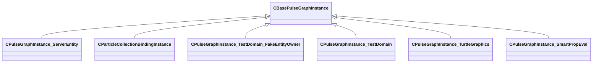

### CPulseArraylib

**Metadata:** `MPropertyDescription "Array support."`

### CPulseCell_Base

**Derived by:** [CPulseCell_BaseFlow](pulse_runtime_lib.md#cpulsecell_baseflow), [CPulseCell_BaseRequirement](pulse_runtime_lib.md#cpulsecell_baserequirement), [CPulseCell_BaseValue](pulse_runtime_lib.md#cpulsecell_basevalue), [CPulseCell_Unknown](pulse_runtime_lib.md#cpulsecell_unknown)

**Metadata:** `MGetKV3ClassDefaults {
	"_class": "CPulseCell_Base",
	"m_nEditorNodeID": -1
}`

**Relationships:**

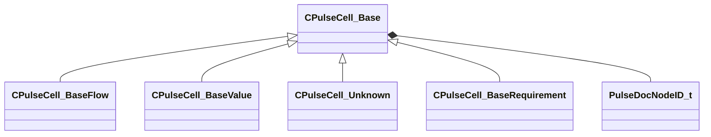

**Fields:**

| Name | Type | Annotations |
|------|------|-------------|
| `m_nEditorNodeID` | [PulseDocNodeID_t](../schemas/pulse_runtime_lib.md#pulsedocnodeid_t) | `MFgdFromSchemaCompletelySkipField` |

### CPulseCell_BaseFlow

**Inherits from:** [CPulseCell_Base](pulse_runtime_lib.md#cpulsecell_base)

**Derived by:** [CPulseCell_BaseYieldingInflow](pulse_runtime_lib.md#cpulsecell_baseyieldinginflow), [CPulseCell_ExampleSelector](pulse_system.md#cpulsecell_exampleselector), [CPulseCell_Inflow_BaseEntrypoint](pulse_runtime_lib.md#cpulsecell_inflow_baseentrypoint), [CPulseCell_InlineNodeSkipSelector](pulse_runtime_lib.md#cpulsecell_inlinenodeskipselector), [CPulseCell_Outflow_CycleOrdered](pulse_runtime_lib.md#cpulsecell_outflow_cycleordered), [CPulseCell_Outflow_CycleRandom](pulse_runtime_lib.md#cpulsecell_outflow_cyclerandom), [CPulseCell_Outflow_CycleShuffled](pulse_runtime_lib.md#cpulsecell_outflow_cycleshuffled), [CPulseCell_Outflow_TestExplicitYesNo](pulse_system.md#cpulsecell_outflow_testexplicityesno), [CPulseCell_Outflow_TestRandomYesNo](pulse_system.md#cpulsecell_outflow_testrandomyesno), [CPulseCell_PickBestOutflowSelector](pulse_runtime_lib.md#cpulsecell_pickbestoutflowselector), [CPulseCell_SoundEventStart](server.md#cpulsecell_soundeventstart), [CPulseCell_Step_DebugLog](pulse_runtime_lib.md#cpulsecell_step_debuglog), [CPulseCell_Step_EntFire](client.md#cpulsecell_step_entfire), [CPulseCell_Step_FollowEntity](server.md#cpulsecell_step_followentity), [CPulseCell_Step_PublicOutput](pulse_runtime_lib.md#cpulsecell_step_publicoutput), [CPulseCell_Step_SetAnimGraphParam](server.md#cpulsecell_step_setanimgraphparam), [CPulseCell_Step_TestDomainCreateFakeEntity](pulse_system.md#cpulsecell_step_testdomaincreatefakeentity), [CPulseCell_Step_TestDomainDestroyFakeEntity](pulse_system.md#cpulsecell_step_testdomaindestroyfakeentity), [CPulseCell_Step_TestDomainEntFire](pulse_system.md#cpulsecell_step_testdomainentfire), [CPulseCell_Step_TestDomainTracepoint](pulse_system.md#cpulsecell_step_testdomaintracepoint), [CPulseCell_Test_MultiInflow_NoDefault](pulse_system.md#cpulsecell_test_multiinflow_nodefault), [CPulseCell_Test_MultiInflow_WithDefault](pulse_system.md#cpulsecell_test_multiinflow_withdefault), [CPulseCell_Test_MultiOutflow_WithParams](pulse_system.md#cpulsecell_test_multioutflow_withparams), [CPulseCell_Test_NoInflow](pulse_system.md#cpulsecell_test_noinflow), [CSmartPropPulse_BaseQueryableFlow](smartprops.md#csmartproppulse_basequeryableflow), [CSmartPropPulse_CreateRotator](smartprops.md#csmartproppulse_createrotator), [CSmartPropPulse_CreateSizer](smartprops.md#csmartproppulse_createsizer), [CSmartPropPulse_FitOnLine](smartprops.md#csmartproppulse_fitonline), [CSmartPropPulse_Group](smartprops.md#csmartproppulse_group), [CSmartPropPulse_PickOneSelector](smartprops.md#csmartproppulse_pickoneselector), [CSmartPropPulse_PlaceInSphere](smartprops.md#csmartproppulse_placeinsphere), [CSmartPropPulse_SmartProp](smartprops.md#csmartproppulse_smartprop)

**Metadata:** `MGetKV3ClassDefaults {
	"_class": "CPulseCell_BaseFlow",
	"m_nEditorNodeID": -1
}`

**Relationships:**

```mermaid
classDiagram
    CPulseCell_Base <|-- CPulseCell_BaseFlow
    CPulseCell_BaseFlow <|-- CPulseCell_Outflow_CycleOrdered
    CPulseCell_BaseFlow <|-- CPulseCell_Step_DebugLog
    CPulseCell_BaseFlow <|-- CPulseCell_Inflow_BaseEntrypoint
    CPulseCell_BaseFlow <|-- CPulseCell_Step_EntFire
    CPulseCell_BaseFlow <|-- CPulseCell_Outflow_CycleShuffled
    CPulseCell_BaseFlow <|-- CPulseCell_BaseYieldingInflow
    CPulseCell_BaseFlow <|-- CPulseCell_Outflow_CycleRandom
    CPulseCell_BaseFlow <|-- CPulseCell_InlineNodeSkipSelector
    CPulseCell_BaseFlow <|-- CPulseCell_PickBestOutflowSelector
    CPulseCell_BaseFlow <|-- CPulseCell_Step_PublicOutput
    CPulseCell_BaseFlow <|-- CPulseCell_Step_FollowEntity
    CPulseCell_BaseFlow <|-- CPulseCell_Step_SetAnimGraphParam
    CPulseCell_BaseFlow <|-- CPulseCell_SoundEventStart
    CPulseCell_BaseFlow <|-- CPulseCell_Outflow_TestRandomYesNo
    CPulseCell_BaseFlow <|-- CPulseCell_Outflow_TestExplicitYesNo
    CPulseCell_BaseFlow <|-- CPulseCell_Test_MultiInflow_NoDefault
    CPulseCell_BaseFlow <|-- CPulseCell_Step_TestDomainTracepoint
    CPulseCell_BaseFlow <|-- CPulseCell_Step_TestDomainEntFire
    CPulseCell_BaseFlow <|-- CPulseCell_Step_TestDomainCreateFakeEntity
    CPulseCell_BaseFlow <|-- CPulseCell_Test_NoInflow
    CPulseCell_BaseFlow <|-- CPulseCell_Test_MultiInflow_WithDefault
    CPulseCell_BaseFlow <|-- CPulseCell_ExampleSelector
    CPulseCell_BaseFlow <|-- CPulseCell_Test_MultiOutflow_WithParams
    CPulseCell_BaseFlow <|-- CPulseCell_Step_TestDomainDestroyFakeEntity
    CPulseCell_BaseFlow <|-- CSmartPropPulse_SmartProp
    CPulseCell_BaseFlow <|-- CSmartPropPulse_PlaceInSphere
    CPulseCell_BaseFlow <|-- CSmartPropPulse_CreateSizer
    CPulseCell_BaseFlow <|-- CSmartPropPulse_PickOneSelector
    CPulseCell_BaseFlow <|-- CSmartPropPulse_BaseQueryableFlow
    CPulseCell_BaseFlow <|-- CSmartPropPulse_CreateRotator
    CPulseCell_BaseFlow <|-- CSmartPropPulse_FitOnLine
    CPulseCell_BaseFlow <|-- CSmartPropPulse_Group
```

### CPulseCell_BaseLerp

**Inherits from:** [CPulseCell_BaseYieldingInflow](pulse_runtime_lib.md#cpulsecell_baseyieldinginflow)

**Derived by:** [CPulseCell_LerpCameraSettings](client.md#cpulsecell_lerpcamerasettings)

**Metadata:** `MGetKV3ClassDefaults Could not parse KV3 Defaults`

**Relationships:**

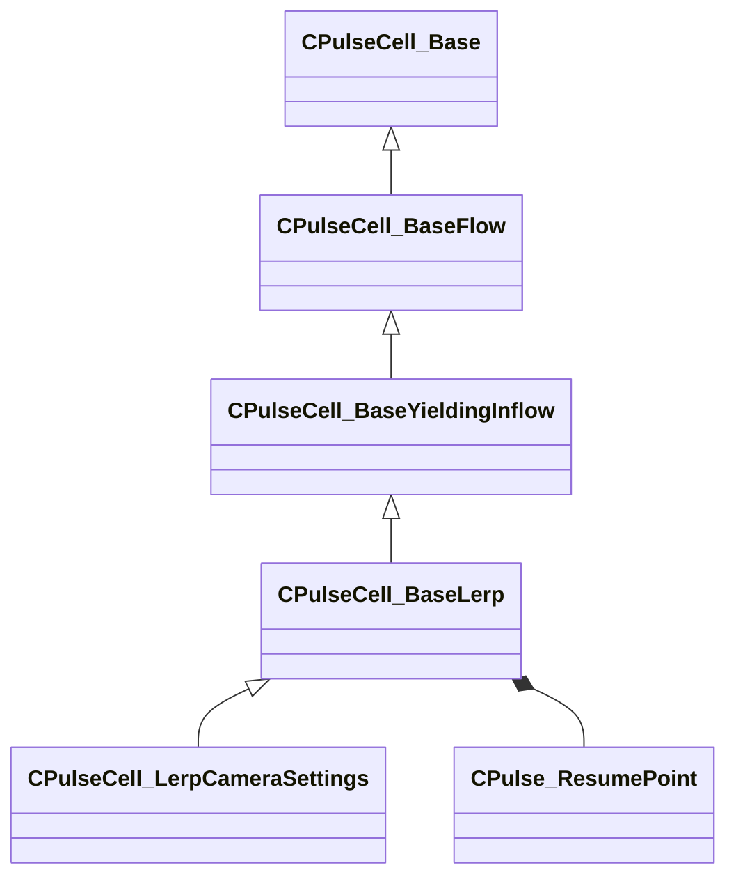

**Fields:**

| Name | Type | Annotations |
|------|------|-------------|
| `m_WakeResume` | [CPulse_ResumePoint](../schemas/pulse_runtime_lib.md#cpulse_resumepoint) |  |

### CPulseCell_BaseLerp::CursorState_t

**Derived by:** [CPulseCell_LerpCameraSettings::CursorState_t](client.md#cpulsecell_lerpcamerasettingscursorstate_t)

**Metadata:** `MGetKV3ClassDefaults {
	"m_StartTime": null,
	"m_EndTime": null
}`

**Relationships:**

```mermaid
classDiagram
    "CPulseCell_BaseLerp::CursorState_t" <|-- "CPulseCell_LerpCameraSettings::CursorState_t"
    "CPulseCell_BaseLerp::CursorState_t" *-- GameTime_t
```

**Fields:**

| Name | Type | Annotations |
|------|------|-------------|
| `m_StartTime` | [GameTime_t](../schemas/entity2.md#gametime_t) |  |
| `m_EndTime` | [GameTime_t](../schemas/entity2.md#gametime_t) |  |

### CPulseCell_BaseRequirement

**Inherits from:** [CPulseCell_Base](pulse_runtime_lib.md#cpulsecell_base)

**Derived by:** [CPulseCell_ExampleCriteria](pulse_system.md#cpulsecell_examplecriteria), [CPulseCell_IsRequirementValid](pulse_runtime_lib.md#cpulsecell_isrequirementvalid), [CPulseCell_LimitCount](pulse_runtime_lib.md#cpulsecell_limitcount), [CSmartPropPulse_CriteriaPathPosition](smartprops.md#csmartproppulse_criteriapathposition), [CSmartPropPulse_SelectionChoiceWeight](smartprops.md#csmartproppulse_selectionchoiceweight), [CSmartPropPulse_SelectionEndCap](smartprops.md#csmartproppulse_selectionendcap), [CSmartPropPulse_SelectionLinearLength](smartprops.md#csmartproppulse_selectionlinearlength)

**Metadata:** `MGetKV3ClassDefaults {
	"_class": "CPulseCell_BaseRequirement",
	"m_nEditorNodeID": -1
}`

**Relationships:**

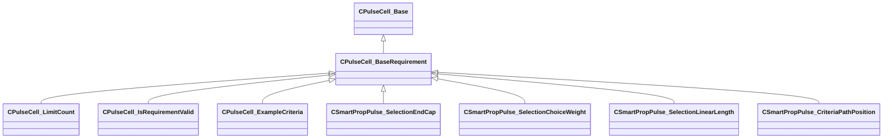

### CPulseCell_BaseState

**Inherits from:** [CPulseCell_BaseYieldingInflow](pulse_runtime_lib.md#cpulsecell_baseyieldinginflow)

**Derived by:** [CPulseCell_BooleanSwitchState](pulse_runtime_lib.md#cpulsecell_booleanswitchstate)

**Metadata:** `MGetKV3ClassDefaults Could not parse KV3 Defaults`, `MPulseEditorHeaderIcon "tools/images/pulse_editor/inflow_statecell.png"`

**Relationships:**

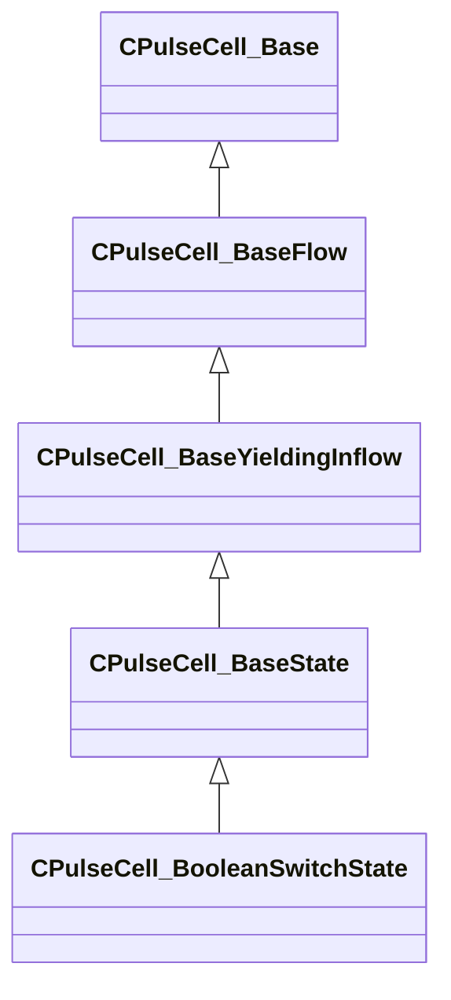

### CPulseCell_BaseValue

**Inherits from:** [CPulseCell_Base](pulse_runtime_lib.md#cpulsecell_base)

**Derived by:** [CPulseCell_Val_TestDomainFindEntityByName](pulse_system.md#cpulsecell_val_testdomainfindentitybyname), [CPulseCell_Val_TestDomainGetEntityName](pulse_system.md#cpulsecell_val_testdomaingetentityname), [CPulseCell_Value_Curve](pulse_runtime_lib.md#cpulsecell_value_curve), [CPulseCell_Value_Gradient](pulse_runtime_lib.md#cpulsecell_value_gradient), [CPulseCell_Value_RandomFloat](pulse_runtime_lib.md#cpulsecell_value_randomfloat), [CPulseCell_Value_RandomInt](pulse_runtime_lib.md#cpulsecell_value_randomint), [CPulseCell_Value_TestValue50](pulse_system.md#cpulsecell_value_testvalue50)

**Metadata:** `MGetKV3ClassDefaults {
	"_class": "CPulseCell_BaseValue",
	"m_nEditorNodeID": -1
}`

**Relationships:**

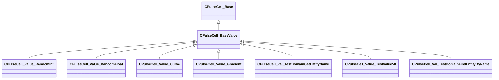

### CPulseCell_BaseYieldingInflow

**Inherits from:** [CPulseCell_BaseFlow](pulse_runtime_lib.md#cpulsecell_baseflow)

**Derived by:** [CPulseCell_BaseLerp](pulse_runtime_lib.md#cpulsecell_baselerp), [CPulseCell_BaseState](pulse_runtime_lib.md#cpulsecell_basestate), [CPulseCell_FireCursors](pulse_runtime_lib.md#cpulsecell_firecursors), [CPulseCell_Inflow_Wait](pulse_runtime_lib.md#cpulsecell_inflow_wait), [CPulseCell_Inflow_Yield](pulse_runtime_lib.md#cpulsecell_inflow_yield), [CPulseCell_IntervalTimer](pulse_runtime_lib.md#cpulsecell_intervaltimer), [CPulseCell_Outflow_ListenForAnimgraphTag](server.md#cpulsecell_outflow_listenforanimgraphtag), [CPulseCell_Outflow_ListenForEntityOutput](server.md#cpulsecell_outflow_listenforentityoutput), [CPulseCell_Outflow_PlaySceneBase](server.md#cpulsecell_outflow_playscenebase), [CPulseCell_Outflow_PlayVOLine](server.md#cpulsecell_outflow_playvoline), [CPulseCell_Outflow_ScriptedSequence](server.md#cpulsecell_outflow_scriptedsequence), [CPulseCell_PlaySequence](client.md#cpulsecell_playsequence), [CPulseCell_Step_CallExternalMethod](pulse_runtime_lib.md#cpulsecell_step_callexternalmethod), [CPulseCell_TestWaitWithCursorState](pulse_system.md#cpulsecell_testwaitwithcursorstate), [CPulseCell_Test_MultiOutflow_WithParams_Yielding](pulse_system.md#cpulsecell_test_multioutflow_withparams_yielding), [CPulseCell_Timeline](pulse_runtime_lib.md#cpulsecell_timeline), [CPulseCell_WaitForCursorsWithTagBase](pulse_runtime_lib.md#cpulsecell_waitforcursorswithtagbase), [CPulseCell_WaitForObservable](pulse_runtime_lib.md#cpulsecell_waitforobservable)

**Metadata:** `MGetKV3ClassDefaults Could not parse KV3 Defaults`

**Relationships:**

```mermaid
classDiagram
    CPulseCell_BaseFlow <|-- CPulseCell_BaseYieldingInflow
    CPulseCell_Base <|-- CPulseCell_BaseFlow
    CPulseCell_BaseYieldingInflow <|-- CPulseCell_IntervalTimer
    CPulseCell_BaseYieldingInflow <|-- CPulseCell_BaseLerp
    CPulseCell_BaseYieldingInflow <|-- CPulseCell_WaitForObservable
    CPulseCell_BaseYieldingInflow <|-- CPulseCell_PlaySequence
    CPulseCell_BaseYieldingInflow <|-- CPulseCell_Step_CallExternalMethod
    CPulseCell_BaseYieldingInflow <|-- CPulseCell_Timeline
    CPulseCell_BaseYieldingInflow <|-- CPulseCell_FireCursors
    CPulseCell_BaseYieldingInflow <|-- CPulseCell_BaseState
    CPulseCell_BaseYieldingInflow <|-- CPulseCell_Inflow_Wait
    CPulseCell_BaseYieldingInflow <|-- CPulseCell_Inflow_Yield
    CPulseCell_BaseYieldingInflow <|-- CPulseCell_WaitForCursorsWithTagBase
    CPulseCell_BaseYieldingInflow <|-- CPulseCell_Outflow_ListenForEntityOutput
    CPulseCell_BaseYieldingInflow <|-- CPulseCell_Outflow_PlayVOLine
    CPulseCell_BaseYieldingInflow <|-- CPulseCell_Outflow_ScriptedSequence
    CPulseCell_BaseYieldingInflow <|-- CPulseCell_Outflow_ListenForAnimgraphTag
    CPulseCell_BaseYieldingInflow <|-- CPulseCell_Outflow_PlaySceneBase
    CPulseCell_BaseYieldingInflow <|-- CPulseCell_Test_MultiOutflow_WithParams_Yielding
    CPulseCell_BaseYieldingInflow <|-- CPulseCell_TestWaitWithCursorState
```

### CPulseCell_BooleanSwitchState

**Inherits from:** [CPulseCell_BaseState](pulse_runtime_lib.md#cpulsecell_basestate)

**Metadata:** `MGetKV3ClassDefaults {
	"_class": "CPulseCell_BooleanSwitchState",
	"m_nEditorNodeID": -1,
	"m_Condition":
	{
		"m_EvaluateConnection":
		{
			"m_SourceOutflowName": "",
			"m_nDestChunk": -1,
			"m_nInstruction": -1
		},
		"m_DependentObservableVars":
		[
		],
		"m_DependentObservableBlackboardReferences":
		[
		]
	},
	"m_Always":
	{
		"m_SourceOutflowName": "",
		"m_nDestChunk": -1,
		"m_nInstruction": -1
	},
	"m_WhenTrue":
	{
		"m_SourceOutflowName": "",
		"m_nDestChunk": -1,
		"m_nInstruction": -1
	},
	"m_WhenFalse":
	{
		"m_SourceOutflowName": "",
		"m_nDestChunk": -1,
		"m_nInstruction": -1
	}
}`, `MPropertyFriendlyName "Monitor Observable"`, `MPropertyDescription "While active, manage child cursors based on the results of a boolean condition. When the observable result changes, the prior cursor will be canceled and the appropriate outflow will fire a new child cursor. Will monitor continuously until externally canceled."`, `MPulseEditorCanvasItemSpecKV3 "{ className = 'IsStateNode' item_factory = 'BooleanSwitchState' }"`

**Relationships:**

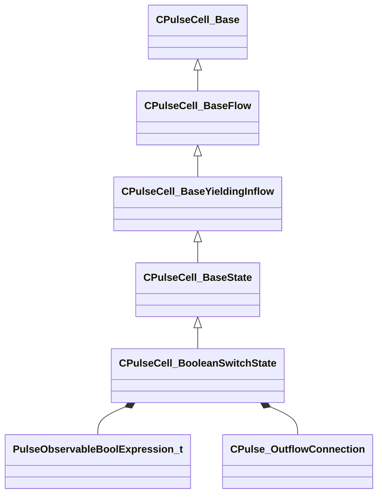

**Fields:**

| Name | Type | Annotations |
|------|------|-------------|
| `m_Condition` | [PulseObservableBoolExpression_t](../schemas/pulse_runtime_lib.md#pulseobservableboolexpression_t) | `MPropertyDescription "Condition to evaluate when any of its dependent values change."` `MPropertyFriendlyName "Observable"` |
| `m_Always` | [CPulse_OutflowConnection](../schemas/pulse_runtime_lib.md#cpulse_outflowconnection) | `MPropertyDescription "Fired immediately when this node begins for chaining purposes."` |
| `m_WhenTrue` | [CPulse_OutflowConnection](../schemas/pulse_runtime_lib.md#cpulse_outflowconnection) | `MPropertyDescription "Fired when the observable boolean is true, and killed when false."` |
| `m_WhenFalse` | [CPulse_OutflowConnection](../schemas/pulse_runtime_lib.md#cpulse_outflowconnection) | `MPropertyDescription "Fired when the observable boolean is false, and killed when true."` |

### CPulseCell_CursorQueue

**Inherits from:** [CPulseCell_WaitForCursorsWithTagBase](pulse_runtime_lib.md#cpulsecell_waitforcursorswithtagbase)

**Metadata:** `MGetKV3ClassDefaults {
	"_class": "CPulseCell_CursorQueue",
	"m_nEditorNodeID": -1,
	"m_nCursorsAllowedToWait": -1,
	"m_WaitComplete":
	{
		"m_SourceOutflowName": "",
		"m_nDestChunk": -1,
		"m_nInstruction": -1
	},
	"m_nCursorsAllowedToRunParallel": 1
}`, `MPropertyFriendlyName "Cursor Queue"`, `MPropertyDescription "Causes each execution cursor to wait for the completion of all prior cursors that have visited this node. Use this to safely support multiple triggers to areas of the graph that take time to complete."`, `MPulseEditorHeaderIcon "tools/images/pulse_editor/cursor_wait_zone.png"`

**Relationships:**

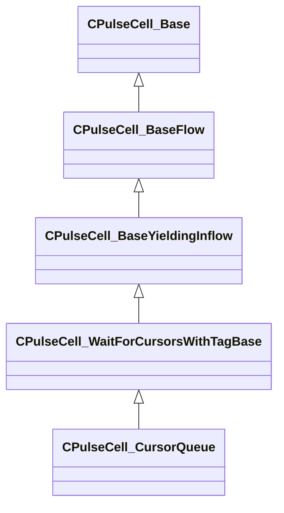

**Fields:**

| Name | Type | Annotations |
|------|------|-------------|
| `m_nCursorsAllowedToRunParallel` | int32 | `MPropertyDescription "Any cursors above this count will wait, up to the limit."` |

### CPulseCell_FireCursors

**Inherits from:** [CPulseCell_BaseYieldingInflow](pulse_runtime_lib.md#cpulsecell_baseyieldinginflow)

**Metadata:** `MGetKV3ClassDefaults {
	"_class": "CPulseCell_FireCursors",
	"m_nEditorNodeID": -1,
	"m_Outflows":
	[
	],
	"m_bWaitForChildOutflows": true,
	"m_OnFinished":
	{
		"m_SourceOutflowName": "",
		"m_nDestChunk": -1,
		"m_nInstruction": -1
	},
	"m_OnCanceled":
	{
		"m_SourceOutflowName": "",
		"m_nDestChunk": -1,
		"m_nInstruction": -1
	}
}`

**Relationships:**

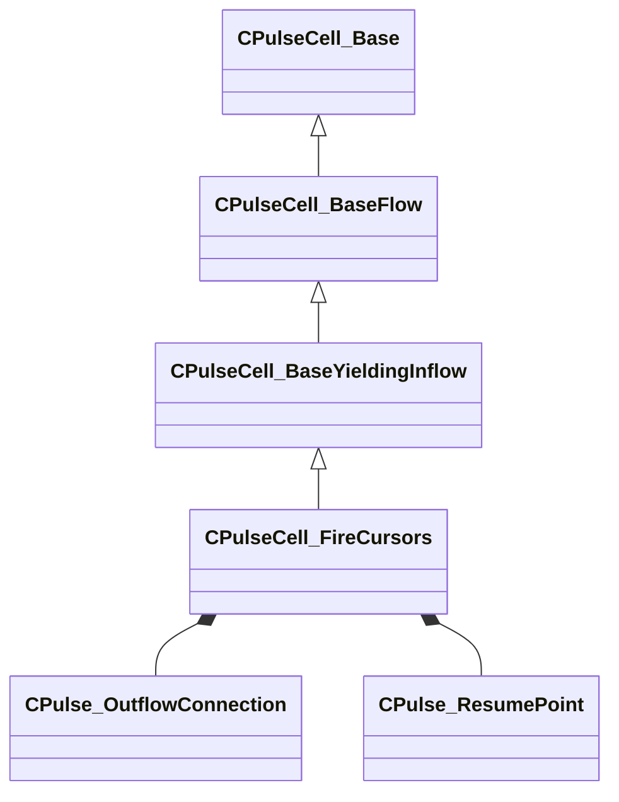

**Fields:**

| Name | Type | Annotations |
|------|------|-------------|
| `m_Outflows` | CUtlVector<[CPulse_OutflowConnection](../schemas/pulse_runtime_lib.md#cpulse_outflowconnection)> |  |
| `m_bWaitForChildOutflows` | bool |  |
| `m_OnFinished` | [CPulse_ResumePoint](../schemas/pulse_runtime_lib.md#cpulse_resumepoint) |  |
| `m_OnCanceled` | [CPulse_ResumePoint](../schemas/pulse_runtime_lib.md#cpulse_resumepoint) |  |

### CPulseCell_Inflow_BaseEntrypoint

**Inherits from:** [CPulseCell_BaseFlow](pulse_runtime_lib.md#cpulsecell_baseflow)

**Derived by:** [CPulseCell_Inflow_EntOutputHandler](pulse_runtime_lib.md#cpulsecell_inflow_entoutputhandler), [CPulseCell_Inflow_EventHandler](pulse_runtime_lib.md#cpulsecell_inflow_eventhandler), [CPulseCell_Inflow_GraphHook](pulse_runtime_lib.md#cpulsecell_inflow_graphhook), [CPulseCell_Inflow_Method](pulse_runtime_lib.md#cpulsecell_inflow_method), [CPulseCell_Inflow_ObservableVariableListener](pulse_runtime_lib.md#cpulsecell_inflow_observablevariablelistener)

**Metadata:** `MGetKV3ClassDefaults {
	"_class": "CPulseCell_Inflow_BaseEntrypoint",
	"m_nEditorNodeID": -1,
	"m_EntryChunk": -1,
	"m_RegisterMap":
	{
		"m_Inparams": null,
		"m_Outparams": null
	}
}`

**Relationships:**

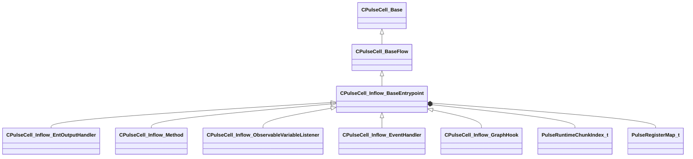

**Fields:**

| Name | Type | Annotations |
|------|------|-------------|
| `m_EntryChunk` | [PulseRuntimeChunkIndex_t](../schemas/pulse_runtime_lib.md#pulseruntimechunkindex_t) |  |
| `m_RegisterMap` | [PulseRegisterMap_t](../schemas/pulse_runtime_lib.md#pulseregistermap_t) |  |

### CPulseCell_Inflow_EntOutputHandler

**Inherits from:** [CPulseCell_Inflow_BaseEntrypoint](pulse_runtime_lib.md#cpulsecell_inflow_baseentrypoint)

**Metadata:** `MGetKV3ClassDefaults {
	"_class": "CPulseCell_Inflow_EntOutputHandler",
	"m_nEditorNodeID": -1,
	"m_EntryChunk": -1,
	"m_RegisterMap":
	{
		"m_Inparams": null,
		"m_Outparams": null
	},
	"m_SourceEntity": "",
	"m_SourceOutput": "",
	"m_ExpectedParamType": "PVAL_VOID"
}`

**Relationships:**

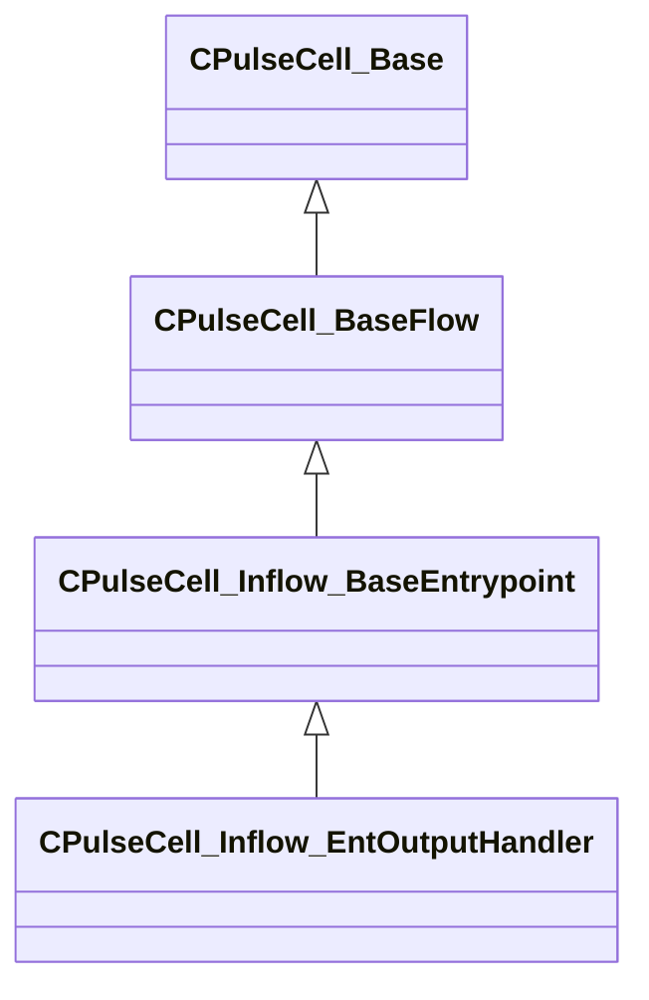

**Fields:**

| Name | Type | Annotations |
|------|------|-------------|
| `m_SourceEntity` | PulseSymbol_t |  |
| `m_SourceOutput` | PulseSymbol_t |  |
| `m_ExpectedParamType` | CPulseValueFullType |  |

### CPulseCell_Inflow_EventHandler

**Inherits from:** [CPulseCell_Inflow_BaseEntrypoint](pulse_runtime_lib.md#cpulsecell_inflow_baseentrypoint)

**Metadata:** `MGetKV3ClassDefaults {
	"_class": "CPulseCell_Inflow_EventHandler",
	"m_nEditorNodeID": -1,
	"m_EntryChunk": -1,
	"m_RegisterMap":
	{
		"m_Inparams": null,
		"m_Outparams": null
	},
	"m_EventName": ""
}`

**Relationships:**

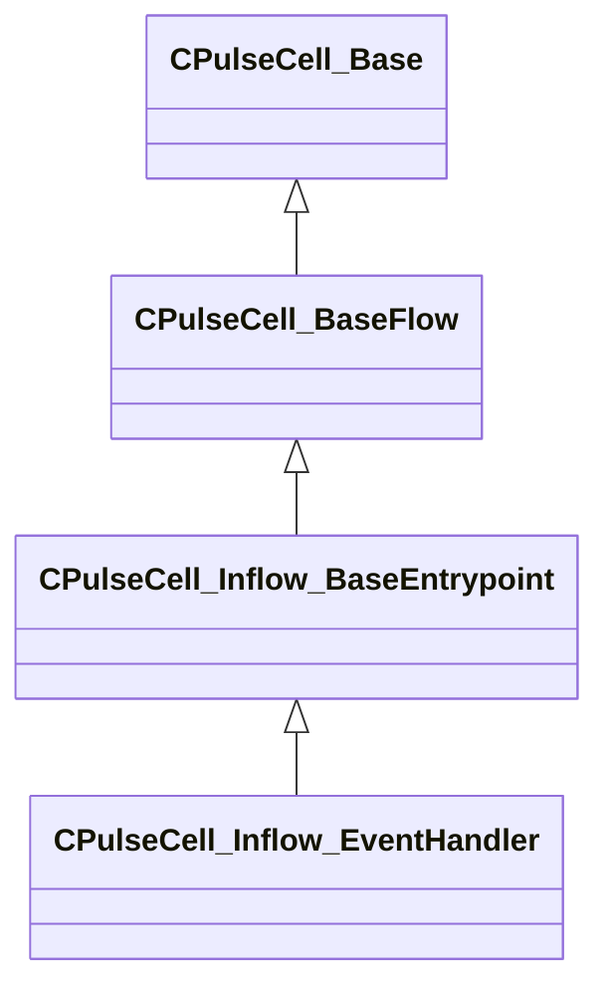

**Fields:**

| Name | Type | Annotations |
|------|------|-------------|
| `m_EventName` | PulseSymbol_t |  |

### CPulseCell_Inflow_GraphHook

**Inherits from:** [CPulseCell_Inflow_BaseEntrypoint](pulse_runtime_lib.md#cpulsecell_inflow_baseentrypoint)

**Metadata:** `MGetKV3ClassDefaults {
	"_class": "CPulseCell_Inflow_GraphHook",
	"m_nEditorNodeID": -1,
	"m_EntryChunk": -1,
	"m_RegisterMap":
	{
		"m_Inparams": null,
		"m_Outparams": null
	},
	"m_HookName": ""
}`

**Relationships:**

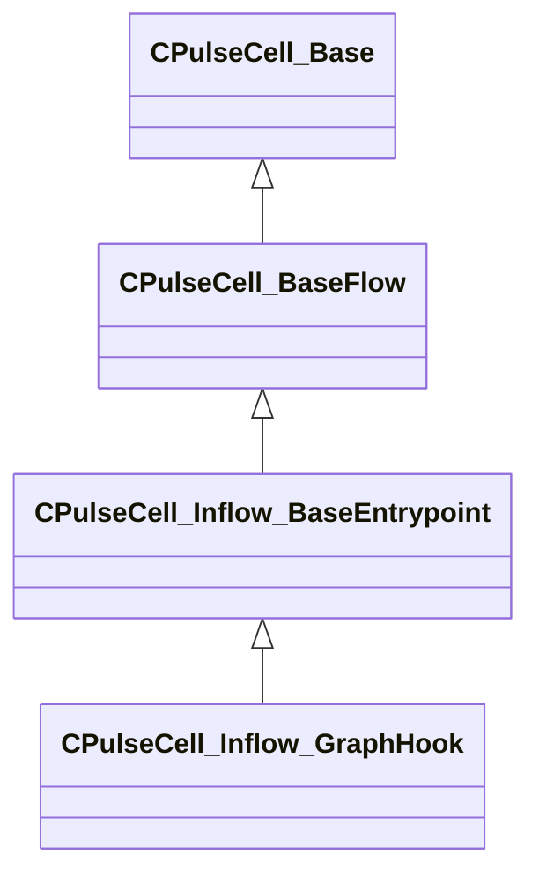

**Fields:**

| Name | Type | Annotations |
|------|------|-------------|
| `m_HookName` | PulseSymbol_t |  |

### CPulseCell_Inflow_Method

**Inherits from:** [CPulseCell_Inflow_BaseEntrypoint](pulse_runtime_lib.md#cpulsecell_inflow_baseentrypoint)

**Metadata:** `MGetKV3ClassDefaults {
	"_class": "CPulseCell_Inflow_Method",
	"m_nEditorNodeID": -1,
	"m_EntryChunk": -1,
	"m_RegisterMap":
	{
		"m_Inparams": null,
		"m_Outparams": null
	},
	"m_MethodName": "",
	"m_Description": "",
	"m_bIsPublic": false,
	"m_ReturnType": "PVAL_VOID",
	"m_Args":
	[
	]
}`

**Relationships:**

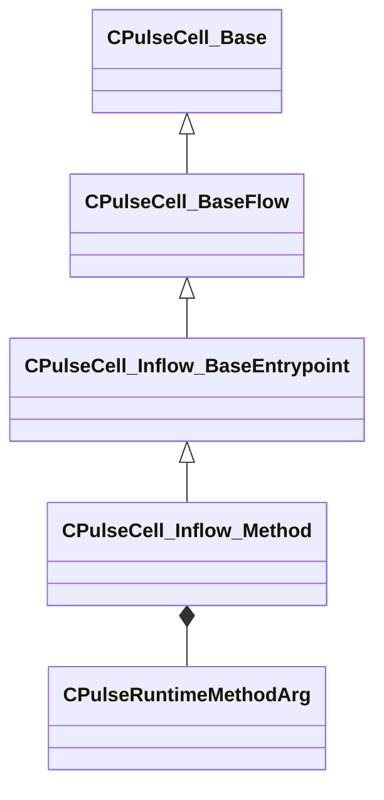

**Fields:**

| Name | Type | Annotations |
|------|------|-------------|
| `m_MethodName` | PulseSymbol_t |  |
| `m_Description` | CUtlString |  |
| `m_bIsPublic` | bool |  |
| `m_ReturnType` | CPulseValueFullType |  |
| `m_Args` | CUtlLeanVector<[CPulseRuntimeMethodArg](../schemas/pulse_runtime_lib.md#cpulseruntimemethodarg)> |  |

### CPulseCell_Inflow_ObservableVariableListener

**Inherits from:** [CPulseCell_Inflow_BaseEntrypoint](pulse_runtime_lib.md#cpulsecell_inflow_baseentrypoint)

**Metadata:** `MGetKV3ClassDefaults {
	"_class": "CPulseCell_Inflow_ObservableVariableListener",
	"m_nEditorNodeID": -1,
	"m_EntryChunk": -1,
	"m_RegisterMap":
	{
		"m_Inparams": null,
		"m_Outparams": null
	},
	"m_nBlackboardReference": -1,
	"m_bSelfReference": false
}`

**Relationships:**

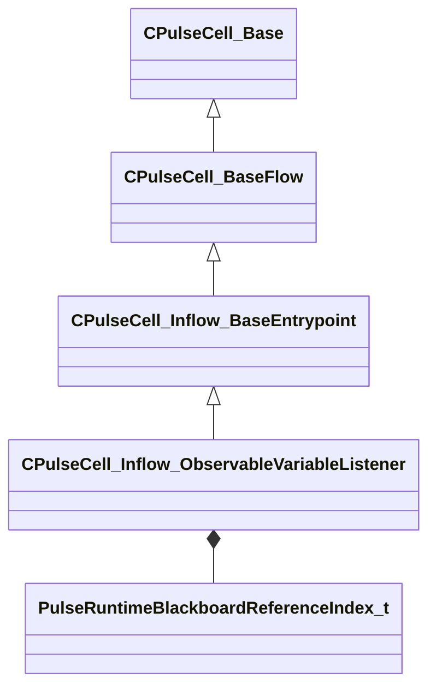

**Fields:**

| Name | Type | Annotations |
|------|------|-------------|
| `m_nBlackboardReference` | [PulseRuntimeBlackboardReferenceIndex_t](../schemas/pulse_runtime_lib.md#pulseruntimeblackboardreferenceindex_t) |  |
| `m_bSelfReference` | bool |  |

### CPulseCell_Inflow_Wait

**Inherits from:** [CPulseCell_BaseYieldingInflow](pulse_runtime_lib.md#cpulsecell_baseyieldinginflow)

**Metadata:** `MGetKV3ClassDefaults {
	"_class": "CPulseCell_Inflow_Wait",
	"m_nEditorNodeID": -1,
	"m_WakeResume":
	{
		"m_SourceOutflowName": "",
		"m_nDestChunk": -1,
		"m_nInstruction": -1
	}
}`, `MPropertyFriendlyName "Wait"`, `MPropertyDescription "Causes each execution cursor to pause at this node for a fixed period of time. Each cursor will wake up and resume execution when the time expires, unless aborted or early-woken."`, `MPulseEditorHeaderIcon "tools/images/pulse_editor/inflow_wait.png"`, `MPulseEditorCanvasItemSpecKV3 "{ className = 'IsWaitNode IsControlFlowNode' item_factory = 'InflowWait' }"`

**Relationships:**

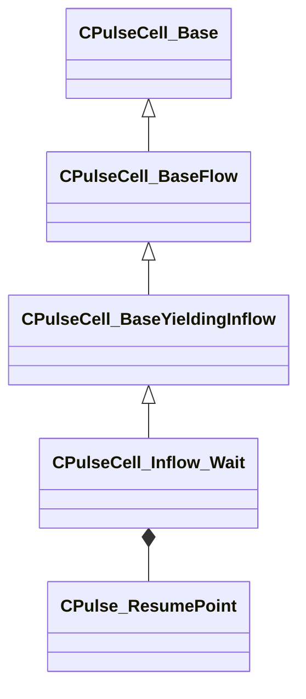

**Fields:**

| Name | Type | Annotations |
|------|------|-------------|
| `m_WakeResume` | [CPulse_ResumePoint](../schemas/pulse_runtime_lib.md#cpulse_resumepoint) |  |

### CPulseCell_Inflow_Yield

**Inherits from:** [CPulseCell_BaseYieldingInflow](pulse_runtime_lib.md#cpulsecell_baseyieldinginflow)

**Metadata:** `MGetKV3ClassDefaults {
	"_class": "CPulseCell_Inflow_Yield",
	"m_nEditorNodeID": -1,
	"m_UnyieldResume":
	{
		"m_SourceOutflowName": "",
		"m_nDestChunk": -1,
		"m_nInstruction": -1
	}
}`

**Relationships:**

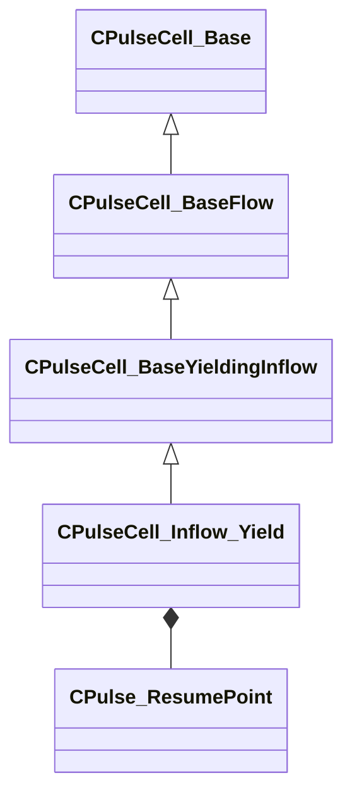

**Fields:**

| Name | Type | Annotations |
|------|------|-------------|
| `m_UnyieldResume` | [CPulse_ResumePoint](../schemas/pulse_runtime_lib.md#cpulse_resumepoint) |  |

### CPulseCell_InlineNodeSkipSelector

**Inherits from:** [CPulseCell_BaseFlow](pulse_runtime_lib.md#cpulsecell_baseflow)

**Metadata:** `MGetKV3ClassDefaults {
	"_class": "CPulseCell_InlineNodeSkipSelector",
	"m_nEditorNodeID": -1,
	"m_nFlowNodeID": -1,
	"m_bAnd": false,
	"m_PassOutflow":
	{
		"m_Outflows":
		[
		]
	},
	"m_FailOutflow":
	{
		"m_SourceOutflowName": "",
		"m_nDestChunk": -1,
		"m_nInstruction": -1
	}
}`, `MPulseFunctionHiddenInTool`

**Relationships:**

```mermaid
classDiagram
    CPulseCell_BaseFlow <|-- CPulseCell_InlineNodeSkipSelector
    CPulseCell_Base <|-- CPulseCell_BaseFlow
    CPulseCell_InlineNodeSkipSelector *-- PulseDocNodeID_t
    CPulseCell_InlineNodeSkipSelector *-- PulseSelectorOutflowList_t
    CPulseCell_InlineNodeSkipSelector *-- CPulse_OutflowConnection
```

**Fields:**

| Name | Type | Annotations |
|------|------|-------------|
| `m_nFlowNodeID` | [PulseDocNodeID_t](../schemas/pulse_runtime_lib.md#pulsedocnodeid_t) |  |
| `m_bAnd` | bool |  |
| `m_PassOutflow` | [PulseSelectorOutflowList_t](../schemas/pulse_runtime_lib.md#pulseselectoroutflowlist_t) |  |
| `m_FailOutflow` | [CPulse_OutflowConnection](../schemas/pulse_runtime_lib.md#cpulse_outflowconnection) |  |

### CPulseCell_IntervalTimer

**Inherits from:** [CPulseCell_BaseYieldingInflow](pulse_runtime_lib.md#cpulsecell_baseyieldinginflow)

**Metadata:** `MGetKV3ClassDefaults {
	"_class": "CPulseCell_IntervalTimer",
	"m_nEditorNodeID": -1,
	"m_Completed":
	{
		"m_SourceOutflowName": "",
		"m_nDestChunk": -1,
		"m_nInstruction": -1
	},
	"m_OnInterval":
	{
		"m_SourceOutflowName": "",
		"m_nDestChunk": -1,
		"m_nInstruction": -1
	}
}`, `MPropertyFriendlyName "Interval Timer"`, `MPropertyDescription "Wait for a duration, firing a child cursor at regular (or randomized) intervals"`, `MPulseEditorHeaderIcon "tools/images/pulse_editor/node_timer.png"`

**Relationships:**

```mermaid
classDiagram
    CPulseCell_BaseYieldingInflow <|-- CPulseCell_IntervalTimer
    CPulseCell_BaseFlow <|-- CPulseCell_BaseYieldingInflow
    CPulseCell_Base <|-- CPulseCell_BaseFlow
    CPulseCell_IntervalTimer *-- CPulse_ResumePoint
    CPulseCell_IntervalTimer *-- SignatureOutflow_Continue
```

**Fields:**

| Name | Type | Annotations |
|------|------|-------------|
| `m_Completed` | [CPulse_ResumePoint](../schemas/pulse_runtime_lib.md#cpulse_resumepoint) | `MPropertyDescription "Called when timer reaches the duration OR is stopped. NOTE: This will run a little while AFTER the last interval fires unless they line up perfectly."` |
| `m_OnInterval` | [SignatureOutflow_Continue](../schemas/pulse_runtime_lib.md#signatureoutflow_continue) | `MPropertyDescription "New child cursor starts here every time the wait interval elapses"` |

### CPulseCell_IntervalTimer::CursorState_t

**Metadata:** `MGetKV3ClassDefaults {
	"m_StartTime": null,
	"m_EndTime": null,
	"m_flWaitInterval": 0.000000,
	"m_flWaitIntervalHigh": 0.000000,
	"m_bCompleteOnNextWake": false
}`

**Relationships:**

```mermaid
classDiagram
    "CPulseCell_IntervalTimer::CursorState_t" *-- GameTime_t
```

**Fields:**

| Name | Type | Annotations |
|------|------|-------------|
| `m_StartTime` | [GameTime_t](../schemas/entity2.md#gametime_t) |  |
| `m_EndTime` | [GameTime_t](../schemas/entity2.md#gametime_t) |  |
| `m_flWaitInterval` | float32 |  |
| `m_flWaitIntervalHigh` | float32 |  |
| `m_bCompleteOnNextWake` | bool |  |

### CPulseCell_IsRequirementValid

**Inherits from:** [CPulseCell_BaseRequirement](pulse_runtime_lib.md#cpulsecell_baserequirement)

**Metadata:** `MGetKV3ClassDefaults {
	"_class": "CPulseCell_IsRequirementValid",
	"m_nEditorNodeID": -1
}`

**Relationships:**

```mermaid
classDiagram
    CPulseCell_BaseRequirement <|-- CPulseCell_IsRequirementValid
    CPulseCell_Base <|-- CPulseCell_BaseRequirement
```

### CPulseCell_IsRequirementValid::Criteria_t

**Fields:**

| Name | Type | Annotations |
|------|------|-------------|
| `m_bIsValid` | bool |  |

### CPulseCell_LimitCount

**Inherits from:** [CPulseCell_BaseRequirement](pulse_runtime_lib.md#cpulsecell_baserequirement)

**Metadata:** `MGetKV3ClassDefaults {
	"_class": "CPulseCell_LimitCount",
	"m_nEditorNodeID": -1,
	"m_nLimitCount": 1
}`, `MPropertyFriendlyName "Limit Count"`, `MPropertyDescription "Skip this node after the limit. Check Type does not apply, the limit will always be checked."`

**Relationships:**

```mermaid
classDiagram
    CPulseCell_BaseRequirement <|-- CPulseCell_LimitCount
    CPulseCell_Base <|-- CPulseCell_BaseRequirement
```

**Fields:**

| Name | Type | Annotations |
|------|------|-------------|
| `m_nLimitCount` | int32 | `MPropertyFlattenIntoParentRow` |

### CPulseCell_LimitCount::Criteria_t

**Fields:**

| Name | Type | Annotations |
|------|------|-------------|
| `m_bLimitCountPasses` | bool |  |

### CPulseCell_LimitCount::InstanceState_t

**Metadata:** `MGetKV3ClassDefaults {
	"m_nCurrentCount": 0
}`

**Fields:**

| Name | Type | Annotations |
|------|------|-------------|
| `m_nCurrentCount` | int32 |  |

### CPulseCell_Outflow_CycleOrdered

**Inherits from:** [CPulseCell_BaseFlow](pulse_runtime_lib.md#cpulsecell_baseflow)

**Metadata:** `MGetKV3ClassDefaults {
	"_class": "CPulseCell_Outflow_CycleOrdered",
	"m_nEditorNodeID": -1,
	"m_Outputs":
	[
	]
}`

**Relationships:**

```mermaid
classDiagram
    CPulseCell_BaseFlow <|-- CPulseCell_Outflow_CycleOrdered
    CPulseCell_Base <|-- CPulseCell_BaseFlow
    CPulseCell_Outflow_CycleOrdered *-- CPulse_OutflowConnection
```

**Fields:**

| Name | Type | Annotations |
|------|------|-------------|
| `m_Outputs` | CUtlVector<[CPulse_OutflowConnection](../schemas/pulse_runtime_lib.md#cpulse_outflowconnection)> |  |

### CPulseCell_Outflow_CycleOrdered::InstanceState_t

**Metadata:** `MGetKV3ClassDefaults {
	"m_nNextIndex": 0
}`

**Fields:**

| Name | Type | Annotations |
|------|------|-------------|
| `m_nNextIndex` | int32 |  |

### CPulseCell_Outflow_CycleRandom

**Inherits from:** [CPulseCell_BaseFlow](pulse_runtime_lib.md#cpulsecell_baseflow)

**Metadata:** `MGetKV3ClassDefaults {
	"_class": "CPulseCell_Outflow_CycleRandom",
	"m_nEditorNodeID": -1,
	"m_Outputs":
	[
	]
}`

**Relationships:**

```mermaid
classDiagram
    CPulseCell_BaseFlow <|-- CPulseCell_Outflow_CycleRandom
    CPulseCell_Base <|-- CPulseCell_BaseFlow
    CPulseCell_Outflow_CycleRandom *-- CPulse_OutflowConnection
```

**Fields:**

| Name | Type | Annotations |
|------|------|-------------|
| `m_Outputs` | CUtlVector<[CPulse_OutflowConnection](../schemas/pulse_runtime_lib.md#cpulse_outflowconnection)> |  |

### CPulseCell_Outflow_CycleShuffled

**Inherits from:** [CPulseCell_BaseFlow](pulse_runtime_lib.md#cpulsecell_baseflow)

**Metadata:** `MGetKV3ClassDefaults {
	"_class": "CPulseCell_Outflow_CycleShuffled",
	"m_nEditorNodeID": -1,
	"m_Outputs":
	[
	]
}`

**Relationships:**

```mermaid
classDiagram
    CPulseCell_BaseFlow <|-- CPulseCell_Outflow_CycleShuffled
    CPulseCell_Base <|-- CPulseCell_BaseFlow
    CPulseCell_Outflow_CycleShuffled *-- CPulse_OutflowConnection
```

**Fields:**

| Name | Type | Annotations |
|------|------|-------------|
| `m_Outputs` | CUtlVector<[CPulse_OutflowConnection](../schemas/pulse_runtime_lib.md#cpulse_outflowconnection)> |  |

### CPulseCell_Outflow_CycleShuffled::InstanceState_t

**Metadata:** `MGetKV3ClassDefaults {
	"m_Shuffle":
	[
	],
	"m_nNextShuffle": 0
}`

**Fields:**

| Name | Type | Annotations |
|------|------|-------------|
| `m_Shuffle` | CUtlVectorFixedGrowable<uint8> |  |
| `m_nNextShuffle` | int32 |  |

### CPulseCell_PickBestOutflowSelector

**Inherits from:** [CPulseCell_BaseFlow](pulse_runtime_lib.md#cpulsecell_baseflow)

**Metadata:** `MGetKV3ClassDefaults {
	"_class": "CPulseCell_PickBestOutflowSelector",
	"m_nEditorNodeID": -1,
	"m_nCheckType": "SORT_BY_NUMBER_OF_VALID_CRITERIA",
	"m_OutflowList":
	{
		"m_Outflows":
		[
		]
	}
}`, `MPropertyFriendlyName "Select Best Exit"`, `MPropertyDescription "Evaluate the requirements of each connected node"`, `MPulseEditorHeaderIcon "tools/images/pulse_editor/requirements.png"`, `MPulseEditorCanvasItemSpecKV3 "{ className='IsControlFlowNode AllOutflowsInSpecialSection IsSelectorNode' create_special_outflows_section=true }"`

**Relationships:**

```mermaid
classDiagram
    CPulseCell_BaseFlow <|-- CPulseCell_PickBestOutflowSelector
    CPulseCell_Base <|-- CPulseCell_BaseFlow
    CPulseCell_PickBestOutflowSelector *-- PulseBestOutflowRules_t
    CPulseCell_PickBestOutflowSelector *-- PulseSelectorOutflowList_t
```

**Fields:**

| Name | Type | Annotations |
|------|------|-------------|
| `m_nCheckType` | [PulseBestOutflowRules_t](../schemas/pulse_runtime_lib.md#pulsebestoutflowrules_t) |  |
| `m_OutflowList` | [PulseSelectorOutflowList_t](../schemas/pulse_runtime_lib.md#pulseselectoroutflowlist_t) |  |

### CPulseCell_Step_CallExternalMethod

**Inherits from:** [CPulseCell_BaseYieldingInflow](pulse_runtime_lib.md#cpulsecell_baseyieldinginflow)

**Metadata:** `MGetKV3ClassDefaults {
	"_class": "CPulseCell_Step_CallExternalMethod",
	"m_nEditorNodeID": -1,
	"m_MethodName": "",
	"m_nBlackboardIndex": -1,
	"m_ExpectedArgs":
	[
	],
	"m_nAsyncCallMode": "ASYNC_FIRE_AND_FORGET",
	"m_OnFinished":
	{
		"m_SourceOutflowName": "",
		"m_nDestChunk": -1,
		"m_nInstruction": -1
	}
}`

**Relationships:**

```mermaid
classDiagram
    CPulseCell_BaseYieldingInflow <|-- CPulseCell_Step_CallExternalMethod
    CPulseCell_BaseFlow <|-- CPulseCell_BaseYieldingInflow
    CPulseCell_Base <|-- CPulseCell_BaseFlow
    CPulseCell_Step_CallExternalMethod *-- PulseRuntimeBlackboardReferenceIndex_t
    CPulseCell_Step_CallExternalMethod *-- CPulseRuntimeMethodArg
    CPulseCell_Step_CallExternalMethod *-- PulseMethodCallMode_t
    CPulseCell_Step_CallExternalMethod *-- CPulse_ResumePoint
```

**Fields:**

| Name | Type | Annotations |
|------|------|-------------|
| `m_MethodName` | PulseSymbol_t |  |
| `m_nBlackboardIndex` | [PulseRuntimeBlackboardReferenceIndex_t](../schemas/pulse_runtime_lib.md#pulseruntimeblackboardreferenceindex_t) |  |
| `m_ExpectedArgs` | CUtlLeanVector<[CPulseRuntimeMethodArg](../schemas/pulse_runtime_lib.md#cpulseruntimemethodarg)> |  |
| `m_nAsyncCallMode` | [PulseMethodCallMode_t](../schemas/pulse_runtime_lib.md#pulsemethodcallmode_t) |  |
| `m_OnFinished` | [CPulse_ResumePoint](../schemas/pulse_runtime_lib.md#cpulse_resumepoint) |  |

### CPulseCell_Step_DebugLog

**Inherits from:** [CPulseCell_BaseFlow](pulse_runtime_lib.md#cpulsecell_baseflow)

**Metadata:** `MGetKV3ClassDefaults {
	"_class": "CPulseCell_Step_DebugLog",
	"m_nEditorNodeID": -1
}`

**Relationships:**

```mermaid
classDiagram
    CPulseCell_BaseFlow <|-- CPulseCell_Step_DebugLog
    CPulseCell_Base <|-- CPulseCell_BaseFlow
```

### CPulseCell_Step_PublicOutput

**Inherits from:** [CPulseCell_BaseFlow](pulse_runtime_lib.md#cpulsecell_baseflow)

**Metadata:** `MGetKV3ClassDefaults {
	"_class": "CPulseCell_Step_PublicOutput",
	"m_nEditorNodeID": -1,
	"m_OutputIndex": -1
}`

**Relationships:**

```mermaid
classDiagram
    CPulseCell_BaseFlow <|-- CPulseCell_Step_PublicOutput
    CPulseCell_Base <|-- CPulseCell_BaseFlow
    CPulseCell_Step_PublicOutput *-- PulseRuntimeOutputIndex_t
```

**Fields:**

| Name | Type | Annotations |
|------|------|-------------|
| `m_OutputIndex` | [PulseRuntimeOutputIndex_t](../schemas/pulse_runtime_lib.md#pulseruntimeoutputindex_t) |  |

### CPulseCell_Timeline

**Inherits from:** [CPulseCell_BaseYieldingInflow](pulse_runtime_lib.md#cpulsecell_baseyieldinginflow)

**Metadata:** `MGetKV3ClassDefaults {
	"_class": "CPulseCell_Timeline",
	"m_nEditorNodeID": -1,
	"m_TimelineEvents":
	[
	],
	"m_bWaitForChildOutflows": true,
	"m_OnFinished":
	{
		"m_SourceOutflowName": "",
		"m_nDestChunk": -1,
		"m_nInstruction": -1
	},
	"m_OnCanceled":
	{
		"m_SourceOutflowName": "",
		"m_nDestChunk": -1,
		"m_nInstruction": -1
	}
}`

**Relationships:**

```mermaid
classDiagram
    CPulseCell_BaseYieldingInflow <|-- CPulseCell_Timeline
    CPulseCell_BaseFlow <|-- CPulseCell_BaseYieldingInflow
    CPulseCell_Base <|-- CPulseCell_BaseFlow
    CPulseCell_Timeline *-- CPulse_ResumePoint
```

**Fields:**

| Name | Type | Annotations |
|------|------|-------------|
| `m_TimelineEvents` | CUtlVector<[CPulseCell_Timeline](../schemas/pulse_runtime_lib.md#cpulsecell_timeline)::TimelineEvent_t> |  |
| `m_bWaitForChildOutflows` | bool |  |
| `m_OnFinished` | [CPulse_ResumePoint](../schemas/pulse_runtime_lib.md#cpulse_resumepoint) |  |
| `m_OnCanceled` | [CPulse_ResumePoint](../schemas/pulse_runtime_lib.md#cpulse_resumepoint) |  |

### CPulseCell_Timeline::TimelineEvent_t

**Metadata:** `MGetKV3ClassDefaults {
	"m_flTimeFromPrevious": 0.000000,
	"m_EventOutflow":
	{
		"m_SourceOutflowName": "",
		"m_nDestChunk": -1,
		"m_nInstruction": -1
	}
}`

**Relationships:**

```mermaid
classDiagram
    "CPulseCell_Timeline::TimelineEvent_t" *-- CPulse_OutflowConnection
```

**Fields:**

| Name | Type | Annotations |
|------|------|-------------|
| `m_flTimeFromPrevious` | float32 |  |
| `m_EventOutflow` | [CPulse_OutflowConnection](../schemas/pulse_runtime_lib.md#cpulse_outflowconnection) |  |

### CPulseCell_Unknown

**Inherits from:** [CPulseCell_Base](pulse_runtime_lib.md#cpulsecell_base)

**Relationships:**

```mermaid
classDiagram
    CPulseCell_Base <|-- CPulseCell_Unknown
```

**Fields:**

| Name | Type | Annotations |
|------|------|-------------|
| `m_UnknownKeys` | KeyValues3 |  |

### CPulseCell_Value_Curve

**Inherits from:** [CPulseCell_BaseValue](pulse_runtime_lib.md#cpulsecell_basevalue)

**Metadata:** `MGetKV3ClassDefaults {
	"_class": "CPulseCell_Value_Curve",
	"m_nEditorNodeID": -1,
	"m_Curve":
	{
		"m_spline":
		[
		],
		"m_tangents":
		[
		],
		"m_vDomainMins":
		[
			0.000000,
			0.000000
		],
		"m_vDomainMaxs":
		[
			0.000000,
			0.000000
		]
	}
}`, `MPropertyFriendlyName "Curve"`

**Relationships:**

```mermaid
classDiagram
    CPulseCell_BaseValue <|-- CPulseCell_Value_Curve
    CPulseCell_Base <|-- CPulseCell_BaseValue
```

**Fields:**

| Name | Type | Annotations |
|------|------|-------------|
| `m_Curve` | CPiecewiseCurve |  |

### CPulseCell_Value_Gradient

**Inherits from:** [CPulseCell_BaseValue](pulse_runtime_lib.md#cpulsecell_basevalue)

**Metadata:** `MGetKV3ClassDefaults {
	"_class": "CPulseCell_Value_Gradient",
	"m_nEditorNodeID": -1,
	"m_Gradient":
	{
		"m_Stops":
		[
		]
	}
}`, `MPropertyFriendlyName "Gradient"`

**Relationships:**

```mermaid
classDiagram
    CPulseCell_BaseValue <|-- CPulseCell_Value_Gradient
    CPulseCell_Base <|-- CPulseCell_BaseValue
```

**Fields:**

| Name | Type | Annotations |
|------|------|-------------|
| `m_Gradient` | CColorGradient |  |

### CPulseCell_Value_RandomFloat

**Inherits from:** [CPulseCell_BaseValue](pulse_runtime_lib.md#cpulsecell_basevalue)

**Metadata:** `MGetKV3ClassDefaults {
	"_class": "CPulseCell_Value_RandomFloat",
	"m_nEditorNodeID": -1
}`, `MPropertyFriendlyName "Random Float"`, `MPropertyDescription "Generate a random float between min and max (inclusive)"`, `MPulseEditorHeaderIcon "tools/images/pulse_editor/exit_cycle_random.png"`

**Relationships:**

```mermaid
classDiagram
    CPulseCell_BaseValue <|-- CPulseCell_Value_RandomFloat
    CPulseCell_Base <|-- CPulseCell_BaseValue
```

### CPulseCell_Value_RandomInt

**Inherits from:** [CPulseCell_BaseValue](pulse_runtime_lib.md#cpulsecell_basevalue)

**Metadata:** `MGetKV3ClassDefaults {
	"_class": "CPulseCell_Value_RandomInt",
	"m_nEditorNodeID": -1
}`, `MPropertyFriendlyName "Random Integer"`, `MPropertyDescription "Generate a random integer between min and max (inclusive)"`, `MPulseEditorHeaderIcon "tools/images/pulse_editor/exit_cycle_random.png"`

**Relationships:**

```mermaid
classDiagram
    CPulseCell_BaseValue <|-- CPulseCell_Value_RandomInt
    CPulseCell_Base <|-- CPulseCell_BaseValue
```

### CPulseCell_WaitForCursorsWithTag

**Inherits from:** [CPulseCell_WaitForCursorsWithTagBase](pulse_runtime_lib.md#cpulsecell_waitforcursorswithtagbase)

**Metadata:** `MGetKV3ClassDefaults {
	"_class": "CPulseCell_WaitForCursorsWithTag",
	"m_nEditorNodeID": -1,
	"m_nCursorsAllowedToWait": -1,
	"m_WaitComplete":
	{
		"m_SourceOutflowName": "",
		"m_nDestChunk": -1,
		"m_nInstruction": -1
	},
	"m_bTagSelfWhenComplete": false,
	"m_nDesiredKillPriority": "None"
}`, `MPropertyFriendlyName "Wait For Cursors With Tag"`, `MPropertyDescription "Causes this execution cursor to wait for the completion of other cursors with the given tag. Can optionally kill the tag while waiting."`, `MPulseEditorHeaderIcon "tools/images/pulse_editor/cursor_tag.png"`

**Relationships:**

```mermaid
classDiagram
    CPulseCell_WaitForCursorsWithTagBase <|-- CPulseCell_WaitForCursorsWithTag
    CPulseCell_BaseYieldingInflow <|-- CPulseCell_WaitForCursorsWithTagBase
    CPulseCell_BaseFlow <|-- CPulseCell_BaseYieldingInflow
    CPulseCell_Base <|-- CPulseCell_BaseFlow
    CPulseCell_WaitForCursorsWithTag *-- PulseCursorCancelPriority_t
```

**Fields:**

| Name | Type | Annotations |
|------|------|-------------|
| `m_bTagSelfWhenComplete` | bool | `MPropertyDescription "Apply the same tag we're waiting on to the resulting cursor upon wait completion. Can be used to wait on our result cursor with the same tag."` |
| `m_nDesiredKillPriority` | [PulseCursorCancelPriority_t](../schemas/pulse_runtime_lib.md#pulsecursorcancelpriority_t) | `MPropertyDescription "When we start waiting, how should we handle existing cursors?"` |

### CPulseCell_WaitForCursorsWithTagBase

**Inherits from:** [CPulseCell_BaseYieldingInflow](pulse_runtime_lib.md#cpulsecell_baseyieldinginflow)

**Derived by:** [CPulseCell_CursorQueue](pulse_runtime_lib.md#cpulsecell_cursorqueue), [CPulseCell_WaitForCursorsWithTag](pulse_runtime_lib.md#cpulsecell_waitforcursorswithtag)

**Metadata:** `MGetKV3ClassDefaults {
	"_class": "CPulseCell_WaitForCursorsWithTagBase",
	"m_nEditorNodeID": -1,
	"m_nCursorsAllowedToWait": -1,
	"m_WaitComplete":
	{
		"m_SourceOutflowName": "",
		"m_nDestChunk": -1,
		"m_nInstruction": -1
	}
}`, `MPulseEditorCanvasItemSpecKV3 "{ className = 'IsControlFlowNode' }"`

**Relationships:**

```mermaid
classDiagram
    CPulseCell_BaseYieldingInflow <|-- CPulseCell_WaitForCursorsWithTagBase
    CPulseCell_BaseFlow <|-- CPulseCell_BaseYieldingInflow
    CPulseCell_Base <|-- CPulseCell_BaseFlow
    CPulseCell_WaitForCursorsWithTagBase <|-- CPulseCell_WaitForCursorsWithTag
    CPulseCell_WaitForCursorsWithTagBase <|-- CPulseCell_CursorQueue
    CPulseCell_WaitForCursorsWithTagBase *-- CPulse_ResumePoint
```

**Fields:**

| Name | Type | Annotations |
|------|------|-------------|
| `m_nCursorsAllowedToWait` | int32 | `MPropertyDescription "Any extra waiting cursors will be terminated. -1 for infinite cursors."` |
| `m_WaitComplete` | [CPulse_ResumePoint](../schemas/pulse_runtime_lib.md#cpulse_resumepoint) |  |

### CPulseCell_WaitForCursorsWithTagBase::CursorState_t

**Fields:**

| Name | Type | Annotations |
|------|------|-------------|
| `m_TagName` | PulseSymbol_t |  |

### CPulseCell_WaitForObservable

**Inherits from:** [CPulseCell_BaseYieldingInflow](pulse_runtime_lib.md#cpulsecell_baseyieldinginflow)

**Metadata:** `MGetKV3ClassDefaults {
	"_class": "CPulseCell_WaitForObservable",
	"m_nEditorNodeID": -1,
	"m_Condition":
	{
		"m_EvaluateConnection":
		{
			"m_SourceOutflowName": "",
			"m_nDestChunk": -1,
			"m_nInstruction": -1
		},
		"m_DependentObservableVars":
		[
		],
		"m_DependentObservableBlackboardReferences":
		[
		]
	},
	"m_OnTrue":
	{
		"m_SourceOutflowName": "",
		"m_nDestChunk": -1,
		"m_nInstruction": -1
	}
}`, `MPulseEditorHeaderIcon "tools/images/pulse_editor/observable_variable_listener.png"`, `MPropertyFriendlyName "Wait Until"`, `MPropertyDescription "All values connected to this node must be 'observable'. Variables on this graph will be automatically promoted to observable. Other value nodes must take an explicit context, look for those nodes with a corresponding icon."`

**Relationships:**

```mermaid
classDiagram
    CPulseCell_BaseYieldingInflow <|-- CPulseCell_WaitForObservable
    CPulseCell_BaseFlow <|-- CPulseCell_BaseYieldingInflow
    CPulseCell_Base <|-- CPulseCell_BaseFlow
    CPulseCell_WaitForObservable *-- PulseObservableBoolExpression_t
    CPulseCell_WaitForObservable *-- CPulse_ResumePoint
```

**Fields:**

| Name | Type | Annotations |
|------|------|-------------|
| `m_Condition` | [PulseObservableBoolExpression_t](../schemas/pulse_runtime_lib.md#pulseobservableboolexpression_t) | `MPropertyDescription "Condition to evaluate when any of its dependent values change."` `MPropertyFriendlyName "Observable"` |
| `m_OnTrue` | [CPulse_ResumePoint](../schemas/pulse_runtime_lib.md#cpulse_resumepoint) |  |

### CPulseCursorFuncs

**Metadata:** `MPropertyDescription "Library for interacting with pulse cursors."`

### CPulseExecCursor

**Derived by:** [CPulseServerCursor](server.md#cpulseservercursor), [CPulseTurtleGraphicsCursor](pulse_system.md#cpulseturtlegraphicscursor), [CTestDomainDerived_Cursor](pulse_system.md#ctestdomainderived_cursor)

**Relationships:**

```mermaid
classDiagram
    CPulseExecCursor <|-- CPulseServerCursor
    CPulseExecCursor <|-- CPulseTurtleGraphicsCursor
    CPulseExecCursor <|-- CTestDomainDerived_Cursor
```

### CPulseGraphDef

**Metadata:** `MGetKV3ClassDefaults {
	"m_DomainIdentifier": "",
	"m_DomainSubType": "PVAL_VOID",
	"m_ParentMapName": "",
	"m_ParentXmlName": "",
	"m_Chunks":
	[
	],
	"m_Cells":
	[
	],
	"m_Vars":
	[
	],
	"m_PublicOutputs":
	[
	],
	"m_InvokeBindings":
	[
	],
	"m_CallInfos":
	[
	],
	"m_Constants":
	[
	],
	"m_DomainValues":
	[
	],
	"m_BlackboardReferences":
	[
	],
	"m_OutputConnections":
	[
	]
}`

**Relationships:**

```mermaid
classDiagram
    CPulseGraphDef --> CPulse_Chunk
    CPulseGraphDef --> CPulseCell_Base
    CPulseGraphDef *-- CPulse_Variable
    CPulseGraphDef *-- CPulse_PublicOutput
    CPulseGraphDef --> CPulse_InvokeBinding
    CPulseGraphDef --> CPulse_CallInfo
    CPulseGraphDef *-- CPulse_Constant
    CPulseGraphDef *-- CPulse_DomainValue
    CPulseGraphDef *-- CPulse_BlackboardReference
    CPulseGraphDef --> CPulse_OutputConnection
```

**Fields:**

| Name | Type | Annotations |
|------|------|-------------|
| `m_DomainIdentifier` | PulseSymbol_t |  |
| `m_DomainSubType` | CPulseValueFullType |  |
| `m_ParentMapName` | PulseSymbol_t |  |
| `m_ParentXmlName` | PulseSymbol_t |  |
| `m_Chunks` | CUtlVector<[CPulse_Chunk](../schemas/pulse_runtime_lib.md#cpulse_chunk)*> |  |
| `m_Cells` | CUtlVector<[CPulseCell_Base](../schemas/pulse_runtime_lib.md#cpulsecell_base)*> |  |
| `m_Vars` | CUtlVector<[CPulse_Variable](../schemas/pulse_runtime_lib.md#cpulse_variable)> |  |
| `m_PublicOutputs` | CUtlVector<[CPulse_PublicOutput](../schemas/pulse_runtime_lib.md#cpulse_publicoutput)> |  |
| `m_InvokeBindings` | CUtlVector<[CPulse_InvokeBinding](../schemas/pulse_runtime_lib.md#cpulse_invokebinding)*> |  |
| `m_CallInfos` | CUtlVector<[CPulse_CallInfo](../schemas/pulse_runtime_lib.md#cpulse_callinfo)*> |  |
| `m_Constants` | CUtlVector<[CPulse_Constant](../schemas/pulse_runtime_lib.md#cpulse_constant)> |  |
| `m_DomainValues` | CUtlVector<[CPulse_DomainValue](../schemas/pulse_runtime_lib.md#cpulse_domainvalue)> |  |
| `m_BlackboardReferences` | CUtlVector<[CPulse_BlackboardReference](../schemas/pulse_runtime_lib.md#cpulse_blackboardreference)> |  |
| `m_OutputConnections` | CUtlVector<[CPulse_OutputConnection](../schemas/pulse_runtime_lib.md#cpulse_outputconnection)*> |  |

### CPulseGraphExecutionHistory

**Metadata:** `MGetKV3ClassDefaults {
	"m_nInstanceID": 0,
	"m_strFileName": "",
	"m_vecHistory":
	[
	],
	"m_mapCellDesc":
	{
	},
	"m_mapCursorDesc":
	{
	}
}`

**Relationships:**

```mermaid
classDiagram
    CPulseGraphExecutionHistory *-- PulseGraphInstanceID_t
    CPulseGraphExecutionHistory --> PulseGraphExecutionHistoryEntry_t
    CPulseGraphExecutionHistory --> PulseDocNodeID_t
    CPulseGraphExecutionHistory --> PulseGraphExecutionHistoryNodeDesc_t
    CPulseGraphExecutionHistory --> PulseCursorID_t
    CPulseGraphExecutionHistory --> PulseGraphExecutionHistoryCursorDesc_t
```

**Fields:**

| Name | Type | Annotations |
|------|------|-------------|
| `m_nInstanceID` | [PulseGraphInstanceID_t](../schemas/pulse_runtime_lib.md#pulsegraphinstanceid_t) |  |
| `m_strFileName` | CUtlString |  |
| `m_vecHistory` | CUtlVector<[PulseGraphExecutionHistoryEntry_t](../schemas/pulse_runtime_lib.md#pulsegraphexecutionhistoryentry_t)*> |  |
| `m_mapCellDesc` | CUtlOrderedMap<[PulseDocNodeID_t](../schemas/pulse_runtime_lib.md#pulsedocnodeid_t),[PulseGraphExecutionHistoryNodeDesc_t](../schemas/pulse_runtime_lib.md#pulsegraphexecutionhistorynodedesc_t)*> |  |
| `m_mapCursorDesc` | CUtlOrderedMap<[PulseCursorID_t](../schemas/pulse_runtime_lib.md#pulsecursorid_t),[PulseGraphExecutionHistoryCursorDesc_t](../schemas/pulse_runtime_lib.md#pulsegraphexecutionhistorycursordesc_t)*> |  |

### CPulseMathlib

**Metadata:** `MPropertyDescription "Basic math support."`

### CPulseRuntimeMethodArg

**Metadata:** `MGetKV3ClassDefaults {
	"m_Name": "",
	"m_Description": "",
	"m_Type": "PVAL_VOID"
}`

**Fields:**

| Name | Type | Annotations |
|------|------|-------------|
| `m_Name` | CKV3MemberNameWithStorage |  |
| `m_Description` | CUtlString |  |
| `m_Type` | CPulseValueFullType |  |

### CPulseTestScriptLib

**Metadata:** `MPropertyDescription "Testing script helpers."`

### CPulse_BlackboardReference

**Metadata:** `MGetKV3ClassDefaults {
	"m_hBlackboardResource": "",
	"m_BlackboardResource": "",
	"m_nNodeID": -1,
	"m_NodeName": ""
}`

**Relationships:**

```mermaid
classDiagram
    CPulse_BlackboardReference *-- InfoForResourceTypeIPulseGraphDef
    CPulse_BlackboardReference *-- PulseDocNodeID_t
```

**Fields:**

| Name | Type | Annotations |
|------|------|-------------|
| `m_hBlackboardResource` | CStrongHandle<[InfoForResourceTypeIPulseGraphDef](../schemas/resourcesystem.md#infoforresourcetypeipulsegraphdef)> |  |
| `m_BlackboardResource` | PulseSymbol_t |  |
| `m_nNodeID` | [PulseDocNodeID_t](../schemas/pulse_runtime_lib.md#pulsedocnodeid_t) |  |
| `m_NodeName` | CGlobalSymbol |  |

### CPulse_CallInfo

**Metadata:** `MGetKV3ClassDefaults {
	"m_PortName": "",
	"m_nEditorNodeID": -1,
	"m_RegisterMap":
	{
		"m_Inparams": null,
		"m_Outparams": null
	},
	"m_CallMethodID": -1,
	"m_nSrcChunk": -1,
	"m_nSrcInstruction": -1
}`

**Relationships:**

```mermaid
classDiagram
    CPulse_CallInfo *-- PulseDocNodeID_t
    CPulse_CallInfo *-- PulseRegisterMap_t
    CPulse_CallInfo *-- PulseRuntimeChunkIndex_t
```

**Fields:**

| Name | Type | Annotations |
|------|------|-------------|
| `m_PortName` | PulseSymbol_t |  |
| `m_nEditorNodeID` | [PulseDocNodeID_t](../schemas/pulse_runtime_lib.md#pulsedocnodeid_t) |  |
| `m_RegisterMap` | [PulseRegisterMap_t](../schemas/pulse_runtime_lib.md#pulseregistermap_t) |  |
| `m_CallMethodID` | [PulseDocNodeID_t](../schemas/pulse_runtime_lib.md#pulsedocnodeid_t) |  |
| `m_nSrcChunk` | [PulseRuntimeChunkIndex_t](../schemas/pulse_runtime_lib.md#pulseruntimechunkindex_t) |  |
| `m_nSrcInstruction` | int32 |  |

### CPulse_Chunk

**Metadata:** `MGetKV3ClassDefaults {
	"m_Instructions":
	[
	],
	"m_Registers":
	[
	],
	"m_InstructionDebugInfos":
	[
	]
}`

**Relationships:**

```mermaid
classDiagram
    CPulse_Chunk *-- PGDInstruction_t
    CPulse_Chunk *-- CPulse_RegisterInfo
    CPulse_Chunk *-- CPulse_InstructionDebug
```

**Fields:**

| Name | Type | Annotations |
|------|------|-------------|
| `m_Instructions` | CUtlLeanVector<[PGDInstruction_t](../schemas/pulse_runtime_lib.md#pgdinstruction_t)> |  |
| `m_Registers` | CUtlLeanVector<[CPulse_RegisterInfo](../schemas/pulse_runtime_lib.md#cpulse_registerinfo)> |  |
| `m_InstructionDebugInfos` | CUtlLeanVector<[CPulse_InstructionDebug](../schemas/pulse_runtime_lib.md#cpulse_instructiondebug)> |  |

### CPulse_Constant

**Metadata:** `MGetKV3ClassDefaults {
	"m_Type": "PVAL_VOID",
	"m_Value": null
}`

**Fields:**

| Name | Type | Annotations |
|------|------|-------------|
| `m_Type` | CPulseValueFullType |  |
| `m_Value` | KeyValues3 |  |

### CPulse_DomainValue

**Metadata:** `MGetKV3ClassDefaults {
	"m_nType": "INVALID",
	"m_Value": "",
	"m_RequiredRuntimeType": "PVAL_VOID"
}`

**Relationships:**

```mermaid
classDiagram
    CPulse_DomainValue *-- PulseDomainValueType_t
```

**Fields:**

| Name | Type | Annotations |
|------|------|-------------|
| `m_nType` | [PulseDomainValueType_t](../schemas/pulse_runtime_lib.md#pulsedomainvaluetype_t) |  |
| `m_Value` | CGlobalSymbolCaseSensitive |  |
| `m_RequiredRuntimeType` | CPulseValueFullType |  |

### CPulse_InstructionDebug

**Metadata:** `MGetKV3ClassDefaults {
	"m_nFlowNodeID": -1,
	"m_nValueNodeID": -1,
	"m_SequencePointName": ""
}`

**Relationships:**

```mermaid
classDiagram
    CPulse_InstructionDebug *-- PulseDocNodeID_t
```

**Fields:**

| Name | Type | Annotations |
|------|------|-------------|
| `m_nFlowNodeID` | [PulseDocNodeID_t](../schemas/pulse_runtime_lib.md#pulsedocnodeid_t) |  |
| `m_nValueNodeID` | [PulseDocNodeID_t](../schemas/pulse_runtime_lib.md#pulsedocnodeid_t) |  |
| `m_SequencePointName` | CGlobalSymbol |  |

### CPulse_InvokeBinding

**Metadata:** `MGetKV3ClassDefaults {
	"m_RegisterMap":
	{
		"m_Inparams": null,
		"m_Outparams": null
	},
	"m_FuncName": "",
	"m_nCellIndex": -1,
	"m_nSrcChunk": -1,
	"m_nSrcInstruction": -1
}`

**Relationships:**

```mermaid
classDiagram
    CPulse_InvokeBinding *-- PulseRegisterMap_t
    CPulse_InvokeBinding *-- PulseRuntimeCellIndex_t
    CPulse_InvokeBinding *-- PulseRuntimeChunkIndex_t
```

**Fields:**

| Name | Type | Annotations |
|------|------|-------------|
| `m_RegisterMap` | [PulseRegisterMap_t](../schemas/pulse_runtime_lib.md#pulseregistermap_t) |  |
| `m_FuncName` | PulseSymbol_t |  |
| `m_nCellIndex` | [PulseRuntimeCellIndex_t](../schemas/pulse_runtime_lib.md#pulseruntimecellindex_t) |  |
| `m_nSrcChunk` | [PulseRuntimeChunkIndex_t](../schemas/pulse_runtime_lib.md#pulseruntimechunkindex_t) |  |
| `m_nSrcInstruction` | int32 |  |

### CPulse_OutflowConnection

**Derived by:** [CPulse_ResumePoint](pulse_runtime_lib.md#cpulse_resumepoint), [SignatureOutflow_Continue](pulse_runtime_lib.md#signatureoutflow_continue)

**Relationships:**

```mermaid
classDiagram
    CPulse_OutflowConnection <|-- SignatureOutflow_Continue
    CPulse_OutflowConnection <|-- CPulse_ResumePoint
    CPulse_OutflowConnection *-- PulseRuntimeChunkIndex_t
    CPulse_OutflowConnection *-- PulseRegisterMap_t
```

**Fields:**

| Name | Type | Annotations |
|------|------|-------------|
| `m_SourceOutflowName` | PulseSymbol_t |  |
| `m_nDestChunk` | [PulseRuntimeChunkIndex_t](../schemas/pulse_runtime_lib.md#pulseruntimechunkindex_t) |  |
| `m_nInstruction` | int32 |  |
| `m_OutflowRegisterMap` | [PulseRegisterMap_t](../schemas/pulse_runtime_lib.md#pulseregistermap_t) |  |

### CPulse_OutputConnection

**Metadata:** `MGetKV3ClassDefaults {
	"m_SourceOutput": "",
	"m_TargetEntity": "",
	"m_TargetInput": "",
	"m_Param": ""
}`

**Fields:**

| Name | Type | Annotations |
|------|------|-------------|
| `m_SourceOutput` | PulseSymbol_t |  |
| `m_TargetEntity` | PulseSymbol_t |  |
| `m_TargetInput` | PulseSymbol_t |  |
| `m_Param` | PulseSymbol_t |  |

### CPulse_PublicOutput

**Metadata:** `MGetKV3ClassDefaults {
	"m_Name": "",
	"m_Description": "",
	"m_Args":
	[
	]
}`

**Relationships:**

```mermaid
classDiagram
    CPulse_PublicOutput *-- CPulseRuntimeMethodArg
```

**Fields:**

| Name | Type | Annotations |
|------|------|-------------|
| `m_Name` | PulseSymbol_t |  |
| `m_Description` | CUtlString |  |
| `m_Args` | CUtlLeanVector<[CPulseRuntimeMethodArg](../schemas/pulse_runtime_lib.md#cpulseruntimemethodarg)> |  |

### CPulse_RegisterInfo

**Metadata:** `MGetKV3ClassDefaults {
	"m_nReg": -1,
	"m_Type": "PVAL_VOID",
	"m_OriginName": "",
	"m_nWrittenByInstruction": -1,
	"m_nLastReadByInstruction": -1
}`

**Relationships:**

```mermaid
classDiagram
    CPulse_RegisterInfo *-- PulseRuntimeRegisterIndex_t
```

**Fields:**

| Name | Type | Annotations |
|------|------|-------------|
| `m_nReg` | [PulseRuntimeRegisterIndex_t](../schemas/pulse_runtime_lib.md#pulseruntimeregisterindex_t) |  |
| `m_Type` | CPulseValueFullType |  |
| `m_OriginName` | CKV3MemberNameWithStorage |  |
| `m_nWrittenByInstruction` | int32 |  |
| `m_nLastReadByInstruction` | int32 |  |

### CPulse_ResumePoint

**Inherits from:** [CPulse_OutflowConnection](pulse_runtime_lib.md#cpulse_outflowconnection)

**Derived by:** [SignatureOutflow_Resume](pulse_runtime_lib.md#signatureoutflow_resume)

**Relationships:**

```mermaid
classDiagram
    CPulse_OutflowConnection <|-- CPulse_ResumePoint
    CPulse_ResumePoint <|-- SignatureOutflow_Resume
```

### CPulse_Variable

**Metadata:** `MGetKV3ClassDefaults {
	"m_Name": "",
	"m_Description": "",
	"m_Type": "PVAL_VOID",
	"m_DefaultValue": null,
	"m_nKeysSource": "PRIVATE",
	"m_bIsPublicBlackboardVariable": false,
	"m_bIsObservable": false,
	"m_nEditorNodeID": -1
}`

**Relationships:**

```mermaid
classDiagram
    CPulse_Variable *-- PulseVariableKeysSource_t
    CPulse_Variable *-- PulseDocNodeID_t
```

**Fields:**

| Name | Type | Annotations |
|------|------|-------------|
| `m_Name` | PulseSymbol_t |  |
| `m_Description` | CUtlString |  |
| `m_Type` | CPulseValueFullType |  |
| `m_DefaultValue` | KeyValues3 |  |
| `m_nKeysSource` | [PulseVariableKeysSource_t](../schemas/pulse_runtime_lib.md#pulsevariablekeyssource_t) |  |
| `m_bIsPublicBlackboardVariable` | bool |  |
| `m_bIsObservable` | bool |  |
| `m_nEditorNodeID` | [PulseDocNodeID_t](../schemas/pulse_runtime_lib.md#pulsedocnodeid_t) |  |

### EPulseGraphExecutionHistoryFlag

**Values:**

| Name | Value | Description |
|------|-------|-------------|
| `NO_FLAGS` | 0 |  |
| `CURSOR_ADD_TAG` | 1 |  |
| `CURSOR_REMOVE_TAG` | 2 |  |
| `CURSOR_RETIRED` | 4 |  |
| `REQUIREMENT_PASS` | 8 |  |
| `REQUIREMENT_FAIL` | 16 |  |

### OutflowWithRequirements_t

**Metadata:** `MGetKV3ClassDefaults {
	"m_Connection":
	{
		"m_SourceOutflowName": "",
		"m_nDestChunk": -1,
		"m_nInstruction": -1
	},
	"m_DestinationFlowNodeID": -1,
	"m_RequirementNodeIDs":
	[
	],
	"m_nCursorStateBlockIndex":
	[
	]
}`

**Relationships:**

```mermaid
classDiagram
    OutflowWithRequirements_t *-- CPulse_OutflowConnection
    OutflowWithRequirements_t *-- PulseDocNodeID_t
```

**Fields:**

| Name | Type | Annotations |
|------|------|-------------|
| `m_Connection` | [CPulse_OutflowConnection](../schemas/pulse_runtime_lib.md#cpulse_outflowconnection) |  |
| `m_DestinationFlowNodeID` | [PulseDocNodeID_t](../schemas/pulse_runtime_lib.md#pulsedocnodeid_t) |  |
| `m_RequirementNodeIDs` | CUtlVector<[PulseDocNodeID_t](../schemas/pulse_runtime_lib.md#pulsedocnodeid_t)> |  |
| `m_nCursorStateBlockIndex` | CUtlVector<int32> |  |

### PGDInstruction_t

**Metadata:** `MGetKV3ClassDefaults {
	"m_nCode": "INVALID",
	"m_nVar": -1,
	"m_nReg0": -1,
	"m_nReg1": -1,
	"m_nReg2": -1,
	"m_nInvokeBindingIndex": -1,
	"m_nChunk": -1,
	"m_nDestInstruction": 0,
	"m_nCallInfoIndex": -1,
	"m_nConstIdx": -1,
	"m_nDomainValueIdx": -1,
	"m_nBlackboardReferenceIdx": -1
}`

**Relationships:**

```mermaid
classDiagram
    PGDInstruction_t *-- PulseInstructionCode_t
    PGDInstruction_t *-- PulseRuntimeVarIndex_t
    PGDInstruction_t *-- PulseRuntimeRegisterIndex_t
    PGDInstruction_t *-- PulseRuntimeInvokeIndex_t
    PGDInstruction_t *-- PulseRuntimeChunkIndex_t
    PGDInstruction_t *-- PulseRuntimeCallInfoIndex_t
    PGDInstruction_t *-- PulseRuntimeConstantIndex_t
    PGDInstruction_t *-- PulseRuntimeDomainValueIndex_t
    PGDInstruction_t *-- PulseRuntimeBlackboardReferenceIndex_t
```

**Fields:**

| Name | Type | Annotations |
|------|------|-------------|
| `m_nCode` | [PulseInstructionCode_t](../schemas/pulse_runtime_lib.md#pulseinstructioncode_t) |  |
| `m_nVar` | [PulseRuntimeVarIndex_t](../schemas/pulse_runtime_lib.md#pulseruntimevarindex_t) |  |
| `m_nReg0` | [PulseRuntimeRegisterIndex_t](../schemas/pulse_runtime_lib.md#pulseruntimeregisterindex_t) |  |
| `m_nReg1` | [PulseRuntimeRegisterIndex_t](../schemas/pulse_runtime_lib.md#pulseruntimeregisterindex_t) |  |
| `m_nReg2` | [PulseRuntimeRegisterIndex_t](../schemas/pulse_runtime_lib.md#pulseruntimeregisterindex_t) |  |
| `m_nInvokeBindingIndex` | [PulseRuntimeInvokeIndex_t](../schemas/pulse_runtime_lib.md#pulseruntimeinvokeindex_t) |  |
| `m_nChunk` | [PulseRuntimeChunkIndex_t](../schemas/pulse_runtime_lib.md#pulseruntimechunkindex_t) |  |
| `m_nDestInstruction` | int32 |  |
| `m_nCallInfoIndex` | [PulseRuntimeCallInfoIndex_t](../schemas/pulse_runtime_lib.md#pulseruntimecallinfoindex_t) |  |
| `m_nConstIdx` | [PulseRuntimeConstantIndex_t](../schemas/pulse_runtime_lib.md#pulseruntimeconstantindex_t) |  |
| `m_nDomainValueIdx` | [PulseRuntimeDomainValueIndex_t](../schemas/pulse_runtime_lib.md#pulseruntimedomainvalueindex_t) |  |
| `m_nBlackboardReferenceIdx` | [PulseRuntimeBlackboardReferenceIndex_t](../schemas/pulse_runtime_lib.md#pulseruntimeblackboardreferenceindex_t) |  |

### PulseApiFeature_t

**Values:**

| Name | Value | Description |
|------|-------|-------------|
| `AF_NONE` | 0 |  |
| `AF_ENTITIES` | 1 |  |
| `AF_PANORAMA` | 2 |  |
| `AF_PARTICLES` | 8 |  |
| `AF_FAKE_ENTITIES` | 16 |  |
| `AF_SELECTORS_WITHOUT_REQUIREMENTS` | 32 |  |

### PulseBestOutflowRules_t

**Values:**

| Name | Value | Description |
|------|-------|-------------|
| `SORT_BY_NUMBER_OF_VALID_CRITERIA` | 0 | Choose Best — Choose the best outflow with all rules passing, as determined by number of passing rules (specificity). |
| `SORT_BY_OUTFLOW_INDEX` | 1 | Choose First — Choose the first outflow with all rules passing, from left to right |

### PulseCursorCancelPriority_t

**Values:**

| Name | Value | Description |
|------|-------|-------------|
| `None` | 0 | Keep running normally. |
| `CancelOnSucceeded` | 1 | Kill after current node. — Do not stop the current yielding node, but do not continue to the next node afterwards. |
| `SoftCancel` | 2 | Kill elegantly. — Request elegant wind-down of any associated work (e.g. vcd interrupt). |
| `HardCancel` | 3 | Kill immediately. — Stop without any wind-down. |

### PulseCursorExecResult_t

**Values:**

| Name | Value | Description |
|------|-------|-------------|
| `Succeeded` | 0 |  |
| `Canceled` | 1 |  |
| `Failed` | 2 |  |
| `OngoingNotify` | 3 |  |

### PulseCursorID_t

**Metadata:** `MIsBoxedIntegerType`

**Fields:**

| Name | Type | Annotations |
|------|------|-------------|
| `m_Value` | int32 |  |

### PulseCursorYieldToken_t

**Metadata:** `MIsBoxedIntegerType`

**Fields:**

| Name | Type | Annotations |
|------|------|-------------|
| `m_Value` | int32 |  |

### PulseDocNodeID_t

**Metadata:** `MIsBoxedIntegerType`

**Fields:**

| Name | Type | Annotations |
|------|------|-------------|
| `m_Value` | int32 |  |

### PulseDomainValueType_t

**Values:**

| Name | Value | Description |
|------|-------|-------------|
| `INVALID` | -1 | Invalid |
| `ENTITY_NAME` | 0 | Parent Map Entity |
| `PANEL_ID` | 1 | Parent XML Panel |
| `COUNT` | 2 |  |

### PulseGraphExecutionHistoryCursorDesc_t

**Metadata:** `MGetKV3ClassDefaults {
	"vecAncestorCursorIDs":
	[
	],
	"nSpawnNodeID": -1,
	"nRetiredAtNodeID": -1,
	"flLastReferenced": 0.000000,
	"nLastValidEntryIdx": 0,
	"bWasAnObservableComputation": false
}`

**Relationships:**

```mermaid
classDiagram
    PulseGraphExecutionHistoryCursorDesc_t *-- PulseCursorID_t
    PulseGraphExecutionHistoryCursorDesc_t *-- PulseDocNodeID_t
```

**Fields:**

| Name | Type | Annotations |
|------|------|-------------|
| `vecAncestorCursorIDs` | CUtlVector<[PulseCursorID_t](../schemas/pulse_runtime_lib.md#pulsecursorid_t)> |  |
| `nSpawnNodeID` | [PulseDocNodeID_t](../schemas/pulse_runtime_lib.md#pulsedocnodeid_t) |  |
| `nRetiredAtNodeID` | [PulseDocNodeID_t](../schemas/pulse_runtime_lib.md#pulsedocnodeid_t) |  |
| `flLastReferenced` | float32 |  |
| `nLastValidEntryIdx` | int32 |  |
| `bWasAnObservableComputation` | bool |  |

### PulseGraphExecutionHistoryEntry_t

**Metadata:** `MGetKV3ClassDefaults {
	"nCursorID": -1,
	"nEditorID": -1,
	"flExecTime": 0.000000,
	"unFlags": 0,
	"tagName": ""
}`

**Relationships:**

```mermaid
classDiagram
    PulseGraphExecutionHistoryEntry_t *-- PulseCursorID_t
    PulseGraphExecutionHistoryEntry_t *-- PulseDocNodeID_t
```

**Fields:**

| Name | Type | Annotations |
|------|------|-------------|
| `nCursorID` | [PulseCursorID_t](../schemas/pulse_runtime_lib.md#pulsecursorid_t) |  |
| `nEditorID` | [PulseDocNodeID_t](../schemas/pulse_runtime_lib.md#pulsedocnodeid_t) |  |
| `flExecTime` | float32 |  |
| `unFlags` | uint32 |  |
| `tagName` | PulseSymbol_t |  |

### PulseGraphExecutionHistoryNodeDesc_t

**Metadata:** `MGetKV3ClassDefaults {
	"strCellDesc": "",
	"strBindingName": ""
}`

**Fields:**

| Name | Type | Annotations |
|------|------|-------------|
| `strCellDesc` | CBufferString |  |
| `strBindingName` | PulseSymbol_t |  |

### PulseGraphInstanceID_t

**Metadata:** `MIsBoxedIntegerType`

**Fields:**

| Name | Type | Annotations |
|------|------|-------------|
| `m_Value` | uint32 |  |

### PulseInstructionCode_t

**Values:**

| Name | Value | Description |
|------|-------|-------------|
| `INVALID` | 0 |  |
| `IMMEDIATE_HALT` | 1 |  |
| `RETURN_VOID` | 2 |  |
| `RETURN_VALUE` | 3 |  |
| `NOP` | 4 |  |
| `JUMP` | 5 |  |
| `JUMP_COND` | 6 |  |
| `CHUNK_LEAP` | 7 |  |
| `CHUNK_LEAP_COND` | 8 |  |
| `PULSE_CALL_SYNC` | 9 |  |
| `PULSE_CALL_ASYNC_FIRE` | 10 |  |
| `CELL_INVOKE` | 11 |  |
| `LIBRARY_INVOKE` | 12 |  |
| `SET_VAR` | 13 |  |
| `GET_VAR` | 14 |  |
| `GET_VAR_DETACH` | 15 |  |
| `DETACH_REGISTER` | 16 |  |
| `SET_VAR_ARRAY_ELEMENT_1D` | 17 |  |
| `SET_VAR_OBSERVABLE` | 18 |  |
| `GET_CONST` | 19 |  |
| `GET_ARRAY_ELEMENT` | 20 |  |
| `GET_DOMAIN_VALUE` | 21 |  |
| `COPY` | 22 |  |
| `NOT` | 23 |  |
| `NEGATE` | 24 |  |
| `ADD` | 25 |  |
| `SUB` | 26 |  |
| `MUL` | 27 |  |
| `DIV` | 28 |  |
| `MOD` | 29 |  |
| `LT` | 30 |  |
| `LTE` | 31 |  |
| `EQ` | 32 |  |
| `NE` | 33 |  |
| `AND` | 34 |  |
| `OR` | 35 |  |
| `SCALE` | 36 |  |
| `SCALE_INV` | 37 |  |
| `ELEMENT_ACCESS` | 38 |  |
| `CONVERT_VALUE` | 39 |  |
| `REINTERPRET_INSTANCE` | 40 |  |
| `GET_BLACKBOARD_REFERENCE` | 41 |  |
| `SET_BLACKBOARD_REFERENCE` | 42 |  |
| `LAST_SERIALIZED_CODE` | 43 |  |
| `NEGATE_INT` | 44 |  |
| `NEGATE_FLOAT` | 45 |  |
| `NEGATE_VEC2` | 46 |  |
| `NEGATE_VEC3` | 47 |  |
| `NEGATE_VEC4` | 48 |  |
| `ADD_INT` | 49 |  |
| `ADD_FLOAT` | 50 |  |
| `ADD_STRING` | 51 |  |
| `ADD_VEC2` | 52 |  |
| `ADD_VEC3` | 53 |  |
| `ADD_VEC3WS_VEC3` | 54 |  |
| `ADD_VEC3_VEC3WS` | 55 |  |
| `ADD_VEC4` | 56 |  |
| `ADD_GAMETIME_FLOAT` | 57 |  |
| `ADD_FLOAT_GAMETIME` | 58 |  |
| `SUB_INT` | 59 |  |
| `SUB_FLOAT` | 60 |  |
| `SUB_VEC2` | 61 |  |
| `SUB_VEC3` | 62 |  |
| `SUB_VEC3WS_VEC3` | 63 |  |
| `SUB_VEC3WS_VEC3WS` | 64 |  |
| `SUB_VEC4` | 65 |  |
| `SUB_GAMETIME_FLOAT` | 66 |  |
| `SUB_GAMETIME` | 67 |  |
| `MUL_INT` | 68 |  |
| `MUL_FLOAT` | 69 |  |
| `DIV_FLOAT` | 70 |  |
| `MOD_INT` | 71 |  |
| `MOD_FLOAT` | 72 |  |
| `LT_INT` | 73 |  |
| `LT_FLOAT` | 74 |  |
| `LT_GAMETIME` | 75 |  |
| `LTE_INT` | 76 |  |
| `LTE_FLOAT` | 77 |  |
| `LTE_GAMETIME` | 78 |  |
| `EQ_BOOL` | 79 |  |
| `EQ_INT` | 80 |  |
| `EQ_FLOAT` | 81 |  |
| `EQ_VEC2` | 82 |  |
| `EQ_VEC3` | 83 |  |
| `EQ_VEC3WS` | 84 |  |
| `EQ_VEC4` | 85 |  |
| `EQ_STRING` | 86 |  |
| `EQ_ENTITY_NAME` | 87 |  |
| `EQ_SCHEMA_ENUM` | 88 |  |
| `EQ_EHANDLE` | 89 |  |
| `EQ_PANEL_HANDLE` | 90 |  |
| `EQ_OPAQUE_HANDLE` | 91 |  |
| `EQ_TEST_HANDLE` | 92 |  |
| `EQ_COLOR_RGB` | 93 |  |
| `EQ_ARRAY` | 94 |  |
| `EQ_GAMETIME` | 95 |  |
| `NE_BOOL` | 96 |  |
| `NE_INT` | 97 |  |
| `NE_FLOAT` | 98 |  |
| `NE_VEC2` | 99 |  |
| `NE_VEC3` | 100 |  |
| `NE_VEC3WS` | 101 |  |
| `NE_VEC4` | 102 |  |
| `NE_STRING` | 103 |  |
| `NE_ENTITY_NAME` | 104 |  |
| `NE_SCHEMA_ENUM` | 105 |  |
| `NE_EHANDLE` | 106 |  |
| `NE_PANEL_HANDLE` | 107 |  |
| `NE_OPAQUE_HANDLE` | 108 |  |
| `NE_TEST_HANDLE` | 109 |  |
| `NE_COLOR_RGB` | 110 |  |
| `NE_ARRAY` | 111 |  |
| `NE_GAMETIME` | 112 |  |
| `SCALE_VEC3` | 113 |  |
| `SCALE_VEC2` | 114 |  |
| `SCALE_VEC4` | 115 |  |
| `SCALE_INV_VEC3` | 116 |  |
| `SCALE_INV_VEC2` | 117 |  |
| `SCALE_INV_VEC4` | 118 |  |
| `ELEMENT_ACCESS_VEC2` | 119 |  |
| `ELEMENT_ACCESS_VEC3` | 120 |  |
| `ELEMENT_ACCESS_VEC3WS` | 121 |  |
| `ELEMENT_ACCESS_VEC4` | 122 |  |
| `ELEMENT_ACCESS_COLOR_RGB` | 123 |  |
| `GET_CONST_INLINE_STORAGE` | 124 |  |

### PulseMethodCallMode_t

**Values:**

| Name | Value | Description |
|------|-------|-------------|
| `SYNC_WAIT_FOR_COMPLETION` | 0 | Wait For Completion — Synchronous - wait for the method to fully complete before returning |
| `ASYNC_FIRE_AND_FORGET` | 1 | Fire And Forget — Asynchronous - returns and continues despite the called method yielding |

### PulseNodeDynamicOutflows_t

**Metadata:** `MGetKV3ClassDefaults {
	"m_Outflows":
	[
	]
}`

**Fields:**

| Name | Type | Annotations |
|------|------|-------------|
| `m_Outflows` | CUtlVector<[PulseNodeDynamicOutflows_t](../schemas/pulse_runtime_lib.md#pulsenodedynamicoutflows_t)::DynamicOutflow_t> |  |

### PulseNodeDynamicOutflows_t::DynamicOutflow_t

**Metadata:** `MGetKV3ClassDefaults {
	"m_OutflowID": "",
	"m_Connection":
	{
		"m_SourceOutflowName": "",
		"m_nDestChunk": -1,
		"m_nInstruction": -1
	}
}`

**Relationships:**

```mermaid
classDiagram
    "PulseNodeDynamicOutflows_t::DynamicOutflow_t" *-- CPulse_OutflowConnection
```

**Fields:**

| Name | Type | Annotations |
|------|------|-------------|
| `m_OutflowID` | CGlobalSymbol |  |
| `m_Connection` | [CPulse_OutflowConnection](../schemas/pulse_runtime_lib.md#cpulse_outflowconnection) | `MFgdFromSchemaCompletelySkipField` |

### PulseObservableBoolExpression_t

**Metadata:** `MGetKV3ClassDefaults {
	"m_EvaluateConnection":
	{
		"m_SourceOutflowName": "",
		"m_nDestChunk": -1,
		"m_nInstruction": -1
	},
	"m_DependentObservableVars":
	[
	],
	"m_DependentObservableBlackboardReferences":
	[
	]
}`

**Relationships:**

```mermaid
classDiagram
    PulseObservableBoolExpression_t *-- CPulse_OutflowConnection
    PulseObservableBoolExpression_t *-- PulseRuntimeVarIndex_t
    PulseObservableBoolExpression_t *-- PulseRuntimeBlackboardReferenceIndex_t
```

**Fields:**

| Name | Type | Annotations |
|------|------|-------------|
| `m_EvaluateConnection` | [CPulse_OutflowConnection](../schemas/pulse_runtime_lib.md#cpulse_outflowconnection) |  |
| `m_DependentObservableVars` | CUtlVector<[PulseRuntimeVarIndex_t](../schemas/pulse_runtime_lib.md#pulseruntimevarindex_t)> |  |
| `m_DependentObservableBlackboardReferences` | CUtlVector<[PulseRuntimeBlackboardReferenceIndex_t](../schemas/pulse_runtime_lib.md#pulseruntimeblackboardreferenceindex_t)> |  |

### PulseRegisterMap_t

**Fields:**

| Name | Type | Annotations |
|------|------|-------------|
| `m_Inparams` | KeyValues3 |  |
| `m_InparamsWhichCanBeMoved` | CKV3MemberNameSet |  |
| `m_Outparams` | KeyValues3 |  |

### PulseRuntimeBlackboardReferenceIndex_t

**Metadata:** `MIsBoxedIntegerType`

**Fields:**

| Name | Type | Annotations |
|------|------|-------------|
| `m_Value` | int16 |  |

### PulseRuntimeCallInfoIndex_t

**Metadata:** `MIsBoxedIntegerType`

**Fields:**

| Name | Type | Annotations |
|------|------|-------------|
| `m_Value` | int32 |  |

### PulseRuntimeCellIndex_t

**Metadata:** `MIsBoxedIntegerType`

**Fields:**

| Name | Type | Annotations |
|------|------|-------------|
| `m_Value` | int32 |  |

### PulseRuntimeChunkIndex_t

**Metadata:** `MIsBoxedIntegerType`

**Fields:**

| Name | Type | Annotations |
|------|------|-------------|
| `m_Value` | int32 |  |

### PulseRuntimeConstantIndex_t

**Metadata:** `MIsBoxedIntegerType`

**Fields:**

| Name | Type | Annotations |
|------|------|-------------|
| `m_Value` | int16 |  |

### PulseRuntimeDomainValueIndex_t

**Metadata:** `MIsBoxedIntegerType`

**Fields:**

| Name | Type | Annotations |
|------|------|-------------|
| `m_Value` | int16 |  |

### PulseRuntimeEntrypointIndex_t

**Metadata:** `MIsBoxedIntegerType`

**Fields:**

| Name | Type | Annotations |
|------|------|-------------|
| `m_Value` | int32 |  |

### PulseRuntimeInvokeIndex_t

**Metadata:** `MIsBoxedIntegerType`

**Fields:**

| Name | Type | Annotations |
|------|------|-------------|
| `m_Value` | int32 |  |

### PulseRuntimeOutputIndex_t

**Metadata:** `MIsBoxedIntegerType`

**Fields:**

| Name | Type | Annotations |
|------|------|-------------|
| `m_Value` | int32 |  |

### PulseRuntimeRegisterIndex_t

**Metadata:** `MIsBoxedIntegerType`

**Fields:**

| Name | Type | Annotations |
|------|------|-------------|
| `m_Value` | int16 |  |

### PulseRuntimeStateOffset_t

**Metadata:** `MIsBoxedIntegerType`

**Fields:**

| Name | Type | Annotations |
|------|------|-------------|
| `m_Value` | uint16 |  |

### PulseRuntimeVarIndex_t

**Metadata:** `MIsBoxedIntegerType`

**Fields:**

| Name | Type | Annotations |
|------|------|-------------|
| `m_Value` | int32 |  |

### PulseSelectorOutflowList_t

**Metadata:** `MGetKV3ClassDefaults {
	"m_Outflows":
	[
	]
}`

**Relationships:**

```mermaid
classDiagram
    PulseSelectorOutflowList_t *-- OutflowWithRequirements_t
```

**Fields:**

| Name | Type | Annotations |
|------|------|-------------|
| `m_Outflows` | CUtlVector<[OutflowWithRequirements_t](../schemas/pulse_runtime_lib.md#outflowwithrequirements_t)> |  |

### PulseValueType_t

**Values:**

| Name | Value | Description |
|------|-------|-------------|
| `PVAL_VOID` | -1 | Void |
| `PVAL_BOOL` | 0 | Boolean |
| `PVAL_INT` | 1 | Integer |
| `PVAL_FLOAT` | 2 | Float |
| `PVAL_STRING` | 3 | String |
| `PVAL_VEC2` | 4 | Vector2D |
| `PVAL_VEC3` | 5 | Vector |
| `PVAL_QANGLE` | 6 | Angle |
| `PVAL_VEC3_WORLDSPACE` | 7 | World Vector |
| `PVAL_VEC4` | 8 | Vector4D |
| `PVAL_TRANSFORM` | 9 | Transform |
| `PVAL_TRANSFORM_WORLDSPACE` | 10 | World Transform |
| `PVAL_COLOR_RGB` | 11 | Color |
| `PVAL_GAMETIME` | 12 | Game Time |
| `PVAL_EHANDLE` | 13 | Entity Handle |
| `PVAL_RESOURCE` | 14 | Resource |
| `PVAL_RESOURCE_NAME` | 15 | Resource Name |
| `PVAL_SNDEVT_GUID` | 16 | SoundEvent Instance Handle |
| `PVAL_SNDEVT_NAME` | 17 | SoundEvent |
| `PVAL_ENTITY_NAME` | 18 | Entity Name |
| `PVAL_OPAQUE_HANDLE` | 19 | Opaque Handle |
| `PVAL_TYPESAFE_INT` | 20 | Typesafe Int |
| `PVAL_MODEL_MATERIAL_GROUP` | 21 | Material Group |
| `PVAL_CURSOR_FLOW` | 22 |  |
| `PVAL_VARIANT` | 23 | Variant |
| `PVAL_UNKNOWN` | 24 | Unknown |
| `PVAL_SCHEMA_ENUM` | 25 | Schema Enum |
| `PVAL_PANORAMA_PANEL_HANDLE` | 26 | Panorama Panel Handle |
| `PVAL_TEST_HANDLE` | 27 | Test Handle |
| `PVAL_ARRAY` | 28 | Array |
| `PVAL_TYPESAFE_INT64` | 29 | Typesafe Int64 |
| `PVAL_PARTICLE_EHANDLE` | 30 | Particle Object |
| `PVAL_COUNT` | 31 |  |

### PulseVariableKeysSource_t

**Values:**

| Name | Value | Description |
|------|-------|-------------|
| `PRIVATE` | 0 | Private |
| `CPP` | 1 | Code |
| `VMAP` | 2 | Parent Map |
| `VMDL` | 3 | Parent VMDL |
| `XML` | 4 | Parent XML |
| `COUNT` | 5 |  |

### SignatureOutflow_Continue

**Inherits from:** [CPulse_OutflowConnection](pulse_runtime_lib.md#cpulse_outflowconnection)

**Relationships:**

```mermaid
classDiagram
    CPulse_OutflowConnection <|-- SignatureOutflow_Continue
```

### SignatureOutflow_Resume

**Inherits from:** [CPulse_ResumePoint](pulse_runtime_lib.md#cpulse_resumepoint)

**Relationships:**

```mermaid
classDiagram
    CPulse_ResumePoint <|-- SignatureOutflow_Resume
    CPulse_OutflowConnection <|-- CPulse_ResumePoint
```
