# Module: pulse_runtime_lib

[📊 View UML Diagram](../diagrams/pulse_runtime_lib.md)

| Name | Kind | Bases | Fields |
|------|------|-------|--------|
| [CBasePulseGraphInstance](#cbasepulsegraphinstance) | class |  | 0 |
| [CPulseArraylib](#cpulsearraylib) | class |  | 0 |
| [CPulseCell_Base](#cpulsecell_base) | class |  | 1 |
| [CPulseCell_BaseFlow](#cpulsecell_baseflow) | class | CPulseCell_Base | 0 |
| [CPulseCell_BaseLerp](#cpulsecell_baselerp) | class | CPulseCell_BaseYieldingInflow | 1 |
| [CPulseCell_BaseLerp::CursorState_t](#cpulsecell_baselerpcursorstate_t) | class |  | 2 |
| [CPulseCell_BaseRequirement](#cpulsecell_baserequirement) | class | CPulseCell_Base | 0 |
| [CPulseCell_BaseState](#cpulsecell_basestate) | class | CPulseCell_BaseYieldingInflow | 0 |
| [CPulseCell_BaseValue](#cpulsecell_basevalue) | class | CPulseCell_Base | 0 |
| [CPulseCell_BaseYieldingInflow](#cpulsecell_baseyieldinginflow) | class | CPulseCell_BaseFlow | 2 |
| [CPulseCell_BooleanSwitchState](#cpulsecell_booleanswitchstate) | class | CPulseCell_BaseState | 3 |
| [CPulseCell_CursorQueue](#cpulsecell_cursorqueue) | class | CPulseCell_WaitForCursorsWithTagBase | 1 |
| [CPulseCell_FireCursors](#cpulsecell_firecursors) | class | CPulseCell_BaseYieldingInflow | 3 |
| [CPulseCell_Inflow_BaseEntrypoint](#cpulsecell_inflow_baseentrypoint) | class | CPulseCell_BaseFlow | 2 |
| [CPulseCell_Inflow_EntOutputHandler](#cpulsecell_inflow_entoutputhandler) | class | CPulseCell_Inflow_BaseEntrypoint | 3 |
| [CPulseCell_Inflow_EventHandler](#cpulsecell_inflow_eventhandler) | class | CPulseCell_Inflow_BaseEntrypoint | 1 |
| [CPulseCell_Inflow_GraphHook](#cpulsecell_inflow_graphhook) | class | CPulseCell_Inflow_BaseEntrypoint | 1 |
| [CPulseCell_Inflow_Method](#cpulsecell_inflow_method) | class | CPulseCell_Inflow_BaseEntrypoint | 5 |
| [CPulseCell_Inflow_ObservableVariableListener](#cpulsecell_inflow_observablevariablelistener) | class | CPulseCell_Inflow_BaseEntrypoint | 2 |
| [CPulseCell_Inflow_Wait](#cpulsecell_inflow_wait) | class | CPulseCell_BaseYieldingInflow | 1 |
| [CPulseCell_Inflow_Yield](#cpulsecell_inflow_yield) | class | CPulseCell_BaseYieldingInflow | 1 |
| [CPulseCell_InlineNodeSkipSelector](#cpulsecell_inlinenodeskipselector) | class | CPulseCell_BaseFlow | 4 |
| [CPulseCell_IntervalTimer](#cpulsecell_intervaltimer) | class | CPulseCell_BaseYieldingInflow | 2 |
| [CPulseCell_IntervalTimer::CursorState_t](#cpulsecell_intervaltimercursorstate_t) | class |  | 5 |
| [CPulseCell_IsRequirementValid](#cpulsecell_isrequirementvalid) | class | CPulseCell_BaseRequirement | 0 |
| [CPulseCell_IsRequirementValid::Criteria_t](#cpulsecell_isrequirementvalidcriteria_t) | class |  | 1 |
| [CPulseCell_LimitCount](#cpulsecell_limitcount) | class | CPulseCell_BaseRequirement | 1 |
| [CPulseCell_LimitCount::Criteria_t](#cpulsecell_limitcountcriteria_t) | class |  | 1 |
| [CPulseCell_LimitCount::InstanceState_t](#cpulsecell_limitcountinstancestate_t) | class |  | 1 |
| [CPulseCell_Outflow_CycleOrdered](#cpulsecell_outflow_cycleordered) | class | CPulseCell_BaseFlow | 1 |
| [CPulseCell_Outflow_CycleOrdered::InstanceState_t](#cpulsecell_outflow_cycleorderedinstancestate_t) | class |  | 1 |
| [CPulseCell_Outflow_CycleRandom](#cpulsecell_outflow_cyclerandom) | class | CPulseCell_BaseFlow | 1 |
| [CPulseCell_Outflow_CycleShuffled](#cpulsecell_outflow_cycleshuffled) | class | CPulseCell_BaseFlow | 1 |
| [CPulseCell_Outflow_CycleShuffled::InstanceState_t](#cpulsecell_outflow_cycleshuffledinstancestate_t) | class |  | 2 |
| [CPulseCell_PickBestOutflowSelector](#cpulsecell_pickbestoutflowselector) | class | CPulseCell_BaseFlow | 2 |
| [CPulseCell_Step_CallExternalMethod](#cpulsecell_step_callexternalmethod) | class | CPulseCell_BaseYieldingInflow | 5 |
| [CPulseCell_Step_DebugLog](#cpulsecell_step_debuglog) | class | CPulseCell_BaseFlow | 0 |
| [CPulseCell_Step_PublicOutput](#cpulsecell_step_publicoutput) | class | CPulseCell_BaseFlow | 1 |
| [CPulseCell_Timeline](#cpulsecell_timeline) | class | CPulseCell_BaseYieldingInflow | 3 |
| [CPulseCell_Timeline::TimelineEvent_t](#cpulsecell_timelinetimelineevent_t) | class |  | 2 |
| [CPulseCell_Unknown](#cpulsecell_unknown) | class | CPulseCell_Base | 1 |
| [CPulseCell_Value_Curve](#cpulsecell_value_curve) | class | CPulseCell_BaseValue | 1 |
| [CPulseCell_Value_Gradient](#cpulsecell_value_gradient) | class | CPulseCell_BaseValue | 1 |
| [CPulseCell_Value_RandomFloat](#cpulsecell_value_randomfloat) | class | CPulseCell_BaseValue | 0 |
| [CPulseCell_Value_RandomInt](#cpulsecell_value_randomint) | class | CPulseCell_BaseValue | 0 |
| [CPulseCell_WaitForCursorsWithTag](#cpulsecell_waitforcursorswithtag) | class | CPulseCell_WaitForCursorsWithTagBase | 2 |
| [CPulseCell_WaitForCursorsWithTagBase](#cpulsecell_waitforcursorswithtagbase) | class | CPulseCell_BaseYieldingInflow | 2 |
| [CPulseCell_WaitForObservable](#cpulsecell_waitforobservable) | class | CPulseCell_BaseYieldingInflow | 2 |
| [CPulseCursorFuncs](#cpulsecursorfuncs) | class |  | 0 |
| [CPulseEnumlib](#cpulseenumlib) | class |  | 0 |
| [CPulseExecCursor](#cpulseexeccursor) | class |  | 0 |
| [CPulseGraphDef](#cpulsegraphdef) | class |  | 14 |
| [CPulseMathlib](#cpulsemathlib) | class |  | 0 |
| [CPulseStringlib](#cpulsestringlib) | class |  | 0 |
| [CPulseTestScriptLib](#cpulsetestscriptlib) | class |  | 0 |
| [CPulse_BlackboardReference](#cpulse_blackboardreference) | class |  | 4 |
| [CPulse_CallInfo](#cpulse_callinfo) | class |  | 6 |
| [CPulse_InvokeBinding](#cpulse_invokebinding) | class |  | 5 |
| [CPulse_OutflowConnection](#cpulse_outflowconnection) | class |  | 4 |
| [CPulse_ResumePoint](#cpulse_resumepoint) | class | CPulse_OutflowConnection | 0 |
| [OutflowWithRequirements_t](#outflowwithrequirements_t) | class |  | 4 |
| [PulseNodeDynamicOutflows_t](#pulsenodedynamicoutflows_t) | class |  | 1 |
| [PulseNodeDynamicOutflows_t::DynamicOutflow_t](#pulsenodedynamicoutflows_tdynamicoutflow_t) | class |  | 2 |
| [PulseSelectorOutflowList_t](#pulseselectoroutflowlist_t) | class |  | 1 |
| [SignatureOutflow_Continue](#signatureoutflow_continue) | class | CPulse_OutflowConnection | 0 |
| [SignatureOutflow_Resume](#signatureoutflow_resume) | class | CPulse_ResumePoint | 0 |

---

### CBasePulseGraphInstance

**Derived by:** [CParticleCollectionBindingInstance](particleslib.md#cparticlecollectionbindinginstance), [CPulseGraphInstance_ServerEntity](server.md#cpulsegraphinstance_serverentity)

**Relationships:**

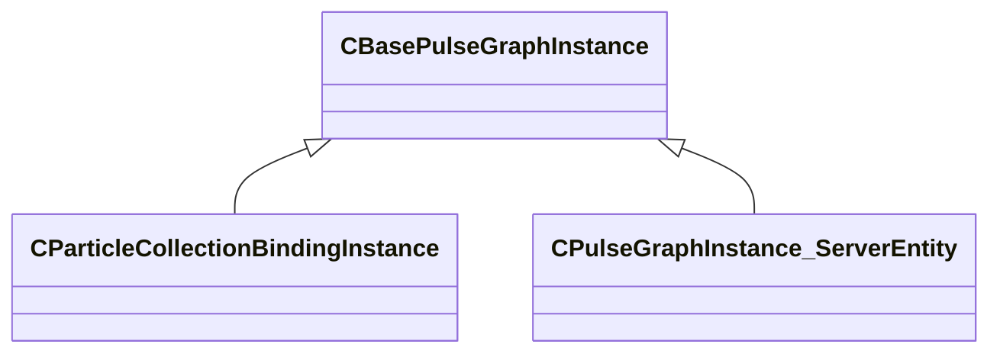
```mermaid
classDiagram
    CBasePulseGraphInstance <|-- CParticleCollectionBindingInstance
    CBasePulseGraphInstance <|-- CPulseGraphInstance_ServerEntity
```

### CPulseArraylib

**Metadata:** `MPropertyDescription Array support.`

### CPulseCell_Base

**Derived by:** [CPulseCell_BaseFlow](pulse_runtime_lib.md#cpulsecell_baseflow), [CPulseCell_BaseRequirement](pulse_runtime_lib.md#cpulsecell_baserequirement), [CPulseCell_BaseValue](pulse_runtime_lib.md#cpulsecell_basevalue), [CPulseCell_Unknown](pulse_runtime_lib.md#cpulsecell_unknown)

**Metadata:** `MGetKV3ClassDefaults`

**Relationships:**

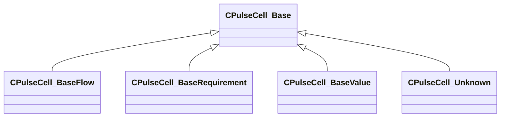
```mermaid
classDiagram
    CPulseCell_Base <|-- CPulseCell_BaseFlow
    CPulseCell_Base <|-- CPulseCell_BaseRequirement
    CPulseCell_Base <|-- CPulseCell_BaseValue
    CPulseCell_Base <|-- CPulseCell_Unknown
```

**Fields:**

| Name | Type | Annotations |
|------|------|-------------|
| `m_nEditorNodeID` | PulseDocNodeID_t | `MFgdFromSchemaCompletelySkipField` |

### CPulseCell_BaseFlow

**Inherits from:** [CPulseCell_Base](pulse_runtime_lib.md#cpulsecell_base)

**Derived by:** [CPulseCell_BaseYieldingInflow](pulse_runtime_lib.md#cpulsecell_baseyieldinginflow), [CPulseCell_Inflow_BaseEntrypoint](pulse_runtime_lib.md#cpulsecell_inflow_baseentrypoint), [CPulseCell_InlineNodeSkipSelector](pulse_runtime_lib.md#cpulsecell_inlinenodeskipselector), [CPulseCell_Outflow_CycleOrdered](pulse_runtime_lib.md#cpulsecell_outflow_cycleordered), [CPulseCell_Outflow_CycleRandom](pulse_runtime_lib.md#cpulsecell_outflow_cyclerandom), [CPulseCell_Outflow_CycleShuffled](pulse_runtime_lib.md#cpulsecell_outflow_cycleshuffled), [CPulseCell_PickBestOutflowSelector](pulse_runtime_lib.md#cpulsecell_pickbestoutflowselector), [CPulseCell_SoundEventStart](server.md#cpulsecell_soundeventstart), [CPulseCell_Step_DebugLog](pulse_runtime_lib.md#cpulsecell_step_debuglog), [CPulseCell_Step_EntFire](client.md#cpulsecell_step_entfire), [CPulseCell_Step_FollowEntity](server.md#cpulsecell_step_followentity), [CPulseCell_Step_PublicOutput](pulse_runtime_lib.md#cpulsecell_step_publicoutput), [CPulseCell_Step_SetAnimGraphParam](server.md#cpulsecell_step_setanimgraphparam)

**Metadata:** `MGetKV3ClassDefaults`

**Relationships:**

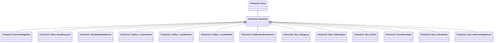
```mermaid
classDiagram
    CPulseCell_Base <|-- CPulseCell_BaseFlow
    CPulseCell_BaseFlow <|-- CPulseCell_BaseYieldingInflow
    CPulseCell_BaseFlow <|-- CPulseCell_Inflow_BaseEntrypoint
    CPulseCell_BaseFlow <|-- CPulseCell_InlineNodeSkipSelector
    CPulseCell_BaseFlow <|-- CPulseCell_Outflow_CycleOrdered
    CPulseCell_BaseFlow <|-- CPulseCell_Outflow_CycleRandom
    CPulseCell_BaseFlow <|-- CPulseCell_Outflow_CycleShuffled
    CPulseCell_BaseFlow <|-- CPulseCell_PickBestOutflowSelector
    CPulseCell_BaseFlow <|-- CPulseCell_Step_DebugLog
    CPulseCell_BaseFlow <|-- CPulseCell_Step_PublicOutput
    CPulseCell_BaseFlow <|-- CPulseCell_Step_EntFire
    CPulseCell_BaseFlow <|-- CPulseCell_SoundEventStart
    CPulseCell_BaseFlow <|-- CPulseCell_Step_FollowEntity
    CPulseCell_BaseFlow <|-- CPulseCell_Step_SetAnimGraphParam
```

### CPulseCell_BaseLerp

**Inherits from:** [CPulseCell_BaseYieldingInflow](pulse_runtime_lib.md#cpulsecell_baseyieldinginflow)

**Derived by:** [CPulseCell_LerpCameraSettings](client.md#cpulsecell_lerpcamerasettings)

**Metadata:** `MGetKV3ClassDefaults`

**Relationships:**

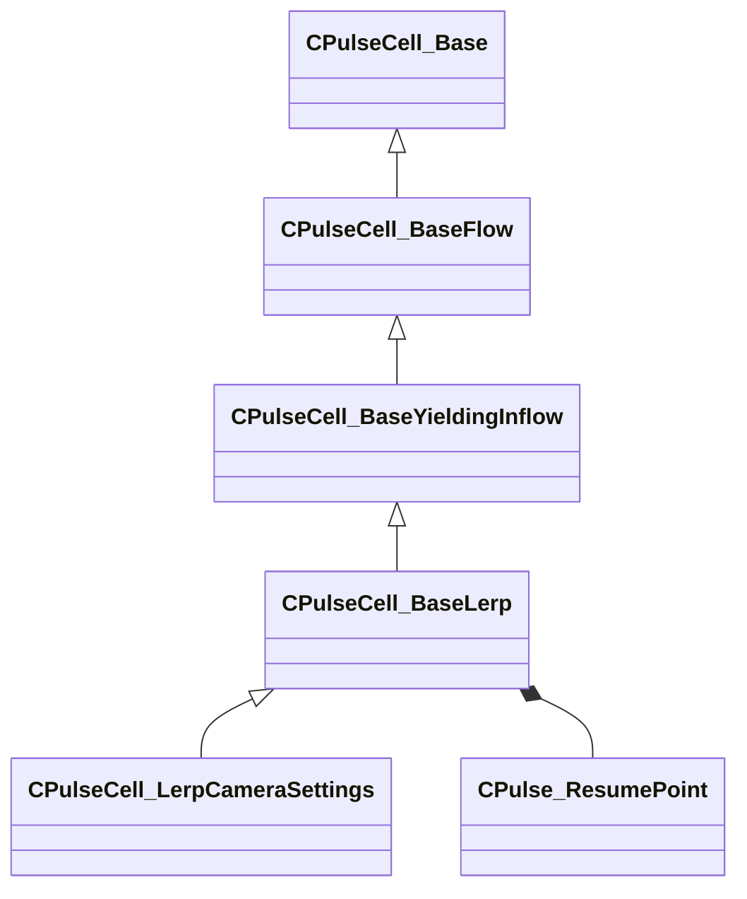
```mermaid
classDiagram
    CPulseCell_BaseYieldingInflow <|-- CPulseCell_BaseLerp
    CPulseCell_BaseFlow <|-- CPulseCell_BaseYieldingInflow
    CPulseCell_Base <|-- CPulseCell_BaseFlow
    CPulseCell_BaseLerp <|-- CPulseCell_LerpCameraSettings
    CPulseCell_BaseLerp *-- CPulse_ResumePoint
```

**Fields:**

| Name | Type | Annotations |
|------|------|-------------|
| `m_WakeResume` | [CPulse_ResumePoint](../schemas/pulse_runtime_lib.md#cpulse_resumepoint) |  |

### CPulseCell_BaseLerp::CursorState_t

**Derived by:** [CPulseCell_LerpCameraSettings::CursorState_t](client.md#cpulsecell_lerpcamerasettingscursorstate_t)

**Metadata:** `MGetKV3ClassDefaults`

**Relationships:**

```mermaid
classDiagram
    "CPulseCell_BaseLerp::CursorState_t" <|-- "CPulseCell_LerpCameraSettings::CursorState_t"
```

**Fields:**

| Name | Type | Annotations |
|------|------|-------------|
| `m_StartTime` | GameTime_t |  |
| `m_EndTime` | GameTime_t |  |

### CPulseCell_BaseRequirement

**Inherits from:** [CPulseCell_Base](pulse_runtime_lib.md#cpulsecell_base)

**Derived by:** [CPulseCell_IsRequirementValid](pulse_runtime_lib.md#cpulsecell_isrequirementvalid), [CPulseCell_LimitCount](pulse_runtime_lib.md#cpulsecell_limitcount)

**Metadata:** `MGetKV3ClassDefaults`

**Relationships:**

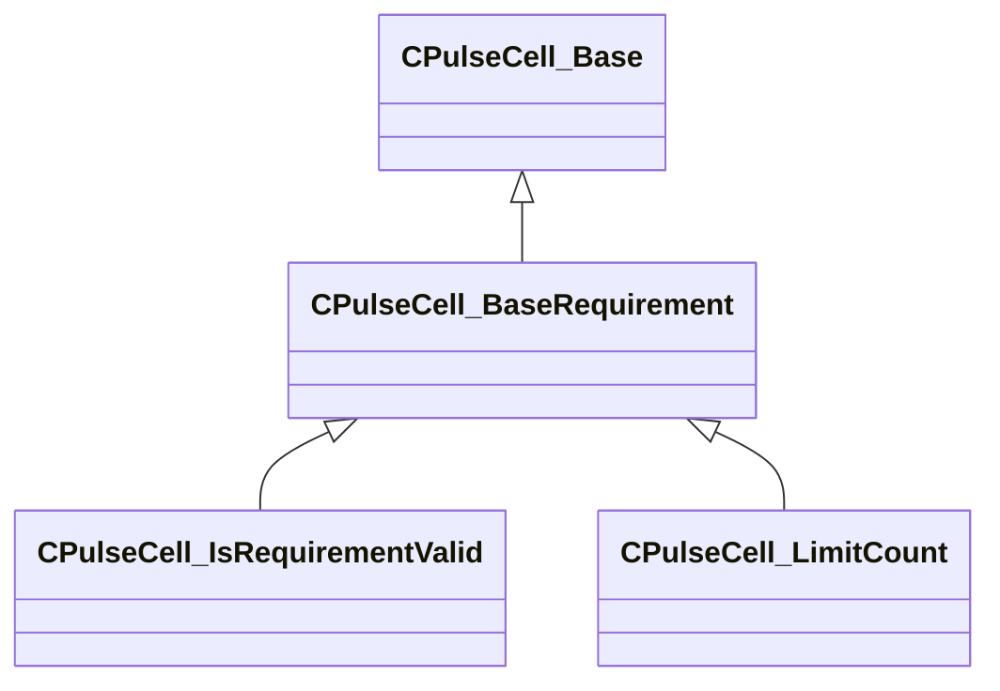
```mermaid
classDiagram
    CPulseCell_Base <|-- CPulseCell_BaseRequirement
    CPulseCell_BaseRequirement <|-- CPulseCell_IsRequirementValid
    CPulseCell_BaseRequirement <|-- CPulseCell_LimitCount
```

### CPulseCell_BaseState

**Inherits from:** [CPulseCell_BaseYieldingInflow](pulse_runtime_lib.md#cpulsecell_baseyieldinginflow)

**Derived by:** [CPulseCell_BooleanSwitchState](pulse_runtime_lib.md#cpulsecell_booleanswitchstate)

**Metadata:** `MGetKV3ClassDefaults`, `MPulseEditorHeaderIcon`

**Relationships:**

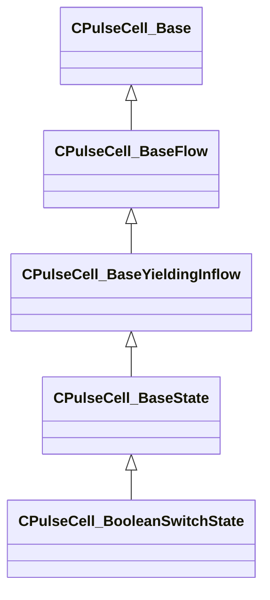
```mermaid
classDiagram
    CPulseCell_BaseYieldingInflow <|-- CPulseCell_BaseState
    CPulseCell_BaseFlow <|-- CPulseCell_BaseYieldingInflow
    CPulseCell_Base <|-- CPulseCell_BaseFlow
    CPulseCell_BaseState <|-- CPulseCell_BooleanSwitchState
```

### CPulseCell_BaseValue

**Inherits from:** [CPulseCell_Base](pulse_runtime_lib.md#cpulsecell_base)

**Derived by:** [CPulseCell_Value_Curve](pulse_runtime_lib.md#cpulsecell_value_curve), [CPulseCell_Value_Gradient](pulse_runtime_lib.md#cpulsecell_value_gradient), [CPulseCell_Value_RandomFloat](pulse_runtime_lib.md#cpulsecell_value_randomfloat), [CPulseCell_Value_RandomInt](pulse_runtime_lib.md#cpulsecell_value_randomint)

**Metadata:** `MGetKV3ClassDefaults`

**Relationships:**

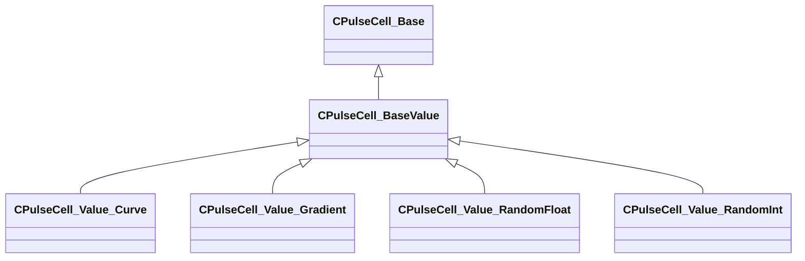
```mermaid
classDiagram
    CPulseCell_Base <|-- CPulseCell_BaseValue
    CPulseCell_BaseValue <|-- CPulseCell_Value_Curve
    CPulseCell_BaseValue <|-- CPulseCell_Value_Gradient
    CPulseCell_BaseValue <|-- CPulseCell_Value_RandomFloat
    CPulseCell_BaseValue <|-- CPulseCell_Value_RandomInt
```

### CPulseCell_BaseYieldingInflow

**Inherits from:** [CPulseCell_BaseFlow](pulse_runtime_lib.md#cpulsecell_baseflow)

**Derived by:** [CPulseCell_BaseLerp](pulse_runtime_lib.md#cpulsecell_baselerp), [CPulseCell_BaseState](pulse_runtime_lib.md#cpulsecell_basestate), [CPulseCell_FireCursors](pulse_runtime_lib.md#cpulsecell_firecursors), [CPulseCell_Inflow_Wait](pulse_runtime_lib.md#cpulsecell_inflow_wait), [CPulseCell_Inflow_Yield](pulse_runtime_lib.md#cpulsecell_inflow_yield), [CPulseCell_IntervalTimer](pulse_runtime_lib.md#cpulsecell_intervaltimer), [CPulseCell_Outflow_ListenForAnimgraphTag](server.md#cpulsecell_outflow_listenforanimgraphtag), [CPulseCell_Outflow_ListenForEntityOutput](server.md#cpulsecell_outflow_listenforentityoutput), [CPulseCell_Outflow_PlaySceneBase](server.md#cpulsecell_outflow_playscenebase), [CPulseCell_Outflow_PlayVOLine](server.md#cpulsecell_outflow_playvoline), [CPulseCell_Outflow_ScriptedSequence](server.md#cpulsecell_outflow_scriptedsequence), [CPulseCell_PlaySequence](client.md#cpulsecell_playsequence), [CPulseCell_Step_CallExternalMethod](pulse_runtime_lib.md#cpulsecell_step_callexternalmethod), [CPulseCell_Timeline](pulse_runtime_lib.md#cpulsecell_timeline), [CPulseCell_WaitForCursorsWithTagBase](pulse_runtime_lib.md#cpulsecell_waitforcursorswithtagbase), [CPulseCell_WaitForObservable](pulse_runtime_lib.md#cpulsecell_waitforobservable)

**Metadata:** `MCustomFGDMetadata`, `MGetKV3ClassDefaults`

**Relationships:**

```mermaid
classDiagram
    CPulseCell_BaseFlow <|-- CPulseCell_BaseYieldingInflow
    CPulseCell_Base <|-- CPulseCell_BaseFlow
    CPulseCell_BaseYieldingInflow <|-- CPulseCell_BaseLerp
    CPulseCell_BaseYieldingInflow <|-- CPulseCell_BaseState
    CPulseCell_BaseYieldingInflow <|-- CPulseCell_FireCursors
    CPulseCell_BaseYieldingInflow <|-- CPulseCell_Inflow_Wait
    CPulseCell_BaseYieldingInflow <|-- CPulseCell_Inflow_Yield
    CPulseCell_BaseYieldingInflow <|-- CPulseCell_IntervalTimer
    CPulseCell_BaseYieldingInflow <|-- CPulseCell_Step_CallExternalMethod
    CPulseCell_BaseYieldingInflow <|-- CPulseCell_Timeline
    CPulseCell_BaseYieldingInflow <|-- CPulseCell_WaitForCursorsWithTagBase
    CPulseCell_BaseYieldingInflow <|-- CPulseCell_WaitForObservable
    CPulseCell_BaseYieldingInflow <|-- CPulseCell_PlaySequence
    CPulseCell_BaseYieldingInflow <|-- CPulseCell_Outflow_ListenForAnimgraphTag
    CPulseCell_BaseYieldingInflow <|-- CPulseCell_Outflow_ListenForEntityOutput
    CPulseCell_BaseYieldingInflow <|-- CPulseCell_Outflow_PlaySceneBase
    CPulseCell_BaseYieldingInflow <|-- CPulseCell_Outflow_PlayVOLine
    CPulseCell_BaseYieldingInflow <|-- CPulseCell_Outflow_ScriptedSequence
    CPulseCell_BaseYieldingInflow *-- CPulse_ResumePoint
```

**Fields:**

| Name | Type | Annotations |
|------|------|-------------|
| `m_BaseFlow_OnAfterCancel` | [CPulse_ResumePoint](../schemas/pulse_runtime_lib.md#cpulse_resumepoint) | `MPulseFGDSkipField` |
| `m_BaseFlow_WhileActive` | [CPulse_ResumePoint](../schemas/pulse_runtime_lib.md#cpulse_resumepoint) | `MPulseFGDSkipField` |

### CPulseCell_BooleanSwitchState

**Inherits from:** [CPulseCell_BaseState](pulse_runtime_lib.md#cpulsecell_basestate)

**Metadata:** `MGetKV3ClassDefaults`, `MPropertyDescription While active, manage child cursors based on the results of a boolean condition. When the observable result changes, the prior cursor will be canceled and the appropriate outflow will fire a new child cursor. Will monitor continuously until externally canceled.`, `MPropertyFriendlyName Monitor Observable`, `MPulseEditorCanvasItemSpecKV3`

**Relationships:**

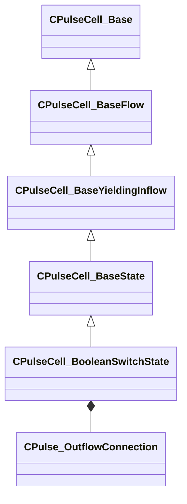
```mermaid
classDiagram
    CPulseCell_BaseState <|-- CPulseCell_BooleanSwitchState
    CPulseCell_BaseYieldingInflow <|-- CPulseCell_BaseState
    CPulseCell_BaseFlow <|-- CPulseCell_BaseYieldingInflow
    CPulseCell_Base <|-- CPulseCell_BaseFlow
    CPulseCell_BooleanSwitchState *-- CPulse_OutflowConnection
```

**Fields:**

| Name | Type | Annotations |
|------|------|-------------|
| `m_Condition` | CPulseObservableExpression< bool > | `MPropertyDescription Condition to evaluate when any of its dependent values change.` `MPropertyFriendlyName Observable` |
| `m_WhenTrue` | [CPulse_OutflowConnection](../schemas/pulse_runtime_lib.md#cpulse_outflowconnection) | `MPropertyDescription Fired when the observable boolean is true, and killed when false.` `MPropertyFriendlyName While True` |
| `m_WhenFalse` | [CPulse_OutflowConnection](../schemas/pulse_runtime_lib.md#cpulse_outflowconnection) | `MPropertyDescription Fired when the observable boolean is false, and killed when true.` `MPropertyFriendlyName While False` |

### CPulseCell_CursorQueue

**Inherits from:** [CPulseCell_WaitForCursorsWithTagBase](pulse_runtime_lib.md#cpulsecell_waitforcursorswithtagbase)

**Metadata:** `MGetKV3ClassDefaults`, `MPropertyDescription Causes each execution cursor to wait for the completion of all prior cursors that have visited this node. Use this to safely support multiple triggers to areas of the graph that take time to complete.`, `MPropertyFriendlyName Cursor Queue`, `MPulseEditorHeaderIcon`

**Relationships:**

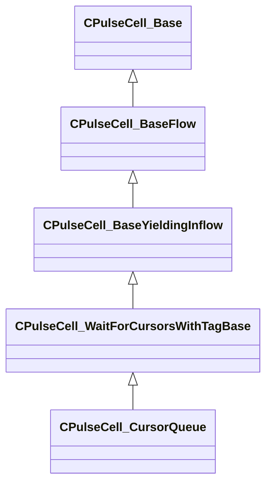
```mermaid
classDiagram
    CPulseCell_WaitForCursorsWithTagBase <|-- CPulseCell_CursorQueue
    CPulseCell_BaseYieldingInflow <|-- CPulseCell_WaitForCursorsWithTagBase
    CPulseCell_BaseFlow <|-- CPulseCell_BaseYieldingInflow
    CPulseCell_Base <|-- CPulseCell_BaseFlow
```

**Fields:**

| Name | Type | Annotations |
|------|------|-------------|
| `m_nCursorsAllowedToRunParallel` | int32 | `MPropertyDescription Any cursors above this count will wait, up to the limit.` |

### CPulseCell_FireCursors

**Inherits from:** [CPulseCell_BaseYieldingInflow](pulse_runtime_lib.md#cpulsecell_baseyieldinginflow)

**Metadata:** `MGetKV3ClassDefaults`

**Relationships:**

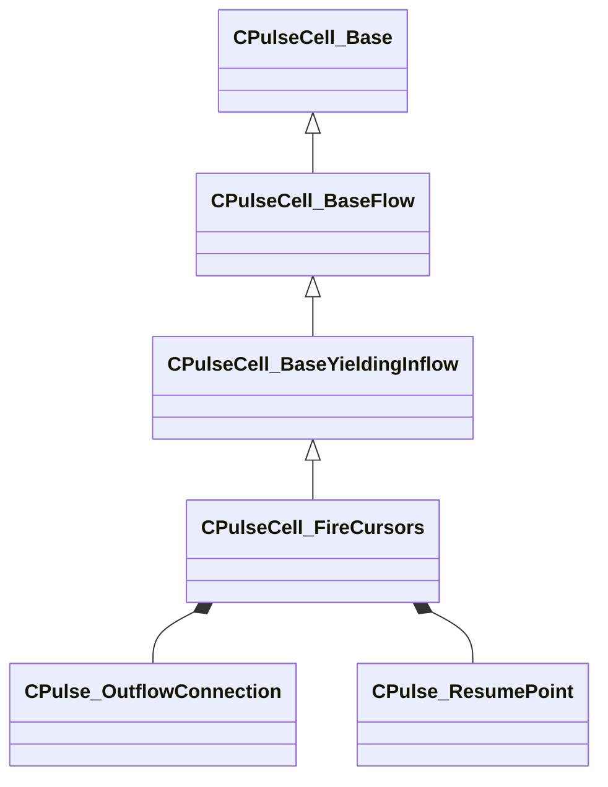
```mermaid
classDiagram
    CPulseCell_BaseYieldingInflow <|-- CPulseCell_FireCursors
    CPulseCell_BaseFlow <|-- CPulseCell_BaseYieldingInflow
    CPulseCell_Base <|-- CPulseCell_BaseFlow
    CPulseCell_FireCursors *-- CPulse_OutflowConnection
    CPulseCell_FireCursors *-- CPulse_ResumePoint
```

**Fields:**

| Name | Type | Annotations |
|------|------|-------------|
| `m_Outflows` | CUtlVector< [CPulse_OutflowConnection](../schemas/pulse_runtime_lib.md#cpulse_outflowconnection) > |  |
| `m_bWaitForChildOutflows` | bool |  |
| `m_OnFinished` | [CPulse_ResumePoint](../schemas/pulse_runtime_lib.md#cpulse_resumepoint) |  |

### CPulseCell_Inflow_BaseEntrypoint

**Inherits from:** [CPulseCell_BaseFlow](pulse_runtime_lib.md#cpulsecell_baseflow)

**Derived by:** [CPulseCell_Inflow_EntOutputHandler](pulse_runtime_lib.md#cpulsecell_inflow_entoutputhandler), [CPulseCell_Inflow_EventHandler](pulse_runtime_lib.md#cpulsecell_inflow_eventhandler), [CPulseCell_Inflow_GraphHook](pulse_runtime_lib.md#cpulsecell_inflow_graphhook), [CPulseCell_Inflow_Method](pulse_runtime_lib.md#cpulsecell_inflow_method), [CPulseCell_Inflow_ObservableVariableListener](pulse_runtime_lib.md#cpulsecell_inflow_observablevariablelistener)

**Metadata:** `MGetKV3ClassDefaults`

**Relationships:**

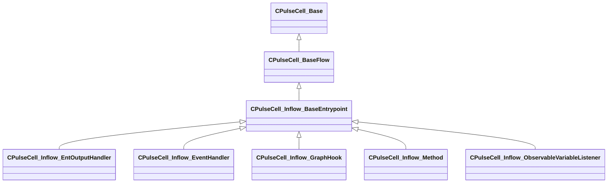
```mermaid
classDiagram
    CPulseCell_BaseFlow <|-- CPulseCell_Inflow_BaseEntrypoint
    CPulseCell_Base <|-- CPulseCell_BaseFlow
    CPulseCell_Inflow_BaseEntrypoint <|-- CPulseCell_Inflow_EntOutputHandler
    CPulseCell_Inflow_BaseEntrypoint <|-- CPulseCell_Inflow_EventHandler
    CPulseCell_Inflow_BaseEntrypoint <|-- CPulseCell_Inflow_GraphHook
    CPulseCell_Inflow_BaseEntrypoint <|-- CPulseCell_Inflow_Method
    CPulseCell_Inflow_BaseEntrypoint <|-- CPulseCell_Inflow_ObservableVariableListener
```

**Fields:**

| Name | Type | Annotations |
|------|------|-------------|
| `m_EntryChunk` | PulseRuntimeChunkIndex_t |  |
| `m_RegisterMap` | PulseRegisterMap_t |  |

### CPulseCell_Inflow_EntOutputHandler

**Inherits from:** [CPulseCell_Inflow_BaseEntrypoint](pulse_runtime_lib.md#cpulsecell_inflow_baseentrypoint)

**Metadata:** `MGetKV3ClassDefaults`

**Relationships:**

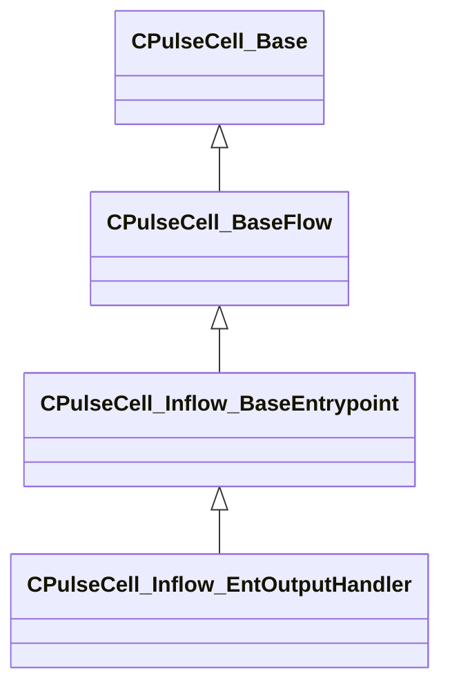
```mermaid
classDiagram
    CPulseCell_Inflow_BaseEntrypoint <|-- CPulseCell_Inflow_EntOutputHandler
    CPulseCell_BaseFlow <|-- CPulseCell_Inflow_BaseEntrypoint
    CPulseCell_Base <|-- CPulseCell_BaseFlow
```

**Fields:**

| Name | Type | Annotations |
|------|------|-------------|
| `m_SourceEntity` | PulseSymbol_t |  |
| `m_SourceOutput` | PulseSymbol_t |  |
| `m_ExpectedParamType` | CPulseValueFullType |  |

### CPulseCell_Inflow_EventHandler

**Inherits from:** [CPulseCell_Inflow_BaseEntrypoint](pulse_runtime_lib.md#cpulsecell_inflow_baseentrypoint)

**Metadata:** `MGetKV3ClassDefaults`

**Relationships:**

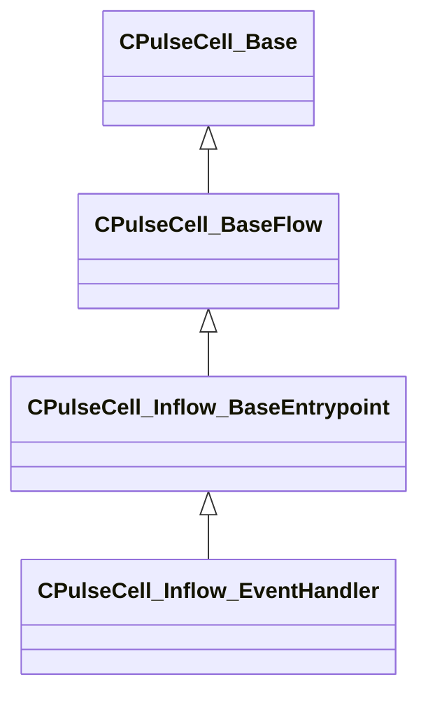
```mermaid
classDiagram
    CPulseCell_Inflow_BaseEntrypoint <|-- CPulseCell_Inflow_EventHandler
    CPulseCell_BaseFlow <|-- CPulseCell_Inflow_BaseEntrypoint
    CPulseCell_Base <|-- CPulseCell_BaseFlow
```

**Fields:**

| Name | Type | Annotations |
|------|------|-------------|
| `m_EventName` | PulseSymbol_t |  |

### CPulseCell_Inflow_GraphHook

**Inherits from:** [CPulseCell_Inflow_BaseEntrypoint](pulse_runtime_lib.md#cpulsecell_inflow_baseentrypoint)

**Metadata:** `MGetKV3ClassDefaults`

**Relationships:**

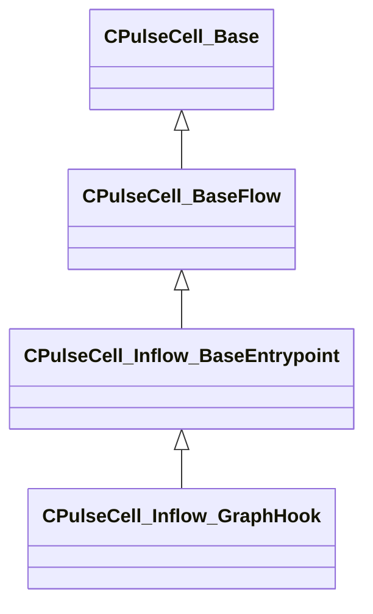
```mermaid
classDiagram
    CPulseCell_Inflow_BaseEntrypoint <|-- CPulseCell_Inflow_GraphHook
    CPulseCell_BaseFlow <|-- CPulseCell_Inflow_BaseEntrypoint
    CPulseCell_Base <|-- CPulseCell_BaseFlow
```

**Fields:**

| Name | Type | Annotations |
|------|------|-------------|
| `m_HookName` | PulseSymbol_t |  |

### CPulseCell_Inflow_Method

**Inherits from:** [CPulseCell_Inflow_BaseEntrypoint](pulse_runtime_lib.md#cpulsecell_inflow_baseentrypoint)

**Metadata:** `MGetKV3ClassDefaults`

**Relationships:**

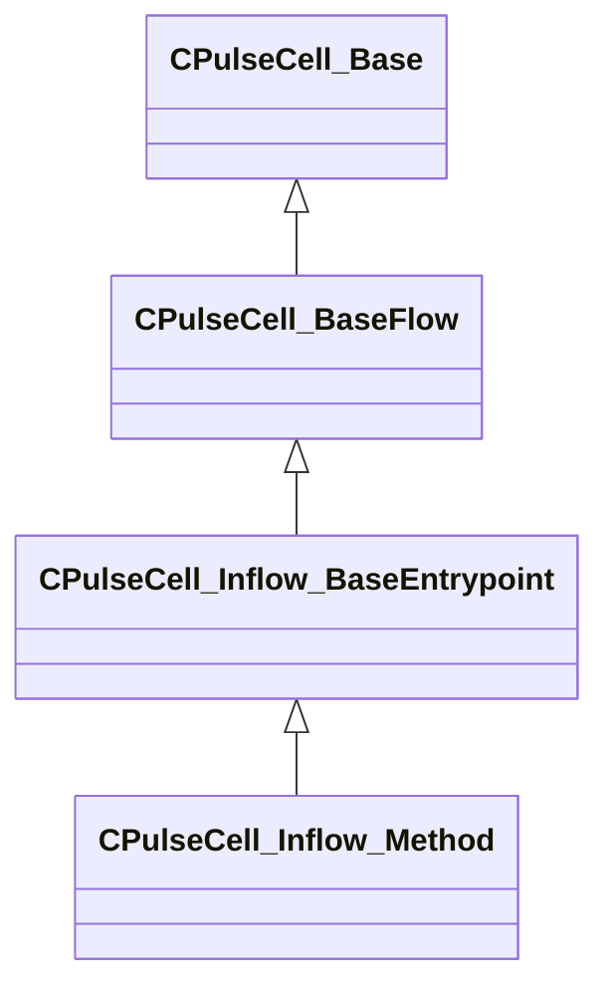
```mermaid
classDiagram
    CPulseCell_Inflow_BaseEntrypoint <|-- CPulseCell_Inflow_Method
    CPulseCell_BaseFlow <|-- CPulseCell_Inflow_BaseEntrypoint
    CPulseCell_Base <|-- CPulseCell_BaseFlow
```

**Fields:**

| Name | Type | Annotations |
|------|------|-------------|
| `m_MethodName` | PulseSymbol_t |  |
| `m_Description` | CUtlString |  |
| `m_bIsPublic` | bool |  |
| `m_ReturnType` | CPulseValueFullType |  |
| `m_Args` | CUtlLeanVector< CPulseRuntimeMethodArg > |  |

### CPulseCell_Inflow_ObservableVariableListener

**Inherits from:** [CPulseCell_Inflow_BaseEntrypoint](pulse_runtime_lib.md#cpulsecell_inflow_baseentrypoint)

**Metadata:** `MGetKV3ClassDefaults`

**Relationships:**

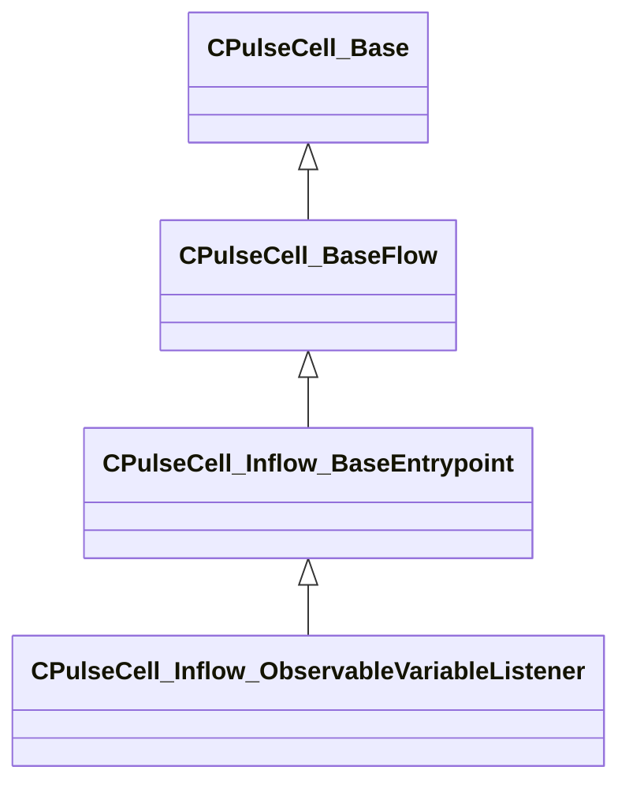
```mermaid
classDiagram
    CPulseCell_Inflow_BaseEntrypoint <|-- CPulseCell_Inflow_ObservableVariableListener
    CPulseCell_BaseFlow <|-- CPulseCell_Inflow_BaseEntrypoint
    CPulseCell_Base <|-- CPulseCell_BaseFlow
```

**Fields:**

| Name | Type | Annotations |
|------|------|-------------|
| `m_nBlackboardReference` | PulseRuntimeBlackboardReferenceIndex_t |  |
| `m_bSelfReference` | bool |  |

### CPulseCell_Inflow_Wait

**Inherits from:** [CPulseCell_BaseYieldingInflow](pulse_runtime_lib.md#cpulsecell_baseyieldinginflow)

**Metadata:** `MGetKV3ClassDefaults`, `MPropertyDescription Causes each execution cursor to pause at this node for a fixed period of time. Each cursor will wake up and resume execution when the time expires, unless aborted or early-woken.`, `MPropertyFriendlyName Wait`, `MPulseEditorCanvasItemSpecKV3`, `MPulseEditorHeaderIcon`

**Relationships:**

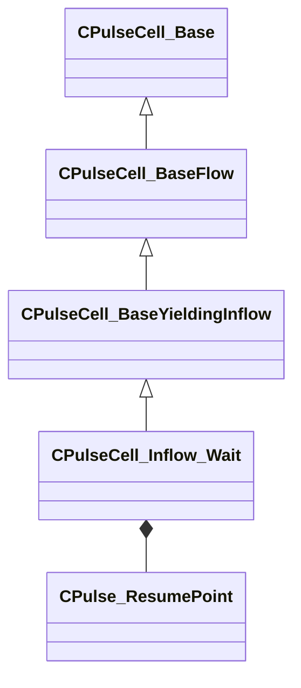
```mermaid
classDiagram
    CPulseCell_BaseYieldingInflow <|-- CPulseCell_Inflow_Wait
    CPulseCell_BaseFlow <|-- CPulseCell_BaseYieldingInflow
    CPulseCell_Base <|-- CPulseCell_BaseFlow
    CPulseCell_Inflow_Wait *-- CPulse_ResumePoint
```

**Fields:**

| Name | Type | Annotations |
|------|------|-------------|
| `m_WakeResume` | [CPulse_ResumePoint](../schemas/pulse_runtime_lib.md#cpulse_resumepoint) |  |

### CPulseCell_Inflow_Yield

**Inherits from:** [CPulseCell_BaseYieldingInflow](pulse_runtime_lib.md#cpulsecell_baseyieldinginflow)

**Metadata:** `MGetKV3ClassDefaults`

**Relationships:**

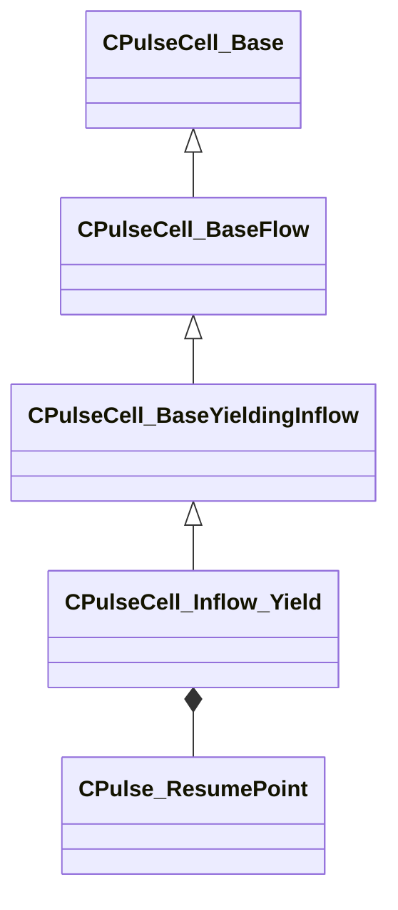
```mermaid
classDiagram
    CPulseCell_BaseYieldingInflow <|-- CPulseCell_Inflow_Yield
    CPulseCell_BaseFlow <|-- CPulseCell_BaseYieldingInflow
    CPulseCell_Base <|-- CPulseCell_BaseFlow
    CPulseCell_Inflow_Yield *-- CPulse_ResumePoint
```

**Fields:**

| Name | Type | Annotations |
|------|------|-------------|
| `m_UnyieldResume` | [CPulse_ResumePoint](../schemas/pulse_runtime_lib.md#cpulse_resumepoint) |  |

### CPulseCell_InlineNodeSkipSelector

**Inherits from:** [CPulseCell_BaseFlow](pulse_runtime_lib.md#cpulsecell_baseflow)

**Metadata:** `MGetKV3ClassDefaults`, `MPulseFunctionHiddenInTool`

**Relationships:**

```mermaid
classDiagram
    CPulseCell_BaseFlow <|-- CPulseCell_InlineNodeSkipSelector
    CPulseCell_Base <|-- CPulseCell_BaseFlow
    CPulseCell_InlineNodeSkipSelector *-- PulseSelectorOutflowList_t
    CPulseCell_InlineNodeSkipSelector *-- CPulse_OutflowConnection
```

**Fields:**

| Name | Type | Annotations |
|------|------|-------------|
| `m_nFlowNodeID` | PulseDocNodeID_t |  |
| `m_bAnd` | bool |  |
| `m_PassOutflow` | [PulseSelectorOutflowList_t](../schemas/pulse_runtime_lib.md#pulseselectoroutflowlist_t) |  |
| `m_FailOutflow` | [CPulse_OutflowConnection](../schemas/pulse_runtime_lib.md#cpulse_outflowconnection) |  |

### CPulseCell_IntervalTimer

**Inherits from:** [CPulseCell_BaseYieldingInflow](pulse_runtime_lib.md#cpulsecell_baseyieldinginflow)

**Metadata:** `MGetKV3ClassDefaults`, `MPropertyDescription Wait for a duration, firing a child cursor at regular (or randomized) intervals`, `MPropertyFriendlyName Interval Timer`, `MPulseEditorCanvasItemSpecKV3`, `MPulseEditorHeaderIcon`

**Relationships:**

```mermaid
classDiagram
    CPulseCell_BaseYieldingInflow <|-- CPulseCell_IntervalTimer
    CPulseCell_BaseFlow <|-- CPulseCell_BaseYieldingInflow
    CPulseCell_Base <|-- CPulseCell_BaseFlow
    CPulseCell_IntervalTimer *-- CPulse_ResumePoint
    CPulseCell_IntervalTimer *-- SignatureOutflow_Continue
```

**Fields:**

| Name | Type | Annotations |
|------|------|-------------|
| `m_Completed` | [CPulse_ResumePoint](../schemas/pulse_runtime_lib.md#cpulse_resumepoint) | `MPropertyDescription Called when timer reaches the duration OR is stopped. NOTE: This will run a little while AFTER the last interval fires unless they line up perfectly.` |
| `m_OnInterval` | [SignatureOutflow_Continue](../schemas/pulse_runtime_lib.md#signatureoutflow_continue) | `MPropertyDescription New child cursor starts here every time the wait interval elapses` |

### CPulseCell_IntervalTimer::CursorState_t

**Metadata:** `MGetKV3ClassDefaults`

**Fields:**

| Name | Type | Annotations |
|------|------|-------------|
| `m_StartTime` | GameTime_t |  |
| `m_EndTime` | GameTime_t |  |
| `m_flWaitInterval` | float32 |  |
| `m_flWaitIntervalHigh` | float32 |  |
| `m_bCompleteOnNextWake` | bool |  |

### CPulseCell_IsRequirementValid

**Inherits from:** [CPulseCell_BaseRequirement](pulse_runtime_lib.md#cpulsecell_baserequirement)

**Metadata:** `MGetKV3ClassDefaults`

**Relationships:**

```mermaid
classDiagram
    CPulseCell_BaseRequirement <|-- CPulseCell_IsRequirementValid
    CPulseCell_Base <|-- CPulseCell_BaseRequirement
```

### CPulseCell_IsRequirementValid::Criteria_t

**Fields:**

| Name | Type | Annotations |
|------|------|-------------|
| `m_bIsValid` | bool |  |

### CPulseCell_LimitCount

**Inherits from:** [CPulseCell_BaseRequirement](pulse_runtime_lib.md#cpulsecell_baserequirement)

**Metadata:** `MGetKV3ClassDefaults`, `MPropertyDescription Skip this node after the limit. Check Type does not apply, the limit will always be checked.`, `MPropertyFriendlyName Limit Count`

**Relationships:**

```mermaid
classDiagram
    CPulseCell_BaseRequirement <|-- CPulseCell_LimitCount
    CPulseCell_Base <|-- CPulseCell_BaseRequirement
```

**Fields:**

| Name | Type | Annotations |
|------|------|-------------|
| `m_nLimitCount` | int32 | `MPropertyFlattenIntoParentRow` |

### CPulseCell_LimitCount::Criteria_t

**Fields:**

| Name | Type | Annotations |
|------|------|-------------|
| `m_bLimitCountPasses` | bool |  |

### CPulseCell_LimitCount::InstanceState_t

**Metadata:** `MGetKV3ClassDefaults`

**Fields:**

| Name | Type | Annotations |
|------|------|-------------|
| `m_nCurrentCount` | int32 |  |

### CPulseCell_Outflow_CycleOrdered

**Inherits from:** [CPulseCell_BaseFlow](pulse_runtime_lib.md#cpulsecell_baseflow)

**Metadata:** `MGetKV3ClassDefaults`

**Relationships:**

```mermaid
classDiagram
    CPulseCell_BaseFlow <|-- CPulseCell_Outflow_CycleOrdered
    CPulseCell_Base <|-- CPulseCell_BaseFlow
    CPulseCell_Outflow_CycleOrdered *-- CPulse_OutflowConnection
```

**Fields:**

| Name | Type | Annotations |
|------|------|-------------|
| `m_Outputs` | CUtlVector< [CPulse_OutflowConnection](../schemas/pulse_runtime_lib.md#cpulse_outflowconnection) > |  |

### CPulseCell_Outflow_CycleOrdered::InstanceState_t

**Metadata:** `MGetKV3ClassDefaults`

**Fields:**

| Name | Type | Annotations |
|------|------|-------------|
| `m_nNextIndex` | int32 |  |

### CPulseCell_Outflow_CycleRandom

**Inherits from:** [CPulseCell_BaseFlow](pulse_runtime_lib.md#cpulsecell_baseflow)

**Metadata:** `MGetKV3ClassDefaults`

**Relationships:**

```mermaid
classDiagram
    CPulseCell_BaseFlow <|-- CPulseCell_Outflow_CycleRandom
    CPulseCell_Base <|-- CPulseCell_BaseFlow
    CPulseCell_Outflow_CycleRandom *-- CPulse_OutflowConnection
```

**Fields:**

| Name | Type | Annotations |
|------|------|-------------|
| `m_Outputs` | CUtlVector< [CPulse_OutflowConnection](../schemas/pulse_runtime_lib.md#cpulse_outflowconnection) > |  |

### CPulseCell_Outflow_CycleShuffled

**Inherits from:** [CPulseCell_BaseFlow](pulse_runtime_lib.md#cpulsecell_baseflow)

**Metadata:** `MGetKV3ClassDefaults`

**Relationships:**

```mermaid
classDiagram
    CPulseCell_BaseFlow <|-- CPulseCell_Outflow_CycleShuffled
    CPulseCell_Base <|-- CPulseCell_BaseFlow
    CPulseCell_Outflow_CycleShuffled *-- CPulse_OutflowConnection
```

**Fields:**

| Name | Type | Annotations |
|------|------|-------------|
| `m_Outputs` | CUtlVector< [CPulse_OutflowConnection](../schemas/pulse_runtime_lib.md#cpulse_outflowconnection) > |  |

### CPulseCell_Outflow_CycleShuffled::InstanceState_t

**Metadata:** `MGetKV3ClassDefaults`

**Fields:**

| Name | Type | Annotations |
|------|------|-------------|
| `m_Shuffle` | CUtlVectorFixedGrowable< uint8, 8 > |  |
| `m_nNextShuffle` | int32 |  |

### CPulseCell_PickBestOutflowSelector

**Inherits from:** [CPulseCell_BaseFlow](pulse_runtime_lib.md#cpulsecell_baseflow)

**Metadata:** `MGetKV3ClassDefaults`, `MPropertyDescription Evaluate the requirements of each connected node`, `MPropertyFriendlyName Select Best Exit`, `MPulseEditorCanvasItemSpecKV3`, `MPulseEditorHeaderIcon`

**Relationships:**

```mermaid
classDiagram
    CPulseCell_BaseFlow <|-- CPulseCell_PickBestOutflowSelector
    CPulseCell_Base <|-- CPulseCell_BaseFlow
    CPulseCell_PickBestOutflowSelector *-- PulseBestOutflowRules_t
    CPulseCell_PickBestOutflowSelector *-- PulseSelectorOutflowList_t
```

**Fields:**

| Name | Type | Annotations |
|------|------|-------------|
| `m_nCheckType` | [PulseBestOutflowRules_t](../schemas/animationsystem.md#pulsebestoutflowrules_t) |  |
| `m_OutflowList` | [PulseSelectorOutflowList_t](../schemas/pulse_runtime_lib.md#pulseselectoroutflowlist_t) |  |

### CPulseCell_Step_CallExternalMethod

**Inherits from:** [CPulseCell_BaseYieldingInflow](pulse_runtime_lib.md#cpulsecell_baseyieldinginflow)

**Metadata:** `MGetKV3ClassDefaults`

**Relationships:**

```mermaid
classDiagram
    CPulseCell_BaseYieldingInflow <|-- CPulseCell_Step_CallExternalMethod
    CPulseCell_BaseFlow <|-- CPulseCell_BaseYieldingInflow
    CPulseCell_Base <|-- CPulseCell_BaseFlow
    CPulseCell_Step_CallExternalMethod *-- PulseMethodCallMode_t
    CPulseCell_Step_CallExternalMethod *-- CPulse_ResumePoint
```

**Fields:**

| Name | Type | Annotations |
|------|------|-------------|
| `m_MethodName` | PulseSymbol_t |  |
| `m_nBlackboardIndex` | PulseRuntimeBlackboardReferenceIndex_t |  |
| `m_ExpectedArgs` | CUtlLeanVector< CPulseRuntimeMethodArg > |  |
| `m_nAsyncCallMode` | [PulseMethodCallMode_t](../schemas/animationsystem.md#pulsemethodcallmode_t) |  |
| `m_OnFinished` | [CPulse_ResumePoint](../schemas/pulse_runtime_lib.md#cpulse_resumepoint) |  |

### CPulseCell_Step_DebugLog

**Inherits from:** [CPulseCell_BaseFlow](pulse_runtime_lib.md#cpulsecell_baseflow)

**Metadata:** `MGetKV3ClassDefaults`

**Relationships:**

```mermaid
classDiagram
    CPulseCell_BaseFlow <|-- CPulseCell_Step_DebugLog
    CPulseCell_Base <|-- CPulseCell_BaseFlow
```

### CPulseCell_Step_PublicOutput

**Inherits from:** [CPulseCell_BaseFlow](pulse_runtime_lib.md#cpulsecell_baseflow)

**Metadata:** `MGetKV3ClassDefaults`

**Relationships:**

```mermaid
classDiagram
    CPulseCell_BaseFlow <|-- CPulseCell_Step_PublicOutput
    CPulseCell_Base <|-- CPulseCell_BaseFlow
```

**Fields:**

| Name | Type | Annotations |
|------|------|-------------|
| `m_OutputIndex` | PulseRuntimeOutputIndex_t |  |

### CPulseCell_Timeline

**Inherits from:** [CPulseCell_BaseYieldingInflow](pulse_runtime_lib.md#cpulsecell_baseyieldinginflow)

**Metadata:** `MGetKV3ClassDefaults`

**Relationships:**

```mermaid
classDiagram
    CPulseCell_BaseYieldingInflow <|-- CPulseCell_Timeline
    CPulseCell_BaseFlow <|-- CPulseCell_BaseYieldingInflow
    CPulseCell_Base <|-- CPulseCell_BaseFlow
    CPulseCell_Timeline *-- CPulse_ResumePoint
```

**Fields:**

| Name | Type | Annotations |
|------|------|-------------|
| `m_TimelineEvents` | CUtlVector< [CPulseCell_Timeline](../schemas/pulse_runtime_lib.md#cpulsecell_timeline)::TimelineEvent_t > |  |
| `m_bWaitForChildOutflows` | bool |  |
| `m_OnFinished` | [CPulse_ResumePoint](../schemas/pulse_runtime_lib.md#cpulse_resumepoint) |  |

### CPulseCell_Timeline::TimelineEvent_t

**Metadata:** `MGetKV3ClassDefaults`

**Relationships:**

```mermaid
classDiagram
    "CPulseCell_Timeline::TimelineEvent_t" *-- CPulse_OutflowConnection
```

**Fields:**

| Name | Type | Annotations |
|------|------|-------------|
| `m_flTimeFromPrevious` | float32 |  |
| `m_EventOutflow` | [CPulse_OutflowConnection](../schemas/pulse_runtime_lib.md#cpulse_outflowconnection) |  |

### CPulseCell_Unknown

**Inherits from:** [CPulseCell_Base](pulse_runtime_lib.md#cpulsecell_base)

**Relationships:**

```mermaid
classDiagram
    CPulseCell_Base <|-- CPulseCell_Unknown
```

**Fields:**

| Name | Type | Annotations |
|------|------|-------------|
| `m_UnknownKeys` | KeyValues3 |  |

### CPulseCell_Value_Curve

**Inherits from:** [CPulseCell_BaseValue](pulse_runtime_lib.md#cpulsecell_basevalue)

**Metadata:** `MGetKV3ClassDefaults`, `MPropertyFriendlyName Curve`

**Relationships:**

```mermaid
classDiagram
    CPulseCell_BaseValue <|-- CPulseCell_Value_Curve
    CPulseCell_Base <|-- CPulseCell_BaseValue
```

**Fields:**

| Name | Type | Annotations |
|------|------|-------------|
| `m_Curve` | CPiecewiseCurve |  |

### CPulseCell_Value_Gradient

**Inherits from:** [CPulseCell_BaseValue](pulse_runtime_lib.md#cpulsecell_basevalue)

**Metadata:** `MGetKV3ClassDefaults`, `MPropertyFriendlyName Gradient`

**Relationships:**

```mermaid
classDiagram
    CPulseCell_BaseValue <|-- CPulseCell_Value_Gradient
    CPulseCell_Base <|-- CPulseCell_BaseValue
```

**Fields:**

| Name | Type | Annotations |
|------|------|-------------|
| `m_Gradient` | CColorGradient |  |

### CPulseCell_Value_RandomFloat

**Inherits from:** [CPulseCell_BaseValue](pulse_runtime_lib.md#cpulsecell_basevalue)

**Metadata:** `MGetKV3ClassDefaults`, `MPropertyDescription Generate a random float between min and max (inclusive)`, `MPropertyFriendlyName Random Float`, `MPulseEditorHeaderIcon`

**Relationships:**

```mermaid
classDiagram
    CPulseCell_BaseValue <|-- CPulseCell_Value_RandomFloat
    CPulseCell_Base <|-- CPulseCell_BaseValue
```

### CPulseCell_Value_RandomInt

**Inherits from:** [CPulseCell_BaseValue](pulse_runtime_lib.md#cpulsecell_basevalue)

**Metadata:** `MGetKV3ClassDefaults`, `MPropertyDescription Generate a random integer between min and max (inclusive)`, `MPropertyFriendlyName Random Integer`, `MPulseEditorHeaderIcon`

**Relationships:**

```mermaid
classDiagram
    CPulseCell_BaseValue <|-- CPulseCell_Value_RandomInt
    CPulseCell_Base <|-- CPulseCell_BaseValue
```

### CPulseCell_WaitForCursorsWithTag

**Inherits from:** [CPulseCell_WaitForCursorsWithTagBase](pulse_runtime_lib.md#cpulsecell_waitforcursorswithtagbase)

**Metadata:** `MGetKV3ClassDefaults`, `MPropertyDescription Causes this execution cursor to wait for the completion of other cursors with the given tag. Can optionally kill the tag while waiting.`, `MPropertyFriendlyName Wait For Cursors With Tag`, `MPulseEditorHeaderIcon`

**Relationships:**

```mermaid
classDiagram
    CPulseCell_WaitForCursorsWithTagBase <|-- CPulseCell_WaitForCursorsWithTag
    CPulseCell_BaseYieldingInflow <|-- CPulseCell_WaitForCursorsWithTagBase
    CPulseCell_BaseFlow <|-- CPulseCell_BaseYieldingInflow
    CPulseCell_Base <|-- CPulseCell_BaseFlow
    CPulseCell_WaitForCursorsWithTag *-- PulseCursorCancelPriority_t
```

**Fields:**

| Name | Type | Annotations |
|------|------|-------------|
| `m_bTagSelfWhenComplete` | bool | `MPropertyDescription Apply the same tag we're waiting on to the resulting cursor upon wait completion. Can be used to wait on our result cursor with the same tag.` |
| `m_nDesiredKillPriority` | [PulseCursorCancelPriority_t](../schemas/animationsystem.md#pulsecursorcancelpriority_t) | `MPropertyDescription When we start waiting, how should we handle existing cursors?` |

### CPulseCell_WaitForCursorsWithTagBase

**Inherits from:** [CPulseCell_BaseYieldingInflow](pulse_runtime_lib.md#cpulsecell_baseyieldinginflow)

**Derived by:** [CPulseCell_CursorQueue](pulse_runtime_lib.md#cpulsecell_cursorqueue), [CPulseCell_WaitForCursorsWithTag](pulse_runtime_lib.md#cpulsecell_waitforcursorswithtag)

**Metadata:** `MGetKV3ClassDefaults`, `MPulseEditorCanvasItemSpecKV3`

**Relationships:**

```mermaid
classDiagram
    CPulseCell_BaseYieldingInflow <|-- CPulseCell_WaitForCursorsWithTagBase
    CPulseCell_BaseFlow <|-- CPulseCell_BaseYieldingInflow
    CPulseCell_Base <|-- CPulseCell_BaseFlow
    CPulseCell_WaitForCursorsWithTagBase <|-- CPulseCell_CursorQueue
    CPulseCell_WaitForCursorsWithTagBase <|-- CPulseCell_WaitForCursorsWithTag
    CPulseCell_WaitForCursorsWithTagBase *-- CPulse_ResumePoint
```

**Fields:**

| Name | Type | Annotations |
|------|------|-------------|
| `m_nCursorsAllowedToWait` | int32 | `MPropertyDescription Any extra waiting cursors will be terminated. -1 for infinite cursors.` |
| `m_WaitComplete` | [CPulse_ResumePoint](../schemas/pulse_runtime_lib.md#cpulse_resumepoint) |  |

### CPulseCell_WaitForObservable

**Inherits from:** [CPulseCell_BaseYieldingInflow](pulse_runtime_lib.md#cpulsecell_baseyieldinginflow)

**Metadata:** `MGetKV3ClassDefaults`, `MPropertyDescription All values connected to this node must be 'observable'. Variables on this graph will be automatically promoted to observable. Other value nodes must take an explicit context, look for those nodes with a corresponding icon.`, `MPropertyFriendlyName Wait Until`, `MPulseEditorHeaderIcon`

**Relationships:**

```mermaid
classDiagram
    CPulseCell_BaseYieldingInflow <|-- CPulseCell_WaitForObservable
    CPulseCell_BaseFlow <|-- CPulseCell_BaseYieldingInflow
    CPulseCell_Base <|-- CPulseCell_BaseFlow
    CPulseCell_WaitForObservable *-- CPulse_ResumePoint
```

**Fields:**

| Name | Type | Annotations |
|------|------|-------------|
| `m_Condition` | CPulseObservableExpression< bool > | `MPropertyDescription Condition to evaluate when any of its dependent values change.` `MPropertyFriendlyName Observable` |
| `m_OnTrue` | [CPulse_ResumePoint](../schemas/pulse_runtime_lib.md#cpulse_resumepoint) |  |

### CPulseCursorFuncs

**Metadata:** `MPropertyDescription Library for interacting with pulse cursors.`

### CPulseEnumlib

**Metadata:** `MPropertyDescription Enum support.`

### CPulseExecCursor

**Derived by:** [CPulseServerCursor](server.md#cpulseservercursor)

**Relationships:**

```mermaid
classDiagram
    CPulseExecCursor <|-- CPulseServerCursor
```

### CPulseGraphDef

**Metadata:** `MGetKV3ClassDefaults`

**Relationships:**

```mermaid
classDiagram
    CPulseGraphDef --> CPulseCell_Base
    CPulseGraphDef --> CPulse_InvokeBinding
    CPulseGraphDef --> CPulse_CallInfo
    CPulseGraphDef *-- CPulse_BlackboardReference
```

**Fields:**

| Name | Type | Annotations |
|------|------|-------------|
| `m_DomainIdentifier` | PulseSymbol_t |  |
| `m_DomainSubType` | CPulseValueFullType |  |
| `m_ParentMapName` | PulseSymbol_t |  |
| `m_ParentXmlName` | PulseSymbol_t |  |
| `m_Chunks` | CUtlVector< CPulse_Chunk* > |  |
| `m_Cells` | CUtlVector< [CPulseCell_Base](../schemas/pulse_runtime_lib.md#cpulsecell_base)* > |  |
| `m_Vars` | CUtlVector< CPulse_Variable > |  |
| `m_PublicOutputs` | CUtlVector< CPulse_PublicOutput > |  |
| `m_InvokeBindings` | CUtlVector< [CPulse_InvokeBinding](../schemas/pulse_runtime_lib.md#cpulse_invokebinding)* > |  |
| `m_CallInfos` | CUtlVector< [CPulse_CallInfo](../schemas/pulse_runtime_lib.md#cpulse_callinfo)* > |  |
| `m_Constants` | CUtlVector< CPulse_Constant > |  |
| `m_DomainValues` | CUtlVector< CPulse_DomainValue > |  |
| `m_BlackboardReferences` | CUtlVector< [CPulse_BlackboardReference](../schemas/pulse_runtime_lib.md#cpulse_blackboardreference) > |  |
| `m_OutputConnections` | CUtlVector< CPulse_OutputConnection* > |  |

### CPulseMathlib

**Metadata:** `MPropertyDescription Basic math support.`

### CPulseStringlib

**Metadata:** `MPropertyDescription Basic string support.`

### CPulseTestScriptLib

**Metadata:** `MPropertyDescription Testing script helpers.`

### CPulse_BlackboardReference

**Metadata:** `MGetKV3ClassDefaults`

**Fields:**

| Name | Type | Annotations |
|------|------|-------------|
| `m_hBlackboardResource` | CStrongHandle< InfoForResourceTypeIPulseGraphDef > |  |
| `m_BlackboardResource` | PulseSymbol_t |  |
| `m_nNodeID` | PulseDocNodeID_t |  |
| `m_NodeName` | CGlobalSymbol |  |

### CPulse_CallInfo

**Metadata:** `MGetKV3ClassDefaults`

**Fields:**

| Name | Type | Annotations |
|------|------|-------------|
| `m_PortName` | PulseSymbol_t |  |
| `m_nEditorNodeID` | PulseDocNodeID_t |  |
| `m_RegisterMap` | PulseRegisterMap_t |  |
| `m_CallMethodID` | PulseDocNodeID_t |  |
| `m_nSrcChunk` | PulseRuntimeChunkIndex_t |  |
| `m_nSrcInstruction` | int32 |  |

### CPulse_InvokeBinding

**Metadata:** `MGetKV3ClassDefaults`

**Fields:**

| Name | Type | Annotations |
|------|------|-------------|
| `m_RegisterMap` | PulseRegisterMap_t |  |
| `m_FuncName` | PulseSymbol_t |  |
| `m_nCellIndex` | PulseRuntimeCellIndex_t |  |
| `m_nSrcChunk` | PulseRuntimeChunkIndex_t |  |
| `m_nSrcInstruction` | int32 |  |

### CPulse_OutflowConnection

**Derived by:** [CPulse_ResumePoint](pulse_runtime_lib.md#cpulse_resumepoint), [SignatureOutflow_Continue](pulse_runtime_lib.md#signatureoutflow_continue)

**Relationships:**

```mermaid
classDiagram
    CPulse_OutflowConnection <|-- CPulse_ResumePoint
    CPulse_OutflowConnection <|-- SignatureOutflow_Continue
```

**Fields:**

| Name | Type | Annotations |
|------|------|-------------|
| `m_SourceOutflowName` | PulseSymbol_t |  |
| `m_nDestChunk` | PulseRuntimeChunkIndex_t |  |
| `m_nInstruction` | int32 |  |
| `m_OutflowRegisterMap` | PulseRegisterMap_t |  |

### CPulse_ResumePoint

**Inherits from:** [CPulse_OutflowConnection](pulse_runtime_lib.md#cpulse_outflowconnection)

**Derived by:** [SignatureOutflow_Resume](pulse_runtime_lib.md#signatureoutflow_resume)

**Relationships:**

```mermaid
classDiagram
    CPulse_OutflowConnection <|-- CPulse_ResumePoint
    CPulse_ResumePoint <|-- SignatureOutflow_Resume
```

### OutflowWithRequirements_t

**Metadata:** `MGetKV3ClassDefaults`

**Relationships:**

```mermaid
classDiagram
    OutflowWithRequirements_t *-- CPulse_OutflowConnection
```

**Fields:**

| Name | Type | Annotations |
|------|------|-------------|
| `m_Connection` | [CPulse_OutflowConnection](../schemas/pulse_runtime_lib.md#cpulse_outflowconnection) |  |
| `m_DestinationFlowNodeID` | PulseDocNodeID_t |  |
| `m_RequirementNodeIDs` | CUtlVector< PulseDocNodeID_t > |  |
| `m_nCursorStateBlockIndex` | CUtlVector< int32 > |  |

### PulseNodeDynamicOutflows_t

**Metadata:** `MGetKV3ClassDefaults`

**Fields:**

| Name | Type | Annotations |
|------|------|-------------|
| `m_Outflows` | CUtlVector< [PulseNodeDynamicOutflows_t](../schemas/pulse_runtime_lib.md#pulsenodedynamicoutflows_t)::DynamicOutflow_t > |  |

### PulseNodeDynamicOutflows_t::DynamicOutflow_t

**Metadata:** `MGetKV3ClassDefaults`

**Relationships:**

```mermaid
classDiagram
    "PulseNodeDynamicOutflows_t::DynamicOutflow_t" *-- CPulse_OutflowConnection
```

**Fields:**

| Name | Type | Annotations |
|------|------|-------------|
| `m_OutflowID` | CGlobalSymbol |  |
| `m_Connection` | [CPulse_OutflowConnection](../schemas/pulse_runtime_lib.md#cpulse_outflowconnection) | `MFgdFromSchemaCompletelySkipField` |

### PulseSelectorOutflowList_t

**Metadata:** `MGetKV3ClassDefaults`

**Relationships:**

```mermaid
classDiagram
    PulseSelectorOutflowList_t *-- OutflowWithRequirements_t
```

**Fields:**

| Name | Type | Annotations |
|------|------|-------------|
| `m_Outflows` | CUtlVector< [OutflowWithRequirements_t](../schemas/pulse_runtime_lib.md#outflowwithrequirements_t) > |  |

### SignatureOutflow_Continue

**Inherits from:** [CPulse_OutflowConnection](pulse_runtime_lib.md#cpulse_outflowconnection)

**Relationships:**

```mermaid
classDiagram
    CPulse_OutflowConnection <|-- SignatureOutflow_Continue
```

### SignatureOutflow_Resume

**Inherits from:** [CPulse_ResumePoint](pulse_runtime_lib.md#cpulse_resumepoint)

**Relationships:**

```mermaid
classDiagram
    CPulse_ResumePoint <|-- SignatureOutflow_Resume
    CPulse_OutflowConnection <|-- CPulse_ResumePoint
```
