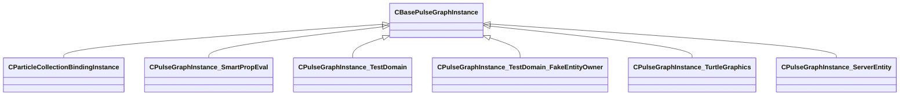

[Schemas](../../schemas.md) / [pulse_runtime_lib](../pulse_runtime_lib.md) / CBasePulseGraphInstance

# CBasePulseGraphInstance

> Source: **Build 25000182** · 2026-08-28 · `windows-x86_64` · schema `0.10.0`

**Kind:** class · **Size:** 272 bytes (`0x110`) · **Align:** n/a (unspecified) · **Module:** pulse_runtime_lib

**Derived by:** [CParticleCollectionBindingInstance](../particleslib/CParticleCollectionBindingInstance.md), [CPulseGraphInstance_ServerEntity](../server/CPulseGraphInstance_ServerEntity.md), [CPulseGraphInstance_SmartPropEval](../smartprops/CPulseGraphInstance_SmartPropEval.md), [CPulseGraphInstance_TestDomain](../pulse_system/CPulseGraphInstance_TestDomain.md), [CPulseGraphInstance_TestDomain_FakeEntityOwner](../pulse_system/CPulseGraphInstance_TestDomain_FakeEntityOwner.md), [CPulseGraphInstance_TurtleGraphics](../pulse_system/CPulseGraphInstance_TurtleGraphics.md)

**Relationships:**

## Memory layout

No schema-visible fields (272 bytes of opaque storage).
