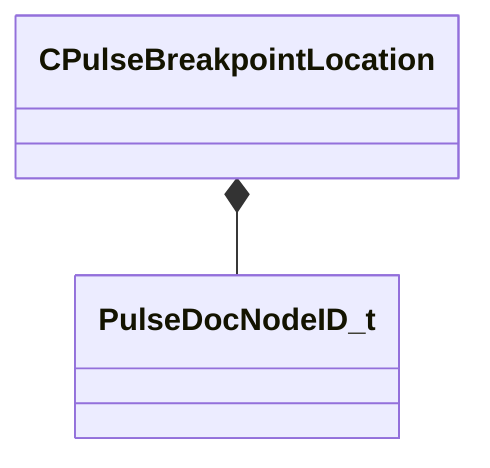

[Schemas](../../schemas.md) / [pulse_runtime_lib](../pulse_runtime_lib.md) / CPulseBreakpointLocation

# CPulseBreakpointLocation

**Kind:** class · **Size:** 40 bytes (`0x28`) · **Align:** 8 · **Module:** pulse_runtime_lib

**Relationships:**

## Memory layout

3 fields (3 declared here, 0 inherited). Offsets are absolute from the object base.

| Offset | Field | Type | From | Annotations |
|--------|-------|------|------|-------------|
| `0x0` | `m_NodeID` | [PulseDocNodeID_t](../pulse_runtime_lib/PulseDocNodeID_t.md) |  |  |
| `0x8` | `m_SequencePoint` | PulseSymbol_t |  |  |
| `0x18` | `m_PortName` | PulseSymbol_t |  |  |

KV3 class defaults

<pre>{
	&quot;m_NodeID&quot;: -1,
	&quot;m_SequencePoint&quot;: &quot;&quot;,
	&quot;m_PortName&quot;: &quot;&quot;
}</pre>

