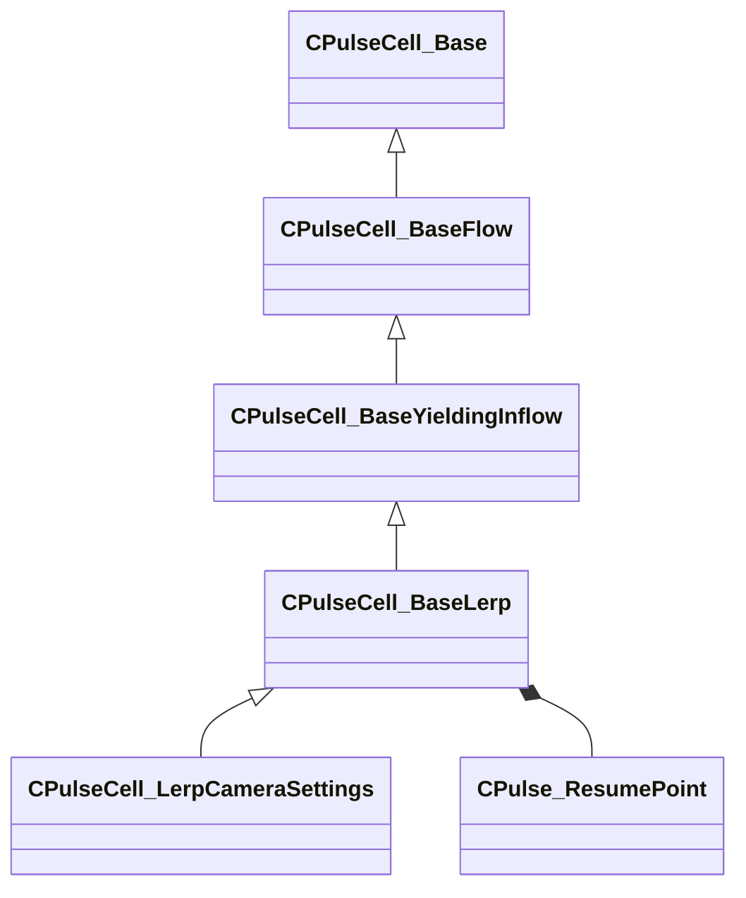

[Schemas](../../schemas.md) / [pulse_runtime_lib](../pulse_runtime_lib.md) / CPulseCell_BaseLerp

# CPulseCell_BaseLerp

**Kind:** class · **Size:** 288 bytes (`0x120`) · **Align:** 255 · **Module:** pulse_runtime_lib

**Inherits from:** [CPulseCell_BaseYieldingInflow](../pulse_runtime_lib/CPulseCell_BaseYieldingInflow.md)

**Derived by:** [CPulseCell_LerpCameraSettings](../client/CPulseCell_LerpCameraSettings.md)

**Relationships:**

## Memory layout

4 fields (1 declared here, 3 inherited). Offsets are absolute from the object base.

| Offset | Field | Type | From | Annotations |
|--------|-------|------|------|-------------|
| `0x8` | `m_nEditorNodeID` | [PulseDocNodeID_t](../pulse_runtime_lib/PulseDocNodeID_t.md) | [CPulseCell_Base](../pulse_runtime_lib/CPulseCell_Base.md) | `MFgdFromSchemaCompletelySkipField` |
| `0x48` | `m_BaseFlow_OnAfterCancel` | [CPulse_ResumePoint](../pulse_runtime_lib/CPulse_ResumePoint.md) | [CPulseCell_BaseYieldingInflow](../pulse_runtime_lib/CPulseCell_BaseYieldingInflow.md) | `MPulseFGDSkipField` |
| `0x90` | `m_BaseFlow_WhileActive` | [CPulse_ResumePoint](../pulse_runtime_lib/CPulse_ResumePoint.md) | [CPulseCell_BaseYieldingInflow](../pulse_runtime_lib/CPulseCell_BaseYieldingInflow.md) | `MPulseFGDSkipField` |
| `0xd8` | `m_WakeResume` | [CPulse_ResumePoint](../pulse_runtime_lib/CPulse_ResumePoint.md) |  |  |
