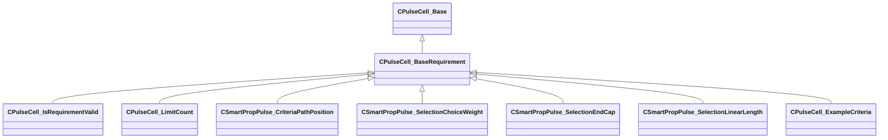

[Schemas](../../schemas.md) / [pulse_runtime_lib](../pulse_runtime_lib.md) / CPulseCell_BaseRequirement

# CPulseCell_BaseRequirement

> Source: **Build 25000182** · 2026-08-28 · `windows-x86_64` · schema `0.10.0`

**Kind:** class · **Size:** 72 bytes (`0x48`) · **Align:** 8 · **Module:** pulse_runtime_lib

**Inherits from:** [CPulseCell_Base](../pulse_runtime_lib/CPulseCell_Base.md)

**Derived by:** [CPulseCell_ExampleCriteria](../pulse_system/CPulseCell_ExampleCriteria.md), [CPulseCell_IsRequirementValid](../pulse_runtime_lib/CPulseCell_IsRequirementValid.md), [CPulseCell_LimitCount](../pulse_runtime_lib/CPulseCell_LimitCount.md), [CSmartPropPulse_CriteriaPathPosition](../smartprops/CSmartPropPulse_CriteriaPathPosition.md), [CSmartPropPulse_SelectionChoiceWeight](../smartprops/CSmartPropPulse_SelectionChoiceWeight.md), [CSmartPropPulse_SelectionEndCap](../smartprops/CSmartPropPulse_SelectionEndCap.md), [CSmartPropPulse_SelectionLinearLength](../smartprops/CSmartPropPulse_SelectionLinearLength.md)

**Relationships:**

## Memory layout

1 field (0 declared here, 1 inherited). Offsets are absolute from the object base.

| Offset | Field | Type | From | Annotations |
|--------|-------|------|------|-------------|
| `0x8` | `m_nEditorNodeID` | [PulseDocNodeID_t](../pulse_runtime_lib/PulseDocNodeID_t.md) | [CPulseCell_Base](../pulse_runtime_lib/CPulseCell_Base.md) | `MFgdFromSchemaCompletelySkipField` |

KV3 class defaults

<pre>{
	&quot;_class&quot;: &quot;CPulseCell_BaseRequirement&quot;,
	&quot;m_nEditorNodeID&quot;: -1
}</pre>

