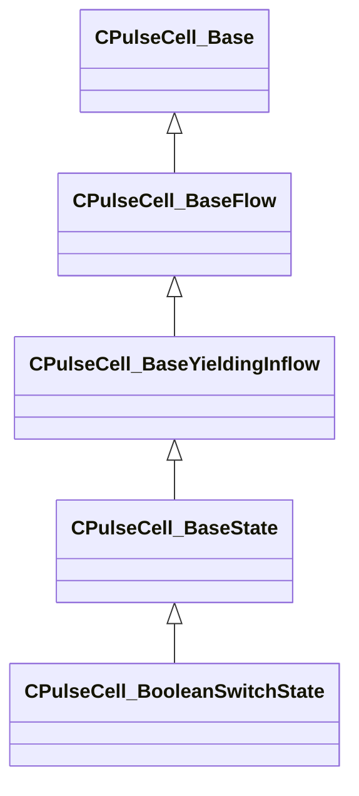

[Schemas](../../schemas.md) / [pulse_runtime_lib](../pulse_runtime_lib.md) / CPulseCell_BaseState

# CPulseCell_BaseState

> Source: **Build 25000182** · 2026-08-28 · `windows-x86_64` · schema `0.10.0`

**Kind:** class · **Size:** 216 bytes (`0xd8`) · **Align:** n/a (unspecified) · **Module:** pulse_runtime_lib

**Inherits from:** [CPulseCell_BaseYieldingInflow](../pulse_runtime_lib/CPulseCell_BaseYieldingInflow.md)

**Derived by:** [CPulseCell_BooleanSwitchState](../pulse_runtime_lib/CPulseCell_BooleanSwitchState.md)

**Metadata:** `MPulseEditorHeaderIcon tools/images/pulse_editor/inflow_statecell.png`

**Relationships:**

## Memory layout

3 fields (0 declared here, 3 inherited). Offsets are absolute from the object base.

| Offset | Field | Type | From | Annotations |
|--------|-------|------|------|-------------|
| `0x8` | `m_nEditorNodeID` | [PulseDocNodeID_t](../pulse_runtime_lib/PulseDocNodeID_t.md) | [CPulseCell_Base](../pulse_runtime_lib/CPulseCell_Base.md) | `MFgdFromSchemaCompletelySkipField` |
| `0x48` | `m_BaseFlow_OnAfterCancel` | [CPulse_ResumePoint](../pulse_runtime_lib/CPulse_ResumePoint.md) | [CPulseCell_BaseYieldingInflow](../pulse_runtime_lib/CPulseCell_BaseYieldingInflow.md) | `MPulseFGDSkipField` |
| `0x90` | `m_BaseFlow_WhileActive` | [CPulse_ResumePoint](../pulse_runtime_lib/CPulse_ResumePoint.md) | [CPulseCell_BaseYieldingInflow](../pulse_runtime_lib/CPulseCell_BaseYieldingInflow.md) | `MPulseFGDSkipField` |
