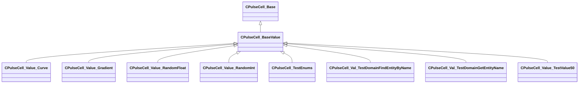

[Schemas](../../schemas.md) / [pulse_runtime_lib](../pulse_runtime_lib.md) / CPulseCell_BaseValue

# CPulseCell_BaseValue

> Source: **Build 25000182** · 2026-08-28 · `windows-x86_64` · schema `0.10.0`

**Kind:** class · **Size:** 72 bytes (`0x48`) · **Align:** 8 · **Module:** pulse_runtime_lib

**Inherits from:** [CPulseCell_Base](../pulse_runtime_lib/CPulseCell_Base.md)

**Derived by:** [CPulseCell_TestEnums](../pulse_system/CPulseCell_TestEnums.md), [CPulseCell_Val_TestDomainFindEntityByName](../pulse_system/CPulseCell_Val_TestDomainFindEntityByName.md), [CPulseCell_Val_TestDomainGetEntityName](../pulse_system/CPulseCell_Val_TestDomainGetEntityName.md), [CPulseCell_Value_Curve](../pulse_runtime_lib/CPulseCell_Value_Curve.md), [CPulseCell_Value_Gradient](../pulse_runtime_lib/CPulseCell_Value_Gradient.md), [CPulseCell_Value_RandomFloat](../pulse_runtime_lib/CPulseCell_Value_RandomFloat.md), [CPulseCell_Value_RandomInt](../pulse_runtime_lib/CPulseCell_Value_RandomInt.md), [CPulseCell_Value_TestValue50](../pulse_system/CPulseCell_Value_TestValue50.md)

**Relationships:**

## Memory layout

1 field (0 declared here, 1 inherited). Offsets are absolute from the object base.

| Offset | Field | Type | From | Annotations |
|--------|-------|------|------|-------------|
| `0x8` | `m_nEditorNodeID` | [PulseDocNodeID_t](../pulse_runtime_lib/PulseDocNodeID_t.md) | [CPulseCell_Base](../pulse_runtime_lib/CPulseCell_Base.md) | `MFgdFromSchemaCompletelySkipField` |

KV3 class defaults

<pre>{
	&quot;_class&quot;: &quot;CPulseCell_BaseValue&quot;,
	&quot;m_nEditorNodeID&quot;: -1
}</pre>

