[Schemas](../../schemas.md) / [pulse_runtime_lib](../pulse_runtime_lib.md) / CPulseCell_BaseYieldingInflow

# CPulseCell_BaseYieldingInflow

> Source: **Build 25000182** · 2026-08-28 · `windows-x86_64` · schema `0.10.0`

**Kind:** class · **Size:** 216 bytes (`0xd8`) · **Align:** n/a (unspecified) · **Module:** pulse_runtime_lib

**Inherits from:** [CPulseCell_BaseFlow](../pulse_runtime_lib/CPulseCell_BaseFlow.md)

**Derived by:** [CPulseCell_BaseLerp](../pulse_runtime_lib/CPulseCell_BaseLerp.md), [CPulseCell_BaseState](../pulse_runtime_lib/CPulseCell_BaseState.md), [CPulseCell_FireCursors](../pulse_runtime_lib/CPulseCell_FireCursors.md), [CPulseCell_Inflow_Wait](../pulse_runtime_lib/CPulseCell_Inflow_Wait.md), [CPulseCell_Inflow_Yield](../pulse_runtime_lib/CPulseCell_Inflow_Yield.md), [CPulseCell_IntervalTimer](../pulse_runtime_lib/CPulseCell_IntervalTimer.md), [CPulseCell_Outflow_ListenForAnimgraphTag](../server/CPulseCell_Outflow_ListenForAnimgraphTag.md), [CPulseCell_Outflow_ListenForEntityOutput](../server/CPulseCell_Outflow_ListenForEntityOutput.md), [CPulseCell_Outflow_PlaySceneBase](../server/CPulseCell_Outflow_PlaySceneBase.md), [CPulseCell_Outflow_PlayVOLine](../server/CPulseCell_Outflow_PlayVOLine.md), [CPulseCell_Outflow_ScriptedSequence](../server/CPulseCell_Outflow_ScriptedSequence.md), [CPulseCell_PlaySequence](../client/CPulseCell_PlaySequence.md), [CPulseCell_PlaySequence](../client/CPulseCell_PlaySequence.md), [CPulseCell_Step_CallExternalMethod](../pulse_runtime_lib/CPulseCell_Step_CallExternalMethod.md), [CPulseCell_TestWaitWithAutoTracepoints](../pulse_system/CPulseCell_TestWaitWithAutoTracepoints.md), [CPulseCell_TestWaitWithCursorState](../pulse_system/CPulseCell_TestWaitWithCursorState.md), [CPulseCell_TestYieldForever](../pulse_system/CPulseCell_TestYieldForever.md), [CPulseCell_TestYieldWithObservables](../pulse_system/CPulseCell_TestYieldWithObservables.md), [CPulseCell_Test_MultiOutflow_WithParams_Yielding](../pulse_system/CPulseCell_Test_MultiOutflow_WithParams_Yielding.md), [CPulseCell_Timeline](../pulse_runtime_lib/CPulseCell_Timeline.md), [CPulseCell_WaitForCursorsWithTagBase](../pulse_runtime_lib/CPulseCell_WaitForCursorsWithTagBase.md), [CPulseCell_WaitForObservable](../pulse_runtime_lib/CPulseCell_WaitForObservable.md)

**Metadata:** `MCustomFGDMetadata { standard_yielding_flow = true }`

**Relationships:**

```mermaid
classDiagram
    CPulseCell_BaseFlow <|-- CPulseCell_BaseYieldingInflow
    CPulseCell_Base <|-- CPulseCell_BaseFlow
    CPulseCell_BaseYieldingInflow <|-- CPulseCell_BaseLerp
    CPulseCell_BaseYieldingInflow <|-- CPulseCell_BaseState
    CPulseCell_BaseYieldingInflow <|-- CPulseCell_FireCursors
    CPulseCell_BaseYieldingInflow <|-- CPulseCell_Inflow_Wait
    CPulseCell_BaseYieldingInflow <|-- CPulseCell_Inflow_Yield
    CPulseCell_BaseYieldingInflow <|-- CPulseCell_IntervalTimer
    CPulseCell_BaseYieldingInflow <|-- CPulseCell_Step_CallExternalMethod
    CPulseCell_BaseYieldingInflow <|-- CPulseCell_Timeline
    CPulseCell_BaseYieldingInflow <|-- CPulseCell_WaitForCursorsWithTagBase
    CPulseCell_BaseYieldingInflow <|-- CPulseCell_WaitForObservable
    CPulseCell_BaseYieldingInflow <|-- CPulseCell_PlaySequence
    CPulseCell_BaseYieldingInflow <|-- CPulseCell_TestWaitWithAutoTracepoints
    CPulseCell_BaseYieldingInflow <|-- CPulseCell_TestWaitWithCursorState
    CPulseCell_BaseYieldingInflow <|-- CPulseCell_TestYieldForever
    CPulseCell_BaseYieldingInflow <|-- CPulseCell_TestYieldWithObservables
    CPulseCell_BaseYieldingInflow <|-- CPulseCell_Test_MultiOutflow_WithParams_Yielding
    CPulseCell_BaseYieldingInflow <|-- CPulseCell_Outflow_ListenForAnimgraphTag
    CPulseCell_BaseYieldingInflow <|-- CPulseCell_Outflow_ListenForEntityOutput
    CPulseCell_BaseYieldingInflow <|-- CPulseCell_Outflow_PlaySceneBase
    CPulseCell_BaseYieldingInflow <|-- CPulseCell_Outflow_PlayVOLine
    CPulseCell_BaseYieldingInflow <|-- CPulseCell_Outflow_ScriptedSequence
    CPulseCell_BaseYieldingInflow *-- CPulse_ResumePoint
```

## Memory layout

3 fields (2 declared here, 1 inherited). Offsets are absolute from the object base.

| Offset | Field | Type | From | Annotations |
|--------|-------|------|------|-------------|
| `0x8` | `m_nEditorNodeID` | [PulseDocNodeID_t](../pulse_runtime_lib/PulseDocNodeID_t.md) | [CPulseCell_Base](../pulse_runtime_lib/CPulseCell_Base.md) | `MFgdFromSchemaCompletelySkipField` |
| `0x48` | `m_BaseFlow_OnAfterCancel` | [CPulse_ResumePoint](../pulse_runtime_lib/CPulse_ResumePoint.md) |  | `MPulseFGDSkipField` |
| `0x90` | `m_BaseFlow_WhileActive` | [CPulse_ResumePoint](../pulse_runtime_lib/CPulse_ResumePoint.md) |  | `MPulseFGDSkipField` |
