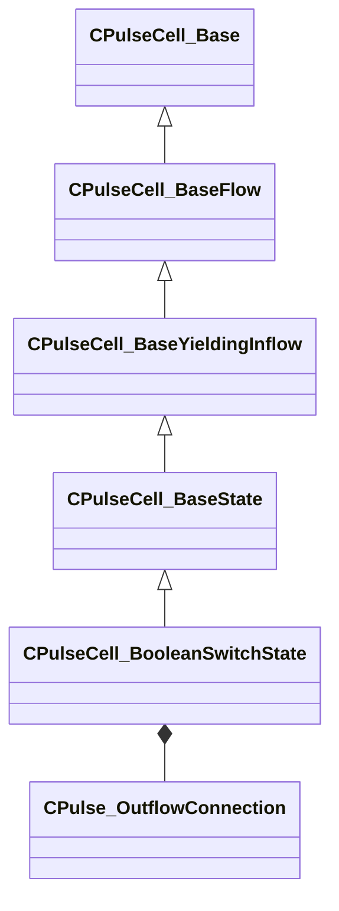

[Schemas](../../schemas.md) / [pulse_runtime_lib](../pulse_runtime_lib.md) / CPulseCell_BooleanSwitchState

# CPulseCell_BooleanSwitchState

> Source: **Build 25000182** · 2026-08-28 · `windows-x86_64` · schema `0.10.0`

**Kind:** class · **Size:** 480 bytes (`0x1e0`) · **Align:** 8 · **Module:** pulse_runtime_lib

**Inherits from:** [CPulseCell_BaseState](../pulse_runtime_lib/CPulseCell_BaseState.md)

**Metadata:** `MPropertyDescription While active, manage child cursors based on the results of a boolean condition. When the observable result changes, the prior cursor will be canceled and the appropriate outflow will fire a new child cursor. Will monitor continuously until externally canceled.`, `MPropertyFriendlyName Monitor Observable`, `MPulseEditorCanvasItemSpecKV3 { className = 'IsStateNode' item_factory = 'BooleanSwitchState' }`

**Relationships:**

## Memory layout

6 fields (3 declared here, 3 inherited). Offsets are absolute from the object base.

| Offset | Field | Type | From | Annotations |
|--------|-------|------|------|-------------|
| `0x8` | `m_nEditorNodeID` | [PulseDocNodeID_t](../pulse_runtime_lib/PulseDocNodeID_t.md) | [CPulseCell_Base](../pulse_runtime_lib/CPulseCell_Base.md) | `MFgdFromSchemaCompletelySkipField` |
| `0x48` | `m_BaseFlow_OnAfterCancel` | [CPulse_ResumePoint](../pulse_runtime_lib/CPulse_ResumePoint.md) | [CPulseCell_BaseYieldingInflow](../pulse_runtime_lib/CPulseCell_BaseYieldingInflow.md) | `MPulseFGDSkipField` |
| `0x90` | `m_BaseFlow_WhileActive` | [CPulse_ResumePoint](../pulse_runtime_lib/CPulse_ResumePoint.md) | [CPulseCell_BaseYieldingInflow](../pulse_runtime_lib/CPulseCell_BaseYieldingInflow.md) | `MPulseFGDSkipField` |
| `0xd8` | `m_Condition` | CPulseObservableExpression< bool > |  | `MPropertyDescription Condition to evaluate when any of its dependent values change.` `MPropertyFriendlyName Observable` |
| `0x150` | `m_WhenTrue` | [CPulse_OutflowConnection](../pulse_runtime_lib/CPulse_OutflowConnection.md) |  | `MPropertyDescription Fired when the observable boolean is true, and killed when false.` `MPropertyFriendlyName While True` |
| `0x198` | `m_WhenFalse` | [CPulse_OutflowConnection](../pulse_runtime_lib/CPulse_OutflowConnection.md) |  | `MPropertyDescription Fired when the observable boolean is false, and killed when true.` `MPropertyFriendlyName While False` |

KV3 class defaults

<pre>{
	&quot;_class&quot;: &quot;CPulseCell_BooleanSwitchState&quot;,
	&quot;m_nEditorNodeID&quot;: -1,
	&quot;m_BaseFlow_OnAfterCancel&quot;:
	{
		&quot;m_SourceOutflowName&quot;: &quot;&quot;,
		&quot;m_nDestChunk&quot;: -1,
		&quot;m_nInstruction&quot;: -1
	},
	&quot;m_BaseFlow_WhileActive&quot;:
	{
		&quot;m_SourceOutflowName&quot;: &quot;&quot;,
		&quot;m_nDestChunk&quot;: -1,
		&quot;m_nInstruction&quot;: -1
	},
	&quot;m_Condition&quot;:
	{
		&quot;m_EvaluateConnection&quot;:
		{
			&quot;m_SourceOutflowName&quot;: &quot;&quot;,
			&quot;m_nDestChunk&quot;: -1,
			&quot;m_nInstruction&quot;: -1
		},
		&quot;m_DependentObservableVars&quot;:
		[
		],
		&quot;m_DependentObservableBlackboardReferences&quot;:
		[
		]
	},
	&quot;m_WhenTrue&quot;:
	{
		&quot;m_SourceOutflowName&quot;: &quot;&quot;,
		&quot;m_nDestChunk&quot;: -1,
		&quot;m_nInstruction&quot;: -1
	},
	&quot;m_WhenFalse&quot;:
	{
		&quot;m_SourceOutflowName&quot;: &quot;&quot;,
		&quot;m_nDestChunk&quot;: -1,
		&quot;m_nInstruction&quot;: -1
	}
}</pre>

