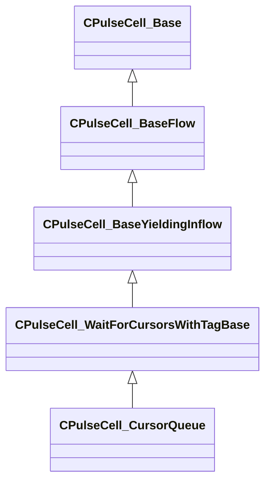

[Schemas](../../schemas.md) / [pulse_runtime_lib](../pulse_runtime_lib.md) / CPulseCell_CursorQueue

# CPulseCell_CursorQueue

> Source: **Build 25000182** · 2026-08-28 · `windows-x86_64` · schema `0.10.0`

**Kind:** class · **Size:** 304 bytes (`0x130`) · **Align:** 8 · **Module:** pulse_runtime_lib

**Inherits from:** [CPulseCell_WaitForCursorsWithTagBase](../pulse_runtime_lib/CPulseCell_WaitForCursorsWithTagBase.md)

**Metadata:** `MPropertyDescription Causes each execution cursor to wait for the completion of all prior cursors that have visited this node. Use this to safely support multiple triggers to areas of the graph that take time to complete.`, `MPropertyFriendlyName Cursor Queue`, `MPulseEditorHeaderIcon tools/images/pulse_editor/cursor_wait_zone.png`

**Relationships:**

## Memory layout

6 fields (1 declared here, 5 inherited). Offsets are absolute from the object base.

| Offset | Field | Type | From | Annotations |
|--------|-------|------|------|-------------|
| `0x8` | `m_nEditorNodeID` | [PulseDocNodeID_t](../pulse_runtime_lib/PulseDocNodeID_t.md) | [CPulseCell_Base](../pulse_runtime_lib/CPulseCell_Base.md) | `MFgdFromSchemaCompletelySkipField` |
| `0x48` | `m_BaseFlow_OnAfterCancel` | [CPulse_ResumePoint](../pulse_runtime_lib/CPulse_ResumePoint.md) | [CPulseCell_BaseYieldingInflow](../pulse_runtime_lib/CPulseCell_BaseYieldingInflow.md) | `MPulseFGDSkipField` |
| `0x90` | `m_BaseFlow_WhileActive` | [CPulse_ResumePoint](../pulse_runtime_lib/CPulse_ResumePoint.md) | [CPulseCell_BaseYieldingInflow](../pulse_runtime_lib/CPulseCell_BaseYieldingInflow.md) | `MPulseFGDSkipField` |
| `0xd8` | `m_nCursorsAllowedToWait` | int32 | [CPulseCell_WaitForCursorsWithTagBase](../pulse_runtime_lib/CPulseCell_WaitForCursorsWithTagBase.md) | `MPropertyDescription Any extra waiting cursors will be terminated. -1 for infinite cursors.` |
| `0xe0` | `m_WaitComplete` | [CPulse_ResumePoint](../pulse_runtime_lib/CPulse_ResumePoint.md) | [CPulseCell_WaitForCursorsWithTagBase](../pulse_runtime_lib/CPulseCell_WaitForCursorsWithTagBase.md) |  |
| `0x128` | `m_nCursorsAllowedToRunParallel` | int32 |  | `MPropertyDescription Any cursors above this count will wait, up to the limit.` |

KV3 class defaults

<pre>{
	&quot;_class&quot;: &quot;CPulseCell_CursorQueue&quot;,
	&quot;m_nEditorNodeID&quot;: -1,
	&quot;m_BaseFlow_OnAfterCancel&quot;:
	{
		&quot;m_SourceOutflowName&quot;: &quot;&quot;,
		&quot;m_nDestChunk&quot;: -1,
		&quot;m_nInstruction&quot;: -1
	},
	&quot;m_BaseFlow_WhileActive&quot;:
	{
		&quot;m_SourceOutflowName&quot;: &quot;&quot;,
		&quot;m_nDestChunk&quot;: -1,
		&quot;m_nInstruction&quot;: -1
	},
	&quot;m_nCursorsAllowedToWait&quot;: -1,
	&quot;m_WaitComplete&quot;:
	{
		&quot;m_SourceOutflowName&quot;: &quot;&quot;,
		&quot;m_nDestChunk&quot;: -1,
		&quot;m_nInstruction&quot;: -1
	},
	&quot;m_nCursorsAllowedToRunParallel&quot;: 1
}</pre>

