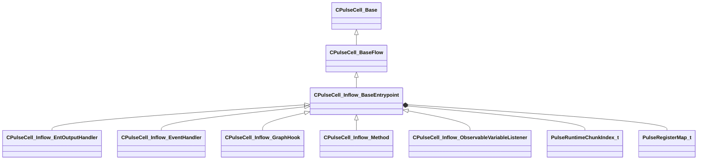

[Schemas](../../schemas.md) / [pulse_runtime_lib](../pulse_runtime_lib.md) / CPulseCell_Inflow_BaseEntrypoint

# CPulseCell_Inflow_BaseEntrypoint

> Source: **Build 25000182** · 2026-08-28 · `windows-x86_64` · schema `0.10.0`

**Kind:** class · **Size:** 128 bytes (`0x80`) · **Align:** 8 · **Module:** pulse_runtime_lib

**Inherits from:** [CPulseCell_BaseFlow](../pulse_runtime_lib/CPulseCell_BaseFlow.md)

**Derived by:** [CPulseCell_Inflow_EntOutputHandler](../pulse_runtime_lib/CPulseCell_Inflow_EntOutputHandler.md), [CPulseCell_Inflow_EventHandler](../pulse_runtime_lib/CPulseCell_Inflow_EventHandler.md), [CPulseCell_Inflow_GraphHook](../pulse_runtime_lib/CPulseCell_Inflow_GraphHook.md), [CPulseCell_Inflow_Method](../pulse_runtime_lib/CPulseCell_Inflow_Method.md), [CPulseCell_Inflow_ObservableVariableListener](../pulse_runtime_lib/CPulseCell_Inflow_ObservableVariableListener.md)

**Relationships:**

## Memory layout

3 fields (2 declared here, 1 inherited). Offsets are absolute from the object base.

| Offset | Field | Type | From | Annotations |
|--------|-------|------|------|-------------|
| `0x8` | `m_nEditorNodeID` | [PulseDocNodeID_t](../pulse_runtime_lib/PulseDocNodeID_t.md) | [CPulseCell_Base](../pulse_runtime_lib/CPulseCell_Base.md) | `MFgdFromSchemaCompletelySkipField` |
| `0x48` | `m_EntryChunk` | [PulseRuntimeChunkIndex_t](../pulse_runtime_lib/PulseRuntimeChunkIndex_t.md) |  |  |
| `0x50` | `m_RegisterMap` | [PulseRegisterMap_t](../pulse_runtime_lib/PulseRegisterMap_t.md) |  |  |

KV3 class defaults

<pre>{
	&quot;_class&quot;: &quot;CPulseCell_Inflow_BaseEntrypoint&quot;,
	&quot;m_nEditorNodeID&quot;: -1,
	&quot;m_EntryChunk&quot;: -1,
	&quot;m_RegisterMap&quot;:
	{
		&quot;m_Inparams&quot;: null,
		&quot;m_Outparams&quot;: null
	}
}</pre>

