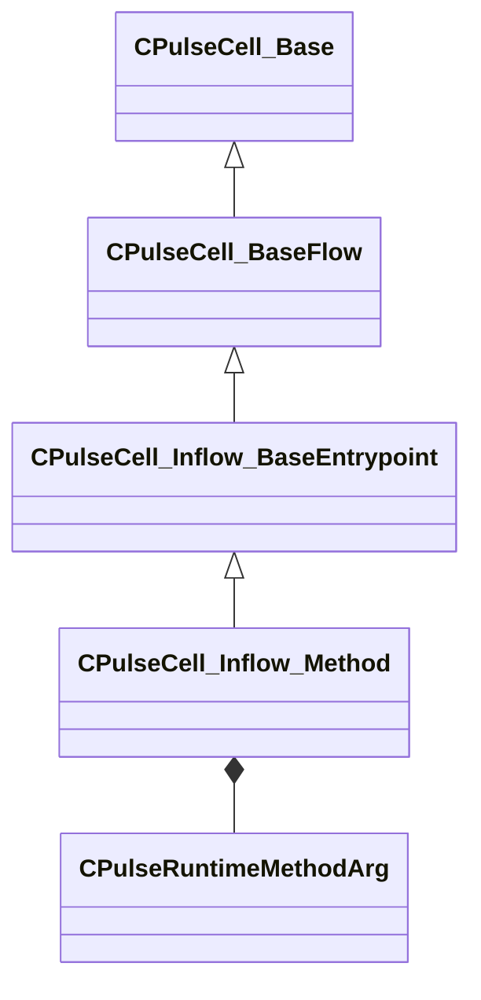

[Schemas](../../schemas.md) / [pulse_runtime_lib](../pulse_runtime_lib.md) / CPulseCell_Inflow_Method

# CPulseCell_Inflow_Method

**Kind:** class · **Size:** 200 bytes (`0xc8`) · **Align:** 8 · **Module:** pulse_runtime_lib

**Inherits from:** [CPulseCell_Inflow_BaseEntrypoint](../pulse_runtime_lib/CPulseCell_Inflow_BaseEntrypoint.md)

**Relationships:**

## Memory layout

8 fields (5 declared here, 3 inherited). Offsets are absolute from the object base.

| Offset | Field | Type | From | Annotations |
|--------|-------|------|------|-------------|
| `0x8` | `m_nEditorNodeID` | [PulseDocNodeID_t](../pulse_runtime_lib/PulseDocNodeID_t.md) | [CPulseCell_Base](../pulse_runtime_lib/CPulseCell_Base.md) | `MFgdFromSchemaCompletelySkipField` |
| `0x48` | `m_EntryChunk` | [PulseRuntimeChunkIndex_t](../pulse_runtime_lib/PulseRuntimeChunkIndex_t.md) | [CPulseCell_Inflow_BaseEntrypoint](../pulse_runtime_lib/CPulseCell_Inflow_BaseEntrypoint.md) |  |
| `0x50` | `m_RegisterMap` | [PulseRegisterMap_t](../pulse_runtime_lib/PulseRegisterMap_t.md) | [CPulseCell_Inflow_BaseEntrypoint](../pulse_runtime_lib/CPulseCell_Inflow_BaseEntrypoint.md) |  |
| `0x80` | `m_MethodName` | PulseSymbol_t |  |  |
| `0x90` | `m_Description` | CUtlString |  |  |
| `0x98` | `m_bIsPublic` | bool |  |  |
| `0xa0` | `m_ReturnType` | CPulseValueFullType |  |  |
| `0xb8` | `m_Args` | CUtlLeanVector< [CPulseRuntimeMethodArg](../pulse_runtime_lib/CPulseRuntimeMethodArg.md) > |  |  |

KV3 class defaults

<pre>{
	&quot;_class&quot;: &quot;CPulseCell_Inflow_Method&quot;,
	&quot;m_nEditorNodeID&quot;: -1,
	&quot;m_EntryChunk&quot;: -1,
	&quot;m_RegisterMap&quot;:
	{
		&quot;m_Inparams&quot;: null,
		&quot;m_Outparams&quot;: null
	},
	&quot;m_MethodName&quot;: &quot;&quot;,
	&quot;m_Description&quot;: &quot;&quot;,
	&quot;m_bIsPublic&quot;: false,
	&quot;m_ReturnType&quot;: &quot;PVAL_VOID&quot;,
	&quot;m_Args&quot;:
	[
	]
}</pre>

