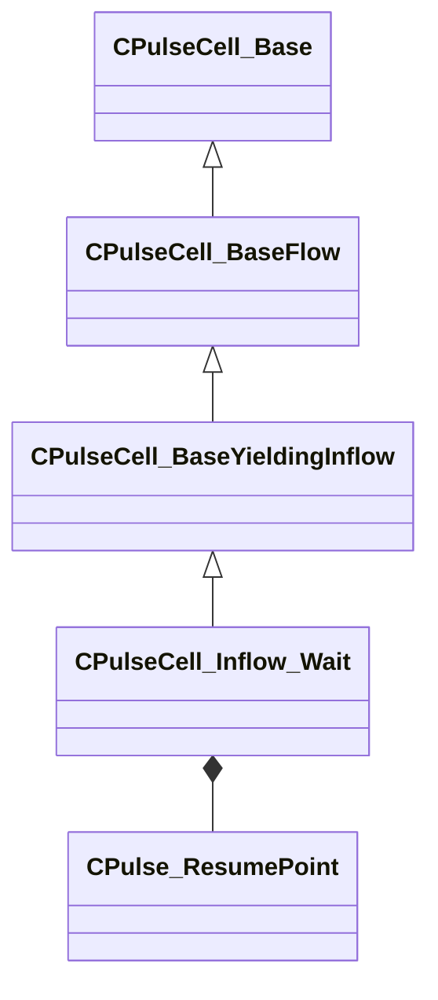

[Schemas](../../schemas.md) / [pulse_runtime_lib](../pulse_runtime_lib.md) / CPulseCell_Inflow_Wait

# CPulseCell_Inflow_Wait

> Source: **Build 25000182** · 2026-08-28 · `windows-x86_64` · schema `0.10.0`

**Kind:** class · **Size:** 288 bytes (`0x120`) · **Align:** 8 · **Module:** pulse_runtime_lib

**Inherits from:** [CPulseCell_BaseYieldingInflow](../pulse_runtime_lib/CPulseCell_BaseYieldingInflow.md)

**Metadata:** `MPropertyDescription Causes each execution cursor to pause at this node for a fixed period of time. Each cursor will wake up and resume execution when the time expires, unless aborted or early-woken.`, `MPropertyFriendlyName Wait`, `MPulseEditorCanvasItemSpecKV3 { className = 'IsWaitNode IsControlFlowNode' item_factory = 'InflowWait' }`, `MPulseEditorHeaderIcon tools/images/pulse_editor/inflow_wait.png`

**Relationships:**

## Memory layout

4 fields (1 declared here, 3 inherited). Offsets are absolute from the object base.

| Offset | Field | Type | From | Annotations |
|--------|-------|------|------|-------------|
| `0x8` | `m_nEditorNodeID` | [PulseDocNodeID_t](../pulse_runtime_lib/PulseDocNodeID_t.md) | [CPulseCell_Base](../pulse_runtime_lib/CPulseCell_Base.md) | `MFgdFromSchemaCompletelySkipField` |
| `0x48` | `m_BaseFlow_OnAfterCancel` | [CPulse_ResumePoint](../pulse_runtime_lib/CPulse_ResumePoint.md) | [CPulseCell_BaseYieldingInflow](../pulse_runtime_lib/CPulseCell_BaseYieldingInflow.md) | `MPulseFGDSkipField` |
| `0x90` | `m_BaseFlow_WhileActive` | [CPulse_ResumePoint](../pulse_runtime_lib/CPulse_ResumePoint.md) | [CPulseCell_BaseYieldingInflow](../pulse_runtime_lib/CPulseCell_BaseYieldingInflow.md) | `MPulseFGDSkipField` |
| `0xd8` | `m_WakeResume` | [CPulse_ResumePoint](../pulse_runtime_lib/CPulse_ResumePoint.md) |  |  |

KV3 class defaults

<pre>{
	&quot;_class&quot;: &quot;CPulseCell_Inflow_Wait&quot;,
	&quot;m_nEditorNodeID&quot;: -1,
	&quot;m_BaseFlow_OnAfterCancel&quot;:
	{
		&quot;m_SourceOutflowName&quot;: &quot;&quot;,
		&quot;m_nDestChunk&quot;: -1,
		&quot;m_nInstruction&quot;: -1
	},
	&quot;m_BaseFlow_WhileActive&quot;:
	{
		&quot;m_SourceOutflowName&quot;: &quot;&quot;,
		&quot;m_nDestChunk&quot;: -1,
		&quot;m_nInstruction&quot;: -1
	},
	&quot;m_WakeResume&quot;:
	{
		&quot;m_SourceOutflowName&quot;: &quot;&quot;,
		&quot;m_nDestChunk&quot;: -1,
		&quot;m_nInstruction&quot;: -1
	}
}</pre>

