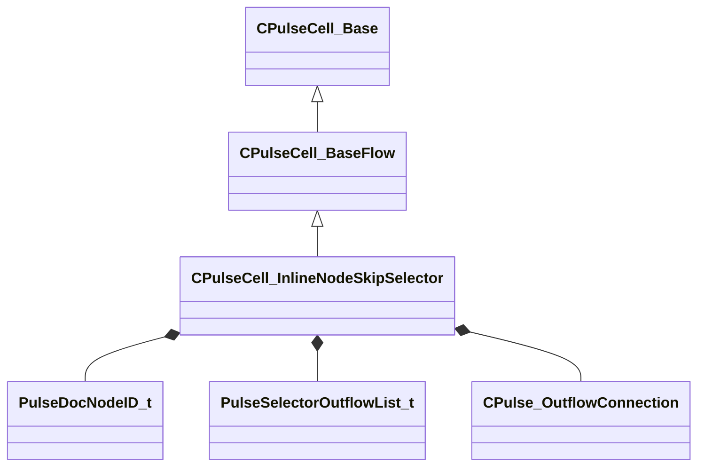

[Schemas](../../schemas.md) / [pulse_runtime_lib](../pulse_runtime_lib.md) / CPulseCell_InlineNodeSkipSelector

# CPulseCell_InlineNodeSkipSelector

> Source: **Build 25000182** · 2026-08-28 · `windows-x86_64` · schema `0.10.0`

**Kind:** class · **Size:** 176 bytes (`0xb0`) · **Align:** 8 · **Module:** pulse_runtime_lib

**Inherits from:** [CPulseCell_BaseFlow](../pulse_runtime_lib/CPulseCell_BaseFlow.md)

**Metadata:** `MPulseFunctionHiddenInTool`

**Relationships:**

## Memory layout

5 fields (4 declared here, 1 inherited). Offsets are absolute from the object base.

| Offset | Field | Type | From | Annotations |
|--------|-------|------|------|-------------|
| `0x8` | `m_nEditorNodeID` | [PulseDocNodeID_t](../pulse_runtime_lib/PulseDocNodeID_t.md) | [CPulseCell_Base](../pulse_runtime_lib/CPulseCell_Base.md) | `MFgdFromSchemaCompletelySkipField` |
| `0x48` | `m_nFlowNodeID` | [PulseDocNodeID_t](../pulse_runtime_lib/PulseDocNodeID_t.md) |  |  |
| `0x4c` | `m_bAnd` | bool |  |  |
| `0x50` | `m_PassOutflow` | [PulseSelectorOutflowList_t](../pulse_runtime_lib/PulseSelectorOutflowList_t.md) |  |  |
| `0x68` | `m_FailOutflow` | [CPulse_OutflowConnection](../pulse_runtime_lib/CPulse_OutflowConnection.md) |  |  |

KV3 class defaults

<pre>{
	&quot;_class&quot;: &quot;CPulseCell_InlineNodeSkipSelector&quot;,
	&quot;m_nEditorNodeID&quot;: -1,
	&quot;m_nFlowNodeID&quot;: -1,
	&quot;m_bAnd&quot;: false,
	&quot;m_PassOutflow&quot;:
	{
		&quot;m_Outflows&quot;:
		[
		]
	},
	&quot;m_FailOutflow&quot;:
	{
		&quot;m_SourceOutflowName&quot;: &quot;&quot;,
		&quot;m_nDestChunk&quot;: -1,
		&quot;m_nInstruction&quot;: -1
	}
}</pre>

