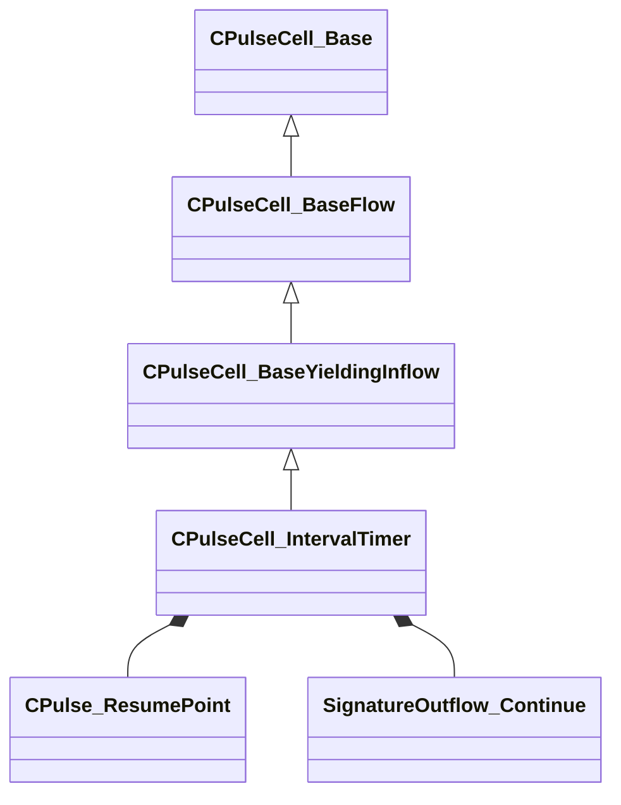

[Schemas](../../schemas.md) / [pulse_runtime_lib](../pulse_runtime_lib.md) / CPulseCell_IntervalTimer

# CPulseCell_IntervalTimer

**Kind:** class · **Size:** 360 bytes (`0x168`) · **Align:** 8 · **Module:** pulse_runtime_lib

**Inherits from:** [CPulseCell_BaseYieldingInflow](../pulse_runtime_lib/CPulseCell_BaseYieldingInflow.md)

**Metadata:** `MPropertyDescription Wait for a duration, firing a child cursor at regular (or randomized) intervals`, `MPropertyFriendlyName Interval Timer`, `MPulseEditorCanvasItemSpecKV3 { item_factory = 'IntervalTimer' }`, `MPulseEditorHeaderIcon tools/images/pulse_editor/node_timer.png`

**Relationships:**

## Memory layout

5 fields (2 declared here, 3 inherited). Offsets are absolute from the object base.

| Offset | Field | Type | From | Annotations |
|--------|-------|------|------|-------------|
| `0x8` | `m_nEditorNodeID` | [PulseDocNodeID_t](../pulse_runtime_lib/PulseDocNodeID_t.md) | [CPulseCell_Base](../pulse_runtime_lib/CPulseCell_Base.md) | `MFgdFromSchemaCompletelySkipField` |
| `0x48` | `m_BaseFlow_OnAfterCancel` | [CPulse_ResumePoint](../pulse_runtime_lib/CPulse_ResumePoint.md) | [CPulseCell_BaseYieldingInflow](../pulse_runtime_lib/CPulseCell_BaseYieldingInflow.md) | `MPulseFGDSkipField` |
| `0x90` | `m_BaseFlow_WhileActive` | [CPulse_ResumePoint](../pulse_runtime_lib/CPulse_ResumePoint.md) | [CPulseCell_BaseYieldingInflow](../pulse_runtime_lib/CPulseCell_BaseYieldingInflow.md) | `MPulseFGDSkipField` |
| `0xd8` | `m_Completed` | [CPulse_ResumePoint](../pulse_runtime_lib/CPulse_ResumePoint.md) |  | `MPropertyDescription Called when timer reaches the duration OR is stopped. NOTE: This will run a little while AFTER the last interval fires unless they line up perfectly.` |
| `0x120` | `m_OnInterval` | [SignatureOutflow_Continue](../pulse_runtime_lib/SignatureOutflow_Continue.md) |  | `MPropertyDescription New child cursor starts here every time the wait interval elapses` |

KV3 class defaults

<pre>{
	&quot;_class&quot;: &quot;CPulseCell_IntervalTimer&quot;,
	&quot;m_nEditorNodeID&quot;: -1,
	&quot;m_BaseFlow_OnAfterCancel&quot;:
	{
		&quot;m_SourceOutflowName&quot;: &quot;&quot;,
		&quot;m_nDestChunk&quot;: -1,
		&quot;m_nInstruction&quot;: -1
	},
	&quot;m_BaseFlow_WhileActive&quot;:
	{
		&quot;m_SourceOutflowName&quot;: &quot;&quot;,
		&quot;m_nDestChunk&quot;: -1,
		&quot;m_nInstruction&quot;: -1
	},
	&quot;m_Completed&quot;:
	{
		&quot;m_SourceOutflowName&quot;: &quot;&quot;,
		&quot;m_nDestChunk&quot;: -1,
		&quot;m_nInstruction&quot;: -1
	},
	&quot;m_OnInterval&quot;:
	{
		&quot;m_SourceOutflowName&quot;: &quot;&quot;,
		&quot;m_nDestChunk&quot;: -1,
		&quot;m_nInstruction&quot;: -1
	}
}</pre>

