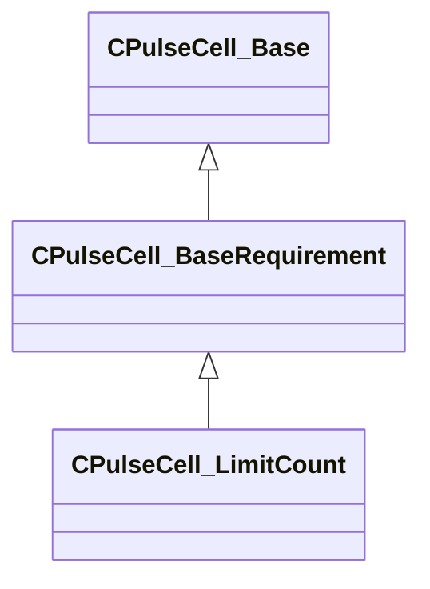

[Schemas](../../schemas.md) / [pulse_runtime_lib](../pulse_runtime_lib.md) / CPulseCell_LimitCount

# CPulseCell_LimitCount

> Source: **Build 25000182** · 2026-08-28 · `windows-x86_64` · schema `0.10.0`

**Kind:** class · **Size:** 80 bytes (`0x50`) · **Align:** 8 · **Module:** pulse_runtime_lib

**Inherits from:** [CPulseCell_BaseRequirement](../pulse_runtime_lib/CPulseCell_BaseRequirement.md)

**Metadata:** `MPropertyDescription Skip this node after the limit. Check Type does not apply, the limit will always be checked.`, `MPropertyFriendlyName Limit Count`

**Relationships:**

## Memory layout

2 fields (1 declared here, 1 inherited). Offsets are absolute from the object base.

| Offset | Field | Type | From | Annotations |
|--------|-------|------|------|-------------|
| `0x8` | `m_nEditorNodeID` | [PulseDocNodeID_t](../pulse_runtime_lib/PulseDocNodeID_t.md) | [CPulseCell_Base](../pulse_runtime_lib/CPulseCell_Base.md) | `MFgdFromSchemaCompletelySkipField` |
| `0x48` | `m_nLimitCount` | int32 |  | `MPropertyFlattenIntoParentRow` |

KV3 class defaults

<pre>{
	&quot;_class&quot;: &quot;CPulseCell_LimitCount&quot;,
	&quot;m_nEditorNodeID&quot;: -1,
	&quot;m_nLimitCount&quot;: 1
}</pre>

