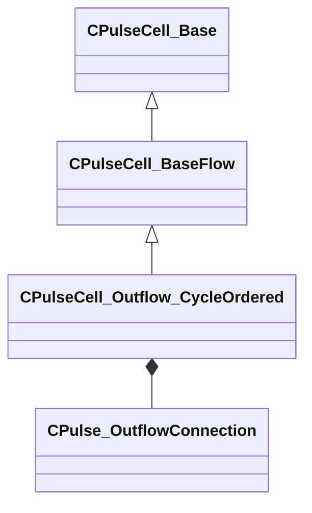

[Schemas](../../schemas.md) / [pulse_runtime_lib](../pulse_runtime_lib.md) / CPulseCell_Outflow_CycleOrdered

# CPulseCell_Outflow_CycleOrdered

> Source: **Build 25000182** · 2026-08-28 · `windows-x86_64` · schema `0.10.0`

**Kind:** class · **Size:** 96 bytes (`0x60`) · **Align:** 8 · **Module:** pulse_runtime_lib

**Inherits from:** [CPulseCell_BaseFlow](../pulse_runtime_lib/CPulseCell_BaseFlow.md)

**Relationships:**

## Memory layout

2 fields (1 declared here, 1 inherited). Offsets are absolute from the object base.

| Offset | Field | Type | From | Annotations |
|--------|-------|------|------|-------------|
| `0x8` | `m_nEditorNodeID` | [PulseDocNodeID_t](../pulse_runtime_lib/PulseDocNodeID_t.md) | [CPulseCell_Base](../pulse_runtime_lib/CPulseCell_Base.md) | `MFgdFromSchemaCompletelySkipField` |
| `0x48` | `m_Outputs` | CUtlVector< [CPulse_OutflowConnection](../pulse_runtime_lib/CPulse_OutflowConnection.md) > |  |  |

KV3 class defaults

<pre>{
	&quot;_class&quot;: &quot;CPulseCell_Outflow_CycleOrdered&quot;,
	&quot;m_nEditorNodeID&quot;: -1,
	&quot;m_Outputs&quot;:
	[
	]
}</pre>

