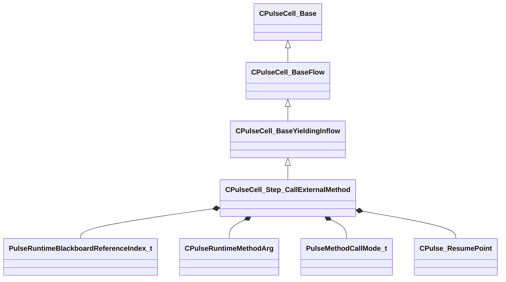

[Schemas](../../schemas.md) / [pulse_runtime_lib](../pulse_runtime_lib.md) / CPulseCell_Step_CallExternalMethod

# CPulseCell_Step_CallExternalMethod

**Kind:** class · **Size:** 336 bytes (`0x150`) · **Align:** 8 · **Module:** pulse_runtime_lib

**Inherits from:** [CPulseCell_BaseYieldingInflow](../pulse_runtime_lib/CPulseCell_BaseYieldingInflow.md)

**Relationships:**

## Memory layout

8 fields (5 declared here, 3 inherited). Offsets are absolute from the object base.

| Offset | Field | Type | From | Annotations |
|--------|-------|------|------|-------------|
| `0x8` | `m_nEditorNodeID` | [PulseDocNodeID_t](../pulse_runtime_lib/PulseDocNodeID_t.md) | [CPulseCell_Base](../pulse_runtime_lib/CPulseCell_Base.md) | `MFgdFromSchemaCompletelySkipField` |
| `0x48` | `m_BaseFlow_OnAfterCancel` | [CPulse_ResumePoint](../pulse_runtime_lib/CPulse_ResumePoint.md) | [CPulseCell_BaseYieldingInflow](../pulse_runtime_lib/CPulseCell_BaseYieldingInflow.md) | `MPulseFGDSkipField` |
| `0x90` | `m_BaseFlow_WhileActive` | [CPulse_ResumePoint](../pulse_runtime_lib/CPulse_ResumePoint.md) | [CPulseCell_BaseYieldingInflow](../pulse_runtime_lib/CPulseCell_BaseYieldingInflow.md) | `MPulseFGDSkipField` |
| `0xd8` | `m_MethodName` | PulseSymbol_t |  |  |
| `0xe8` | `m_nBlackboardIndex` | [PulseRuntimeBlackboardReferenceIndex_t](../pulse_runtime_lib/PulseRuntimeBlackboardReferenceIndex_t.md) |  |  |
| `0xf0` | `m_ExpectedArgs` | CUtlLeanVector< [CPulseRuntimeMethodArg](../pulse_runtime_lib/CPulseRuntimeMethodArg.md) > |  |  |
| `0x100` | `m_nAsyncCallMode` | [PulseMethodCallMode_t](../animationsystem/PulseMethodCallMode_t.md) |  |  |
| `0x108` | `m_OnFinished` | [CPulse_ResumePoint](../pulse_runtime_lib/CPulse_ResumePoint.md) |  |  |

KV3 class defaults

<pre>{
	&quot;_class&quot;: &quot;CPulseCell_Step_CallExternalMethod&quot;,
	&quot;m_nEditorNodeID&quot;: -1,
	&quot;m_BaseFlow_OnAfterCancel&quot;:
	{
		&quot;m_SourceOutflowName&quot;: &quot;&quot;,
		&quot;m_nDestChunk&quot;: -1,
		&quot;m_nInstruction&quot;: -1
	},
	&quot;m_BaseFlow_WhileActive&quot;:
	{
		&quot;m_SourceOutflowName&quot;: &quot;&quot;,
		&quot;m_nDestChunk&quot;: -1,
		&quot;m_nInstruction&quot;: -1
	},
	&quot;m_MethodName&quot;: &quot;&quot;,
	&quot;m_nBlackboardIndex&quot;: -1,
	&quot;m_ExpectedArgs&quot;:
	[
	],
	&quot;m_nAsyncCallMode&quot;: &quot;ASYNC_FIRE_AND_FORGET&quot;,
	&quot;m_OnFinished&quot;:
	{
		&quot;m_SourceOutflowName&quot;: &quot;&quot;,
		&quot;m_nDestChunk&quot;: -1,
		&quot;m_nInstruction&quot;: -1
	}
}</pre>

