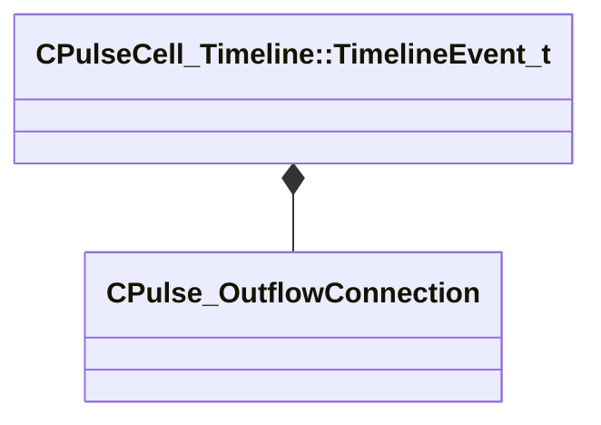

[Schemas](../../schemas.md) / [pulse_runtime_lib](../pulse_runtime_lib.md) / CPulseCell_Timeline::TimelineEvent_t

# CPulseCell_Timeline::TimelineEvent_t

> Source: **Build 25000182** · 2026-08-28 · `windows-x86_64` · schema `0.10.0`

**Kind:** class · **Size:** 80 bytes (`0x50`) · **Align:** 8 · **Module:** pulse_runtime_lib

**Relationships:**

## Memory layout

2 fields (2 declared here, 0 inherited). Offsets are absolute from the object base.

| Offset | Field | Type | From | Annotations |
|--------|-------|------|------|-------------|
| `0x0` | `m_flTimeFromPrevious` | float32 |  |  |
| `0x8` | `m_EventOutflow` | [CPulse_OutflowConnection](../pulse_runtime_lib/CPulse_OutflowConnection.md) |  |  |

KV3 class defaults

<pre>{
	&quot;m_flTimeFromPrevious&quot;: 0.000000,
	&quot;m_EventOutflow&quot;:
	{
		&quot;m_SourceOutflowName&quot;: &quot;&quot;,
		&quot;m_nDestChunk&quot;: -1,
		&quot;m_nInstruction&quot;: -1
	}
}</pre>

