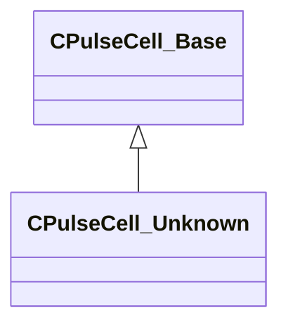

[Schemas](../../schemas.md) / [pulse_runtime_lib](../pulse_runtime_lib.md) / CPulseCell_Unknown

# CPulseCell_Unknown

**Kind:** class · **Size:** 88 bytes (`0x58`) · **Align:** 8 · **Module:** pulse_runtime_lib

**Inherits from:** [CPulseCell_Base](../pulse_runtime_lib/CPulseCell_Base.md)

**Relationships:**

## Memory layout

2 fields (1 declared here, 1 inherited). Offsets are absolute from the object base.

| Offset | Field | Type | From | Annotations |
|--------|-------|------|------|-------------|
| `0x8` | `m_nEditorNodeID` | [PulseDocNodeID_t](../pulse_runtime_lib/PulseDocNodeID_t.md) | [CPulseCell_Base](../pulse_runtime_lib/CPulseCell_Base.md) | `MFgdFromSchemaCompletelySkipField` |
| `0x48` | `m_UnknownKeys` | KeyValues3 |  |  |
