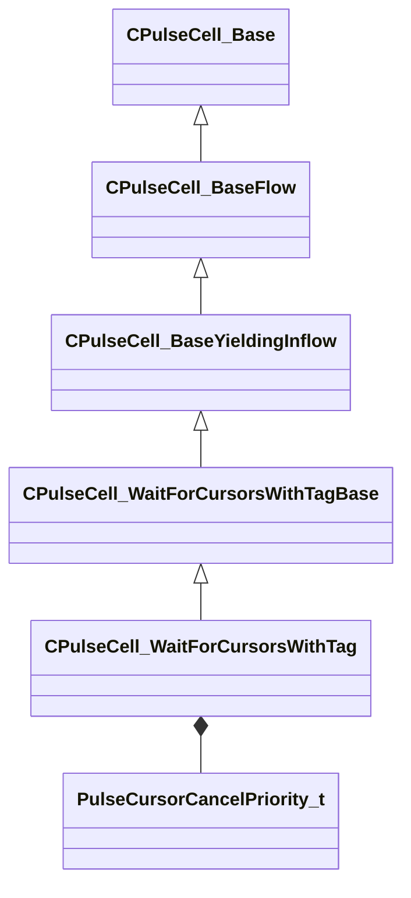

[Schemas](../../schemas.md) / [pulse_runtime_lib](../pulse_runtime_lib.md) / CPulseCell_WaitForCursorsWithTag

# CPulseCell_WaitForCursorsWithTag

**Kind:** class · **Size:** 304 bytes (`0x130`) · **Align:** 8 · **Module:** pulse_runtime_lib

**Inherits from:** [CPulseCell_WaitForCursorsWithTagBase](../pulse_runtime_lib/CPulseCell_WaitForCursorsWithTagBase.md)

**Metadata:** `MPropertyDescription Causes this execution cursor to wait for the completion of other cursors with the given tag. Can optionally kill the tag while waiting.`, `MPropertyFriendlyName Wait For Cursors With Tag`, `MPulseEditorHeaderIcon tools/images/pulse_editor/cursor_tag.png`

**Relationships:**

## Memory layout

7 fields (2 declared here, 5 inherited). Offsets are absolute from the object base.

| Offset | Field | Type | From | Annotations |
|--------|-------|------|------|-------------|
| `0x8` | `m_nEditorNodeID` | [PulseDocNodeID_t](../pulse_runtime_lib/PulseDocNodeID_t.md) | [CPulseCell_Base](../pulse_runtime_lib/CPulseCell_Base.md) | `MFgdFromSchemaCompletelySkipField` |
| `0x48` | `m_BaseFlow_OnAfterCancel` | [CPulse_ResumePoint](../pulse_runtime_lib/CPulse_ResumePoint.md) | [CPulseCell_BaseYieldingInflow](../pulse_runtime_lib/CPulseCell_BaseYieldingInflow.md) | `MPulseFGDSkipField` |
| `0x90` | `m_BaseFlow_WhileActive` | [CPulse_ResumePoint](../pulse_runtime_lib/CPulse_ResumePoint.md) | [CPulseCell_BaseYieldingInflow](../pulse_runtime_lib/CPulseCell_BaseYieldingInflow.md) | `MPulseFGDSkipField` |
| `0xd8` | `m_nCursorsAllowedToWait` | int32 | [CPulseCell_WaitForCursorsWithTagBase](../pulse_runtime_lib/CPulseCell_WaitForCursorsWithTagBase.md) | `MPropertyDescription Any extra waiting cursors will be terminated. -1 for infinite cursors.` |
| `0xe0` | `m_WaitComplete` | [CPulse_ResumePoint](../pulse_runtime_lib/CPulse_ResumePoint.md) | [CPulseCell_WaitForCursorsWithTagBase](../pulse_runtime_lib/CPulseCell_WaitForCursorsWithTagBase.md) |  |
| `0x128` | `m_bTagSelfWhenComplete` | bool |  | `MPropertyDescription Apply the same tag we're waiting on to the resulting cursor upon wait completion. Can be used to wait on our result cursor with the same tag.` |
| `0x12c` | `m_nDesiredKillPriority` | [PulseCursorCancelPriority_t](../animationsystem/PulseCursorCancelPriority_t.md) |  | `MPropertyDescription When we start waiting, how should we handle existing cursors?` |

KV3 class defaults

<pre>{
	&quot;_class&quot;: &quot;CPulseCell_WaitForCursorsWithTag&quot;,
	&quot;m_nEditorNodeID&quot;: -1,
	&quot;m_BaseFlow_OnAfterCancel&quot;:
	{
		&quot;m_SourceOutflowName&quot;: &quot;&quot;,
		&quot;m_nDestChunk&quot;: -1,
		&quot;m_nInstruction&quot;: -1
	},
	&quot;m_BaseFlow_WhileActive&quot;:
	{
		&quot;m_SourceOutflowName&quot;: &quot;&quot;,
		&quot;m_nDestChunk&quot;: -1,
		&quot;m_nInstruction&quot;: -1
	},
	&quot;m_nCursorsAllowedToWait&quot;: -1,
	&quot;m_WaitComplete&quot;:
	{
		&quot;m_SourceOutflowName&quot;: &quot;&quot;,
		&quot;m_nDestChunk&quot;: -1,
		&quot;m_nInstruction&quot;: -1
	},
	&quot;m_bTagSelfWhenComplete&quot;: false,
	&quot;m_nDesiredKillPriority&quot;: &quot;None&quot;
}</pre>

