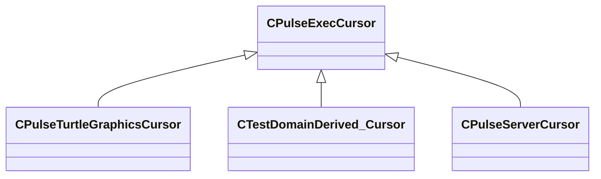

[Schemas](../../schemas.md) / [pulse_runtime_lib](../pulse_runtime_lib.md) / CPulseExecCursor

# CPulseExecCursor

> Source: **Build 25000182** · 2026-08-28 · `windows-x86_64` · schema `0.10.0`

**Kind:** class · **Size:** 216 bytes (`0xd8`) · **Align:** n/a (unspecified) · **Module:** pulse_runtime_lib

**Derived by:** [CPulseServerCursor](../server/CPulseServerCursor.md), [CPulseTurtleGraphicsCursor](../pulse_system/CPulseTurtleGraphicsCursor.md), [CTestDomainDerived_Cursor](../pulse_system/CTestDomainDerived_Cursor.md)

**Relationships:**

## Memory layout

No schema-visible fields (216 bytes of opaque storage).
