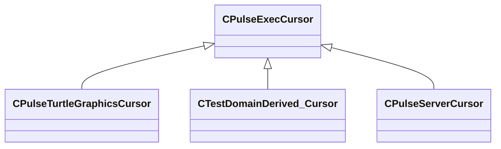

[Schemas](../../schemas.md) / [pulse_runtime_lib](../pulse_runtime_lib.md) / CPulseExecCursor

# CPulseExecCursor

**Kind:** class · **Size:** 216 bytes (`0xd8`) · **Align:** 255 · **Module:** pulse_runtime_lib

**Derived by:** [CPulseServerCursor](../server/CPulseServerCursor.md), [CPulseTurtleGraphicsCursor](../pulse_system/CPulseTurtleGraphicsCursor.md), [CTestDomainDerived_Cursor](../pulse_system/CTestDomainDerived_Cursor.md)

**Relationships:**

