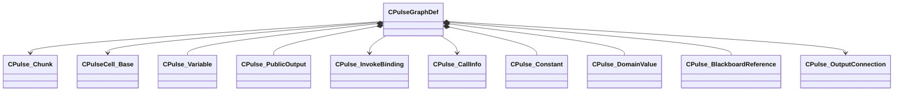

[Schemas](../../schemas.md) / [pulse_runtime_lib](../pulse_runtime_lib.md) / CPulseGraphDef

# CPulseGraphDef

> Source: **Build 25000182** · 2026-08-28 · `windows-x86_64` · schema `0.10.0`

**Kind:** class · **Size:** 432 bytes (`0x1b0`) · **Align:** 8 · **Module:** pulse_runtime_lib

**Relationships:**

## Memory layout

14 fields (14 declared here, 0 inherited). Offsets are absolute from the object base.

| Offset | Field | Type | From | Annotations |
|--------|-------|------|------|-------------|
| `0x8` | `m_DomainIdentifier` | PulseSymbol_t |  |  |
| `0x18` | `m_DomainSubType` | CPulseValueFullType |  |  |
| `0x30` | `m_ParentMapName` | PulseSymbol_t |  |  |
| `0x40` | `m_ParentXmlName` | PulseSymbol_t |  |  |
| `0x50` | `m_Chunks` | CUtlVector< [CPulse_Chunk](../pulse_runtime_lib/CPulse_Chunk.md)* > |  |  |
| `0x68` | `m_Cells` | CUtlVector< [CPulseCell_Base](../pulse_runtime_lib/CPulseCell_Base.md)* > |  |  |
| `0x80` | `m_Vars` | CUtlVector< [CPulse_Variable](../pulse_runtime_lib/CPulse_Variable.md) > |  |  |
| `0x98` | `m_PublicOutputs` | CUtlVector< [CPulse_PublicOutput](../pulse_runtime_lib/CPulse_PublicOutput.md) > |  |  |
| `0xb0` | `m_InvokeBindings` | CUtlVector< [CPulse_InvokeBinding](../pulse_runtime_lib/CPulse_InvokeBinding.md)* > |  |  |
| `0xc8` | `m_CallInfos` | CUtlVector< [CPulse_CallInfo](../pulse_runtime_lib/CPulse_CallInfo.md)* > |  |  |
| `0xe0` | `m_Constants` | CUtlVector< [CPulse_Constant](../pulse_runtime_lib/CPulse_Constant.md) > |  |  |
| `0xf8` | `m_DomainValues` | CUtlVector< [CPulse_DomainValue](../pulse_runtime_lib/CPulse_DomainValue.md) > |  |  |
| `0x110` | `m_BlackboardReferences` | CUtlVector< [CPulse_BlackboardReference](../pulse_runtime_lib/CPulse_BlackboardReference.md) > |  |  |
| `0x128` | `m_OutputConnections` | CUtlVector< [CPulse_OutputConnection](../pulse_runtime_lib/CPulse_OutputConnection.md)* > |  |  |

KV3 class defaults

<pre>{
	&quot;m_DomainIdentifier&quot;: &quot;&quot;,
	&quot;m_DomainSubType&quot;: &quot;PVAL_VOID&quot;,
	&quot;m_ParentMapName&quot;: &quot;&quot;,
	&quot;m_ParentXmlName&quot;: &quot;&quot;,
	&quot;m_Chunks&quot;:
	[
	],
	&quot;m_Cells&quot;:
	[
	],
	&quot;m_Vars&quot;:
	[
	],
	&quot;m_PublicOutputs&quot;:
	[
	],
	&quot;m_InvokeBindings&quot;:
	[
	],
	&quot;m_CallInfos&quot;:
	[
	],
	&quot;m_Constants&quot;:
	[
	],
	&quot;m_DomainValues&quot;:
	[
	],
	&quot;m_BlackboardReferences&quot;:
	[
	],
	&quot;m_OutputConnections&quot;:
	[
	]
}</pre>

