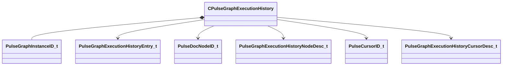

[Schemas](../../schemas.md) / [pulse_runtime_lib](../pulse_runtime_lib.md) / CPulseGraphExecutionHistory

# CPulseGraphExecutionHistory

> Source: **Build 25000182** · 2026-08-28 · `windows-x86_64` · schema `0.10.0`

**Kind:** class · **Size:** 120 bytes (`0x78`) · **Align:** 8 · **Module:** pulse_runtime_lib

**Relationships:**

## Memory layout

5 fields (5 declared here, 0 inherited). Offsets are absolute from the object base.

| Offset | Field | Type | From | Annotations |
|--------|-------|------|------|-------------|
| `0x0` | `m_nInstanceID` | [PulseGraphInstanceID_t](../pulse_runtime_lib/PulseGraphInstanceID_t.md) |  |  |
| `0x8` | `m_strFileName` | CUtlString |  |  |
| `0x10` | `m_vecHistory` | CUtlVector< [PulseGraphExecutionHistoryEntry_t](../pulse_runtime_lib/PulseGraphExecutionHistoryEntry_t.md)* > |  |  |
| `0x28` | `m_mapCellDesc` | CUtlOrderedMap< [PulseDocNodeID_t](../pulse_runtime_lib/PulseDocNodeID_t.md), [PulseGraphExecutionHistoryNodeDesc_t](../pulse_runtime_lib/PulseGraphExecutionHistoryNodeDesc_t.md)* > |  |  |
| `0x50` | `m_mapCursorDesc` | CUtlOrderedMap< [PulseCursorID_t](../pulse_runtime_lib/PulseCursorID_t.md), [PulseGraphExecutionHistoryCursorDesc_t](../pulse_runtime_lib/PulseGraphExecutionHistoryCursorDesc_t.md)* > |  |  |

KV3 class defaults

<pre>{
	&quot;m_nInstanceID&quot;: 0,
	&quot;m_strFileName&quot;: &quot;&quot;,
	&quot;m_vecHistory&quot;:
	[
	],
	&quot;m_mapCellDesc&quot;:
	{
	},
	&quot;m_mapCursorDesc&quot;:
	{
	}
}</pre>

