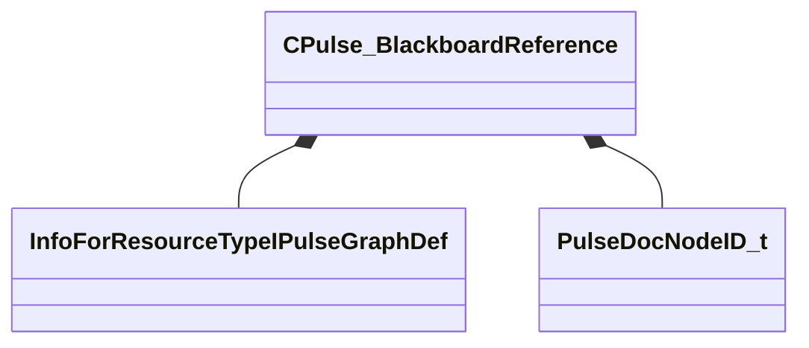

[Schemas](../../schemas.md) / [pulse_runtime_lib](../pulse_runtime_lib.md) / CPulse_BlackboardReference

# CPulse_BlackboardReference

**Kind:** class · **Size:** 40 bytes (`0x28`) · **Align:** 8 · **Module:** pulse_runtime_lib

**Relationships:**

## Memory layout

4 fields (4 declared here, 0 inherited). Offsets are absolute from the object base.

| Offset | Field | Type | From | Annotations |
|--------|-------|------|------|-------------|
| `0x0` | `m_hBlackboardResource` | CStrongHandle< [InfoForResourceTypeIPulseGraphDef](../resourcesystem/InfoForResourceTypeIPulseGraphDef.md) > |  |  |
| `0x8` | `m_BlackboardResource` | PulseSymbol_t |  |  |
| `0x18` | `m_nNodeID` | [PulseDocNodeID_t](../pulse_runtime_lib/PulseDocNodeID_t.md) |  |  |
| `0x20` | `m_NodeName` | CGlobalSymbol |  |  |

KV3 class defaults

<pre>{
	&quot;m_hBlackboardResource&quot;: &quot;&quot;,
	&quot;m_BlackboardResource&quot;: &quot;&quot;,
	&quot;m_nNodeID&quot;: -1,
	&quot;m_NodeName&quot;: &quot;&quot;
}</pre>

