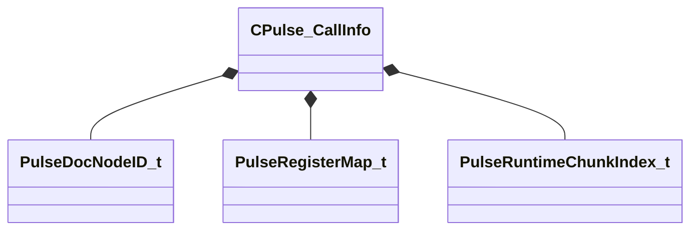

[Schemas](../../schemas.md) / [pulse_runtime_lib](../pulse_runtime_lib.md) / CPulse_CallInfo

# CPulse_CallInfo

> Source: **Build 25000182** · 2026-08-28 · `windows-x86_64` · schema `0.10.0`

**Kind:** class · **Size:** 88 bytes (`0x58`) · **Align:** 8 · **Module:** pulse_runtime_lib

**Relationships:**

## Memory layout

6 fields (6 declared here, 0 inherited). Offsets are absolute from the object base.

| Offset | Field | Type | From | Annotations |
|--------|-------|------|------|-------------|
| `0x0` | `m_PortName` | PulseSymbol_t |  |  |
| `0x10` | `m_nEditorNodeID` | [PulseDocNodeID_t](../pulse_runtime_lib/PulseDocNodeID_t.md) |  |  |
| `0x18` | `m_RegisterMap` | [PulseRegisterMap_t](../pulse_runtime_lib/PulseRegisterMap_t.md) |  |  |
| `0x48` | `m_CallMethodID` | [PulseDocNodeID_t](../pulse_runtime_lib/PulseDocNodeID_t.md) |  |  |
| `0x4c` | `m_nSrcChunk` | [PulseRuntimeChunkIndex_t](../pulse_runtime_lib/PulseRuntimeChunkIndex_t.md) |  |  |
| `0x50` | `m_nSrcInstruction` | int32 |  |  |

KV3 class defaults

<pre>{
	&quot;m_PortName&quot;: &quot;&quot;,
	&quot;m_nEditorNodeID&quot;: -1,
	&quot;m_RegisterMap&quot;:
	{
		&quot;m_Inparams&quot;: null,
		&quot;m_Outparams&quot;: null
	},
	&quot;m_CallMethodID&quot;: -1,
	&quot;m_nSrcChunk&quot;: -1,
	&quot;m_nSrcInstruction&quot;: -1
}</pre>

